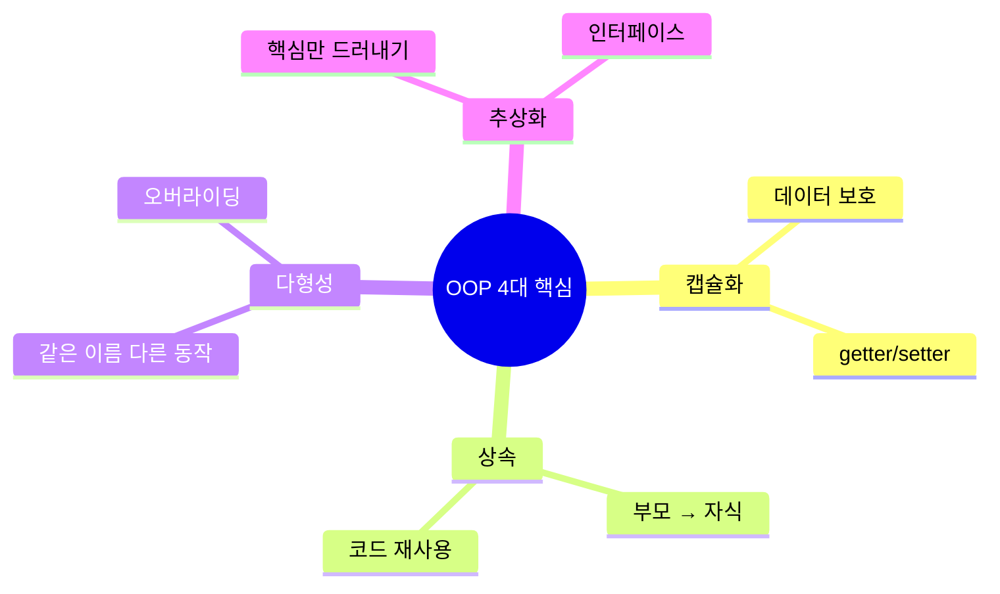
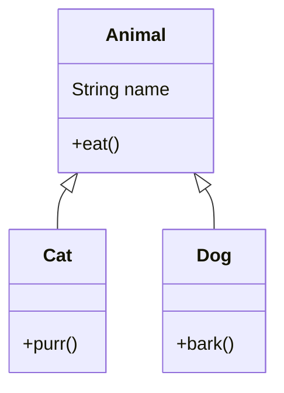
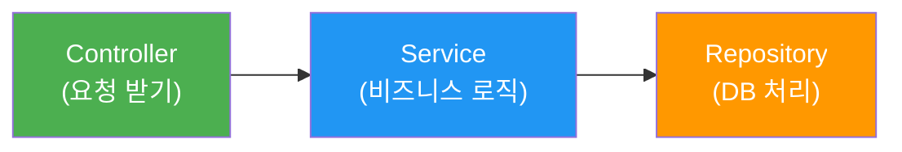
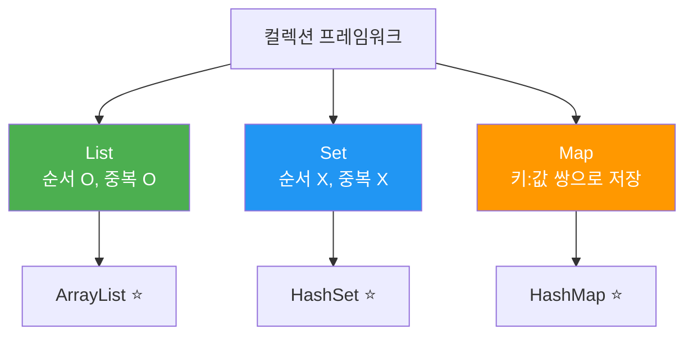
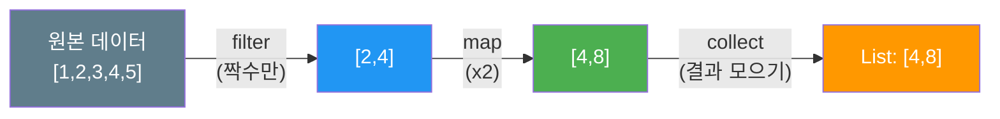
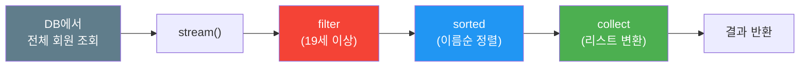

# 자바 스프링부트 수업 리뷰 자료

아래에 두 개의 MD 파일 내용을 작성해드리겠습니다. 비전공자/입문자 눈높이에 맞춰 핵심만 추렸습니다.

---

## 📄 1. 객체지향 프로그래밍의 이해

```markdown
# 객체지향 프로그래밍(OOP)의 이해 - 코드 리뷰

---

## 1. 객체(Object)란?

> **현실 세계의 "것"을 코드로 옮긴 것**

```java
// 현실: 강아지 한 마리
// 코드: 강아지 객체

public class Dog {
    // 상태(속성) = 명사
    String name;
    int age;

    // 행동(기능) = 동사
    void bark() {
        System.out.println(name + "가 멍멍!");
    }
}
```

```java
// 객체 만들기 (= 실체화, 인스턴스화)
Dog myDog = new Dog();
myDog.name = "초코";
myDog.age = 3;
myDog.bark(); // 초코가 멍멍!
```

### ✅ 핵심 정리

| 용어 | 쉬운 말 | 예시 |
|------|---------|------|
| **클래스** | 설계도 | `Dog` 클래스 |
| **객체(인스턴스)** | 설계도로 만든 실체 | `myDog` |
| **필드(멤버변수)** | 속성, 상태 | `name`, `age` |
| **메서드** | 행동, 기능 | `bark()` |

---

## 2. OOP 4대 핵심 개념



---

### 2-1. 캡슐화 (Encapsulation)

> **데이터를 함부로 못 건드리게 보호하는 것**

```java
// ❌ 나쁜 예 - 아무나 값을 바꿀 수 있음
public class BankAccount {
    public int balance = 10000;
}

BankAccount acc = new BankAccount();
acc.balance = -9999; // 잔액이 마이너스?! 말이 안됨
```

```java
// ✅ 좋은 예 - 캡슐화 적용
public class BankAccount {
    private int balance = 10000;  // private으로 보호!

    public int getBalance() {             // 읽기만 허용
        return balance;
    }

    public void deposit(int amount) {     // 규칙에 맞게만 변경
        if (amount > 0) {
            balance += amount;
        }
    }

    public void withdraw(int amount) {
        if (amount > 0 && balance >= amount) {
            balance -= amount;
        }
    }
}
```

**💡 한 줄 요약: `private`으로 잠그고, 메서드로만 접근하게 하자**

---

### 2-2. 상속 (Inheritance)

> **부모가 가진 것을 자식이 물려받는 것**

```java
// 부모 클래스
public class Animal {
    String name;

    void eat() {
        System.out.println(name + "가 밥을 먹는다");
    }
}

// 자식 클래스 - extends로 상속
public class Cat extends Animal {
    void purr() {
        System.out.println(name + "가 골골골~");
    }
}
```

```java
Cat cat = new Cat();
cat.name = "나비";
cat.eat();  // 부모한테 물려받은 기능 → "나비가 밥을 먹는다"
cat.purr(); // 자식만의 기능 → "나비가 골골골~"
```



**💡 한 줄 요약: 공통 코드는 부모에, 개별 코드는 자식에**

---

### 2-3. 다형성 (Polymorphism)

> **같은 명령인데 객체마다 다르게 동작하는 것**

```java
public class Animal {
    String name;

    void sound() {
        System.out.println("...");
    }
}

public class Cat extends Animal {
    @Override  // 부모 메서드를 "재정의"
    void sound() {
        System.out.println(name + ": 야옹~");
    }
}

public class Dog extends Animal {
    @Override
    void sound() {
        System.out.println(name + ": 멍멍!");
    }
}
```

```java
// 다형성의 핵심: 부모 타입으로 자식을 담을 수 있다!
Animal a1 = new Cat();
Animal a2 = new Dog();
a1.name = "나비";
a2.name = "초코";

a1.sound(); // 나비: 야옹~
a2.sound(); // 초코: 멍멍!

// 같은 Animal 타입인데 실제 객체에 따라 동작이 다르다!
```

**💡 한 줄 요약: "부모 타입 하나로 자식들을 다 다룰 수 있다"**

---

### 2-4. 추상화 (Abstraction)

> **"무엇을" 할 수 있는지만 정하고, "어떻게"는 각자 알아서**

```java
// 인터페이스 = 계약서, 약속
public interface Payment {
    void pay(int amount);  // 결제해! (방법은 너가 정해)
}

public class CardPayment implements Payment {
    @Override
    public void pay(int amount) {
        System.out.println("카드로 " + amount + "원 결제");
    }
}

public class KakaoPayment implements Payment {
    @Override
    public void pay(int amount) {
        System.out.println("카카오페이로 " + amount + "원 결제");
    }
}
```

```java
Payment p = new CardPayment();
p.pay(5000);  // 카드로 5000원 결제

p = new KakaoPayment();
p.pay(5000);  // 카카오페이로 5000원 결제
```

**💡 한 줄 요약: 인터페이스로 "규칙"만 정하고, 구현은 각 클래스가 한다**

---

## 3. 왜 스프링부트에서 OOP가 중요한가?



> 스프링부트의 구조 자체가 OOP입니다.
>
> - 각 클래스가 **하나의 역할**만 담당 (캡슐화)
> - `interface`로 규칙을 정하고 구현체를 갈아끼움 (추상화 + 다형성)
> - 공통 기능은 상위 클래스에서 처리 (상속)

---

## 🔑 오늘 꼭 기억할 것

```
1. 클래스 = 설계도, 객체 = 실체
2. private으로 보호하고 메서드로 접근 → 캡슐화
3. extends로 물려받기 → 상속
4. 같은 타입, 다른 동작 → 다형성
5. interface로 약속만 정하기 → 추상화
```
```

---

## 📄 2. 컬렉션 프레임워크와 Stream API

```markdown
# 컬렉션 프레임워크와 Stream API - 코드 리뷰

---

## 1. 컬렉션이 필요한 이유

```java
// 학생 3명의 이름을 저장하려면?
String student1 = "김철수";
String student2 = "이영희";
String student3 = "박민수";
// 100명이면?? 변수 100개..?? 😱

// ✅ 컬렉션을 쓰면!
List<String> students = new ArrayList<>();
students.add("김철수");
students.add("이영희");
students.add("박민수");
// 몇 명이든 OK!
```

**💡 컬렉션 = 데이터를 담는 그릇 (크기가 자동으로 늘어나는 배열)**

---

## 2. 컬렉션 3대장



---

### 2-1. List — 순서가 있고, 중복 허용

```java
List<String> fruits = new ArrayList<>();

fruits.add("사과");
fruits.add("바나나");
fruits.add("사과");   // 중복 OK!

System.out.println(fruits);       // [사과, 바나나, 사과]
System.out.println(fruits.get(0)); // 사과 (인덱스로 접근)
System.out.println(fruits.size()); // 3
```

> 📌 **언제 쓰나?** → 순서가 중요하거나 같은 값이 들어올 수 있을 때
> 예) 장바구니 목록, 게시글 목록

---

### 2-2. Set — 중복 제거가 핵심

```java
Set<String> tags = new HashSet<>();

tags.add("자바");
tags.add("스프링");
tags.add("자바");    // 중복 → 무시됨!

System.out.println(tags);        // [자바, 스프링] (순서 보장 안됨)
System.out.println(tags.size()); // 2
```

> 📌 **언제 쓰나?** → 중복을 없애고 싶을 때
> 예) 태그 목록, 방문자 IP 수집

---

### 2-3. Map — Key:Value 쌍으로 저장

```java
Map<String, Integer> scoreMap = new HashMap<>();

scoreMap.put("김철수", 90);
scoreMap.put("이영희", 85);
scoreMap.put("김철수", 95);  // 같은 키 → 값이 덮어써짐!

System.out.println(scoreMap.get("김철수")); // 95
System.out.println(scoreMap.size());        // 2
```

> 📌 **언제 쓰나?** → "이름으로 값을 찾고 싶을 때"
> 예) 학생별 점수, 설정값 관리, JSON 파싱

---

### ⚡ 한눈에 비교

| | List | Set | Map |
|---|---|---|---|
| **순서** | ✅ 있음 | ❌ 없음 | ❌ 없음 |
| **중복** | ✅ 허용 | ❌ 불가 | Key 중복 불가 |
| **접근** | 인덱스(`get(0)`) | 반복만 가능 | 키로 접근(`get("이름")`) |
| **대표 클래스** | ArrayList | HashSet | HashMap |

---

## 3. 자주 쓰는 반복 패턴

```java
List<String> names = List.of("김철수", "이영희", "박민수");

// 방법 1: 일반 for문
for (int i = 0; i < names.size(); i++) {
    System.out.println(names.get(i));
}

// 방법 2: 향상된 for문 (가장 많이 씀 ⭐)
for (String name : names) {
    System.out.println(name);
}

// Map 반복
Map<String, Integer> scores = Map.of("철수", 90, "영희", 85);

for (Map.Entry<String, Integer> entry : scores.entrySet()) {
    System.out.println(entry.getKey() + " : " + entry.getValue());
}
```

---

## 4. Stream API — 컬렉션을 "흘려보내며" 처리

### Stream이 뭔데?



> **컨베이어 벨트처럼 데이터를 하나씩 흘려보내며 변환/필터링하는 것**

---

### 4-1. Stream 기본 3단계

```
① 생성      →  ② 중간 연산 (filter, map...)  →  ③ 최종 연산 (collect, forEach...)
 (스트림 만들기)    (가공하기)                        (결과 내기)
```

---

### 4-2. 핵심 예제: for문 vs Stream

```java
List<Integer> numbers = List.of(1, 2, 3, 4, 5, 6, 7, 8, 9, 10);
```

**Q. 짝수만 골라서 2배한 리스트를 만들어라**

```java
// ❌ 전통적인 방법 (for문)
List<Integer> result = new ArrayList<>();
for (int n : numbers) {
    if (n % 2 == 0) {
        result.add(n * 2);
    }
}
// result = [4, 8, 12, 16, 20]
```

```java
// ✅ Stream 방법
List<Integer> result = numbers.stream()     // ① 스트림 생성
        .filter(n -> n % 2 == 0)            // ② 짝수만 통과
        .map(n -> n * 2)                    // ② 각각 2배
        .collect(Collectors.toList());      // ③ 리스트로 모으기
// result = [4, 8, 12, 16, 20]
```

**💡 "무엇을 할지"만 적으면 된다. "어떻게 반복할지"는 신경 안써도 됨!**

---

### 4-3. 자주 쓰는 Stream 연산 TOP 5

```java
List<String> names = List.of("김철수", "이영희", "박민수", "김영수", "이철수");
```

```java
// 1️⃣ filter - 조건에 맞는 것만 걸러내기
List<String> kims = names.stream()
        .filter(name -> name.startsWith("김"))
        .collect(Collectors.toList());
// [김철수, 김영수]

// 2️⃣ map - 각 요소를 변환하기
List<Integer> nameLengths = names.stream()
        .map(name -> name.length())
        .collect(Collectors.toList());
// [3, 3, 3, 3, 3]

// 3️⃣ forEach - 하나씩 꺼내서 실행
names.stream()
        .forEach(name -> System.out.println("안녕, " + name));

// 4️⃣ count - 개수 세기
long kimCount = names.stream()
        .filter(name -> name.startsWith("김"))
        .count();
// 2

// 5️⃣ sorted - 정렬
List<String> sorted = names.stream()
        .sorted()
        .collect(Collectors.toList());
// [김영수, 김철수, 박민수, 이영희, 이철수]
```

---

### 4-4. 람다(Lambda)가 뭔지 잠깐만!

```java
// 람다 = 이름 없는 함수를 짧게 쓰는 방법

// 원래 모습 (익명 클래스)
names.stream().filter(new Predicate<String>() {
    @Override
    public boolean test(String name) {
        return name.startsWith("김");
    }
});

// 람다로 줄이면
names.stream().filter(name -> name.startsWith("김"));
//                     ^^^^    ^^^^^^^^^^^^^^^^^^^^^
//                     매개변수       실행할 코드
```

**💡 화살표(`->`) 왼쪽 = 입력, 오른쪽 = 실행 내용. 그게 전부!**

---

## 5. 실무에서 이렇게 씁니다 (스프링부트 맛보기)

```java
// 예: DB에서 가져온 회원 목록에서 성인만 필터링
List<Member> allMembers = memberRepository.findAll();

List<Member> adults = allMembers.stream()
        .filter(m -> m.getAge() >= 19)
        .sorted(Comparator.comparing(Member::getName))
        .collect(Collectors.toList());
```



---

## 🔑 오늘 꼭 기억할 것

```
[컬렉션]
1. List = 순서 O, 중복 O → ArrayList 가장 많이 씀
2. Set  = 중복 제거할 때 → HashSet
3. Map  = 키로 값 찾을 때 → HashMap

[Stream]
4. stream() → 중간연산(filter/map) → 최종연산(collect/forEach)
5. 람다: (입력) -> 실행코드
```
```

---

두 파일 모두 실제 `.md` 파일로 저장하면 Mermaid 지원 뷰어(GitHub, Notion, VS Code 등)에서 다이어그램이 렌더링됩니다. 코드 예제는 모두 복사해서 바로 실행 가능한 수준으로 작성했고, 비전공자가 "아, 이래서 이걸 쓰는구나"를 느낄 수 있도록 **왜 쓰는지 → 어떻게 쓰는지** 순서로 구성했습니다.