# Spring Boot 교육생을 위한 데이터베이스 설계와 Spring JPA 리뷰 가이드 (Spring Data JPA 버전)

> 대상: JPA 처음 배우는 Spring Boot 교육생
> 목표: **"왜 쓰는지"** 부터 **"어떤 SQL이 나가는지"** 까지 그림과 비유로 쉽게 이해하기
> ✨ 모든 예제는 **Spring Data JPA Repository 문법**으로 작성

---

## 📚 오늘 배울 내용

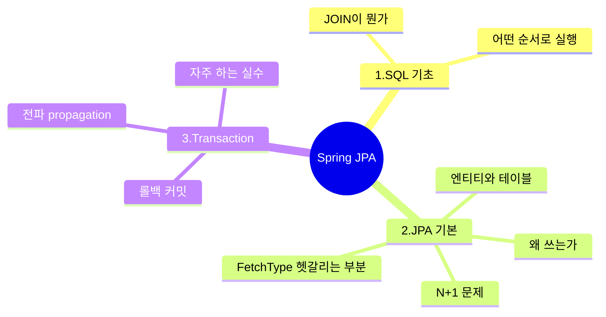

---

# Part 1. SQL 기초 — JPA를 쓰기 전에 왜 SQL을 알아야 할까?

## 1-1. 한 줄 요약

> **"JPA는 SQL을 자동으로 만들어주는 도구일 뿐이에요. SQL을 모르면 JPA가 뭘 만들어 내는지 읽을 수가 없어요."**

운전을 하려면 적어도 도로 표지판은 읽을 줄 알아야 하잖아요? SQL이 그 표지판이에요.

## 1-2. SQL 실행 순서

우리가 SQL을 쓸 때는 `SELECT → FROM → WHERE` 순서로 쓰지만, **DB가 실제로 처리하는 순서는 다릅니다.**

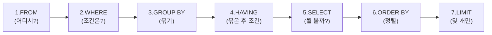

비유하자면 마트에서 장보는 것과 같아요. **먼저 마트에 가고(FROM)**, **원하는 코너에서 고르고(WHERE)**, **카트에 담아서(SELECT)**, **계산대 앞에 줄 세우고(ORDER BY)**, **5개까지만 사기로 결정(LIMIT)** 하는 식이죠.

## 1-3. JOIN — 두 테이블을 합치는 방법

회원과 팀이 따로 저장돼 있다고 해봐요.

```sql
-- 팀 테이블
CREATE TABLE team (
    id BIGINT PRIMARY KEY,
    name VARCHAR(50)
);

-- 회원 테이블 (team_id로 팀과 연결)
CREATE TABLE member (
    id BIGINT PRIMARY KEY,
    name VARCHAR(50),
    team_id BIGINT  -- ← 어느 팀 소속인지
);

INSERT INTO team VALUES (1, 'A팀'), (2, 'B팀'), (3, 'C팀');  -- C팀은 멤버 없음
INSERT INTO member VALUES
  (1, '김철수', 1),     -- A팀
  (2, '이영희', 1),     -- A팀
  (3, '박민수', 2),     -- B팀
  (4, '최지훈', NULL);  -- 팀 없음
```

### JOIN 종류 한눈에

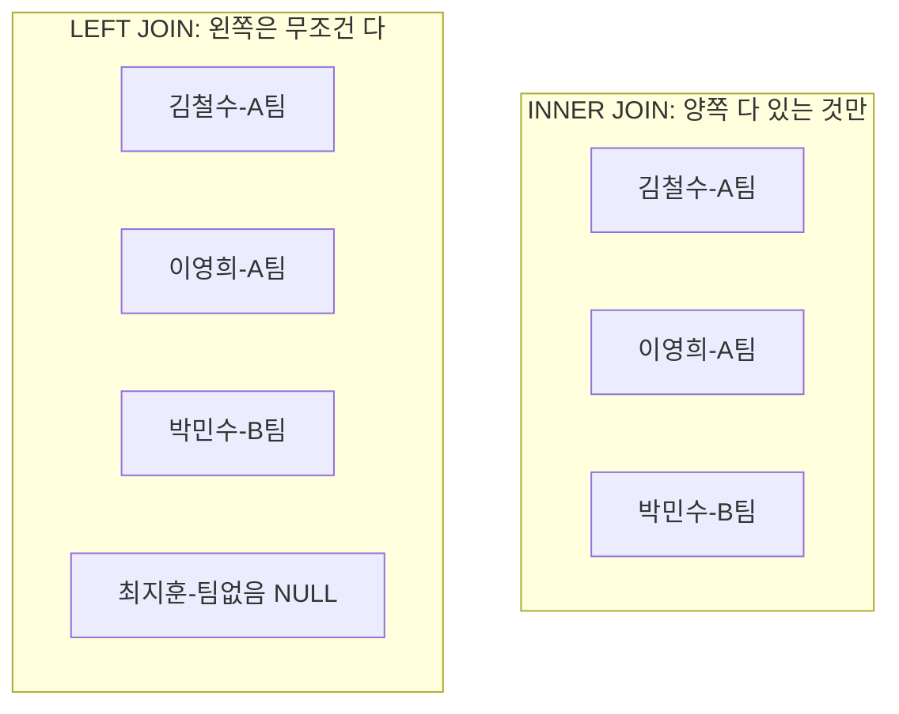

**비유**: 결혼식 사진 찍는 상황이에요.

- **INNER JOIN** = "신랑신부 둘 다 있어야 사진 찍어요" (양쪽 매칭된 것만)
- **LEFT JOIN** = "신부는 무조건 찍고, 신랑 있으면 같이 찍어요" (왼쪽 기준)

### 실제 쿼리

```sql
-- INNER JOIN: 팀이 있는 회원만
SELECT m.name, t.name
FROM member m
INNER JOIN team t ON m.team_id = t.id;
-- 결과: 김철수, 이영희, 박민수 (최지훈 빠짐)

-- LEFT JOIN: 모든 회원 + 팀 정보(없으면 NULL)
SELECT m.name, t.name
FROM member m
LEFT JOIN team t ON m.team_id = t.id;
-- 결과: 김철수, 이영희, 박민수, 최지훈(팀=NULL)
```

이 정도만 알면 JPA가 만드는 SQL을 거의 다 읽을 수 있어요.

---

# Part 2. Spring Data JPA — 객체로 DB 다루기

## 2-1. JPA가 왜 필요한가요?

JPA 없이 코드를 짜면 이래요. 매번 SQL 문자열 쓰고, 결과를 하나씩 꺼내서 객체에 담는 작업을 **모든 메서드마다** 반복합니다.

```java
// JPA 없이...
String sql = "SELECT id, name, team_id FROM member WHERE id = ?";
PreparedStatement pstmt = conn.prepareStatement(sql);
pstmt.setLong(1, id);
ResultSet rs = pstmt.executeQuery();
Member member = new Member();
member.setId(rs.getLong("id"));
member.setName(rs.getString("name"));
// ... 팀 정보도 또 SQL 날려서 채우고...
// ... close 까먹으면 메모리 누수...
```

JPA를 쓰면? **Spring Data JPA Repository**가 알아서 다 해줘요.

```java
public interface MemberRepository extends JpaRepository<Member, Long> {
    // 메서드 이름만 잘 지으면 SQL이 자동 생성됨!
    List<Member> findByName(String name);
}

// 사용
Member member = memberRepository.findById(1L).orElseThrow();
// 끝!
```

**JPA의 핵심 아이디어**: "객체를 저장하면 알아서 INSERT 만들고, 객체를 바꾸면 알아서 UPDATE 만들어준다."

## 2-2. 영속성 컨텍스트 — JPA의 심장

이 개념 하나만 이해하면 JPA의 70%는 끝나요.

**영속성 컨텍스트(Persistence Context)** = JPA가 관리하는 **"임시 보관소"** 같은 거예요. 트랜잭션이 시작되면 만들어지고, 끝나면 사라집니다.

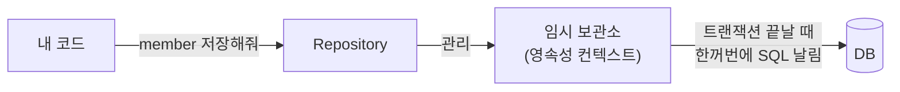

### 비유: 장바구니와 결제

쇼핑몰 장바구니를 생각해 보세요.

- 상품을 담을 때마다 결제하는 게 아니라, **장바구니에 모아뒀다가** 마지막에 한 번에 결제하죠.
- 장바구니에서 상품 수량을 바꿔도, 마지막에 변경된 상태로 결제돼요.
- 같은 상품을 또 보면 굳이 서버에 다시 안 물어봐요.

JPA의 영속성 컨텍스트가 바로 이 **장바구니** 역할이에요.

### 4가지 핵심 동작

**1️⃣ 1차 캐시** — 같은 ID로 두 번 조회하면 SQL은 한 번만 나가요.

```java
@Transactional
public void test() {
    Member m1 = memberRepository.findById(1L).get();  // SQL 나감
    Member m2 = memberRepository.findById(1L).get();  // SQL 안 나감! (캐시에서 꺼냄)
    System.out.println(m1 == m2);  // true
}
```

**2️⃣ 쓰기 지연** — `save()` 한다고 바로 INSERT 나가는 게 아니에요. **트랜잭션 끝날 때 모아서** 나갑니다.

**3️⃣ 변경 감지(Dirty Checking)** ⭐ 가장 신기한 기능

```java
@Transactional
public void changeName(Long id, String newName) {
    Member member = memberRepository.findById(id).orElseThrow();
    member.setName(newName);
    // save() 안 했는데도 UPDATE가 자동으로 나가요!
}
```

어떻게? 영속성 컨텍스트가 처음 가져왔을 때의 모습(스냅샷)을 기억하고 있다가, 트랜잭션 끝날 때 비교해서 **달라진 부분만 UPDATE**를 만들어 줍니다.

```sql
SELECT * FROM member WHERE id = 1;
-- 트랜잭션 끝날 때
UPDATE member SET name = '새이름' WHERE id = 1;
```

**4️⃣ 지연 로딩** — 연관된 객체는 진짜 필요할 때까지 안 가져옴 (이건 다음 섹션에서 자세히)

## 2-3. 엔티티와 연관관계

```java
@Entity
public class Team {
    @Id @GeneratedValue
    private Long id;
    private String name;

    @OneToMany(mappedBy = "team")  // "나는 거울이야, 진짜 주인은 Member의 team이야"
    private List<Member> members = new ArrayList<>();
}

@Entity
public class Member {
    @Id @GeneratedValue
    private Long id;
    private String name;

    @ManyToOne(fetch = FetchType.LAZY)  // ★ 꼭 LAZY로!
    @JoinColumn(name = "team_id")        // ← FK는 내가 가지고 있어 (주인)
    private Team team;
}
```

### 왜 한쪽은 `mappedBy`가 붙어 있나요?

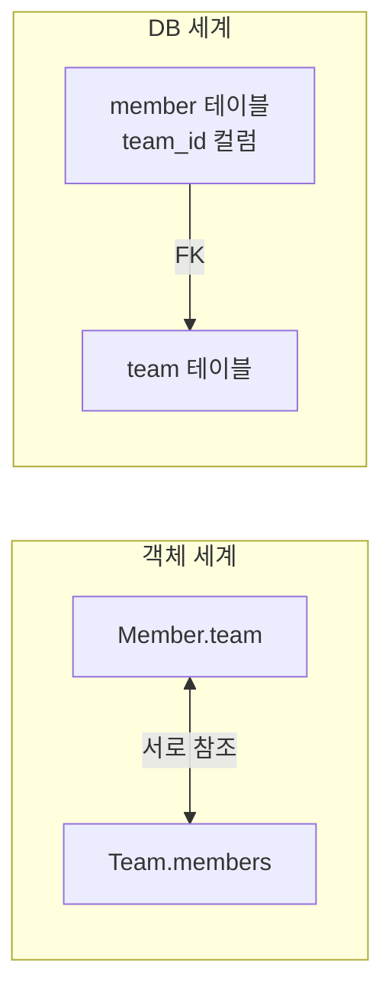

객체는 양쪽이 서로를 가리키지만, **DB에서는 FK가 한쪽에만** 있어요. 그래서 JPA에 "FK는 어느 쪽에 있어?" 라고 알려줘야 해요.

- `@JoinColumn` 붙은 쪽 = **주인** (FK 관리자, INSERT/UPDATE 책임)
- `mappedBy` 붙은 쪽 = **거울** (그냥 읽기 전용)

---

## 2-4. 🔥 FetchType — 가장 헷갈리는 부분, 천천히 봐요

### 2-4-1. 한 문장으로

> **FetchType = "연관된 객체를 언제 가져올까?" 를 정하는 옵션**

```java
@ManyToOne(fetch = FetchType.LAZY)  // 필요할 때 가져와
Team team;

@ManyToOne(fetch = FetchType.EAGER) // 처음부터 같이 가져와
Team team;
```

### 2-4-2. 비유로 이해하기 🍕

피자 시킬 때를 생각해 봐요.

**EAGER (즉시 로딩)** = "피자 시킬 때 콜라랑 치즈스틱도 무조건 같이 시켜줘"
- 일단 다 가져와서 든든하지만, **콜라가 필요 없을 때도** 따라옴

**LAZY (지연 로딩)** = "피자만 시키고, 콜라는 마시고 싶을 때 그때 시킬게"
- 필요할 때만 가져오니 효율적
- 근데 **마시고 싶은 순간에 가게가 문 닫혔으면(트랜잭션 종료)** 콜라를 못 받음 ⚠️

### 2-4-3. 어노테이션별 기본값 (꼭 외우기!)

| 어노테이션 | 기본값 | 권장 |
|---|---|---|
| `@ManyToOne` | **EAGER** ⚠️ 위험! | 반드시 `LAZY`로 바꾸기 |
| `@OneToOne` | **EAGER** ⚠️ 위험! | 반드시 `LAZY`로 바꾸기 |
| `@OneToMany` | LAZY ✅ | 그대로 |
| `@ManyToMany` | LAZY ✅ | (쓰지 마세요) |

**기억법**: 어노테이션 끝이 **"One"** 으로 끝나면 → 기본 EAGER (위험!) → LAZY로 바꾸자

### 2-4-4. LAZY는 어떻게 동작하나요? — 프록시(Proxy)

LAZY를 설정하면 JPA는 진짜 Team 객체 대신 **"가짜 Team"(프록시)** 을 끼워 넣어요.

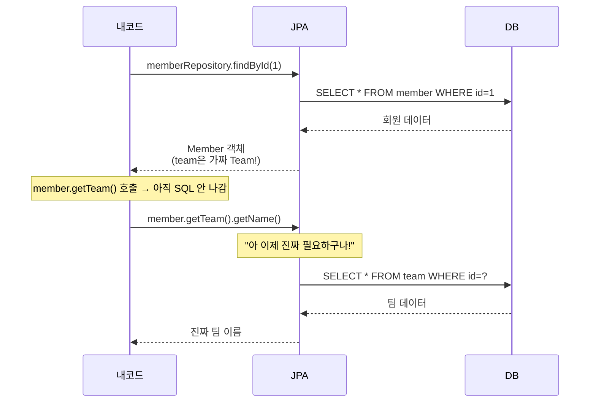

가짜 Team은 껍데기만 있어요. 누가 `team.getName()`을 부르는 순간 그제야 **"앗, 진짜 데이터 가져와야지!"** 하면서 SQL을 날립니다.

---

### 2-4-5. ⭐ 핵심: Spring Data JPA에서 FetchType 케이스별 비교

이게 진짜 헷갈리는 부분이에요. 똑같이 "조회"인데 SQL이 완전히 다르게 나갑니다. 5가지 케이스를 차근차근 봐요.

#### 공통 설정

```java
@Entity
class Member {
    @Id @GeneratedValue Long id;
    String name;

    @ManyToOne(fetch = FetchType.LAZY)
    @JoinColumn(name = "team_id")
    Team team;
}

public interface MemberRepository extends JpaRepository<Member, Long> {
    // 케이스별로 메서드 추가할 예정
}
```

회원 3명이 있고, 모두 팀이 있다고 가정해요.

---

#### 케이스 ① 그냥 조회 + team 안 씀 → 깔끔 ✅

```java
public interface MemberRepository extends JpaRepository<Member, Long> {
    List<Member> findAll();  // JpaRepository가 기본 제공
}

// 서비스
@Transactional(readOnly = true)
public void printNames() {
    List<Member> members = memberRepository.findAll();
    members.forEach(m -> System.out.println(m.getName()));  // team 안 건드림
}
```

**나가는 SQL: 1번**
```sql
SELECT id, name, team_id FROM member;
```

team을 안 쓰니까 SQL은 한 번이면 끝. 평화로워요.

---

#### 케이스 ② 그냥 조회 + team 씀 → N+1 폭탄 💥

```java
@Transactional(readOnly = true)
public void printWithTeam() {
    List<Member> members = memberRepository.findAll();
    // 이번엔 팀 이름까지!
    members.forEach(m -> System.out.println(m.getTeam().getName()));
}
```

**나가는 SQL: 1 + 3 = 4번**
```sql
SELECT * FROM member;                    -- 1번
SELECT * FROM team WHERE id = ?;         -- 회원1의 팀 → SQL 1번 더
SELECT * FROM team WHERE id = ?;         -- 회원2의 팀 → SQL 1번 더
SELECT * FROM team WHERE id = ?;         -- 회원3의 팀 → SQL 1번 더
```

이게 그 유명한 **N+1 문제**예요. 회원 100명이면 SQL이 101번! 회원 10000명이면 10001번!

> 🚨 **착각 금지**: LAZY로 했다고 N+1이 사라지는 게 아니에요. **그냥 발생 시점만 늦춰진 거예요.** team을 결국 쓰면 N+1은 똑같이 터집니다.

---

#### 케이스 ③ 메서드 이름 쿼리 → 헷갈림 주의 ⚠️

Spring Data JPA의 메서드 이름 쿼리로 팀 이름 조건을 걸어볼게요.

```java
public interface MemberRepository extends JpaRepository<Member, Long> {
    // 팀 이름으로 회원 찾기
    List<Member> findByTeamName(String teamName);
}

// 서비스
@Transactional(readOnly = true)
public void findDevTeamMembers() {
    List<Member> members = memberRepository.findByTeamName("개발팀");
    members.forEach(m -> System.out.println(m.getTeam().getName()));
}
```

**나가는 SQL: 1 + N번 (또 N+1!)**
```sql
-- 1번: JOIN은 했지만, SELECT는 m만!
SELECT m.id, m.name, m.team_id
FROM member m
INNER JOIN team t ON m.team_id = t.id
WHERE t.name = '개발팀';

-- 그리고 team 쓸 때마다...
SELECT * FROM team WHERE id = ?;
SELECT * FROM team WHERE id = ?;
```

**❓ 어, JOIN 했는데 왜 또 SQL이 나가요?**

여기가 학생들이 가장 많이 헷갈리는 포인트예요!

Spring Data JPA가 만드는 일반 JOIN은 **"WHERE 조건 걸려고 잠깐 옆 테이블 들춰본 것뿐"** 이에요. SQL에서 JOIN은 했지만, **결과 객체에는 m만 채워져요.** team은 여전히 가짜(프록시)인 채로 남아있어요.

비유하면 도서관에서 책 빌릴 때, **"옆 책장 잠깐 보고 위치 확인은 했지만"**, 그 책을 같이 빌려오진 않은 거예요. 그래서 나중에 그 책이 필요해지면 다시 가야 해요.

---

#### 케이스 ④ @EntityGraph로 함께 가져오기 → 정답! ✅

```java
public interface MemberRepository extends JpaRepository<Member, Long> {

    @EntityGraph(attributePaths = {"team"})  // ← 이 한 줄!
    List<Member> findByTeamName(String teamName);
}

// 서비스
@Transactional(readOnly = true)
public void findDevTeamMembers() {
    List<Member> members = memberRepository.findByTeamName("개발팀");
    members.forEach(m -> System.out.println(m.getTeam().getName()));
}
```

**나가는 SQL: 1번!**
```sql
SELECT m.id, m.name, m.team_id, t.id, t.name
FROM member m
LEFT OUTER JOIN team t ON m.team_id = t.id
WHERE t.name = '개발팀';
```

`@EntityGraph(attributePaths = {"team"})`는 **"team 데이터까지 같이 가져와줘"** 라는 뜻이에요. team이 진짜 객체로 채워집니다. 한 방에 끝!

---

#### 케이스 ⑤ @EntityGraph + findAll() → 모든 메서드에 적용 가능

기본으로 제공되는 `findAll()` 같은 메서드에도 그냥 오버라이드해서 적용할 수 있어요.

```java
public interface MemberRepository extends JpaRepository<Member, Long> {

    @Override
    @EntityGraph(attributePaths = {"team"})
    List<Member> findAll();
}

// 서비스
@Transactional(readOnly = true)
public void printAllWithTeam() {
    List<Member> members = memberRepository.findAll();
    members.forEach(m -> System.out.println(m.getTeam().getName()));
}
```

**나가는 SQL: 1번**
```sql
SELECT m.id, m.name, m.team_id, t.id, t.name
FROM member m
LEFT OUTER JOIN team t ON m.team_id = t.id;
```

팀 없는 회원도 결과에 포함돼요 (이때 team은 null). `@EntityGraph`는 기본으로 LEFT OUTER JOIN을 사용합니다.

---

### 2-4-6. 5가지 케이스 한눈에 비교 ⭐

| 케이스 | Repository 메서드 | SQL 횟수 | team이 채워지는가? |
|---|---|---|---|
| ① team 안 씀 | `findAll()` | 1번 ✅ | 가짜 그대로 (필요 없음) |
| ② team 씀 | `findAll()` | 1 + N번 ❌ | 쓸 때마다 SQL |
| ③ 메서드 이름 쿼리 | `findByTeamName(...)` | 1 + N번 ❌ | **JOIN해도 가짜!** |
| ④ @EntityGraph | `findByTeamName(...)` + `@EntityGraph` | 1번 ✅ | 진짜로 채워짐 |
| ⑤ findAll() 오버라이드 | `findAll()` + `@EntityGraph` | 1번 ✅ | 진짜로 채움 |

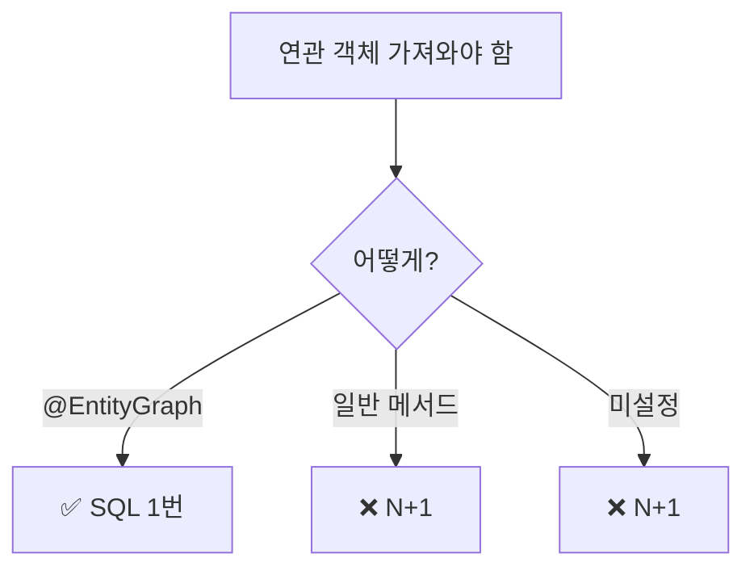


> 💡 **단 한 줄로 외우기**: **"진짜로 같이 가져오려면 반드시 `@EntityGraph`!"** 그냥 메서드 이름 쿼리는 조건만 걸 뿐이에요.

---

### 2-4-7. 컬렉션(1:N) @EntityGraph의 함정

팀에서 멤버들을 한 번에 가져오고 싶을 때:

```java
public interface TeamRepository extends JpaRepository<Team, Long> {

    @EntityGraph(attributePaths = {"members"})
    List<Team> findAll();
}
```

**함정 1: 결과가 뻥튀기됨**

A팀에 멤버가 3명이면 A팀 객체가 결과에 **3번** 나올 수 있어요. SQL JOIN의 자연스러운 결과예요.

해결: Hibernate 6+에서는 자동으로 중복 제거됩니다. 구버전은 별도 처리 필요.

**함정 2: 페이징이랑 같이 쓰면 안 됨 ⚠️**

```java
public interface TeamRepository extends JpaRepository<Team, Long> {

    @EntityGraph(attributePaths = {"members"})
    Page<Team> findAll(Pageable pageable);  // ❌ 위험!
}

// 사용
teamRepository.findAll(PageRequest.of(0, 10));
// 콘솔: WARN HHH000104 - applying in memory!
```

이거 뜨면 **DB에서 다 가져와서 메모리에서 잘라냅니다.** 데이터가 100만 건이면 OOM 터져요.

**해결책**: `default_batch_fetch_size` 설정으로 해결!

```yaml
spring:
  jpa:
    properties:
      hibernate:
        default_batch_fetch_size: 100
```

이렇게 하면 N+1이 발생할 상황에서도 JPA가 똑똑하게 **IN 절로 묶어서** 한 번에 가져와요.

```java
public interface TeamRepository extends JpaRepository<Team, Long> {
    Page<Team> findAll(Pageable pageable);  // @EntityGraph 빼고
}

// 서비스
Page<Team> teams = teamRepository.findAll(PageRequest.of(0, 10));
teams.forEach(t -> t.getMembers().size());  // 여기서 한 방에 묶어 조회!
```

```sql
-- N+1 대신 이렇게 나감
SELECT * FROM team LIMIT 10;
SELECT * FROM member WHERE team_id IN (1, 2, 3, 4, 5, 6, 7, 8, 9, 10);
```

### 2-4-8. @EntityGraph 활용 패턴 모음

실무에서 자주 쓰는 패턴들이에요.

```java
public interface OrderRepository extends JpaRepository<Order, Long> {

    // 1. 단일 연관 함께 가져오기
    @EntityGraph(attributePaths = {"member"})
    Optional<Order> findById(Long id);

    // 2. 여러 연관 함께 가져오기
    @EntityGraph(attributePaths = {"member", "delivery"})
    List<Order> findByStatus(OrderStatus status);

    // 3. 깊은 경로 (Order → Member → Team)
    @EntityGraph(attributePaths = {"member.team"})
    List<Order> findByOrderDateAfter(LocalDate date);
}
```

### 2-4-9. FetchType 핵심 5줄 정리

다음 다섯 가지만 머릿속에 새겨두면 FetchType 실수의 90%가 사라집니다.

첫째, **`@ManyToOne`/`@OneToOne`은 기본이 EAGER이니까 반드시 LAZY로 바꿔라.** 둘째, **LAZY는 N+1을 해결하는 게 아니라 미루는 것이다.** 셋째, **메서드 이름 쿼리(`findByTeamName` 등)의 일반 JOIN은 SQL JOIN만 만들 뿐 데이터를 함께 가져오지 않는다.** 넷째, **연관 객체를 함께 가져오려면 반드시 `@EntityGraph`** 를 쓴다. 다섯째, **컬렉션 fetch는 페이징과 함께 쓰지 말고, `default_batch_fetch_size`** 로 해결한다.

---

## 2-5. JPA에서 꼭 알아야 할 점

| 항목 | 핵심 |
|---|---|
| **@Transactional 없으면** | 변경 감지, 지연 로딩 모두 동작 안 함 |
| **fetch = LAZY 기본 세팅** | `@ManyToOne`/`@OneToOne`은 기본 EAGER → 반드시 LAZY |
| **메서드 이름 쿼리 ≠ @EntityGraph** | 일반 JOIN은 데이터를 함께 안 가져옴 |
| **N+1 해결책** | `@EntityGraph`, `default_batch_fetch_size` |
| **컬렉션 @EntityGraph + 페이징 금지** | 메모리에서 페이징 → OOM 위험 |
| **연관관계 주인** | FK 가진 쪽(`@JoinColumn`)이 주인 |
| **LazyInitializationException** | 트랜잭션 끝난 후 프록시 건드리면 발생 |
| **SQL 로그 켜기** | 항상 `show-sql=true`로 확인하기 |

---

# Part 3. Spring Transaction — 모 아니면 도

## 3-1. 트랜잭션이 뭔가요?

**한 줄 정의**: "여러 SQL을 묶어서, 다 성공하거나 다 실패하거나 둘 중 하나로 처리하는 단위"

### 비유: ATM 송금

A 계좌에서 B 계좌로 10만원 송금한다고 해봐요.

1. A 계좌에서 -10만원
2. B 계좌에 +10만원

**중간에 정전이 나면?** 1번만 되고 2번이 안 됐다면? A는 돈 사라졌는데 B는 못 받음. **돈이 증발해요!**

트랜잭션은 **"둘 다 성공하면 확정(COMMIT), 하나라도 실패하면 둘 다 없던 일로(ROLLBACK)"** 처리해줘요.

### ACID 4가지 성질

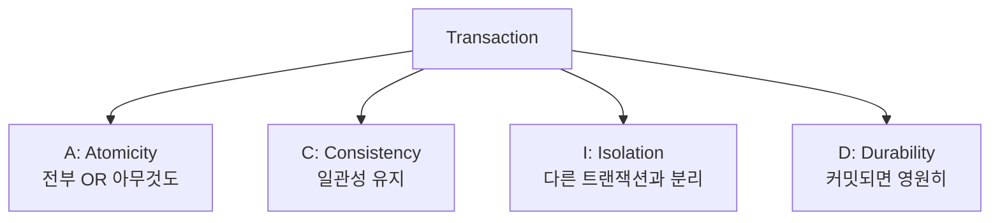

## 3-2. @Transactional이 내부적으로 하는 일

```java
@Service
@RequiredArgsConstructor
public class OrderService {

    private final MemberRepository memberRepository;
    private final ItemRepository itemRepository;
    private final OrderRepository orderRepository;

    @Transactional
    public void placeOrder(Long memberId, Long itemId) {
        Member member = memberRepository.findById(memberId).orElseThrow();
        Item item = itemRepository.findById(itemId).orElseThrow();
        item.decreaseStock(1);
        Order order = Order.create(member, item);
        orderRepository.save(order);
    }
}
```

`@Transactional`을 붙이면 Spring이 알아서 다음을 해줍니다.

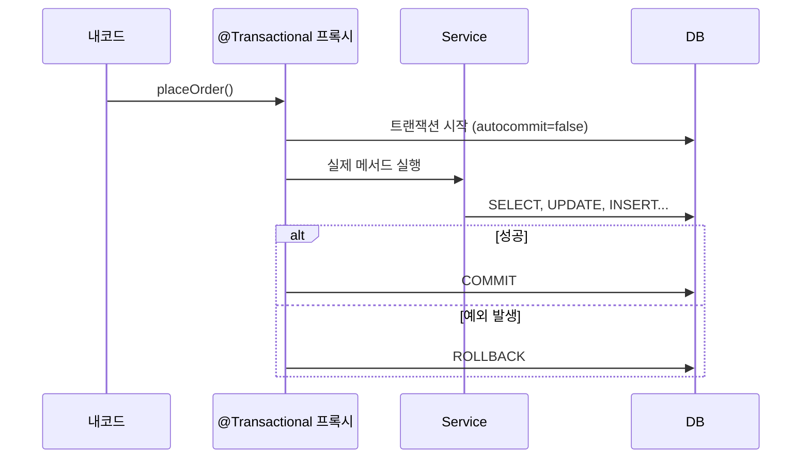

내가 직접 쓰면 이런 SQL이 자동으로 처리되는 거예요.

```sql
START TRANSACTION;          -- 시작
SELECT * FROM member WHERE id = ?;
SELECT * FROM item WHERE id = ?;
UPDATE item SET stock = stock - 1 WHERE id = ?;
INSERT INTO orders (...) VALUES (...);
COMMIT;                     -- 끝 (예외 시 ROLLBACK)
```

## 3-3. 트랜잭션 전파 (Propagation) — 중첩되면 어떻게?

`@Transactional` 메서드 안에서 또 `@Transactional` 메서드를 부르면? 트랜잭션이 두 개? 한 개?

### 비유: 회의실 예약

```java
@Service
@RequiredArgsConstructor
public class OuterService {

    private final InnerService innerService;

    @Transactional
    public void outer() {       // 회의실 예약함 (TX1)
        innerService.inner();    // 그 안에서 다른 회의실 예약?
    }
}
```

**REQUIRED (기본)**: "이미 예약된 회의실 같이 쓸게" — 같은 트랜잭션
**REQUIRES_NEW**: "별도 회의실 새로 예약!" — 새 트랜잭션

### 가장 중요한 비교: REQUIRED vs REQUIRES_NEW

**상황**: 주문이 실패해도 로그는 남기고 싶어요.

```java
@Service
@RequiredArgsConstructor
public class OrderService {

    private final OrderRepository orderRepository;
    private final LogService logService;

    @Transactional
    public void placeOrder() {
        orderRepository.save(order);
        logService.writeLog("주문 시도");
        throw new RuntimeException("주문 실패!");
    }
}
```

**Case A: REQUIRED (기본)**
```java
@Service
public class LogService {

    @Transactional(propagation = Propagation.REQUIRED)
    public void writeLog(String msg) { ... }
}
```
→ 같은 트랜잭션 → 주문 롤백 시 **로그도 같이 사라짐** ❌

**Case B: REQUIRES_NEW**
```java
@Service
public class LogService {

    @Transactional(propagation = Propagation.REQUIRES_NEW)
    public void writeLog(String msg) { ... }
}
```
→ 별도 트랜잭션 → 주문 롤백돼도 **로그는 남음** ✅

```sql
-- REQUIRES_NEW의 실제 흐름
START TRANSACTION;          -- TX1 (placeOrder)
INSERT INTO orders ...;
-- writeLog 진입, TX1 잠시 멈춤
START TRANSACTION;          -- TX2 (writeLog)
INSERT INTO log ...;
COMMIT;                     -- TX2 완료
-- placeOrder로 돌아감, 예외 발생
ROLLBACK;                   -- TX1 롤백 (orders 사라짐, log는 살아있음)
```

### 전파 옵션 한눈에

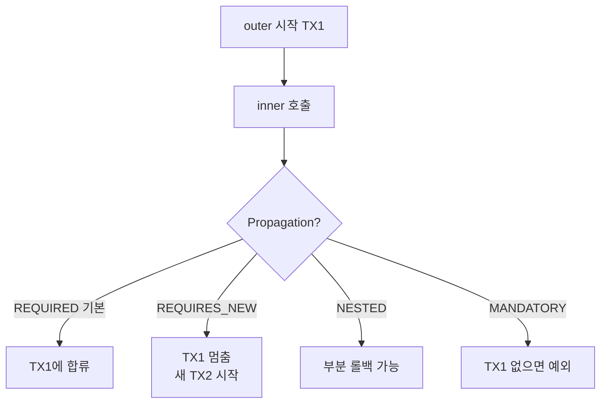

## 3-4. 격리 수준 — 다른 사람과 동시에 작업할 때

**상황**: 둘이 동시에 같은 데이터를 보고 수정하면? 격리 수준은 그 충돌을 어디까지 막아줄지를 정해요.

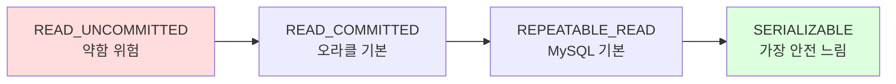

대부분 **DB 기본 설정 그대로** 두고, 정합성이 정말 중요한 경우(재고 차감 등)에만 락을 추가합니다.

## 3-5. Spring Transaction 자주 하는 실수 4가지

### 실수 ① Self-invocation — 같은 클래스 안에서 부르면 안 걸려요!

```java
@Service
public class MyService {

    public void outer() {
        inner();  // ❌ @Transactional 무시됨!
    }

    @Transactional
    public void inner() { ... }
}
```

**왜?** `@Transactional`은 **프록시**가 가로채서 동작해요. 외부에서 호출되면 프록시를 거치지만, 같은 클래스 안에서 부르면(`this.inner()`) 프록시를 안 거쳐서 트랜잭션이 안 걸립니다.

비유: 출입구에 경비가 있는 건물인데, 옆 사무실에서 직접 옆문으로 가면 경비를 안 거치는 거예요.

**해결**: 다른 빈으로 분리하거나, 자기 자신을 주입받기.

### 실수 ② 체크 예외는 기본적으로 롤백 안 됨

```java
@Transactional
public void doSomething() throws IOException {
    throw new IOException("체크 예외");  // ❌ 롤백 안 됨!
}
```

기본은 **RuntimeException과 Error만 롤백.** 체크 예외(IOException 같은)는 롤백 안 해요.

**해결**:
```java
@Transactional(rollbackFor = Exception.class)
```

### 실수 ③ readOnly = true 활용

```java
@Transactional(readOnly = true)
public List<Member> findAll() {
    return memberRepository.findAll();
}
```

조회만 하는 메서드에 붙여주면 변경 감지를 안 해서 **성능이 좋아지고**, 실수로 INSERT/UPDATE가 들어가는 것도 막아줘요. 조회 전용 서비스에는 무조건 붙이세요.

### 실수 ④ 트랜잭션 안에서 외부 API 호출 금지

```java
@Transactional
public void order() {
    saveOrder();
    paymentApi.call();  // ❌ 외부 API 응답 늦으면 DB 커넥션 계속 점유
}
```

DB 커넥션은 한정 자원이에요. 외부 API가 5초 걸리면 그 5초 동안 커넥션을 못 돌려줘서, 다른 요청들이 줄줄이 밀려요. **외부 API는 트랜잭션 밖으로 빼세요.**

## 3-6. JPA + Transaction 통합 흐름

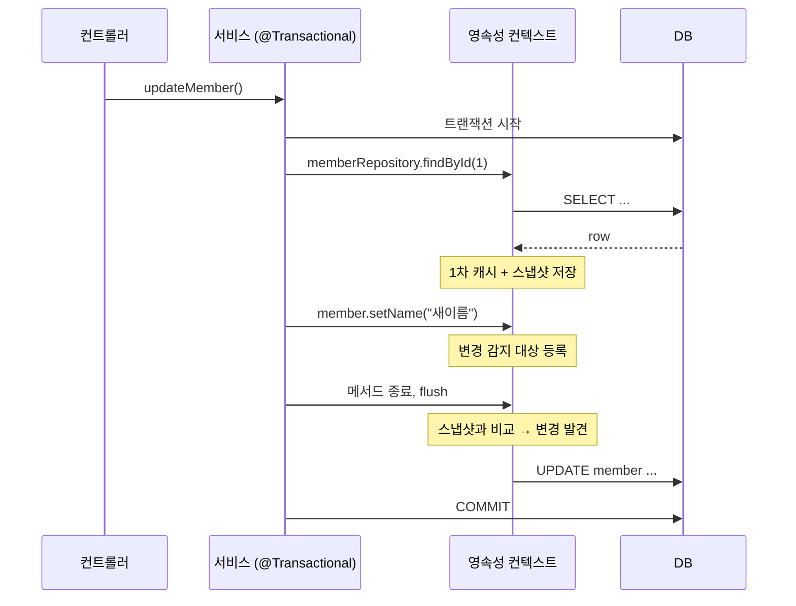

---

# Part 4. 종합 실습 — 같이 풀어볼 문제

## 시나리오: 주문 시스템

```java
@Entity
class Order {
    @Id @GeneratedValue Long id;

    @ManyToOne(fetch = LAZY) @JoinColumn(name = "member_id")
    Member member;

    @OneToMany(mappedBy = "order", cascade = ALL)
    List<OrderItem> items = new ArrayList<>();

    int totalPrice;
}

public interface OrderRepository extends JpaRepository<Order, Long> {
}
```

### Q1. 다음 코드는 SQL이 몇 번 나갈까요?

주문이 5개 있다고 가정해봐요.

```java
@Transactional(readOnly = true)
public void printOrders() {
    List<Order> orders = orderRepository.findAll();   // (A)
    for (Order o : orders) {
        System.out.println(o.getMember().getName());  // (B)
        for (OrderItem oi : o.getItems()) {           // (C)
            System.out.println(oi.getItemName());
        }
    }
}
```

**정답**:
- (A) 주문 전체 조회 → **1번**
- (B) 주문마다 member 조회 → **5번** (LAZY 초기화)
- (C) 주문마다 items 조회 → **5번** (LAZY 초기화)
- 총 **11번** (= 1 + 2N)

전형적인 N+1입니다.

### Q2. 어떻게 줄일까요?

```java
public interface OrderRepository extends JpaRepository<Order, Long> {

    @EntityGraph(attributePaths = {"member", "items"})
    List<Order> findAll();
}
```

**SQL은 단 1번!**

⚠️ 하지만 `items`는 컬렉션이라 페이징이 안 됩니다. 페이징이 필요하면 **member만 `@EntityGraph`로 가져오고, items는 `default_batch_fetch_size`로** 해결하세요.

```java
public interface OrderRepository extends JpaRepository<Order, Long> {

    @EntityGraph(attributePaths = {"member"})  // member만!
    Page<Order> findAll(Pageable pageable);
}
```

### Q3. 주문 생성 시 SQL은?

```java
@Service
@RequiredArgsConstructor
public class OrderService {

    private final MemberRepository memberRepository;
    private final OrderRepository orderRepository;

    @Transactional
    public Long order(Long memberId, String itemName, int price, int count) {
        Member member = memberRepository.findById(memberId).orElseThrow();

        Order order = new Order();
        order.setMember(member);

        OrderItem oi = new OrderItem();
        oi.setItemName(itemName);
        oi.setPrice(price);
        oi.setCount(count);
        oi.setOrder(order);
        order.getItems().add(oi);
        order.setTotalPrice(price * count);

        orderRepository.save(order);  // cascade=ALL → OrderItem도 자동 저장
        return order.getId();
    }
}
```

**나가는 SQL:**
```sql
SELECT * FROM member WHERE id = ?;
-- 메서드 끝날 때 한꺼번에
INSERT INTO orders (member_id, total_price) VALUES (?, ?);
INSERT INTO order_item (order_id, item_name, price, count) VALUES (?, ?, ?, ?);
COMMIT;
```

---

# Part 5. 핵심 6가지로 마무리

오늘 배운 내용 중 **딱 6가지만** 기억해도 충분해요.

**①** JPA 쓸 때는 항상 SQL 로그를 켜놓고 어떤 쿼리가 나가는지 본다.
**②** `@ManyToOne`/`@OneToOne`은 기본이 EAGER다 — 반드시 `fetch = LAZY`로 바꾸자.
**③** Spring Data JPA의 메서드 이름 쿼리(`findByTeamName` 등)는 데이터를 함께 가져오지 않는다 — 같이 가져오려면 반드시 `@EntityGraph`!
**④** `@Transactional`은 프록시 기반이라 같은 클래스 내부 호출에서는 안 먹는다.
**⑤** 영속성 컨텍스트(1차 캐시·변경 감지·쓰기 지연)를 모르면 JPA를 쓰는 게 아니라 당하는 거다.
**⑥** N+1은 반드시 만난다 — `@EntityGraph`, `default_batch_fetch_size` 두 가지로 막을 수 있다.

---

## 부록: 추천 실습 환경 설정

```yaml
# application.yml
spring:
  jpa:
    hibernate:
      ddl-auto: create-drop  # 학습용
    properties:
      hibernate:
        format_sql: true
        use_sql_comments: true
        default_batch_fetch_size: 100  # N+1 자동 완화
    show-sql: true

logging:
  level:
    org.hibernate.SQL: debug
    org.hibernate.orm.jdbc.bind: trace          # 파라미터 값
    org.springframework.transaction: debug      # 트랜잭션 흐름
```

이렇게 설정해 두면 콘솔에 모든 SQL과 트랜잭션 흐름이 그대로 찍혀요. 강의 중에 **"이 코드가 → 이 SQL을 만든다"** 를 직접 눈으로 비교하면서 진행하면 가장 효과적입니다.

특히 **2-4절의 5가지 케이스를 Repository로 직접 만들어 실행해보고 SQL 비교**하는 실습을 강력히 추천해요. 이거 한 번 해보면 FetchType과 `@EntityGraph` 관계가 머릿속에 콱 박힙니다.

---

필요하시면 락 처리, QueryDSL, 배치 INSERT 최적화 같은 심화 주제로도 더 풀어드릴 수 있어요. 강의 시간이 어느 정도인지 알려주시면 분량도 맞춰드릴게요!
