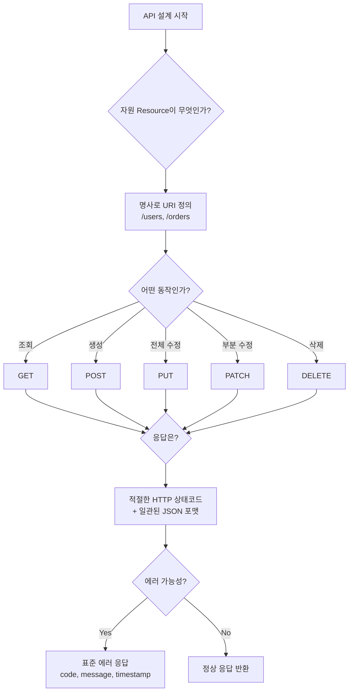
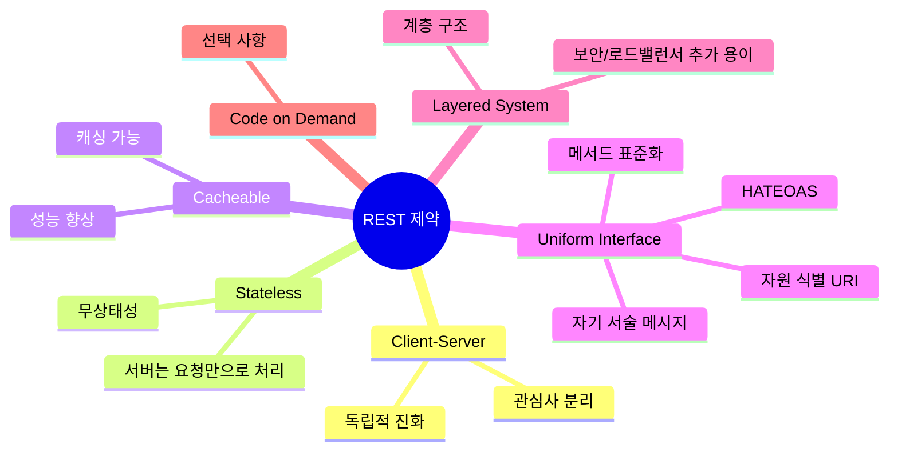
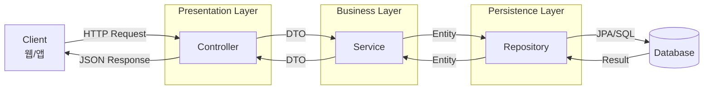
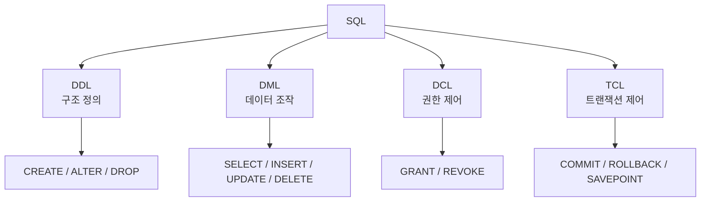
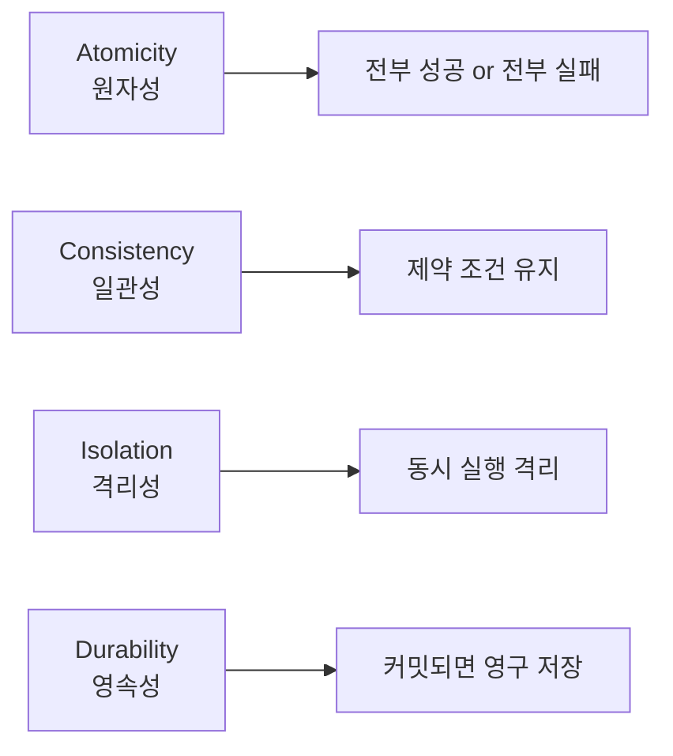
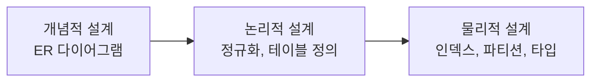
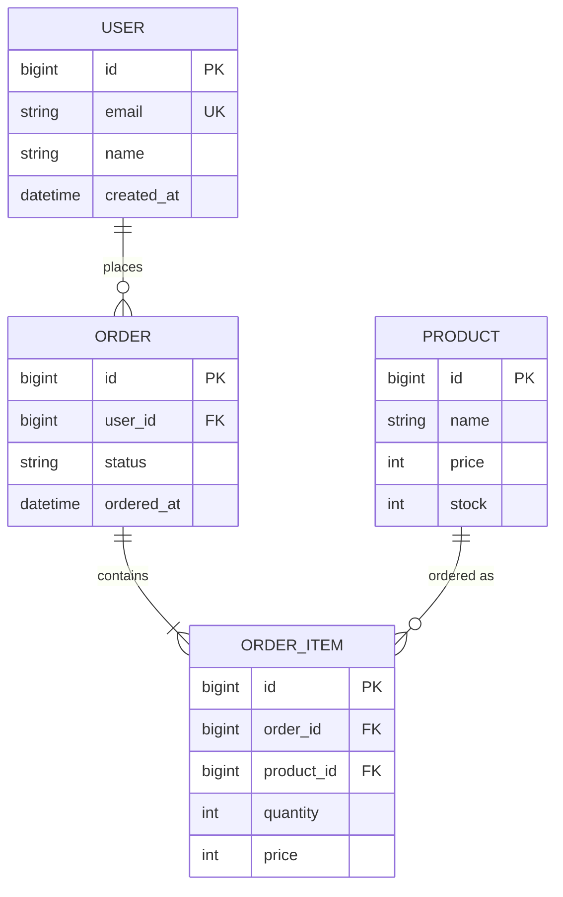
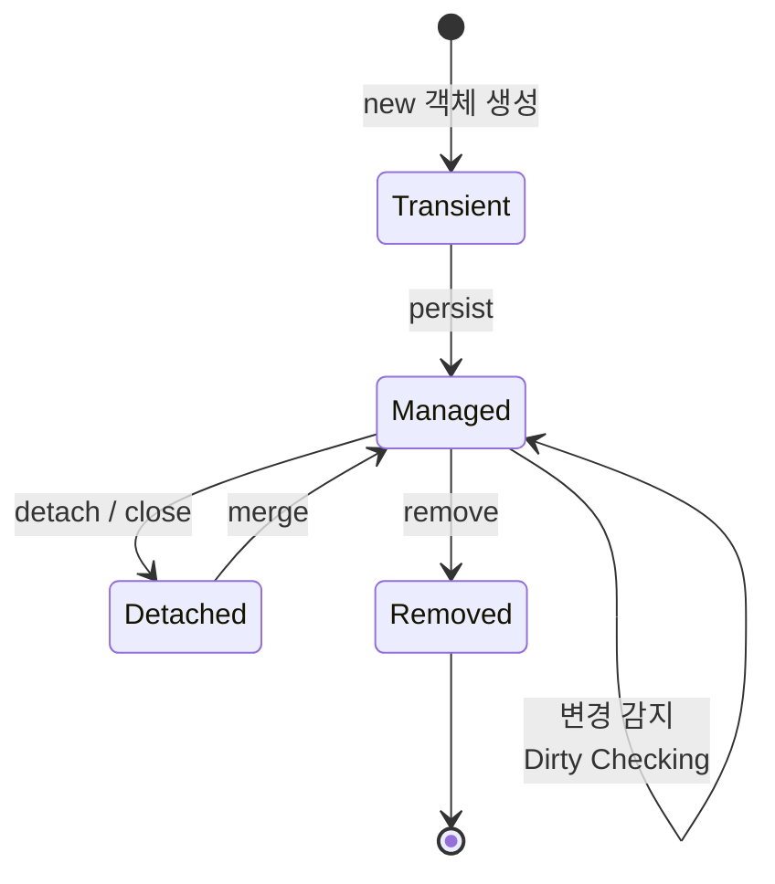
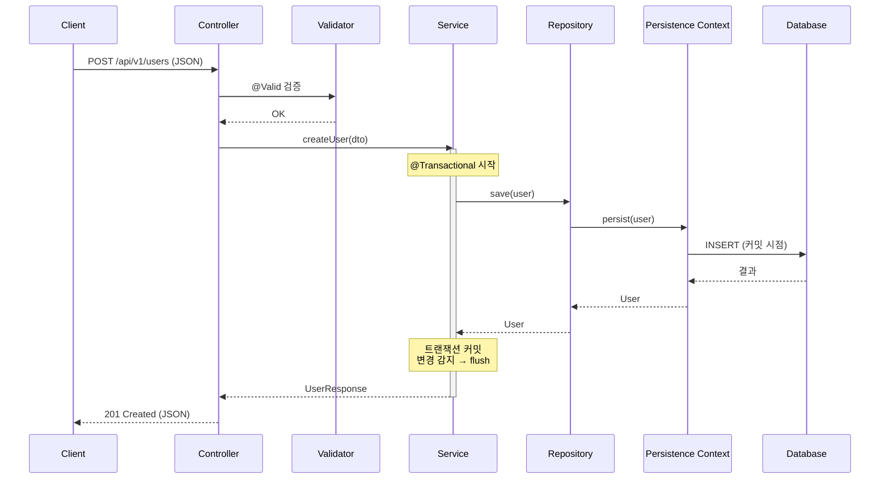
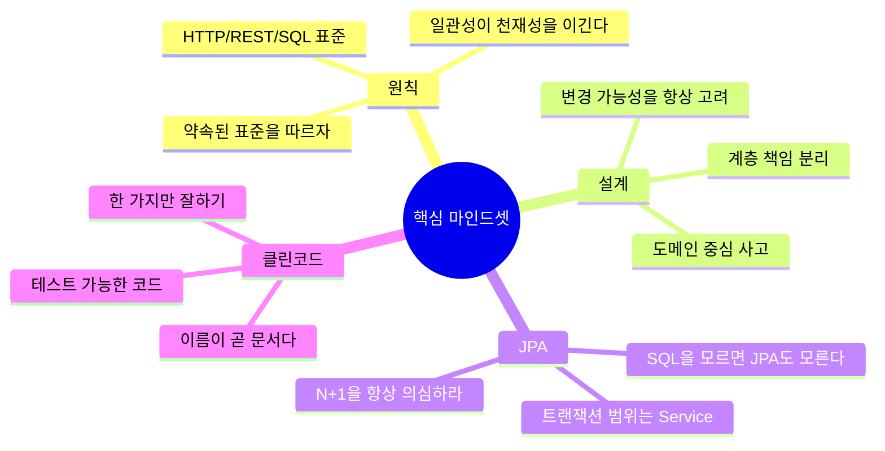

# Spring Boot 수강생을 위한 핵심 개념 리뷰 (용어 풀이판)

> **대상**: 초급 백엔드 개발자 (전문 용어가 아직 낯선 분들)
> **주제**: RESTful API 설계 + 데이터베이스 설계 + Spring Data JPA
> **목표**: "왜 이렇게 해야 하는가?"를 명확히 이해하고, 클린 코드 관점에서 실무에 적용할 수 있게 된다.
> **특징**: 어려운 용어는 일상 비유로 풀어서 설명합니다.

---

## 📚 목차

1. [먼저 알아두면 좋은 기본 용어](#0-먼저-알아두면-좋은-기본-용어)
2. [좋은 웹 API 디자인이란](#1-좋은-웹-api-디자인이란)
3. [RESTful API 설계와 구현 (이론)](#2-restful-api-설계와-구현-이론)
4. [RESTful API 설계와 구현 (실기)](#3-restful-api-설계와-구현-실기)
5. [SQL 이해하기](#4-sql-이해하기)
6. [데이터베이스 설계](#5-데이터베이스-설계)
7. [Spring Data JPA 도입하기](#6-spring-data-jpa-도입하기)
8. [전체 아키텍처 흐름](#7-전체-아키텍처-흐름)
9. [클린 코드 체크리스트](#8-클린-코드-체크리스트)

---

## 0. 먼저 알아두면 좋은 기본 용어

본격적으로 들어가기 전, 자주 등장할 용어를 일상적인 비유로 미리 정리합니다.

| 용어 | 풀어쓴 의미 | 일상 비유 |
|------|------------|----------|
| **API** (Application Programming Interface) | 프로그램끼리 대화하는 약속된 창구 | 식당의 주문 카운터. 손님은 메뉴판에 적힌 대로만 주문하면 음식이 나옴 |
| **Resource (자원)** | 시스템이 다루는 "정보 덩어리" | 도서관의 책 한 권 한 권 |
| **Endpoint (엔드포인트)** | API에 접근하는 주소 | 식당 카운터 위치 (예: `/users/1`) |
| **Request (요청)** | 클라이언트가 서버에 보내는 메시지 | 손님이 점원에게 주문서 전달 |
| **Response (응답)** | 서버가 클라이언트에 돌려주는 결과 | 점원이 음식을 가져다줌 |
| **HTTP** | 웹에서 정보를 주고받는 약속(프로토콜) | 우편 배송 규칙 |
| **JSON** | 데이터를 텍스트로 표현하는 형식 | 깔끔하게 정리된 메모 |
| **Client / Server** | 요청하는 쪽 / 응답하는 쪽 | 손님 / 식당 |
| **Stateless (무상태)** | 서버가 이전 대화를 기억하지 않음 | 매번 처음 온 손님처럼 모든 정보를 다시 주문해야 함 |
| **Idempotent (멱등)** | 같은 요청을 여러 번 해도 결과가 같음 | 엘리베이터 버튼을 5번 눌러도 한 번 누른 것과 같음 |
| **Persistence (영속성)** | 데이터를 영구히 저장하는 것 | 메모를 머릿속이 아닌 노트에 기록 |
| **ORM** (Object-Relational Mapping) | 객체와 DB 테이블을 자동으로 연결 | 외국어 자동 번역기 (자바 ↔ SQL) |
| **Transaction (트랜잭션)** | "전부 성공 또는 전부 실패"로 묶이는 작업 단위 | 송금: 출금만 되고 입금이 안 되면 다 취소 |
| **Layer (계층)** | 역할별로 코드를 나눠 쌓은 층 | 케이크의 시트 층. 각 층의 역할이 다름 |

> 이 표를 한 번 훑고 가면 아래 내용이 훨씬 잘 들어올 거예요. 모르는 단어가 나오면 여기로 돌아오세요.

---

## 1. 좋은 웹 API 디자인이란

### 🎯 핵심 개념

좋은 API는 **"문서 없이도 추측 가능한 API"** 입니다.

쉽게 말해, 메뉴판이 없어도 메뉴를 짐작할 수 있는 식당이라고 할까요? "여기는 분식집이니까 떡볶이는 있겠지?" 하고 손님이 자연스럽게 떠올릴 수 있어야 좋은 식당입니다. API도 마찬가지로, 사용하는 사람(다른 개발자, 프론트엔드 개발자, 외부 서비스)이 "여기쯤에 있겠지?" 하고 추측해서 맞히는 게 가장 좋습니다.

### ✅ 꼭 알아야 할 5가지 원칙

| 원칙 | 풀어쓴 설명 | 왜 필요한가? |
|------|-------------|-------------|
| **일관성 (Consistency)** | 어디서나 같은 규칙으로 만들기 | 한 번 익히면 다른 곳도 자동으로 알 수 있음 |
| **명확성 (Clarity)** | 이름만 봐도 무슨 일을 하는지 알 수 있게 | 추측이 빗나가지 않음 |
| **예측 가능성 (Predictability)** | 비슷한 건 비슷하게 동작 | "아마 이렇게 되겠지"가 맞아떨어짐 |
| **버전 관리 (Versioning)** | API가 바뀔 때 옛날 버전도 살려두기 | 이미 쓰던 사람이 깨지지 않도록 |
| **에러 처리 (Error Handling)** | 잘못됐을 때 똑같은 형식으로 알리기 | 받는 쪽이 한 가지 방식만 처리하면 됨 |

### 📌 좋은 API vs 나쁜 API

```
❌ 나쁜 예시 (제각각인 식당)
GET  /getUserById?id=1     ← "유저 가져오기"
POST /createUser           ← "유저 만들기"
POST /user/delete/1        ← "유저 삭제"
GET  /api/usersList        ← "유저 목록"

✅ 좋은 예시 (일관된 식당)
GET    /api/v1/users/1     ← 1번 유저 조회
POST   /api/v1/users       ← 유저 생성
DELETE /api/v1/users/1     ← 1번 유저 삭제
GET    /api/v1/users       ← 유저 목록
```

**왜 이렇게 해야 할까?**

URI(주소)는 **"무엇을(자원)"** 가리키는 위치입니다. HTTP 메서드(GET, POST 등)는 **"어떻게 할지(동작)"** 를 표현합니다. 두 역할을 분리해야 깔끔합니다.

비유하자면, "도서관 1층 A-3 칸의 책"이 자원이고, "빌리기/반납하기/읽기"가 동작입니다. 주소에 "빌리는 책"이라고 쓰면 동작과 위치가 섞여서 헷갈리겠죠?

> **용어 풀이**
> - **URI** (Uniform Resource Identifier): 자원의 주소. 흔히 말하는 URL과 거의 같은 의미로 봐도 됩니다.
> - **HTTP 메서드**: 요청의 종류를 나타내는 이름표. GET, POST, PUT, DELETE 등.

### 🧭 좋은 API 설계 의사결정 흐름



---

## 2. RESTful API 설계와 구현 (이론)

### 🎯 REST란?

**RE**presentational **S**tate **T**ransfer
한국어로 풀면 "표현(JSON 같은 형식)으로 자원의 상태를 주고받는 방식"입니다.

**더 쉽게 풀면:** 서버에 있는 정보(자원)를 **JSON이라는 깔끔한 메모로 바꿔서** 클라이언트와 주고받는 방식입니다.

> **용어 풀이**
> - **상태(State)**: 데이터의 현재 모습. 예: 유저 1번의 이름이 "홍길동"인 상태
> - **표현(Representation)**: 그 상태를 보여주는 형식. 예: `{"id": 1, "name": "홍길동"}`

### ✅ REST의 6가지 제약 조건 (외우지 말고 이해하기)



각 항목을 일상 비유로 풀어보면:

- **Client-Server (클라이언트-서버 분리)**: 손님과 식당이 분리되어 있어야 함. 손님이 주방을 직접 만지지 않듯, 클라이언트가 서버 내부를 알 필요 없음.
- **Stateless (무상태)**: 식당이 손님의 이전 주문을 기억하지 않음. 매 요청마다 필요한 정보를 다 담아 보내야 함. → **왜?** 서버가 기억할 필요가 없으니 서버를 여러 대로 늘리기 쉬워짐.
- **Cacheable (캐시 가능)**: 자주 묻는 메뉴는 점원이 외워둘 수 있음. → 같은 요청을 반복할 때 빠르게 응답.
- **Uniform Interface (일관된 인터페이스)**: 모든 식당이 같은 방식으로 주문받음. → 학습 비용 절감.
- **Layered System (계층 구조)**: 손님 → 점원 → 주방 → 창고처럼 단계가 있음. → 중간에 보안 검사 같은 걸 끼워넣기 쉬움.
- **Code on Demand (선택사항)**: 필요하면 서버가 코드를 보내서 클라이언트에서 실행. 거의 안 씀.

> **용어 풀이**
> - **캐시(Cache)**: 자주 쓰는 데이터를 가까운 곳에 잠깐 저장해두는 것. 컴퓨터의 "단기 기억" 같은 것.
> - **인터페이스(Interface)**: 서로 다른 둘이 만나는 접점/규칙.

### 📌 HTTP 메서드와 멱등성(Idempotency)

먼저 **멱등성(Idempotency)**부터 풀어볼게요.

> **멱등성이란?**
> "같은 요청을 1번 보내든 100번 보내든 결과가 똑같다"는 성질입니다.
>
> 일상 비유: **엘리베이터의 호출 버튼**. 한 번 누르나 다섯 번 누르나 엘리베이터는 한 번만 옵니다. 이게 멱등합니다.
>
> 반대로 **자판기의 음료 버튼**은 누를 때마다 음료가 하나씩 나옵니다. 이건 멱등하지 않습니다.

| 메서드 | 의미 | 멱등성 | 안전성 | 비유 |
|--------|------|--------|--------|------|
| GET | 조회 | ✅ | ✅ | 메뉴판 보기 (몇 번 봐도 같음) |
| POST | 생성 | ❌ | ❌ | 주문하기 (누를 때마다 새 주문) |
| PUT | 전체 교체 | ✅ | ❌ | 주소를 통째로 새 주소로 바꿈 (몇 번 해도 결과 같음) |
| PATCH | 부분 수정 | ❌ (보통) | ❌ | "+1살" 같은 수정 (할 때마다 결과 달라짐) |
| DELETE | 삭제 | ✅ | ❌ | 휴지통 비우기 (한 번 비우면 끝) |

> **안전성(Safe)**: 서버의 데이터를 바꾸지 않는 성질. GET만 안전합니다.

**왜 멱등성이 중요할까?**

네트워크가 불안정해서 같은 요청이 두 번 도착하는 일은 흔합니다. 만약 결제 API가 멱등하지 않다면? 같은 결제가 두 번 일어나서 손님 돈이 두 번 빠져나가는 사고가 납니다 😱

그래서:
- 조회/수정/삭제는 멱등하게 만들고
- 생성(POST) 같이 멱등하지 않은 작업은 **`Idempotency-Key`라는 고유 번호를 헤더에 붙여서** 중복을 막습니다.

> **헤더(Header)**: HTTP 요청/응답에 붙는 부가 정보. 편지로 치면 봉투에 적힌 내용(보낸 사람, 우편 종류 등).

### 📌 HTTP 상태 코드 (필수 암기)

상태 코드는 **응답이 어떻게 됐는지 알려주는 3자리 숫자**입니다.

| 범위 | 의미 | 대표 코드 | 일상 비유 |
|------|------|----------|----------|
| 2xx | 성공 | 200 OK, 201 Created, 204 No Content | "주문 처리 완료!" |
| 3xx | 리다이렉션 | 301, 304 | "그 메뉴는 옆 가게로 옮겼어요" |
| 4xx | 클라이언트 잘못 | 400, 401, 403, 404, 409, 422 | "주문서가 잘못 작성됐어요" |
| 5xx | 서버 잘못 | 500, 502, 503 | "주방에 불이 났어요" |

자주 쓰는 코드를 풀어쓰면:
- **200 OK**: 잘 됐어요
- **201 Created**: 새로 만들었어요 (POST 성공)
- **204 No Content**: 잘 됐는데 돌려줄 내용은 없어요 (DELETE 성공)
- **400 Bad Request**: 요청이 잘못됐어요
- **401 Unauthorized**: 누구신지 모르겠어요 (로그인 필요)
- **403 Forbidden**: 누군지는 알지만 권한이 없어요
- **404 Not Found**: 그런 거 없어요
- **409 Conflict**: 충돌이 났어요 (예: 이메일 중복)
- **500 Internal Server Error**: 서버 내부에서 뭔가 터졌어요

**왜 200만 쓰면 안 될까?**

가끔 모든 응답을 200으로 주고 본문에 `success: false`를 넣는 코드를 봅니다. 하지만 이렇게 하면:
1. **모니터링 도구가 에러를 못 잡습니다** (다 200이니까 정상이라고 봄)
2. **캐시/프록시 같은 중간 장비가 잘못 동작합니다**
3. **클라이언트가 매번 본문을 열어봐야 합니다**

HTTP는 이미 잘 만들어진 약속이니, 그 약속을 따르는 게 가장 단순하고 안전합니다.

> **모니터링 도구**: 시스템에 문제가 없는지 자동으로 감시하는 프로그램.

---

## 3. RESTful API 설계와 구현 (실기)

### 🏗️ Spring Boot 표준 계층 아키텍처

**아키텍처(Architecture)**란 건물 설계도 같은 것입니다. 코드를 어떻게 층층이 쌓을지 정한 큰 그림이에요.



**식당으로 비유하면:**
- **Controller (컨트롤러)** = 점원: 손님 주문을 받아 주방에 전달
- **Service (서비스)** = 주방장: 실제 요리(비즈니스 로직)를 함
- **Repository (리포지토리)** = 창고지기: 재료를 꺼내고 보관(DB 접근)

### 📌 각 계층의 책임 (단일 책임 원칙)

| 계층 | 책임 | 하지 말아야 할 것 |
|------|------|------------------|
| **Controller** | HTTP 요청/응답 변환, 검증 | 비즈니스 로직 작성 ❌ |
| **Service** | 비즈니스 로직, 트랜잭션 | HTTP 객체 직접 다루기 ❌ |
| **Repository** | DB 접근만 | 비즈니스 판단 ❌ |
| **Entity** | DB 테이블과 연결된 자바 객체 | 외부에 그대로 노출 ❌ |
| **DTO** | 계층 간에 데이터를 옮기는 운반책 | 비즈니스 로직 ❌ |

> **용어 풀이**
> - **비즈니스 로직(Business Logic)**: "사용자가 가입하면 환영 메일을 보낸다" 같은 **업무 규칙**.
> - **Entity (엔티티)**: DB의 한 행(row)에 해당하는 자바 객체. 예: User 테이블 ↔ User 클래스
> - **DTO** (Data Transfer Object): 계층 사이에서 데이터만 들고 옮기는 단순한 객체. 우편 봉투 같은 것.

**왜 계층을 나눌까?**

각 계층이 **변경되는 이유**가 다르기 때문입니다.
- UI 디자인이 바뀌면? Controller만 수정
- DB를 MySQL → PostgreSQL로 바꾸면? Repository만 수정
- "30일 이상 미접속자는 휴면 처리" 정책이 생기면? Service만 수정

이걸 안 지키고 한 곳에 다 몰아넣으면, 작은 변경에도 여러 군데를 수정해야 해서 버그가 생기기 쉽습니다.

### 📌 DTO를 왜 써야 하나?

```java
// ❌ Entity 직접 노출 (위험)
@GetMapping("/users/{id}")
public User getUser(@PathVariable Long id) {
    return userRepository.findById(id).orElseThrow();
}

// ✅ DTO로 변환
@GetMapping("/users/{id}")
public UserResponse getUser(@PathVariable Long id) {
    User user = userService.findById(id);
    return UserResponse.from(user);
}
```

**Entity를 그대로 내보내면 생기는 문제:**

1. **보안 사고**: User 엔티티에 있는 `password`, `권한` 같은 민감한 필드가 그대로 응답에 나갈 수 있음 😱
2. **순환 참조**: User가 Order를 갖고, Order가 User를 갖는 구조면 JSON으로 변환할 때 무한 루프에 빠짐
3. **결합도 증가**: DB 테이블 구조 = API 스펙이 되어버려서, DB만 바꿔도 API 사용자가 깨짐
4. **LazyInitializationException**: JPA의 지연 로딩이 작동하다가 트랜잭션 밖에서 터짐 (뒤에 다시 설명)

> **용어 풀이**
> - **결합도(Coupling)**: 두 코드가 얼마나 강하게 묶여 있는지. 결합도가 높으면 한쪽만 바꿔도 다른 쪽이 깨짐.
> - **순환 참조(Circular Reference)**: A가 B를 가리키고, B가 A를 가리키는 상황. 무한 루프의 원인.

### 📌 표준 응답/에러 포맷

응답을 항상 같은 모양으로 만들어두면, 클라이언트가 코드를 한 번만 짜면 됩니다.

```java
// 공통 응답 (성공)
{
  "data": { ... },
  "message": "OK"
}

// 공통 에러
{
  "code": "USER_NOT_FOUND",
  "message": "사용자를 찾을 수 없습니다",
  "timestamp": "2026-04-28T10:00:00",
  "path": "/api/v1/users/999"
}
```

`@RestControllerAdvice` + `@ExceptionHandler`를 사용하면 모든 컨트롤러에서 발생하는 예외를 한곳에서 처리할 수 있습니다. 매번 try-catch로 감싸지 않아도 돼서 코드가 깔끔해져요.

> **예외(Exception)**: 프로그램이 정상 흐름에서 벗어난 상황. 예: "유저를 못 찾음", "DB 연결 끊김"

### 📌 검증(Validation)은 Controller에서

**검증(Validation)** = 들어온 데이터가 올바른지 확인하는 작업.

```java
@PostMapping("/users")
public ResponseEntity<UserResponse> create(
    @Valid @RequestBody UserCreateRequest request  // @Valid 필수
) { ... }

public class UserCreateRequest {
    @NotBlank @Email
    private String email;

    @Size(min = 8, max = 20)
    private String password;
}
```

**왜 입구에서 검증하나?** 식당으로 치면, 주방에 들어가기 전에 점원이 "이 메뉴는 없어요"라고 미리 거절하는 것과 같습니다. 잘못된 입력은 비즈니스 로직(주방)까지 도달하기 전에 차단해야 코드가 깔끔해집니다. 이걸 **방어적 프로그래밍**이라고 합니다.

---

## 4. SQL 이해하기

### 🎯 핵심 개념

**SQL**은 데이터베이스에 말을 거는 언어입니다. (Structured Query Language = 구조화된 질의 언어)

JPA를 쓰더라도 **SQL을 모르면 성능 튜닝이 불가능**합니다. JPA는 결국 SQL을 자동으로 만들어주는 도구일 뿐, 어떤 SQL이 만들어지는지 이해하지 못하면 성능 문제를 해결할 수 없습니다.

### ✅ 꼭 알아야 할 SQL 카테고리



각 카테고리를 일상 비유로 풀면:
- **DDL** (Data Definition Language) = "건물 짓고 부수기": 테이블 만들기, 변경, 삭제
- **DML** (Data Manipulation Language) = "물건 들이고 빼기": 데이터 조회, 추가, 수정, 삭제
- **DCL** (Data Control Language) = "출입증 발급": 권한 관리
- **TCL** (Transaction Control Language) = "거래 확정/취소": 트랜잭션 제어

### 📌 JOIN 종류

**JOIN**이란 여러 테이블을 합쳐서 조회하는 것입니다.

| 종류 | 의미 | 일상 비유 |
|------|------|----------|
| INNER JOIN | 양쪽 모두 일치하는 행만 | 두 친구의 공통 취미 |
| LEFT JOIN | 왼쪽 전체 + 오른쪽 일치분 | 내 모든 친구 + (친구라면) 그들의 SNS 정보 |
| RIGHT JOIN | 오른쪽 전체 + 왼쪽 일치분 | LEFT의 반대 |
| FULL OUTER JOIN | 양쪽 전체 | 양쪽 친구 다 (MySQL은 미지원) |

### 📌 인덱스(Index)는 왜 중요한가?

**인덱스 = 책의 목차/색인**입니다.

500쪽짜리 책에서 "스프링"이라는 단어를 찾을 때:
- 목차/색인이 없으면 → 1쪽부터 500쪽까지 다 읽어야 함 (Full Scan)
- 색인이 있으면 → "스프링: 234쪽" 보고 바로 점프

```sql
-- 자주 검색되는 컬럼에 인덱스 추가
CREATE INDEX idx_user_email ON users(email);
```

**주의점:**
- 인덱스가 많으면 **INSERT/UPDATE가 느려짐** (책 내용을 바꿀 때마다 색인도 다시 만들어야 함)
- WHERE, JOIN, ORDER BY에 자주 쓰이는 컬럼에만 추가
- **카디널리티(중복도)** 가 낮은 컬럼은 효과가 거의 없음

> **카디널리티(Cardinality)**: 컬럼 값이 얼마나 다양한지를 나타내는 수치.
> - 높은 카디널리티: 이메일 (거의 다 다름) → 인덱스 효과 큼
> - 낮은 카디널리티: 성별 (남/여 두 가지) → 인덱스 효과 거의 없음

### 📌 트랜잭션과 ACID

**트랜잭션(Transaction)** = "한 묶음으로 처리해야 하는 작업들"



**ACID**는 트랜잭션이 갖춰야 할 4가지 성질의 첫 글자입니다:

- **A**tomicity (원자성): "전부 되거나 전부 안 되거나" — 더 이상 쪼갤 수 없는 한 덩어리
- **C**onsistency (일관성): 트랜잭션 후에도 데이터 규칙이 깨지지 않음 (예: 잔액이 음수 안 됨)
- **I**solation (격리성): 동시에 여러 트랜잭션이 돌아도 서로 간섭하지 않음
- **D**urability (영속성): 한번 커밋(확정)되면 시스템이 죽어도 데이터가 살아있음

> **커밋(Commit)**: "이 트랜잭션 작업을 확정하겠다"고 선언. 반대는 **롤백(Rollback)** = "취소하고 되돌리기".

**왜 트랜잭션이 필요한가?**

계좌이체를 생각해보세요:
1. A 계좌에서 1만원 출금
2. B 계좌에 1만원 입금

만약 1번만 되고 서버가 죽으면? 1만원이 공중분해됩니다 😱 트랜잭션은 "두 작업을 한 묶음으로" 처리해서 둘 다 되거나 둘 다 안 되도록 보장합니다.

---

## 5. 데이터베이스 설계

### 🎯 핵심 개념

DB 설계는 **"미래의 나를 살리는 일"** 입니다.

설계가 잘못된 건물은 아무리 인테리어를 잘해도 한계가 있죠? DB도 마찬가지로, 잘못된 설계는 코드로 메꿀 수 없습니다.

### ✅ 설계 3단계



- **개념적 설계**: 큰 그림 그리기 ("유저, 주문, 상품이 있고 어떻게 연결되지?")
- **논리적 설계**: 테이블 구체화 ("어떤 컬럼? 어떤 관계?")
- **물리적 설계**: 성능 고려 ("어떤 컬럼에 인덱스? 어떤 자료형?")

> **ER 다이어그램** (Entity-Relationship Diagram): 데이터의 구조를 그림으로 그린 것. **엔티티(테이블)** 와 **관계**를 표시.

### 📌 정규화 (Normalization)

**정규화** = 중복을 줄이고 데이터를 깔끔하게 정리하는 작업.

| 단계 | 규칙 | 풀어쓴 의미 | 예시 |
|------|------|-----------|------|
| **1NF** | 원자값(쪼갤 수 없는 값)만 | 한 칸에 한 가지만 | "010-1111, 010-2222" → 두 행으로 분리 |
| **2NF** | 부분 함수 종속 제거 | 복합키의 일부에만 매달린 컬럼 분리 | 학번+과목 PK인데 학과명이 학번에만 의존 → 분리 |
| **3NF** | 이행 함수 종속 제거 | 간접적으로 매달린 컬럼 분리 | 사번 → 부서 → 부서장. 부서장은 부서 테이블로 |

**왜 정규화가 필요한가?**

같은 정보가 여러 곳에 있으면:
1. **저장 공간 낭비**
2. **데이터 불일치 위험** — A 테이블 수정했는데 B 테이블 빼먹으면? 데이터가 서로 다른 말을 함
3. **변경 비용 폭증**

**단, 무조건 3NF가 정답은 아닙니다.** 조회 성능이 중요한 경우 일부러 중복을 허용하는 **역정규화(Denormalization)** 도 있습니다. 트레이드오프(둘 중 하나를 택해야 하는 상황)를 이해하는 게 중요합니다.

### 📌 ERD 예시



선의 의미:
- `||--o{` : "한 명의 USER가 여러 개의 ORDER를 가질 수 있다 (0개 이상)"
- `||--|{` : "한 ORDER는 반드시 1개 이상의 ORDER_ITEM을 가진다"

### 📌 관계 종류

| 관계 | 의미 | 예시 |
|------|------|------|
| 1:1 | 일대일 | User ↔ UserProfile (한 명당 프로필 하나) |
| 1:N | 일대다 | User → Order (한 사용자가 여러 주문) |
| N:M | 다대다 | Student ↔ Course (학생도 여러 과목, 과목도 여러 학생) |

> **N:M 관계는 항상 중간 테이블로 풀어야 합니다.** (예: Student-Enrollment-Course)

### 📌 PK / FK / UK 사용 원칙

용어 풀이부터:
- **PK (Primary Key, 기본키)**: 행을 구분하는 유일한 식별자. 한 테이블에 하나.
- **FK (Foreign Key, 외래키)**: 다른 테이블의 PK를 가리키는 컬럼. "이 주문은 1번 유저 거예요"
- **UK (Unique Key, 유일키)**: 중복되면 안 되는 컬럼. PK는 아니지만 고유해야 함 (예: 이메일).

원칙:
- **PK**: 보통 `BIGINT AUTO_INCREMENT` (자동 증가 숫자) 또는 UUID 사용 권장. **비즈니스 의미가 있는 값(주민번호 등)은 PK로 쓰지 말기** — 정책이 바뀌면 재앙.
- **FK**: 참조 무결성("없는 유저를 가리키는 주문은 안 됨")을 보장. 초보자는 반드시 설정.
- **UK**: 비즈니스적으로 유일해야 하는 값(이메일, 사업자번호 등).

> **참조 무결성(Referential Integrity)**: "존재하지 않는 걸 가리킬 수 없다"는 규칙. 1번 유저가 삭제됐는데 그 유저의 주문이 남아있으면 안 됨.

---

## 6. Spring Data JPA 도입하기

### 🎯 JPA란?

**JPA** (Java Persistence API) = 자바 객체와 DB 테이블을 자동으로 연결해주는 표준 명세.

> **명세(Specification)**: "이렇게 동작해야 한다"는 규칙서. 실제 동작하는 건 **구현체**가 함. JPA의 대표 구현체는 **Hibernate**.

비유하자면, JPA는 한국어-영어 자동 통역기입니다. 자바 객체로 말하면 SQL로 바꿔서 DB와 대화해줍니다.

### ✅ JPA를 쓰는 이유

1. **반복적인 SQL 작성 제거** — CRUD(Create/Read/Update/Delete) 자동 생성
2. **객체지향적 코드 유지** — DB 중심이 아닌 도메인(업무) 중심으로 사고
3. **DB 벤더 독립성** — MySQL → PostgreSQL 전환이 비교적 쉬움
4. **편의 기능** — 1차 캐시, 변경 감지(Dirty Checking) 등

### 📌 핵심 어노테이션

> **어노테이션(Annotation)**: `@`로 시작하는 표시. 자바에게 "이 클래스는 엔티티야" 같은 메타정보를 알려줌.

```java
@Entity
@Table(name = "users")
public class User {
    @Id
    @GeneratedValue(strategy = GenerationType.IDENTITY)
    private Long id;

    @Column(nullable = false, unique = true, length = 100)
    private String email;

    @Enumerated(EnumType.STRING)  // ⚠️ ORDINAL 절대 금지
    private UserStatus status;

    @OneToMany(mappedBy = "user", fetch = FetchType.LAZY)
    private List<Order> orders = new ArrayList<>();
}
```

각 어노테이션 뜻:
- `@Entity`: 이건 DB 테이블과 매핑되는 클래스야
- `@Table(name = "users")`: 테이블 이름은 `users`야
- `@Id`: 이 필드가 PK야
- `@GeneratedValue`: 값을 자동 생성해줘 (IDENTITY = DB의 자동 증가 사용)
- `@Column`: 컬럼 속성 (NOT NULL, UNIQUE 등)
- `@Enumerated`: enum을 어떻게 저장할지

**왜 `EnumType.STRING`인가?**

ORDINAL은 enum을 **순서 번호**로 저장합니다 (ACTIVE=0, INACTIVE=1). 만약 중간에 새 값을 추가하면? 기존 데이터의 의미가 바뀝니다 😱

```java
// 처음
enum Status { ACTIVE, INACTIVE }   // ACTIVE=0, INACTIVE=1

// 나중에 PENDING 추가
enum Status { ACTIVE, PENDING, INACTIVE }  // ACTIVE=0, PENDING=1, INACTIVE=2
// → 기존에 INACTIVE(1)였던 데이터가 갑자기 PENDING이 됨!
```

STRING은 `"ACTIVE"`, `"INACTIVE"` 같이 글자로 저장해서 안전합니다.

### 📌 영속성 컨텍스트(Persistence Context)

이름이 어렵죠? 풀어쓰면:

> **영속성 컨텍스트** = JPA가 엔티티를 관리하는 **임시 보관함**.
> 트랜잭션 동안 조회한 엔티티를 이 보관함에 두고, 변경사항을 추적합니다.



각 상태:
- **Transient (비영속)**: 그냥 `new`로 만든 객체. JPA가 모름.
- **Managed (영속)**: 영속성 컨텍스트가 관리 중. 변경하면 자동 반영됨.
- **Detached (준영속)**: 한때 관리됐지만 지금은 분리됨.
- **Removed (삭제)**: 삭제 표시됨. 트랜잭션 끝나면 진짜 삭제.

**핵심 개념: 변경 감지(Dirty Checking)**

```java
@Transactional
public void changeName(Long id, String newName) {
    User user = userRepository.findById(id).orElseThrow();
    user.setName(newName);
    // save() 호출 안 해도 트랜잭션 끝날 때 자동 UPDATE!
}
```

**왜 가능한가?**

영속성 컨텍스트가 처음 조회한 시점의 상태를 **스냅샷(사진)** 으로 보관해뒀다가, 트랜잭션 끝날 때 현재 값과 비교합니다. 다르면 자동으로 UPDATE 쿼리를 날려줍니다.

마법 같지만, 그냥 "JPA가 변경된 걸 알아서 감지"한다고 이해하면 됩니다. 그래서 `update()` 메서드를 따로 만들 필요가 없어요.

### 📌 Spring Data JPA Repository

```java
public interface UserRepository extends JpaRepository<User, Long> {
    // 메서드 이름만으로 쿼리 자동 생성!
    Optional<User> findByEmail(String email);
    List<User> findByStatusAndCreatedAtAfter(UserStatus status, LocalDateTime date);

    // 복잡한 쿼리는 JPQL로 직접 작성
    @Query("SELECT u FROM User u WHERE u.email LIKE %:keyword%")
    List<User> searchByEmail(@Param("keyword") String keyword);
}
```

신기한 점: **메서드 이름만 잘 지으면 Spring이 알아서 SQL을 만들어줍니다**. `findByEmail` → `SELECT * FROM users WHERE email = ?`

> **JPQL** (Java Persistence Query Language): JPA만의 쿼리 언어. SQL과 비슷하지만 **테이블이 아닌 엔티티(클래스)** 를 대상으로 함.

### 📌 ⚠️ JPA 사용 시 반드시 알아야 할 함정

#### 1. N+1 문제

이름이 어렵지만 의미는 단순합니다: **"1번 쿼리 날렸는데 N번이 추가로 나가는 문제"**

```java
// ❌ 사용자 100명을 조회하면 → User 1번 + Orders 100번 = 101번 쿼리!
List<User> users = userRepository.findAll();  // 1번 쿼리
users.forEach(u -> u.getOrders().size());     // 사용자 한 명당 1번씩, 총 100번

// ✅ 해결: Fetch Join (한 번에 다 가져오기)
@Query("SELECT u FROM User u JOIN FETCH u.orders")
List<User> findAllWithOrders();
```

**왜 발생하나?** Lazy 로딩(지연 로딩)은 "실제로 필요할 때 가져오자"는 전략인데, 사용자 100명의 주문에 각각 접근하면 100번 쿼리가 따로 나갑니다.

**비유:** 도서관에서 100권의 책 목록을 받았는데, 각 책의 저자 이름이 필요해서 100번 사서한테 다시 물어보는 격. 처음부터 "책 목록 + 저자 이름 같이 주세요"라고 하는 게 Fetch Join.

#### 2. Fetch 전략 (가져오는 시점)

| 전략 | 설명 | 사용 시점 |
|------|------|----------|
| **EAGER** (즉시) | 엔티티 조회 시 연관된 것까지 즉시 다 가져옴 | 거의 사용 X |
| **LAZY** (지연) | 실제 사용할 때 가져옴 | **기본값으로 사용** |

**모든 연관관계는 LAZY로 설정하고, 필요할 때 Fetch Join으로 가져오는 게 정석입니다.**

EAGER를 쓰면 의도치 않은 거대한 쿼리가 나가서 성능이 폭망합니다.

#### 3. `@Transactional` 위치

```java
@Service
public class UserService {

    @Transactional(readOnly = true)  // 조회는 readOnly
    public UserResponse findById(Long id) { ... }

    @Transactional  // 변경은 일반 트랜잭션
    public void updateName(Long id, String name) { ... }
}
```

**왜 readOnly가 중요한가?**

읽기 전용임을 알리면:
1. **flush가 일어나지 않아 성능 향상** (변경 감지를 안 함)
2. **실수로 변경하는 코드를 방지**

> **flush**: 영속성 컨텍스트의 변경사항을 DB에 반영하는 작업.

#### 4. Setter 남용 금지

```java
// ❌ 무방비 Setter
public class User {
    public void setEmail(String email) { this.email = email; }
}

// ✅ 의도가 드러나는 메서드
public class User {
    public void changeEmail(String newEmail) {
        validateEmail(newEmail);
        this.email = newEmail;
    }
}
```

**왜?** Setter는 어디서나 호출 가능해서 도메인 규칙을 우회합니다. 메서드 이름에 **"왜, 언제"** 변경되는지 의도를 담아야 코드를 읽는 사람이 이해하기 쉽습니다.

`setEmail`보다 `changeEmail`, `verifyEmail`, `updateEmailAfterValidation`처럼 의도가 드러나는 이름이 좋습니다.

---

## 7. 전체 아키텍처 흐름

### 📌 요청 1건의 전체 여정

API 요청 하나가 들어오면 어떤 일이 벌어지는지 따라가 봅시다.



흐름을 말로 풀면:
1. 클라이언트가 JSON으로 요청을 보냄
2. Controller가 받아서 @Valid로 검증
3. Service에 위임 (트랜잭션 시작)
4. Repository를 통해 영속성 컨텍스트에 저장
5. 트랜잭션 커밋 시점에 실제 DB로 INSERT
6. 결과를 DTO로 변환해서 응답

### 📌 패키지 구조 권장안

```
com.example.app
├── user
│   ├── controller    → UserController
│   ├── service       → UserService
│   ├── repository    → UserRepository
│   ├── domain        → User (Entity)
│   ├── dto           → UserCreateRequest, UserResponse
│   └── exception     → UserNotFoundException
├── order
│   └── ...
└── common
    ├── config
    ├── exception     → GlobalExceptionHandler
    └── response      → ApiResponse
```

**왜 도메인별로 묶나?**

두 가지 방식이 있습니다:
- **계층별 묶기**: `controller/`, `service/`, `repository/` 폴더에 모든 도메인이 섞여 있음
- **도메인별 묶기**: `user/`, `order/` 폴더 안에 각자의 controller, service가 있음

**도메인별 묶기**가 더 좋은 이유:
- 한 기능을 수정할 때 한 폴더만 보면 됨
- **응집도(관련된 것들이 모여 있는 정도)** 가 높아짐
- 나중에 마이크로서비스로 분리할 때 폴더 단위로 떼어내면 끝

> **응집도(Cohesion)**: 관련된 것들이 얼마나 가까이 모여 있는지. 응집도가 높을수록 좋음.

---

## 8. 클린 코드 체크리스트

**클린 코드(Clean Code)** = 읽기 쉽고, 바꾸기 쉽고, 테스트하기 쉬운 코드.

### ✅ 이름 짓기

- 변수/메서드는 **의도가 드러나게**: `d` ❌ → `daysSinceCreation` ✅
- Boolean(참/거짓)은 `is`, `has`, `can` 으로 시작: `isActive`, `hasPermission`, `canDelete`
- 메서드는 **동사**, 클래스는 **명사**

좋은 이름은 주석을 줄여줍니다. 코드 자체가 설명이 되니까요.

### ✅ 함수

- **한 가지 일만 한다** (Single Responsibility — 단일 책임 원칙)
- 가능하면 20줄 이내
- 매개변수 3개 이하 권장 (그 이상은 객체로 묶기)
- 부수효과(side effect, 함수 밖의 무언가를 바꾸는 것) 최소화

### ✅ 주석

- "왜(Why)"를 설명. "무엇(What)"은 코드로 드러나게
- 주석으로 설명해야 한다면, 코드 자체가 잘못 작성된 신호일 수 있음

### ✅ 의존성

- 구체 클래스가 아닌 **인터페이스에 의존**
- **생성자 주입** 사용 (필드 주입 ❌)

```java
// ✅ 생성자 주입 (final + Lombok @RequiredArgsConstructor)
@Service
@RequiredArgsConstructor
public class UserService {
    private final UserRepository userRepository;
    private final EmailSender emailSender;
}
```

> **의존성 주입(Dependency Injection)**: 객체가 필요한 다른 객체를 직접 만들지 않고, 외부에서 받아오는 방식. Spring의 핵심 기능.

**왜 생성자 주입인가?**

1. **`final` 사용 가능** → 한 번 받으면 못 바꿈 (불변성 보장)
2. **테스트 시 Mock(가짜) 주입 쉬움**
3. **순환 참조를 컴파일 타임(코드 빌드 시점)에 발견** — 런타임에 터지지 않음
4. **의존성이 명시적으로 드러남** — 생성자만 봐도 뭐가 필요한지 알 수 있음

### ✅ 예외 처리

- **Checked Exception**(예외 처리를 강제하는 예외)보다 **Unchecked(Runtime) Exception** 선호
- 비즈니스 예외는 **커스텀 예외**로 만들기
- 전역 예외 처리기(`@RestControllerAdvice`)에서 일관 처리

```java
public class UserNotFoundException extends RuntimeException {
    public UserNotFoundException(Long id) {
        super("사용자를 찾을 수 없습니다. id=" + id);
    }
}
```

### ✅ 테스트

- **Service**는 단위 테스트 (Mockito로 의존성을 가짜로 만들어 테스트)
- **Repository**는 `@DataJpaTest`
- **Controller**는 `@WebMvcTest` + MockMvc
- **테스트 없는 코드는 레거시 코드다** (마이클 페더스의 명언)

> **단위 테스트(Unit Test)**: 작은 단위(주로 메서드 하나)를 따로 떼어내서 검증하는 테스트.
> **Mock**: 진짜 객체 대신 쓰는 가짜 객체. 테스트 시 외부 의존성을 격리하기 위해 사용.

---

## 🎓 마무리: 초급 개발자가 꼭 기억할 것



### 💡 이번 강의에서 가장 중요한 한 문장

> **"좋은 코드는 미래의 나와 동료를 위한 배려다."**
>
> API 디자인, DB 설계, JPA 활용 모두 결국 "변경에 강한 시스템"을 만들기 위한 도구입니다. 지금 5분 더 고민하면, 6개월 뒤 5시간을 아낄 수 있습니다.

### 📖 추천 학습 다음 단계

1. **JPA 심화**: 영속성 컨텍스트, 페치 조인, 벌크 연산
2. **Querydsl 도입**: 타입 안전한 동적 쿼리 (오타도 컴파일 시점에 잡힘)
3. **테스트 코드 작성 습관화**
4. **API 문서 자동화**: Swagger / Spring REST Docs
5. **도메인 주도 설계(DDD) 입문**

### 🔁 헷갈릴 때 다시 볼 핵심 용어 정리

| 용어 | 한 줄 정리 |
|------|-----------|
| **REST** | HTTP를 제대로 활용해 자원을 주고받는 설계 방식 |
| **Stateless** | 서버가 이전 대화를 기억하지 않음 |
| **Idempotent** | 같은 요청을 여러 번 해도 결과가 같음 (엘리베이터 버튼) |
| **DTO** | 계층 간 데이터 운반책 |
| **Entity** | DB 테이블과 매핑된 자바 객체 |
| **Transaction** | "전부 성공 또는 전부 실패"의 한 묶음 작업 |
| **ORM / JPA** | 자바 객체 ↔ DB 테이블 자동 번역기 |
| **영속성 컨텍스트** | JPA의 엔티티 관리 보관함 |
| **변경 감지** | 영속 상태 엔티티의 변경을 자동 UPDATE |
| **N+1 문제** | 1번 쿼리 후 N번이 추가로 나가는 성능 문제 |
| **Lazy Loading** | 실제 사용할 때 가져오는 지연 로딩 |
| **Fetch Join** | N+1 해결을 위해 한 번에 다 가져오기 |
| **인덱스** | DB의 색인. 검색 속도 ↑, 변경 속도 ↓ |
| **정규화** | 중복 제거를 위한 테이블 분리 |
| **계층 아키텍처** | Controller-Service-Repository로 책임 분리 |

---

> 질문이 있다면 언제든지 환영합니다.
> "왜?"를 5번 던지는 습관이 좋은 개발자를 만듭니다. 🚀

---

**이번 수정 사항 안내**

1. 맨 앞에 **기본 용어집(0번 섹션)** 을 추가해서 본문 들어가기 전에 단어와 친해지도록 했습니다.
2. **멱등성, 영속성, 카디널리티, 트랜잭션, ORM, ACID** 등 어려운 용어를 모두 **일상 비유**(엘리베이터 버튼, 도서관 색인, 식당 등)로 풀어 설명했습니다.
3. 어노테이션, 명세, 응집도, 결합도 같이 코드 옆에 갑자기 등장하는 단어들도 **인용 박스로 별도 풀이**를 추가했습니다.
4. 마지막에 **핵심 용어 한 줄 정리 표**를 넣어, 헷갈릴 때 빠르게 다시 볼 수 있게 했습니다.
