# Spring Boot 심화 학습 가이드

> **대상**: 기본기를 다진 주니어 → 미들 레벨로 성장하려는 개발자
> **목표**: "동작하는 코드"에서 "확장 가능하고 견고한 코드"로
> **전제**: 기본 리뷰 자료의 내용을 이해하고 있음

---

## 📚 목차

1. [심화: 웹 API 디자인](#1-심화-웹-api-디자인)
2. [심화: RESTful API 이론 - HATEOAS와 성숙도 모델](#2-심화-restful-api-이론---hateoas와-성숙도-모델)
3. [심화: RESTful API 실전 아키텍처](#3-심화-restful-api-실전-아키텍처)
4. [심화: SQL과 실행 계획](#4-심화-sql과-실행-계획)
5. [심화: 데이터베이스 설계 패턴](#5-심화-데이터베이스-설계-패턴)
6. [심화: Spring Data JPA 내부 동작](#6-심화-spring-data-jpa-내부-동작)
7. [심화: 동시성과 트랜잭션](#7-심화-동시성과-트랜잭션)
8. [심화: 성능 최적화](#8-심화-성능-최적화)

---

## 1. 심화: 웹 API 디자인

### 🎯 학습 목표

기본을 넘어, **대규모 트래픽과 다양한 클라이언트를 다루는 API**를 설계할 수 있어야 합니다.

### 📌 API 버전 관리 전략 비교

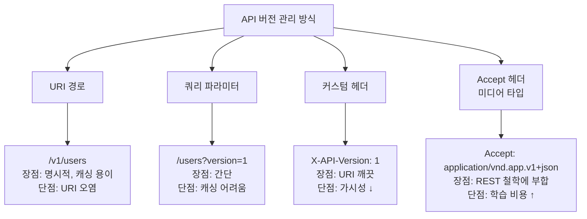

**실무 권장:** URI 경로 방식이 가장 단순하고 디버깅하기 쉽습니다. Netflix, GitHub, Stripe 등 대부분의 회사가 이 방식을 씁니다.

### 📌 페이지네이션 전략

| 방식 | 예시 | 장점 | 단점 | 사용처 |
|------|------|------|------|--------|
| **Offset 기반** | `?page=3&size=20` | 구현 간단, 페이지 번호 가능 | 데이터 많을수록 느림, 데이터 변경 시 중복/누락 | 게시판 |
| **Cursor 기반** | `?cursor=xyz&size=20` | 빠름, 데이터 변경에 안전 | 점프 불가 | 무한 스크롤, SNS 피드 |
| **Keyset 기반** | `?lastId=100&size=20` | Cursor와 유사, 단순 | PK 정렬 강제 | 대용량 리스트 |

**왜 Cursor 방식이 빠른가?**
Offset은 `OFFSET 100000`이면 DB가 10만 행을 스캔 후 버립니다. Cursor는 `WHERE id > ?`로 인덱스를 활용해 바로 점프합니다. 100만 건 기준 100배 이상 차이 날 수 있습니다.

```java
// Cursor 기반 응답 예시
{
  "data": [...],
  "pageInfo": {
    "hasNext": true,
    "nextCursor": "eyJpZCI6MTIzfQ=="  // Base64 인코딩
  }
}
```

### 📌 멱등성 키(Idempotency Key)

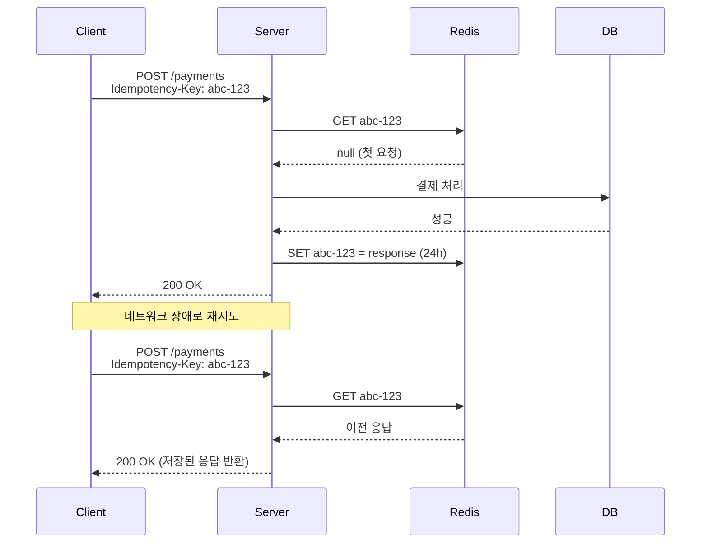

**왜 필요한가?** 결제, 주문 같은 비멱등 API에서 중복 처리를 방지합니다. Stripe, Toss Payments 등 모든 결제 PG사가 이 방식을 씁니다.

### 📌 API Rate Limiting

| 알고리즘 | 동작 | 특징 |
|---------|------|------|
| **Fixed Window** | 1분 단위로 100회 카운트 | 구현 쉬움, 경계에서 폭주 가능 |
| **Sliding Window** | 슬라이딩 시간창 | 부드러운 제한 |
| **Token Bucket** | 토큰을 일정 속도로 채움 | 버스트 허용, AWS API Gateway 사용 |
| **Leaky Bucket** | 일정 속도로만 처리 | 트래픽 평활화 |

응답 헤더 표준:
```
X-RateLimit-Limit: 100
X-RateLimit-Remaining: 87
X-RateLimit-Reset: 1714291200
```

### 📌 API 보안 체크리스트

- **인증(Authentication)**: JWT, OAuth 2.0, Session
- **인가(Authorization)**: RBAC, ABAC
- **HTTPS 강제** (HTTP는 절대 안 됨)
- **CORS 설정** (와일드카드 `*` 금지)
- **민감 정보 마스킹** (로그에 비밀번호, 카드번호 X)
- **SQL Injection / XSS 방어** (JPA 쓰면 대부분 자동 방어, 그러나 네이티브 쿼리는 주의)
- **CSRF 토큰** (쿠키 기반 인증 시)

---

## 2. 심화: RESTful API 이론 - HATEOAS와 성숙도 모델

### 🎯 Richardson 성숙도 모델

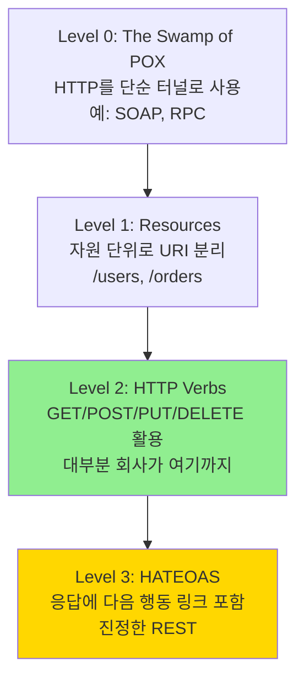

**현실:** 대부분의 "REST API"는 Level 2입니다. Level 3는 이상이지만 비용 대비 효과가 낮아 잘 안 씁니다. **단, 외부 공개 API라면 Level 3가 가치 있습니다.**

### 📌 HATEOAS 예시

```json
{
  "id": 1,
  "name": "홍길동",
  "status": "ACTIVE",
  "_links": {
    "self":     { "href": "/api/v1/users/1" },
    "orders":   { "href": "/api/v1/users/1/orders" },
    "deactivate": { "href": "/api/v1/users/1/deactivate", "method": "POST" }
  }
}
```

**왜 가치 있나?** 클라이언트가 URI를 하드코딩하지 않아도 되어, 서버가 URI를 바꿔도 클라이언트가 안 깨집니다. 또한 현재 상태에서 가능한 행동을 서버가 알려줍니다(상태 머신).

### 📌 Content Negotiation (콘텐츠 협상)

```http
GET /users/1
Accept: application/json    → JSON 응답
Accept: application/xml     → XML 응답
Accept-Language: ko         → 한국어 메시지
```

Spring에서:
```java
@GetMapping(value = "/users/{id}", produces = {
    MediaType.APPLICATION_JSON_VALUE,
    MediaType.APPLICATION_XML_VALUE
})
public UserResponse getUser(@PathVariable Long id) { ... }
```

### 📌 캐싱 전략 (HTTP 레벨)

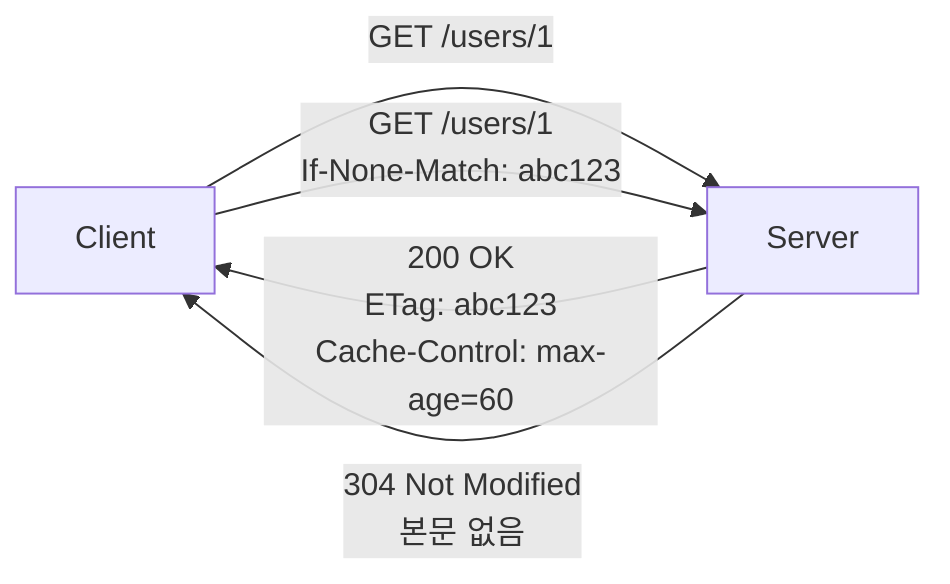

| 헤더 | 역할 |
|------|------|
| `Cache-Control` | 캐싱 정책 (max-age, no-cache, private) |
| `ETag` | 자원 버전 식별자 |
| `Last-Modified` | 마지막 수정 시각 |
| `If-None-Match` | ETag 비교 (조건부 GET) |
| `Vary` | 어떤 헤더 기준으로 캐시 분기할지 |

**304 Not Modified**를 활용하면 본문 전송이 없어 트래픽이 크게 줄어듭니다.

---

## 3. 심화: RESTful API 실전 아키텍처

### 🎯 계층형을 넘어: 헥사고날 아키텍처 입문

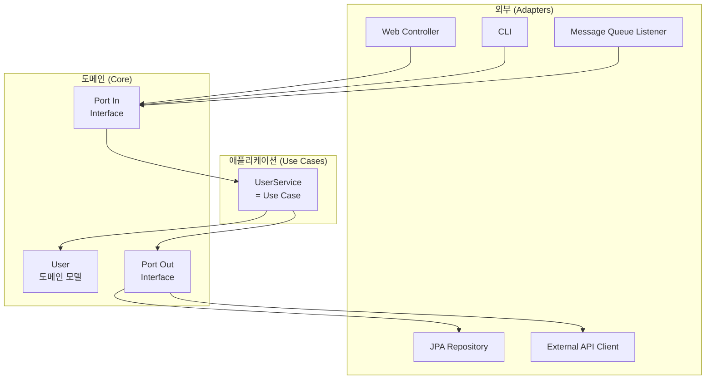

**왜 도입하나?** 도메인이 외부 기술(JPA, Web)에 의존하지 않으면, ① DB를 바꿔도 도메인 코드가 안 바뀜, ② 테스트가 빨라짐(Mock 쉬움), ③ 비즈니스 로직이 한곳에 모임.

**현실 조언:** 처음부터 헥사고날을 도입하면 오버엔지니어링이 됩니다. 계층형으로 시작 → 복잡도 올라가면 점진적 도입이 정석.

### 📌 도메인 모델 vs 빈약한 모델 (Anemic Domain Model)

```java
// ❌ 빈약한 모델: Setter만 있고 로직은 Service에
@Entity
public class Order {
    private Long id;
    private OrderStatus status;
    // setter, getter only
}

@Service
public class OrderService {
    public void cancel(Long orderId) {
        Order order = orderRepository.findById(orderId).orElseThrow();
        if (order.getStatus() == OrderStatus.SHIPPED) {
            throw new IllegalStateException("배송 시작된 주문은 취소 불가");
        }
        order.setStatus(OrderStatus.CANCELLED);
    }
}

// ✅ 풍부한 모델: 도메인이 자기 책임을 안다
@Entity
public class Order {
    private Long id;
    private OrderStatus status;

    public void cancel() {
        if (this.status == OrderStatus.SHIPPED) {
            throw new OrderCancellationException("배송 시작된 주문은 취소 불가");
        }
        this.status = OrderStatus.CANCELLED;
    }
}

@Service
public class OrderService {
    public void cancel(Long orderId) {
        Order order = orderRepository.findById(orderId).orElseThrow();
        order.cancel();  // 도메인이 스스로 검증
    }
}
```

**왜?** Service에 로직이 있으면 Order를 사용하는 모든 곳에 같은 검증을 반복해야 합니다. 도메인이 자기 규칙을 가지면 어디서 호출해도 안전합니다.

### 📌 CQRS 입문 (Command Query Responsibility Segregation)

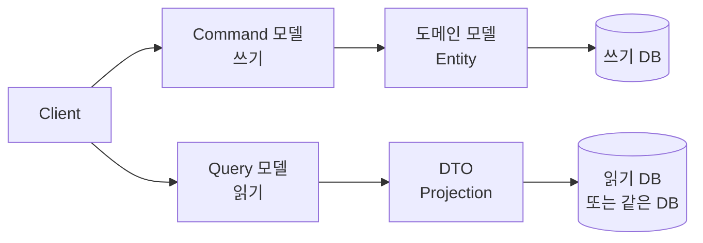

**왜?** 읽기와 쓰기는 요구사항이 완전히 다릅니다. 쓰기는 검증/일관성, 읽기는 성능/조합. 같은 모델을 쓰면 둘 다 어중간해집니다.

**가벼운 적용:** 같은 DB라도 조회 전용 메서드는 Projection DTO로 직접 SELECT, 변경은 Entity로. 이것만으로도 큰 효과.

### 📌 트랜잭션 스크립트 vs 도메인 모델

| 패턴 | 적합한 경우 |
|------|------------|
| **트랜잭션 스크립트** (Service에 절차 코드) | 단순 CRUD, 작은 프로젝트 |
| **도메인 모델** (Entity에 비즈니스 로직) | 복잡한 도메인, 장기 프로젝트 |

### 📌 API 응답 일관성: Result/Either 패턴

```java
public sealed interface Result<T> {
    record Success<T>(T value) implements Result<T> {}
    record Failure<T>(ErrorCode code, String message) implements Result<T> {}
}

// 사용
public Result<User> findUser(Long id) {
    return userRepository.findById(id)
        .<Result<User>>map(Result.Success::new)
        .orElseGet(() -> new Result.Failure<>(ErrorCode.USER_NOT_FOUND, "없음"));
}
```

**왜?** 예외는 비싼 연산이고, "예측 가능한 실패"까지 예외로 처리하면 흐름이 숨겨집니다. Result 타입은 컴파일러가 실패 처리를 강제합니다.

---

## 4. 심화: SQL과 실행 계획

### 🎯 학습 목표

JPA가 만든 SQL이 왜 느린지 **EXPLAIN**으로 진단하고, 인덱스를 직접 설계할 수 있어야 합니다.

### 📌 실행 계획 읽기

```sql
EXPLAIN SELECT * FROM orders WHERE user_id = 1 AND status = 'PAID';
```

| 컬럼 | 의미 | 좋은 값 |
|------|------|---------|
| `type` | 접근 방식 | `const` > `ref` > `range` > `index` > **`ALL`(피하기)** |
| `key` | 사용된 인덱스 | NULL이면 인덱스 미사용 |
| `rows` | 검사할 행 수 | 적을수록 좋음 |
| `Extra` | 추가 정보 | `Using filesort`, `Using temporary`는 경고 |

### 📌 인덱스 설계 원칙

#### 1. 복합 인덱스 순서가 핵심

```sql
-- 인덱스: (user_id, status, created_at)

-- ✅ 인덱스 활용
WHERE user_id = 1
WHERE user_id = 1 AND status = 'PAID'
WHERE user_id = 1 AND status = 'PAID' ORDER BY created_at

-- ❌ 인덱스 활용 못 함 (선두 컬럼 누락)
WHERE status = 'PAID'
WHERE created_at > '2026-01-01'
```

**왜?** 인덱스는 전화번호부와 같습니다. "성+이름" 순으로 정렬된 책에서 이름만 알면 처음부터 다 봐야 합니다.

#### 2. 카디널리티 (선택도)

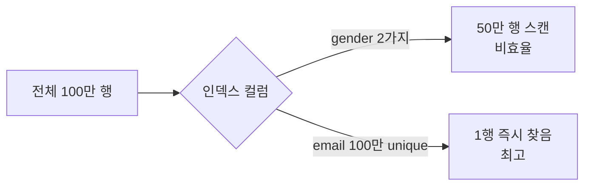

#### 3. 커버링 인덱스

```sql
-- 인덱스: (user_id, status, total_price)
SELECT total_price FROM orders WHERE user_id = 1 AND status = 'PAID';
-- 테이블 접근 없이 인덱스만으로 완료 → 매우 빠름
```

### 📌 SQL 안티패턴

```sql
-- ❌ 함수로 감싸면 인덱스 무력화
WHERE DATE(created_at) = '2026-04-28'
-- ✅
WHERE created_at >= '2026-04-28' AND created_at < '2026-04-29'

-- ❌ LIKE 와일드카드 앞에
WHERE name LIKE '%길동'
-- ✅ Full-Text Index 또는 검색엔진(Elasticsearch)

-- ❌ NOT IN, !=
WHERE status != 'CANCELLED'
-- ✅ 가능하면 양수 조건으로
WHERE status IN ('PENDING', 'PAID', 'SHIPPED')

-- ❌ 암묵적 형변환
WHERE phone_number = 01012345678  -- 문자열 컬럼에 숫자
-- ✅
WHERE phone_number = '01012345678'
```

### 📌 윈도우 함수 (Window Function)

```sql
-- 사용자별 주문 순위
SELECT
    user_id,
    order_id,
    total_price,
    ROW_NUMBER() OVER (PARTITION BY user_id ORDER BY total_price DESC) as rank_in_user
FROM orders;
```

**언제 쓰나?** GROUP BY로는 어려운 "그룹 내 순위/누적/이전 값 비교" 같은 분석. 통계, 리포트에 필수.

### 📌 트랜잭션 격리 수준

| 격리 수준 | Dirty Read | Non-Repeatable Read | Phantom Read |
|-----------|------------|--------------------|--------------|
| READ UNCOMMITTED | O | O | O |
| READ COMMITTED | X | O | O |
| REPEATABLE READ | X | X | O (MySQL은 X) |
| SERIALIZABLE | X | X | X |

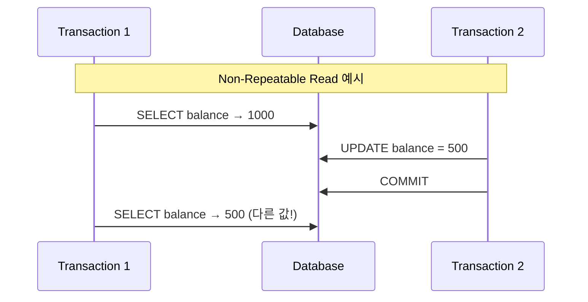

**현실:** MySQL 기본은 REPEATABLE READ, PostgreSQL/Oracle은 READ COMMITTED. **격리 수준을 올리면 안전하지만 동시성이 떨어집니다**. 비관적 락/낙관적 락으로 보완.

---

## 5. 심화: 데이터베이스 설계 패턴

### 📌 식별 관계 vs 비식별 관계

**식별 관계 (Identifying Relationship)**: 부모 테이블의 PK가 자식 테이블의 PK 일부로 사용됨. PK가 전파되어 복합키가 됨.

**비식별 관계 (Non-Identifying Relationship)**: 부모 테이블의 PK가 자식 테이블의 일반 FK로만 사용됨. 자식은 자기만의 단일 PK를 가짐.

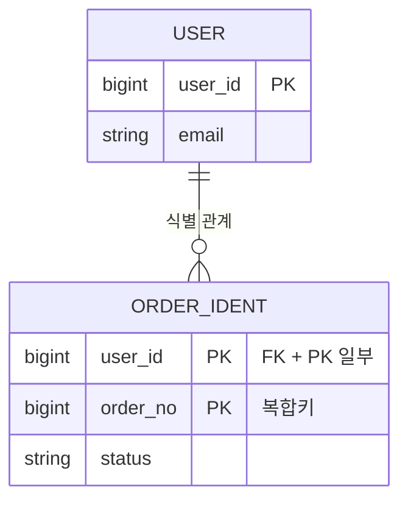

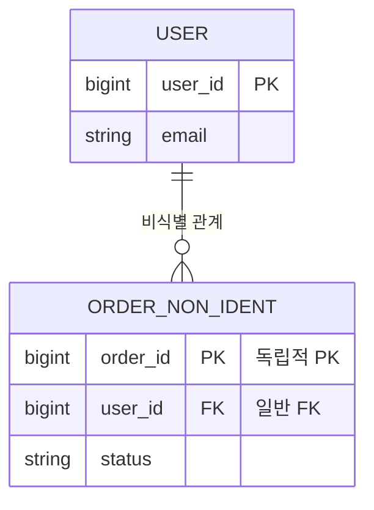

#### 비교표

| 항목 | 식별 관계 | 비식별 관계 |
|------|----------|------------|
| **자식 PK** | 부모 PK + 자체 컬럼 (복합키) | 자체 단일 PK |
| **결합도** | 강함 (부모 없이 존재 불가) | 약함 (독립적) |
| **JPA 매핑** | `@IdClass`, `@EmbeddedId` 필요 (복잡) | `@ManyToOne` 한 줄 (단순) |
| **PK 전파** | 손자, 증손자까지 PK가 누적됨 | 전파 없음 |
| **변경 영향** | PK 변경 시 모든 자식 영향 | 영향 적음 |

**실무 권장: 비식별 관계 + 단일 대리키(Surrogate Key)**

**왜?**
1. **JPA와 잘 맞음**: 복합키는 `@IdClass`나 `@EmbeddedId`로 다뤄야 해서 코드가 복잡해지고 `equals/hashCode` 구현 부담이 생깁니다.
2. **변경에 강함**: 비즈니스 의미 있는 PK(예: 주민번호)를 쓰면 정책이 바뀔 때 PK를 바꿔야 하는 재앙이 발생.
3. **확장성**: 손자 테이블에서도 단일 PK로 단순하게 유지 가능.

**식별 관계가 필요한 드문 경우**: 부모 없이는 절대 존재할 수 없는 약한 엔티티(예: 주문상세는 주문 없이 의미 없음)이고, 자주 함께 조회될 때. 그러나 이 경우에도 대리키를 쓰는 게 일반적입니다.

### 📌 Soft Delete vs Hard Delete

```java
@Entity
@SQLDelete(sql = "UPDATE users SET deleted_at = NOW() WHERE id = ?")
@Where(clause = "deleted_at IS NULL")
public class User {
    private LocalDateTime deletedAt;
}
```

| 방식 | 장점 | 단점 |
|------|------|------|
| **Hard Delete** | 깔끔, 용량 절약 | 복구 불가, 감사 어려움 |
| **Soft Delete** | 복구 가능, 이력 유지 | 모든 쿼리에 조건 추가, 용량 증가 |

**규제 산업(금융/의료)**은 Soft Delete 거의 필수. **GDPR**의 "잊혀질 권리"와는 충돌하니 주의.

### 📌 시간 데이터 다루기

```java
@Entity
@EntityListeners(AuditingEntityListener.class)
public abstract class BaseEntity {
    @CreatedDate
    private LocalDateTime createdAt;

    @LastModifiedDate
    private LocalDateTime updatedAt;

    @CreatedBy
    private String createdBy;

    @LastModifiedBy
    private String updatedBy;
}
```

**시간대(TimeZone) 처리:**
- DB 저장: 항상 **UTC**
- 표시: 클라이언트 시간대로 변환
- 타입: `LocalDateTime` 대신 `Instant` 또는 `ZonedDateTime` 권장

### 📌 대용량 테이블 전략

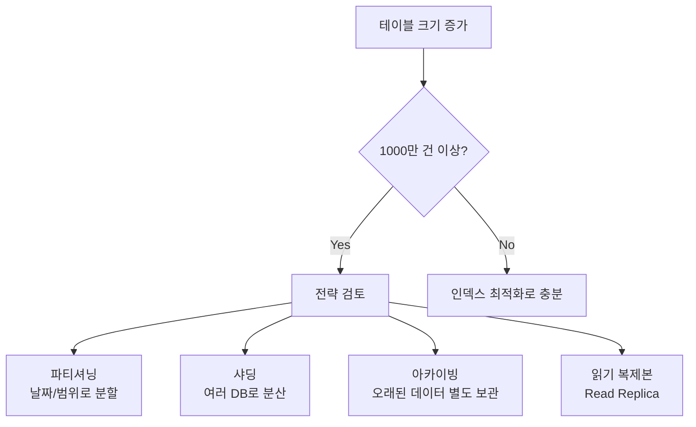

### 📌 이력(History) 테이블 패턴

```sql
-- 현재 테이블
CREATE TABLE products (
    id BIGINT PRIMARY KEY,
    name VARCHAR(100),
    price INT,
    updated_at DATETIME
);

-- 이력 테이블
CREATE TABLE products_history (
    history_id BIGINT PRIMARY KEY AUTO_INCREMENT,
    id BIGINT,
    name VARCHAR(100),
    price INT,
    valid_from DATETIME,
    valid_to DATETIME,
    operation CHAR(1)  -- I, U, D
);
```

**언제 쓰나?** 가격 변동 이력, 권한 변경 이력 등 "언제 무엇이 어땠는지"를 알아야 할 때. Hibernate Envers를 쓰면 자동화 가능.

### 📌 Polymorphic Association (다형 연관관계)

```java
// 댓글이 게시글에도, 사진에도 달릴 수 있을 때
@Entity
public class Comment {
    @Enumerated(EnumType.STRING)
    private TargetType targetType;  // POST, PHOTO

    private Long targetId;
}
```

**주의:** FK를 걸 수 없어 무결성이 깨질 수 있습니다. Single Table Inheritance나 별도 테이블 분리를 우선 검토.

---

## 6. 심화: Spring Data JPA 내부 동작

### 🎯 영속성 컨텍스트 깊이 보기

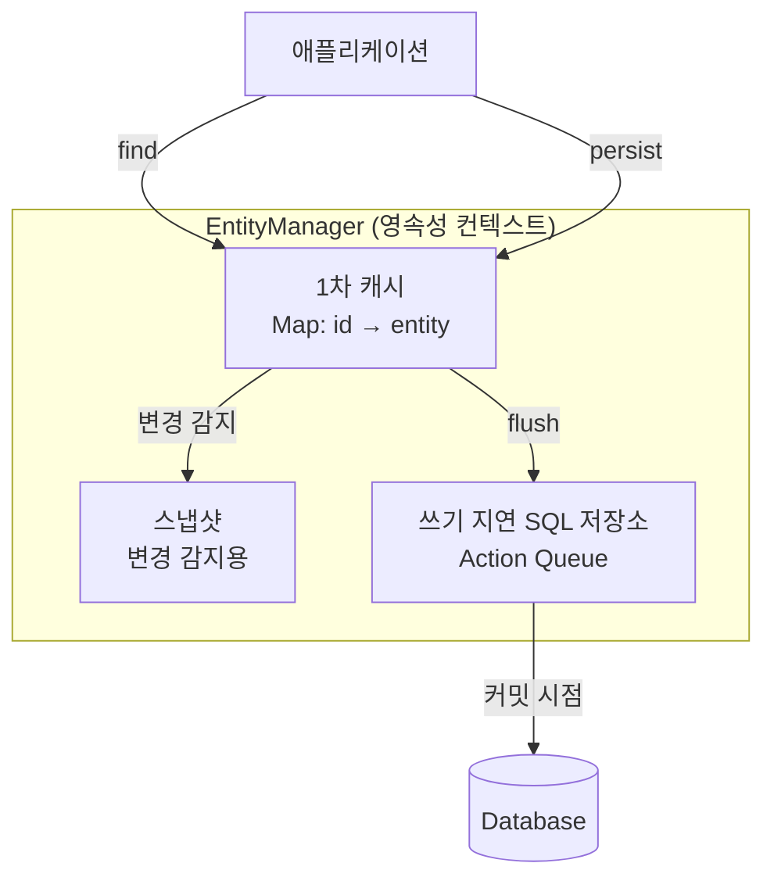

### 📌 1차 캐시의 진실

```java
@Transactional
public void test() {
    User u1 = userRepository.findById(1L).get();  // SELECT 발생
    User u2 = userRepository.findById(1L).get();  // SELECT 없음! 캐시 hit
    System.out.println(u1 == u2);  // true (동일성 보장)
}
```

**중요:** 1차 캐시는 **트랜잭션 범위**입니다. 트랜잭션이 끝나면 사라집니다. "캐시"라기보다 "동일성 보장 메커니즘"으로 이해하는 게 정확합니다.

### 📌 N+1 문제: 모든 해결책 비교

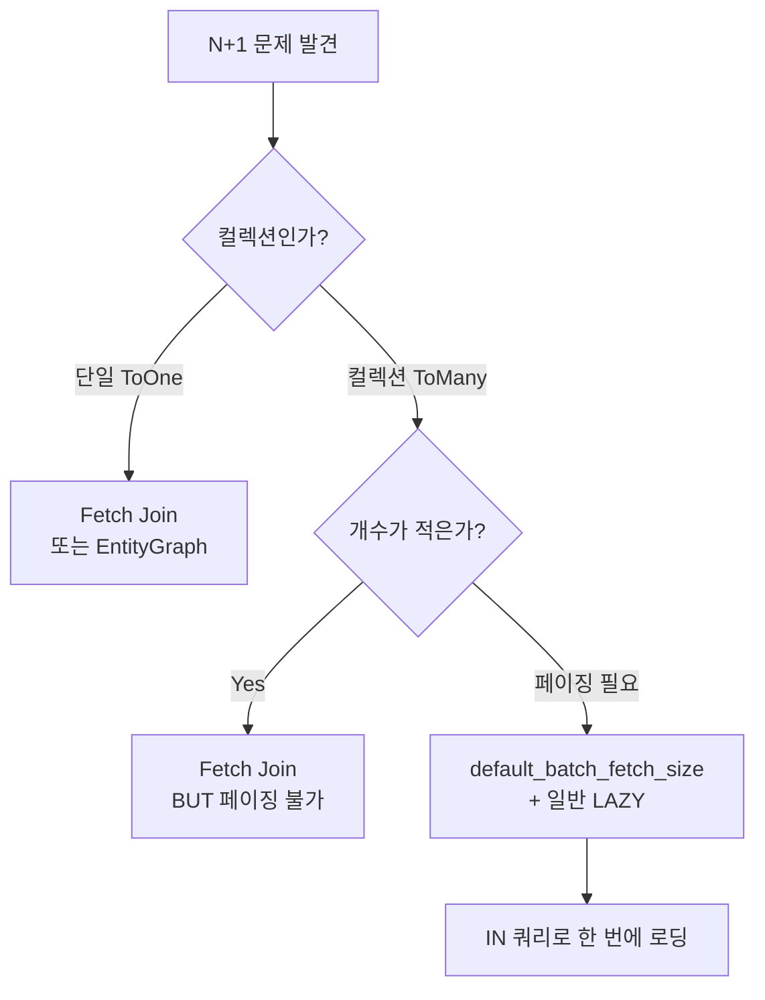

#### Fetch Join의 함정

```java
// ❌ 컬렉션 + 페이징 → 메모리에서 페이징! (위험)
@Query("SELECT u FROM User u JOIN FETCH u.orders")
Page<User> findAllWithOrders(Pageable pageable);
// WARN: firstResult/maxResults specified with collection fetch; applying in memory

// ✅ Batch Size 활용
// application.yml
// jpa.properties.hibernate.default_batch_fetch_size: 100
@Query("SELECT u FROM User u")
Page<User> findAll(Pageable pageable);
// orders 접근 시 IN 쿼리로 100개씩 묶어 로딩
```

#### EntityGraph

```java
@EntityGraph(attributePaths = {"orders", "profile"})
@Query("SELECT u FROM User u WHERE u.status = :status")
List<User> findActiveUsersWithDetails(@Param("status") UserStatus status);
```

**언제 무엇을 쓰나?**
- 단순 ToOne 조인: Fetch Join
- 동적으로 결정: EntityGraph
- 컬렉션 + 페이징: Batch Size
- 복잡한 조회: Querydsl + Projection

### 📌 Projection 활용

```java
// 1. 인터페이스 기반 (Spring Data JPA)
public interface UserSummary {
    Long getId();
    String getName();
    String getEmail();
}

List<UserSummary> findByStatus(UserStatus status);

// 2. 클래스 기반 (생성자 주입)
@Query("""
    SELECT new com.example.dto.UserSummaryDto(u.id, u.name, u.email)
    FROM User u WHERE u.status = :status
""")
List<UserSummaryDto> findSummaryByStatus(@Param("status") UserStatus status);

// 3. Querydsl Projections
queryFactory
    .select(Projections.constructor(UserSummaryDto.class,
        user.id, user.name, user.email))
    .from(user)
    .fetch();
```

**왜 Projection?** Entity는 무겁습니다. 화면에 5개 필드만 필요한데 30개 컬럼을 가져오는 건 낭비. **읽기 성능의 핵심.**

### 📌 식별자 전략 비교

| 전략 | 동작 | 장단점 |
|------|------|--------|
| `IDENTITY` | DB AUTO_INCREMENT | MySQL 표준, **persist 즉시 INSERT 발생** (쓰기 지연 불가) |
| `SEQUENCE` | DB 시퀀스 | Oracle/PostgreSQL, allocationSize로 성능 ↑ |
| `TABLE` | 키 생성 전용 테이블 | 모든 DB 지원, 성능 ↓ |
| `UUID` | 애플리케이션 생성 | 분산 환경 좋음, 인덱스 비효율 |

**팁:** MySQL에서 `IDENTITY`를 쓰면 `saveAll()`이 배치 처리가 안 됩니다. 대량 INSERT가 많다면 SEQUENCE 흉내 또는 JDBC 직접 사용 고려.

### 📌 변경 감지 vs Merge

```java
// ✅ 변경 감지 (권장)
@Transactional
public void update(Long id, UpdateRequest req) {
    User user = userRepository.findById(id).orElseThrow();
    user.changeName(req.getName());  // 끝.
}

// ❌ Merge (가급적 피하기)
@Transactional
public void update(User detachedUser) {
    userRepository.save(detachedUser);  // merge 호출됨
    // 모든 필드를 덮어씀 → null이면 null로 덮음 (위험)
}
```

**왜 Merge가 위험한가?** 클라이언트가 보낸 DTO에 일부 필드가 빠지면, Merge는 그 필드를 null로 덮어버립니다. 의도치 않은 데이터 손실 발생.

### 📌 OSIV (Open Session In View)

```yaml
spring:
  jpa:
    open-in-view: false  # ⚠️ 운영에서는 false 권장
```

**OSIV ON (기본):**
- 장점: View(JSP, Thymeleaf)에서 Lazy 로딩 가능
- 단점: HTTP 응답 끝까지 DB 커넥션 점유 → 커넥션 풀 고갈 위험

**OSIV OFF:**
- Service 계층에서 모든 데이터 로딩 완료 후 DTO 반환 강제
- 장점: 명확한 트랜잭션 경계, 커넥션 빠른 반환
- 권장: **운영 환경에서는 OFF + Command/Query 분리**

---

## 7. 심화: 동시성과 트랜잭션

### 🎯 동시성 문제

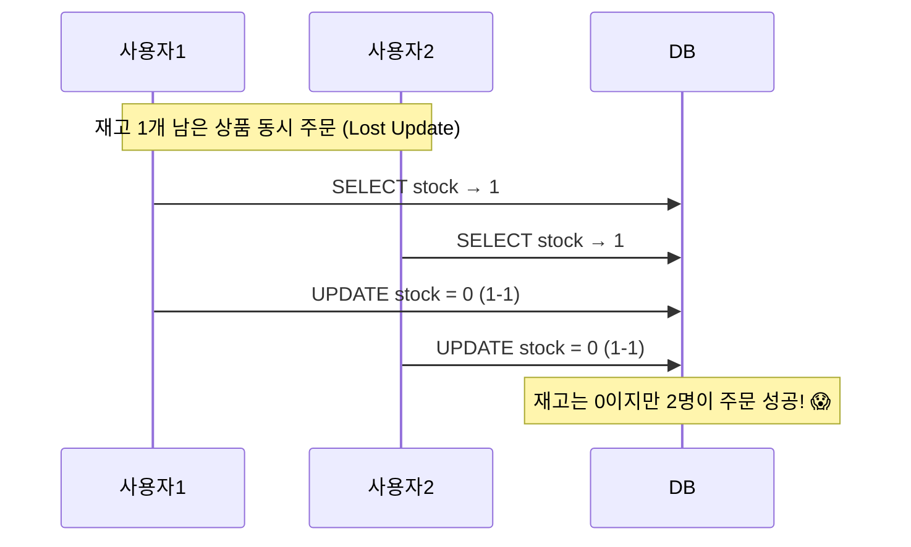

### 📌 낙관적 락 (Optimistic Lock)

```java
@Entity
public class Product {
    @Id Long id;
    int stock;

    @Version
    private Long version;  // 버전 관리
}

@Transactional
public void decreaseStock(Long id) {
    Product product = productRepository.findById(id).orElseThrow();
    product.decrease();
    // 커밋 시: UPDATE ... WHERE id = ? AND version = ?
    // 버전 안 맞으면 OptimisticLockException
}
```

**언제 쓰나?** 충돌이 드물 때. 실패 시 재시도 로직 필요.

### 📌 비관적 락 (Pessimistic Lock)

```java
@Lock(LockModeType.PESSIMISTIC_WRITE)
@Query("SELECT p FROM Product p WHERE p.id = :id")
Optional<Product> findByIdForUpdate(@Param("id") Long id);
// SELECT ... FOR UPDATE (다른 트랜잭션 대기)
```

**언제 쓰나?** 충돌이 잦을 때(인기 상품 재고 차감, 결제). 데드락 주의.

### 📌 분산 락 (Distributed Lock)

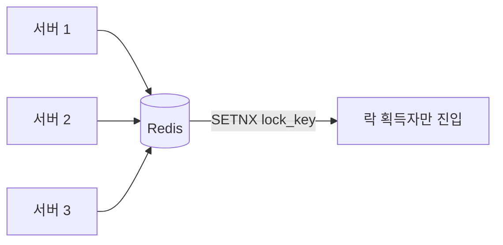

```java
// Redisson 사용
RLock lock = redissonClient.getLock("stock:" + productId);
try {
    if (lock.tryLock(3, 5, TimeUnit.SECONDS)) {
        // 임계 영역
    }
} finally {
    if (lock.isHeldByCurrentThread()) lock.unlock();
}
```

**왜 필요한가?** 서버가 여러 대면 JVM 락(`synchronized`)이 안 통합니다. 트래픽 큰 서비스는 필수.

### 📌 트랜잭션 전파 속성

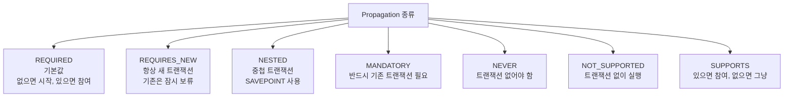

**`REQUIRES_NEW` 활용 예:** 본 트랜잭션이 실패해도 로그는 남겨야 할 때.

```java
@Transactional(propagation = Propagation.REQUIRES_NEW)
public void writeAuditLog(AuditLog log) {
    auditLogRepository.save(log);  // 외부 트랜잭션 롤백돼도 남음
}
```

### 📌 `@Transactional` 함정 모음

```java
@Service
public class UserService {

    public void outer() {
        inner();  // ❌ self-invocation: @Transactional 동작 안 함!
    }

    @Transactional
    public void inner() { ... }
}
```

**왜?** Spring AOP는 프록시 기반인데, 같은 클래스 내부 호출은 프록시를 거치지 않습니다.

**해결:** 다른 빈으로 분리 또는 `AopContext.currentProxy()` 사용.

```java
// 다른 함정들
@Transactional
private void method() { }  // ❌ private은 무시됨

@Transactional
public void method() {
    try {
        // ...
    } catch (Exception e) {
        log.error(e);  // ❌ 예외 삼키면 롤백 안 됨
    }
}

@Transactional  // 기본은 RuntimeException만 롤백
public void method() throws IOException {
    throw new IOException();  // ❌ Checked Exception은 롤백 안 됨
}
// ✅ rollbackFor = Exception.class 명시
```

### 📌 트랜잭션 후처리 - `@TransactionalEventListener`

```java
// 주문 완료 후 이메일 발송 - 트랜잭션 커밋 후에만
@TransactionalEventListener(phase = TransactionPhase.AFTER_COMMIT)
public void handleOrderCreated(OrderCreatedEvent event) {
    emailService.send(event.getOrderId());
}
```

**왜?** "주문 저장 + 이메일 발송"을 한 트랜잭션에 넣으면, 이메일이 늦으면 DB 락이 길어집니다. 커밋 후 이벤트로 분리하면 안전.

---

## 8. 심화: 성능 최적화

### 🎯 측정 없이 최적화 없다

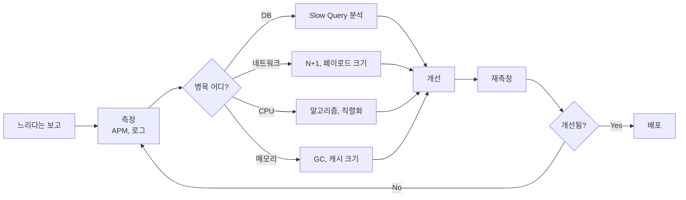

### 📌 JPA 배치 처리

```yaml
spring:
  jpa:
    properties:
      hibernate:
        jdbc:
          batch_size: 100
        order_inserts: true
        order_updates: true
```

```java
// 대량 INSERT
@Transactional
public void bulkInsert(List<User> users) {
    for (int i = 0; i < users.size(); i++) {
        em.persist(users.get(i));
        if (i % 100 == 0) {
            em.flush();
            em.clear();  // 1차 캐시 비우기 (메모리 폭주 방지)
        }
    }
}
```

⚠️ MySQL `IDENTITY` 전략은 배치 INSERT 불가. JDBC `rewriteBatchedStatements=true` URL 옵션 필수.

### 📌 캐시 전략

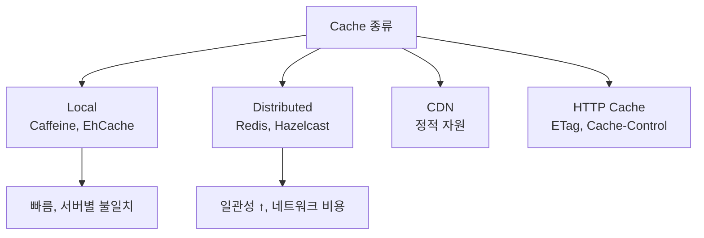

```java
@Cacheable(value = "users", key = "#id")
public UserResponse findById(Long id) { ... }

@CacheEvict(value = "users", key = "#id")
public void update(Long id, UpdateRequest req) { ... }
```

**캐시 무효화 = 컴퓨터 과학에서 어려운 두 가지 중 하나**입니다. 무엇을 언제 만료할지 신중히.

### 📌 비동기 처리

```java
@Async
public CompletableFuture<EmailResult> sendEmail(String to) { ... }

// 또는 메시지 큐
@Component
public class OrderEventPublisher {
    public void publish(OrderEvent event) {
        kafkaTemplate.send("order-events", event);
    }
}
```

**언제?** 응답 시간에 영향 주면 안 되는 작업(이메일, 푸시, 통계 집계).

### 📌 커넥션 풀 튜닝

```yaml
spring:
  datasource:
    hikari:
      maximum-pool-size: 20  # CPU * 2 + 디스크 수 (대략)
      minimum-idle: 10
      connection-timeout: 3000
      max-lifetime: 1800000  # DB의 wait_timeout보다 짧게
```

**공식 (HikariCP):** `pool size = Tn × (Cm - 1) + 1` (Tn=스레드 수, Cm=한 요청당 동시 커넥션)

대부분 **풀 사이즈는 작을수록 좋습니다**. 무작정 늘리면 컨텍스트 스위칭으로 더 느려짐.

### 📌 모니터링 필수 지표

| 카테고리 | 지표 |
|---------|------|
| **애플리케이션** | 응답 시간 (p50/p95/p99), 처리량(TPS), 에러율 |
| **JVM** | GC 시간, 힙 사용률, 스레드 수 |
| **DB** | Slow Query, 커넥션 사용률, 락 대기 |
| **시스템** | CPU, Memory, Disk I/O, Network |

도구: Spring Boot Actuator + Micrometer + Prometheus + Grafana

```yaml
management:
  endpoints:
    web:
      exposure:
        include: health, metrics, prometheus
  metrics:
    tags:
      application: ${spring.application.name}
```

---

## 🎓 심화 학습 로드맵

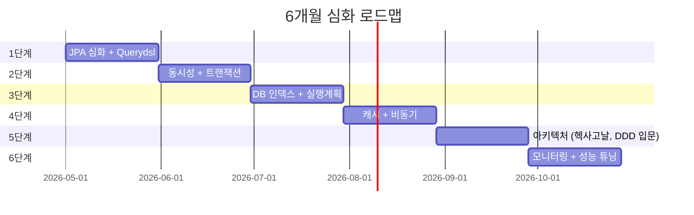

### 📖 추천 도서

- **자바 ORM 표준 JPA 프로그래밍** (김영한) — JPA 바이블
- **클린 아키텍처** (Robert C. Martin) — 아키텍처 원칙
- **도메인 주도 설계 핵심** (Vaughn Vernon) — DDD 입문
- **Real MySQL 8.0** (이성욱) — MySQL/SQL 깊이
- **데이터 중심 애플리케이션 설계** (Martin Kleppmann) — 분산 시스템

### 💡 미들 레벨로 가는 핵심 마인드셋

> **"How"보다 "Why"와 "When"을 묻기**
>
> 주니어는 "어떻게 구현하지?"를 묻고, 미들은 "이게 정말 필요한가? 트레이드오프는?"을 묻습니다. 모든 기술은 비용이 있습니다. JPA, 캐시, 마이크로서비스 모두 마찬가지. **"내 상황에 맞는가"** 를 판단할 수 있어야 진짜 시니어입니다.

### 🎯 다음 단계 키워드

- **DDD (Domain-Driven Design)**: Aggregate, Bounded Context, Event Storming
- **이벤트 기반 아키텍처**: Kafka, Outbox Pattern, Saga Pattern
- **MSA**: Service Mesh, API Gateway, Circuit Breaker (Resilience4j)
- **테스트**: TDD, Testcontainers, ArchUnit (아키텍처 테스트)
- **관찰가능성 (Observability)**: OpenTelemetry, 분산 추적

---

> **최고의 학습법은 "프로덕션에서 깨져보는 것"** 입니다.
> 사이드 프로젝트에 부하 테스트를 돌려보세요. N+1, 데드락, OOM을 직접 경험해야 진짜 내 것이 됩니다. 🚀

---

**수정 사항 안내:**
기존 자료에서 깨졌던 부분은 `식별 관계 vs 비식별 관계`의 ERD 다이어그램이었습니다. Mermaid의 `erDiagram`은 한 다이어그램 안에서 같은 두 엔티티 사이에 여러 관계선을 그리거나, 컬럼명에 `PK_FK`처럼 두 키워드를 동시에 표기하는 문법을 지원하지 않아 렌더링이 깨졌습니다. 이번에는 **두 개의 ERD로 분리**하고, 키 표기는 `PK`만 두되 의미는 코멘트로 설명하는 방식으로 수정했습니다. 또한 SQL 예제의 `PK` 축약 표기도 `PRIMARY KEY`로 정정했습니다.
