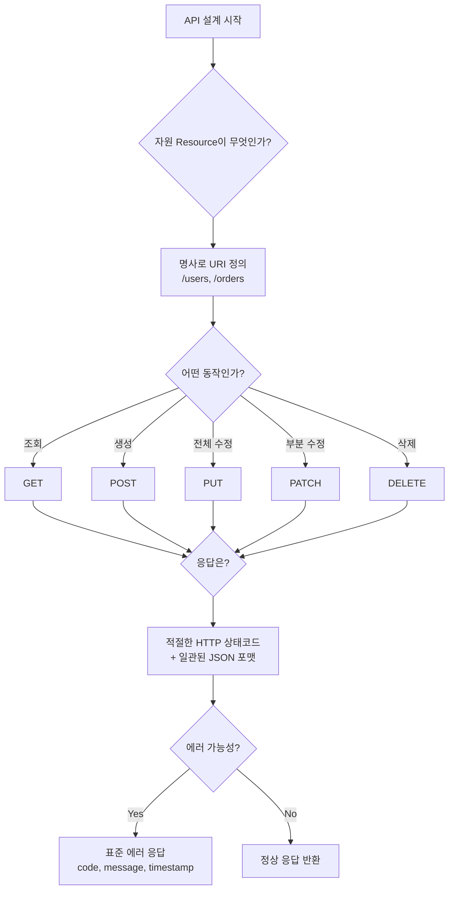
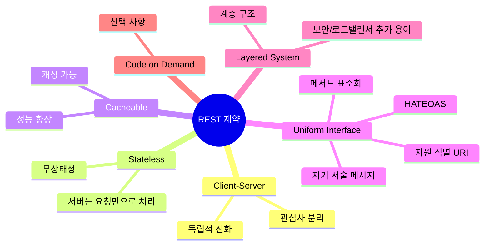
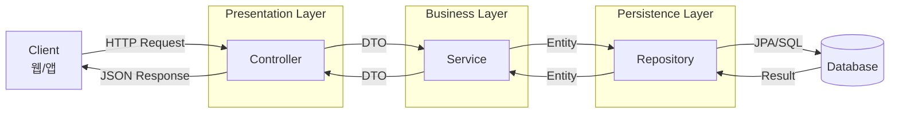
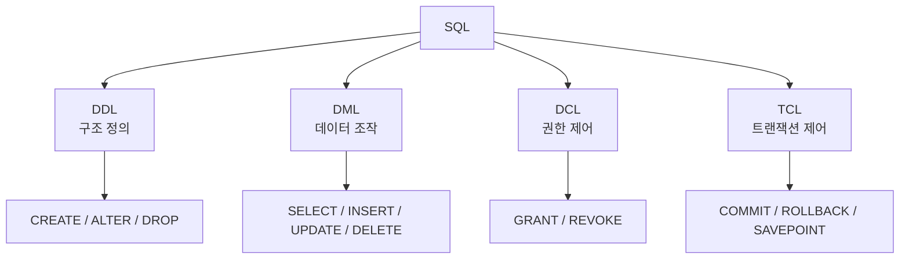
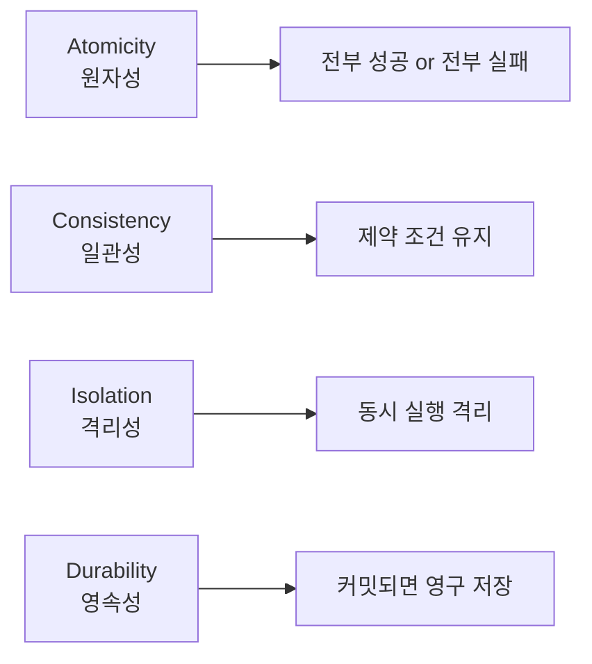
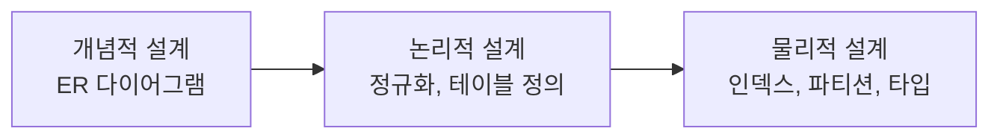
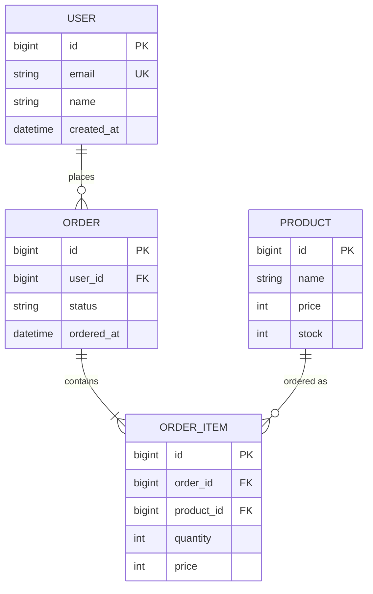
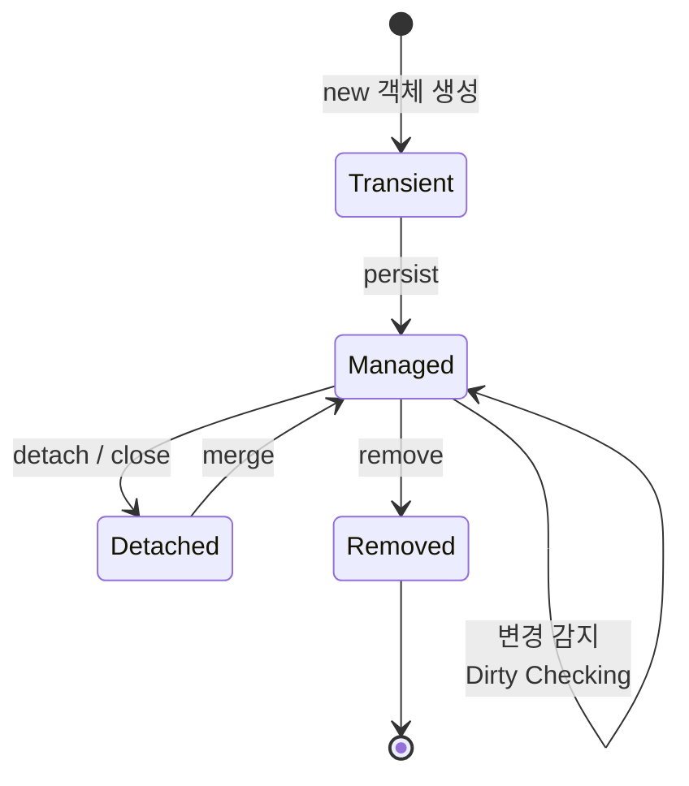
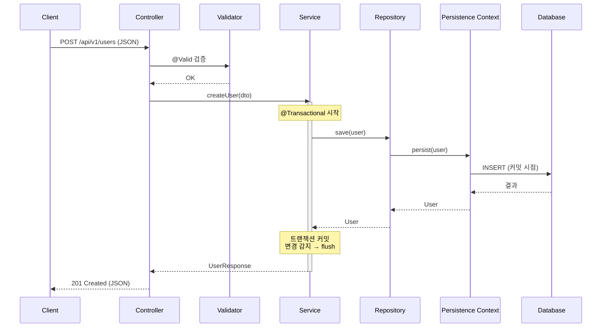
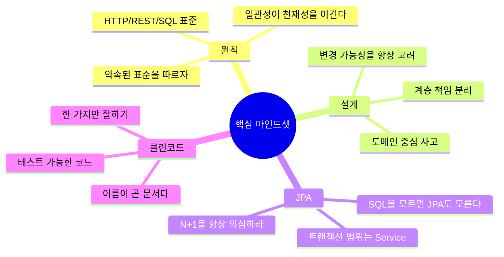

# Spring Boot 수강생을 위한 핵심 개념 리뷰

> **대상**: 초급 백엔드 개발자
> **주제**: RESTful API 설계 + 데이터베이스 설계 + Spring Data JPA
> **목표**: "왜 이렇게 해야 하는가?"를 명확히 이해하고, 클린 코드 관점에서 실무에 적용할 수 있게 된다.

---

## 📚 목차

1. [좋은 웹 API 디자인이란](#1-좋은-웹-api-디자인이란)
2. [RESTful API 설계와 구현 (이론)](#2-restful-api-설계와-구현-이론)
3. [RESTful API 설계와 구현 (실기)](#3-restful-api-설계와-구현-실기)
4. [SQL 이해하기](#4-sql-이해하기)
5. [데이터베이스 설계](#5-데이터베이스-설계)
6. [Spring Data JPA 도입하기](#6-spring-data-jpa-도입하기)
7. [전체 아키텍처 흐름](#7-전체-아키텍처-흐름)
8. [클린 코드 체크리스트](#8-클린-코드-체크리스트)

---

## 1. 좋은 웹 API 디자인이란

### 🎯 핵심 개념

좋은 API는 **"문서 없이도 추측 가능한 API"** 입니다. 사용자(다른 개발자, 프론트엔드, 외부 서비스)가 직관적으로 이해하고 실수하지 않도록 만드는 것이 목표입니다.

### ✅ 꼭 알아야 할 5가지 원칙

| 원칙 | 설명 | 왜? |
|------|------|-----|
| **일관성 (Consistency)** | URI, 응답 포맷, 에러 형식을 항상 같은 규칙으로 | 학습 비용 ↓, 버그 ↓ |
| **명확성 (Clarity)** | URI는 명사, HTTP 메서드는 동사 역할 | 의도가 코드/URL만 봐도 드러남 |
| **예측 가능성 (Predictability)** | 같은 패턴은 같은 결과 | 클라이언트가 추론 가능 |
| **버전 관리 (Versioning)** | `/v1/users` 처럼 명시 | 호환성 깨지지 않게 |
| **에러 처리 (Error Handling)** | 표준화된 에러 응답 | 프론트엔드가 일관되게 처리 |

### 📌 좋은 API vs 나쁜 API

```
❌ 나쁜 예시
GET  /getUserById?id=1
POST /createUser
POST /user/delete/1
GET  /api/usersList

✅ 좋은 예시
GET    /api/v1/users/1
POST   /api/v1/users
DELETE /api/v1/users/1
GET    /api/v1/users
```

**왜 이렇게 해야 할까?**
URI는 "자원(Resource)"을 가리키는 주소입니다. 동사(`getUser`, `createUser`)를 URI에 넣으면 HTTP 메서드와 의미가 중복되고, 자원의 정체성이 흐려집니다. URI는 "무엇(What)"을, HTTP 메서드는 "어떻게(How)"를 표현해야 역할이 분리됩니다.

### 🧭 좋은 API 설계 의사결정 흐름



---

## 2. RESTful API 설계와 구현 (이론)

### 🎯 REST란?

**RE**presentational **S**tate **T**ransfer
→ "자원의 상태를 표현(JSON, XML)으로 주고받는 방식"

### ✅ REST의 6가지 제약 조건 (꼭 외우기보단 이해하기)



### 📌 HTTP 메서드와 멱등성(Idempotency)

| 메서드 | 의미 | 멱등성 | 안전성 |
|--------|------|--------|--------|
| GET | 조회 | ✅ | ✅ |
| POST | 생성 | ❌ | ❌ |
| PUT | 전체 교체 | ✅ | ❌ |
| PATCH | 부분 수정 | ❌ (보통) | ❌ |
| DELETE | 삭제 | ✅ | ❌ |

**왜 멱등성이 중요할까?**
네트워크 장애로 동일 요청이 여러 번 도착해도 결과가 같아야 시스템이 안전합니다. 예를 들어 결제 API가 멱등하지 않으면 같은 결제가 두 번 일어날 수 있습니다. 그래서 PUT은 멱등하게, POST는 비멱등 → 결제 같은 케이스는 `Idempotency-Key`를 헤더로 받는 식으로 보완합니다.

### 📌 HTTP 상태 코드 (필수 암기)

| 범위 | 의미 | 대표 코드 |
|------|------|----------|
| 2xx | 성공 | 200 OK, 201 Created, 204 No Content |
| 3xx | 리다이렉션 | 301, 304 |
| 4xx | 클라이언트 잘못 | 400, 401, 403, 404, 409, 422 |
| 5xx | 서버 잘못 | 500, 502, 503 |

**왜 200만 쓰면 안 될까?**
모든 응답을 200으로 주고 본문에 `success: false`를 넣는 코드를 자주 봅니다. 하지만 그렇게 하면 ① 모니터링 도구가 에러를 감지 못하고, ② 캐시/프록시 동작이 깨지고, ③ 클라이언트가 매번 본문을 파싱해야 합니다. **HTTP는 이미 잘 만들어진 약속이니, 약속을 따르는 게 가장 단순합니다.**

---

## 3. RESTful API 설계와 구현 (실기)

### 🏗️ Spring Boot 표준 계층 아키텍처



### 📌 각 계층의 책임 (단일 책임 원칙)

| 계층 | 책임 | 하지 말아야 할 것 |
|------|------|------------------|
| **Controller** | HTTP 요청/응답 변환, 검증 | 비즈니스 로직 작성 ❌ |
| **Service** | 비즈니스 로직, 트랜잭션 | HTTP 객체 직접 다루기 ❌ |
| **Repository** | DB 접근만 | 비즈니스 판단 ❌ |
| **Entity** | DB 매핑, 도메인 규칙 | 외부에 그대로 노출 ❌ |
| **DTO** | 계층 간 데이터 운반 | 비즈니스 로직 ❌ |

**왜 계층을 나눌까?**
각 계층의 변경 이유(=변경의 축)가 다르기 때문입니다. UI 변경은 Controller만, DB 변경은 Repository만, 비즈니스 정책 변경은 Service만 수정하면 되도록 만드는 게 핵심입니다. 이걸 안 지키면 작은 변경에도 여러 파일을 동시에 수정하게 되어 버그가 폭증합니다.

### 📌 DTO를 왜 써야 하나?

```java
// ❌ Entity 직접 노출 (위험)
@GetMapping("/users/{id}")
public User getUser(@PathVariable Long id) {
    return userRepository.findById(id).orElseThrow();
}

// ✅ DTO로 변환
@GetMapping("/users/{id}")
public UserResponse getUser(@PathVariable Long id) {
    User user = userService.findById(id);
    return UserResponse.from(user);
}
```

**이유:**
1. **보안**: Entity에 비밀번호, 권한 같은 필드가 그대로 노출됨
2. **순환 참조**: 양방향 연관관계 시 JSON 직렬화 무한 루프
3. **결합도**: DB 스키마가 API 스펙에 그대로 묶여 변경이 어려워짐
4. **N+1 / Lazy 예외**: 직렬화 중 LazyInitializationException 발생

### 📌 표준 응답/에러 포맷

```java
// 공통 응답
{
  "data": { ... },
  "message": "OK"
}

// 공통 에러
{
  "code": "USER_NOT_FOUND",
  "message": "사용자를 찾을 수 없습니다",
  "timestamp": "2026-04-28T10:00:00",
  "path": "/api/v1/users/999"
}
```

`@RestControllerAdvice` + `@ExceptionHandler`로 전역 예외 처리를 만들어야 Controller 코드가 try-catch로 더러워지지 않습니다.

### 📌 검증(Validation)은 Controller에서

```java
@PostMapping("/users")
public ResponseEntity<UserResponse> create(
    @Valid @RequestBody UserCreateRequest request  // @Valid 필수
) { ... }

public class UserCreateRequest {
    @NotBlank @Email
    private String email;

    @Size(min = 8, max = 20)
    private String password;
}
```

**왜?** 잘못된 입력은 Service까지 도달하기 전에 차단해야 비즈니스 로직이 깔끔해집니다. "방어적 프로그래밍"의 핵심입니다.

---

## 4. SQL 이해하기

### 🎯 핵심 개념

JPA를 쓰더라도 **SQL을 모르면 성능 튜닝이 불가능**합니다. JPA는 결국 SQL을 만들어내는 도구이기 때문입니다.

### ✅ 꼭 알아야 할 SQL 카테고리



### 📌 JOIN 종류

| 종류 | 의미 |
|------|------|
| INNER JOIN | 양쪽 모두 일치하는 행만 |
| LEFT JOIN | 왼쪽 전체 + 오른쪽 일치분 |
| RIGHT JOIN | 오른쪽 전체 + 왼쪽 일치분 |
| FULL OUTER JOIN | 양쪽 전체 (MySQL 미지원) |

### 📌 인덱스(Index)는 왜 중요한가?

인덱스는 **책의 목차**와 같습니다. 없으면 처음부터 끝까지 다 읽어야 하지만(Full Scan), 있으면 특정 페이지로 바로 갈 수 있습니다.

```sql
-- 자주 검색되는 컬럼에 인덱스 추가
CREATE INDEX idx_user_email ON users(email);
```

**주의점:**
- 인덱스가 많으면 INSERT/UPDATE가 느려짐 (인덱스도 갱신해야 하니까)
- WHERE, JOIN, ORDER BY에 자주 쓰이는 컬럼만 추가
- 카디널리티(중복도)가 낮은 컬럼(예: 성별)은 효과 없음

### 📌 트랜잭션과 ACID



**왜 트랜잭션이 필요한가?**
계좌이체를 생각해보세요. A에서 출금 후 B에 입금되기 전에 서버가 죽으면? 돈이 사라집니다. 트랜잭션은 "둘 다 되거나 둘 다 안 되거나"를 보장합니다.

---

## 5. 데이터베이스 설계

### 🎯 핵심 개념

DB 설계는 **"미래의 나를 살리는 일"** 입니다. 잘못된 설계는 코드로 메꿀 수 없습니다.

### ✅ 설계 3단계



### 📌 정규화 (Normalization)

| 단계 | 규칙 | 예시 |
|------|------|------|
| **1NF** | 원자값(쪼갤 수 없는 값)만 | "010-1111, 010-2222" → 분리 |
| **2NF** | 부분 함수 종속 제거 | 복합키 일부에만 종속된 컬럼 분리 |
| **3NF** | 이행 함수 종속 제거 | A→B→C일 때 C 분리 |

**왜 정규화가 필요한가?**
중복을 줄이면 ① 저장 공간 절약, ② 데이터 불일치 방지(같은 정보를 여러 곳에 저장하면 한쪽만 수정되는 사고 발생), ③ 변경 비용 감소가 됩니다.

**단, 무조건 3NF가 정답은 아닙니다.** 조회 성능을 위해 의도적으로 역정규화(중복 허용)하는 경우도 있습니다. 트레이드오프를 이해하는 게 중요합니다.

### 📌 ERD 예시



### 📌 관계 종류

| 관계 | 예시 |
|------|------|
| 1:1 | User ↔ UserProfile |
| 1:N | User → Order (한 사용자가 여러 주문) |
| N:M | Student ↔ Course (중간 테이블 필요) |

### 📌 PK / FK / UK 사용 원칙

- **PK(Primary Key)**: 보통 의미 없는 `BIGINT AUTO_INCREMENT` 또는 UUID 사용 권장 (비즈니스 의미가 바뀌어도 안전)
- **FK(Foreign Key)**: 참조 무결성 보장. 운영 환경에서는 성능상 빼는 경우도 있으나 초보자는 반드시 설정
- **UK(Unique Key)**: 비즈니스적으로 유일해야 하는 값(이메일 등)

---

## 6. Spring Data JPA 도입하기

### 🎯 JPA란?

**Java Persistence API** - 자바 객체와 DB 테이블을 매핑(ORM)해주는 표준 명세. Hibernate가 대표 구현체.

### ✅ JPA를 쓰는 이유

1. **반복적인 SQL 작성 제거** (CRUD 자동 생성)
2. **객체지향적 코드** 유지 (DB가 아닌 도메인 중심)
3. **DB 벤더 독립성** (MySQL → PostgreSQL 전환이 쉬워짐)
4. **1차 캐시, 변경 감지(Dirty Checking)** 등 성능 기능

### 📌 핵심 어노테이션

```java
@Entity
@Table(name = "users")
public class User {
    @Id
    @GeneratedValue(strategy = GenerationType.IDENTITY)
    private Long id;

    @Column(nullable = false, unique = true, length = 100)
    private String email;

    @Enumerated(EnumType.STRING)  // ⚠️ ORDINAL 절대 금지
    private UserStatus status;

    @OneToMany(mappedBy = "user", fetch = FetchType.LAZY)
    private List<Order> orders = new ArrayList<>();
}
```

**왜 `EnumType.STRING`인가?** ORDINAL은 enum 순서를 숫자로 저장하는데, 중간에 enum 값을 추가하면 기존 데이터의 의미가 바뀌어버립니다. 재앙입니다.

### 📌 영속성 컨텍스트(Persistence Context)



**핵심 개념: 변경 감지(Dirty Checking)**

```java
@Transactional
public void changeName(Long id, String newName) {
    User user = userRepository.findById(id).orElseThrow();
    user.setName(newName);
    // save() 호출 안 해도 트랜잭션 끝날 때 자동 UPDATE!
}
```

**왜 가능한가?** 영속성 컨텍스트가 처음 조회 시점의 스냅샷을 보관해뒀다가, 트랜잭션 커밋 시점에 현재 값과 비교해 변경분만 UPDATE 합니다. 그래서 `update()` 메서드를 따로 만들 필요가 없습니다.

### 📌 Spring Data JPA Repository

```java
public interface UserRepository extends JpaRepository<User, Long> {
    // 메서드 이름만으로 쿼리 자동 생성
    Optional<User> findByEmail(String email);
    List<User> findByStatusAndCreatedAtAfter(UserStatus status, LocalDateTime date);

    // 복잡한 쿼리는 JPQL
    @Query("SELECT u FROM User u WHERE u.email LIKE %:keyword%")
    List<User> searchByEmail(@Param("keyword") String keyword);
}
```

### 📌 ⚠️ JPA 사용 시 반드시 알아야 할 함정

#### 1. N+1 문제

```java
// ❌ 사용자 100명을 조회하면 → User 1번 + Orders 100번 = 101번 쿼리!
List<User> users = userRepository.findAll();
users.forEach(u -> u.getOrders().size());

// ✅ 해결: Fetch Join
@Query("SELECT u FROM User u JOIN FETCH u.orders")
List<User> findAllWithOrders();
```

**왜 발생하나?** Lazy 로딩은 실제로 필요할 때 추가 쿼리를 날리기 때문입니다. 한 명씩 조회 쿼리가 나가니 N+1입니다.

#### 2. Fetch 전략

| 전략 | 설명 | 사용 시점 |
|------|------|----------|
| EAGER | 즉시 로딩 | 거의 사용 X |
| LAZY | 지연 로딩 | **기본값으로 사용** |

**모든 연관관계는 LAZY로 설정하고, 필요할 때 Fetch Join으로 가져오는 게 정석입니다.**

#### 3. `@Transactional` 위치

```java
@Service
public class UserService {

    @Transactional(readOnly = true)  // 조회는 readOnly
    public UserResponse findById(Long id) { ... }

    @Transactional  // 변경은 일반 트랜잭션
    public void updateName(Long id, String name) { ... }
}
```

**왜 readOnly가 중요한가?** 읽기 전용임을 알리면 ① flush 안 일어나서 성능 ↑, ② 실수로 변경하는 코드 방지가 됩니다.

#### 4. Setter 남용 금지

```java
// ❌ 무방비 Setter
public class User {
    public void setEmail(String email) { this.email = email; }
}

// ✅ 의도가 드러나는 메서드
public class User {
    public void changeEmail(String newEmail) {
        validateEmail(newEmail);
        this.email = newEmail;
    }
}
```

**왜?** Setter는 어디서든 호출 가능해 도메인 규칙을 우회합니다. "언제, 왜" 변경되는지 메서드명에 의도를 담아야 합니다.

---

## 7. 전체 아키텍처 흐름

### 📌 요청 1건의 전체 여정



### 📌 패키지 구조 권장안

```
com.example.app
├── user
│   ├── controller    → UserController
│   ├── service       → UserService
│   ├── repository    → UserRepository
│   ├── domain        → User (Entity)
│   ├── dto           → UserCreateRequest, UserResponse
│   └── exception     → UserNotFoundException
├── order
│   └── ...
└── common
    ├── config
    ├── exception     → GlobalExceptionHandler
    └── response      → ApiResponse
```

**왜 도메인별로 묶나?** 계층별(`controller/`, `service/`, ...)로 묶으면 한 기능 수정 시 여러 폴더를 오가야 합니다. 도메인별로 묶으면 응집도가 높아지고 마이크로서비스로 분리할 때도 유리합니다.

---

## 8. 클린 코드 체크리스트

### ✅ 이름 짓기

- 변수/메서드는 **의도가 드러나게**: `d` ❌ → `daysSinceCreation` ✅
- Boolean은 `is`, `has`, `can` 으로 시작: `isActive`, `hasPermission`
- 메서드는 **동사**, 클래스는 **명사**

### ✅ 함수

- 한 가지 일만 한다 (Single Responsibility)
- 가능하면 20줄 이내
- 매개변수 3개 이하 권장 (그 이상은 객체로 묶기)
- 부수효과(side effect) 최소화

### ✅ 주석

- "왜(Why)"를 설명. "무엇(What)"은 코드로 드러나게
- 주석으로 설명해야 한다면, 코드 자체가 잘못 작성된 신호

### ✅ 의존성

- 구체 클래스가 아닌 **인터페이스에 의존**
- 생성자 주입 사용 (필드 주입 ❌)

```java
// ✅ 생성자 주입 (final + Lombok @RequiredArgsConstructor)
@Service
@RequiredArgsConstructor
public class UserService {
    private final UserRepository userRepository;
    private final EmailSender emailSender;
}
```

**왜 생성자 주입인가?**
1. `final` 사용 가능 → 불변성 보장
2. 테스트 시 Mock 주입 쉬움
3. 순환 참조를 컴파일 타임에 발견
4. 의존성이 명시적으로 드러남

### ✅ 예외 처리

- Checked Exception보다 Unchecked(Runtime) 예외 선호
- 비즈니스 예외는 **커스텀 예외**로 만들기
- 전역 예외 처리기(`@RestControllerAdvice`)에서 일관 처리

```java
public class UserNotFoundException extends RuntimeException {
    public UserNotFoundException(Long id) {
        super("사용자를 찾을 수 없습니다. id=" + id);
    }
}
```

### ✅ 테스트

- Service는 단위 테스트 (Mockito)
- Repository는 `@DataJpaTest`
- Controller는 `@WebMvcTest` + MockMvc
- **테스트 없는 코드는 레거시 코드다** (마이클 페더스)

---

## 🎓 마무리: 초급 개발자가 꼭 기억할 것



### 💡 이번 강의에서 가장 중요한 한 문장

> **"좋은 코드는 미래의 나와 동료를 위한 배려다."**
>
> API 디자인, DB 설계, JPA 활용 모두 결국 "변경에 강한 시스템"을 만들기 위한 도구입니다. 지금 5분 더 고민하면, 6개월 뒤 5시간을 아낄 수 있습니다.

### 📖 추천 학습 다음 단계

1. JPA 심화: 영속성 컨텍스트, 페치 조인, 벌크 연산
2. Querydsl 도입 (타입 안전한 동적 쿼리)
3. 테스트 코드 작성 습관화
4. API 문서 자동화 (Swagger / Spring REST Docs)
5. 도메인 주도 설계(DDD) 입문

---

> 질문이 있다면 언제든지 환영합니다.
> "왜?"를 5번 던지는 습관이 좋은 개발자를 만듭니다. 🚀
