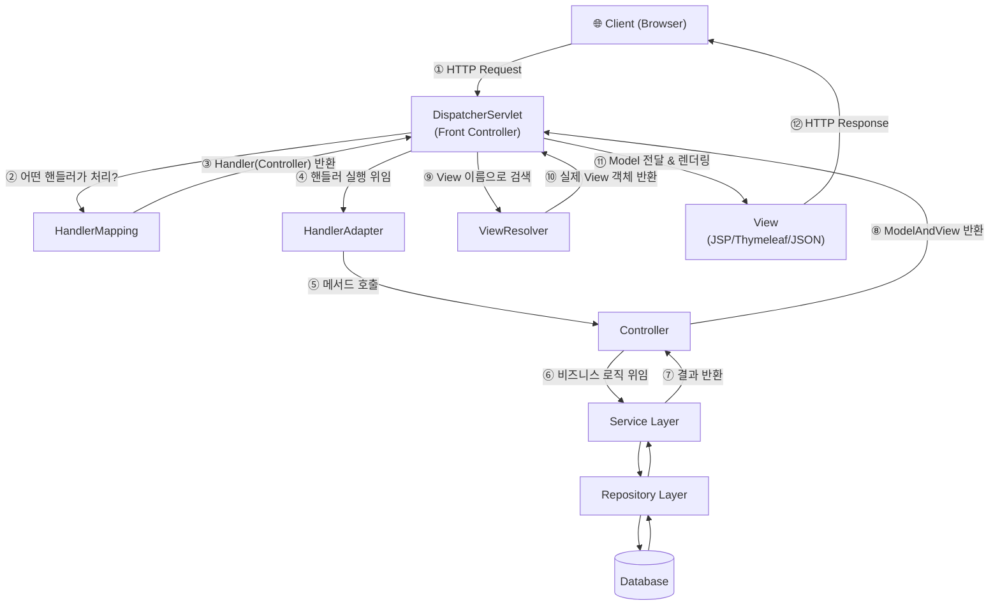
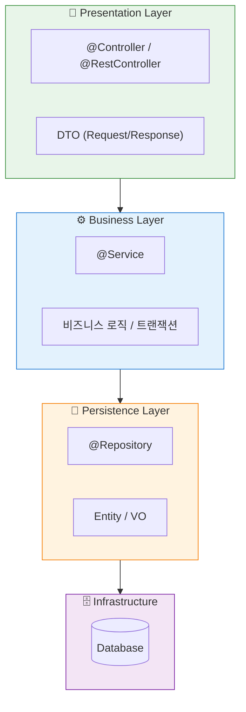
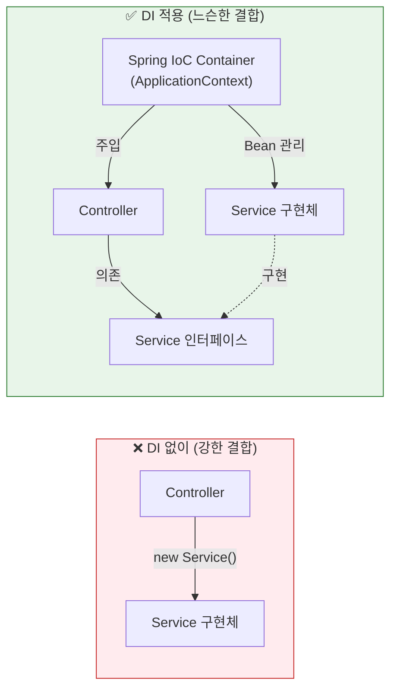
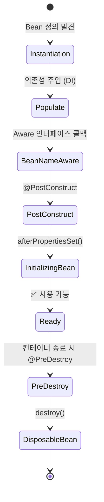
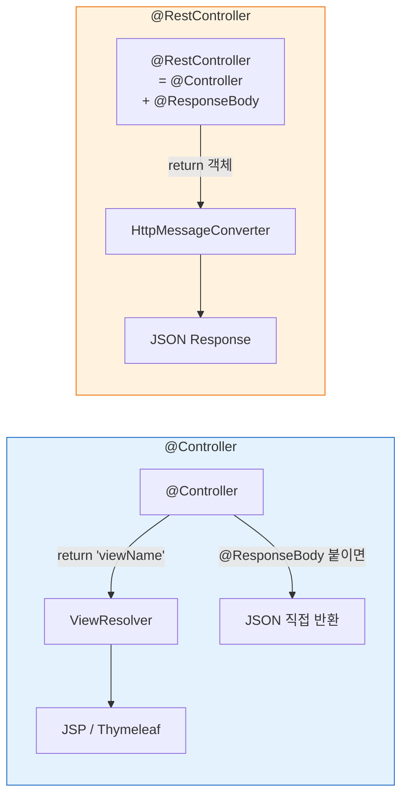
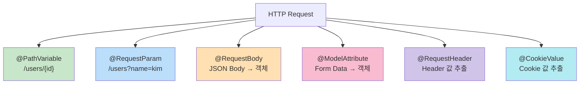
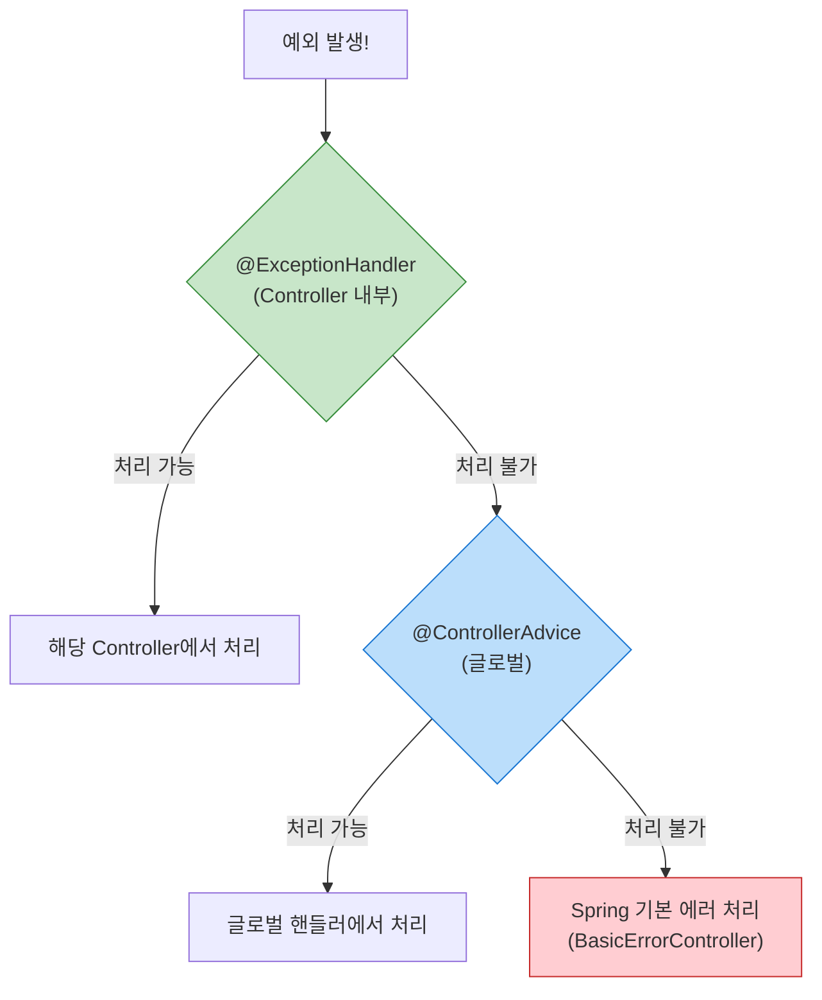
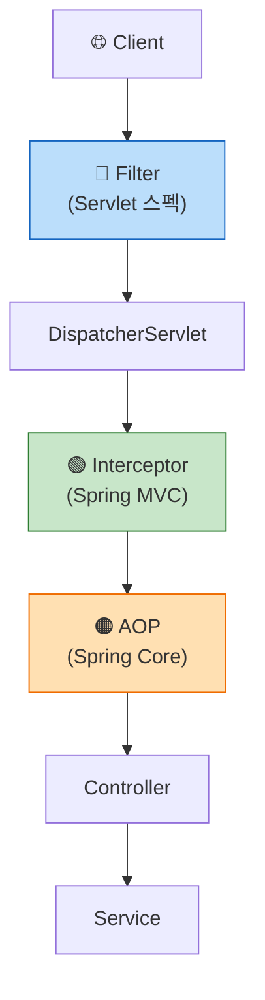
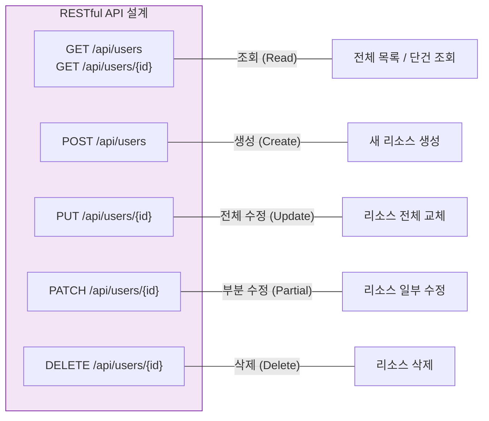
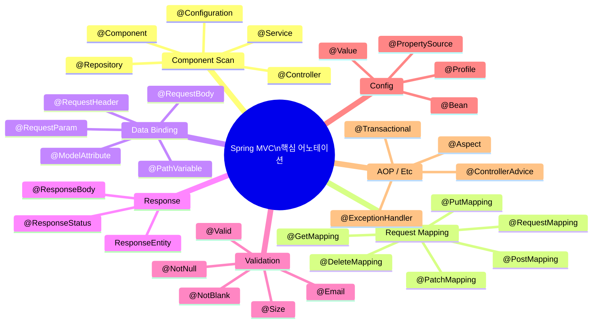

아래 내용을 그대로 복사하여 `spring-mvc-review.md` 파일로 저장하시면 됩니다.

---

```markdown
# 🌿 Spring MVC 핵심 리뷰 노트

---

## 1. Spring MVC 전체 아키텍처 (Request Lifecycle)

> Spring MVC의 모든 것은 **DispatcherServlet**에서 시작된다.



### 핵심 포인트

- **DispatcherServlet**은 Front Controller 패턴의 구현체로, 모든 요청의 진입점이다.
- 개발자가 직접 건드리는 것은 주로 **Controller → Service → Repository** 계층이다.
- 나머지(HandlerMapping, HandlerAdapter, ViewResolver)는 Spring이 자동 처리한다.

---

## 2. 계층 구조 (Layered Architecture)



| 계층 | 어노테이션 | 역할 |
|------|-----------|------|
| **Presentation** | `@Controller`, `@RestController` | HTTP 요청/응답 처리, 데이터 변환 |
| **Business** | `@Service` | 핵심 비즈니스 로직, 트랜잭션 관리 |
| **Persistence** | `@Repository` | DB 접근, CRUD 작업 |

> **원칙**: 상위 계층은 하위 계층에 의존하지만, 하위 계층은 상위 계층을 모른다.

---

## 3. Spring IoC / DI (제어의 역전 / 의존성 주입)

> Spring의 **근본 철학**. 이것을 이해하지 못하면 Spring을 이해할 수 없다.



### DI 3가지 방식

```java
// ✅ 1. 생성자 주입 (권장!)
@Controller
@RequiredArgsConstructor  // Lombok
public class UserController {
    private final UserService userService;  // final 필수
}

// ⚠️ 2. 필드 주입 (테스트 어려움)
@Controller
public class UserController {
    @Autowired
    private UserService userService;
}

// 3. Setter 주입 (선택적 의존성에 사용)
@Controller
public class UserController {
    private UserService userService;

    @Autowired
    public void setUserService(UserService userService) {
        this.userService = userService;
    }
}
```

> **생성자 주입을 쓰는 이유**: 불변성 보장, 순환 의존성 컴파일 타임 감지, 테스트 용이

---

## 4. Spring Bean Scope & Lifecycle



| Scope | 설명 |
|-------|------|
| **singleton** (기본값) | 스프링 컨테이너당 인스턴스 1개. 대부분 이걸 사용 |
| **prototype** | 요청할 때마다 새 인스턴스 생성 |
| **request** | HTTP 요청당 1개 (웹 전용) |
| **session** | HTTP 세션당 1개 (웹 전용) |

---

## 5. @Controller vs @RestController



```java
// View를 반환 (SSR)
@Controller
public class PageController {
    @GetMapping("/home")
    public String home(Model model) {
        model.addAttribute("name", "Spring");
        return "home";  // → ViewResolver가 home.html 을 찾음
    }
}

// JSON을 반환 (REST API)
@RestController
@RequestMapping("/api")
public class UserApiController {
    @GetMapping("/users/{id}")
    public ResponseEntity<UserResponse> getUser(@PathVariable Long id) {
        return ResponseEntity.ok(userService.findById(id));
    }
}
```

---

## 6. 요청 매핑 & 데이터 바인딩



```java
@RestController
@RequestMapping("/api/users")
public class UserController {

    // GET /api/users/1
    @GetMapping("/{id}")
    public User getUser(@PathVariable Long id) { ... }

    // GET /api/users?page=0&size=10
    @GetMapping
    public List<User> getUsers(@RequestParam(defaultValue = "0") int page,
                                @RequestParam(defaultValue = "10") int size) { ... }

    // POST /api/users  (JSON body)
    @PostMapping
    public User createUser(@RequestBody @Valid UserCreateRequest request) { ... }

    // POST (Form submit)
    @PostMapping("/form")
    public String submitForm(@ModelAttribute UserForm form) { ... }
}
```

---

## 7. 예외 처리 전략



```java
// 글로벌 예외 처리 (실무 필수 패턴)
@RestControllerAdvice
public class GlobalExceptionHandler {

    @ExceptionHandler(UserNotFoundException.class)
    public ResponseEntity<ErrorResponse> handleNotFound(UserNotFoundException e) {
        return ResponseEntity.status(HttpStatus.NOT_FOUND)
                .body(new ErrorResponse("USER_NOT_FOUND", e.getMessage()));
    }

    @ExceptionHandler(MethodArgumentNotValidException.class)
    public ResponseEntity<ErrorResponse> handleValidation(MethodArgumentNotValidException e) {
        String message = e.getBindingResult().getFieldErrors().stream()
                .map(FieldError::getDefaultMessage)
                .collect(Collectors.joining(", "));
        return ResponseEntity.badRequest()
                .body(new ErrorResponse("VALIDATION_ERROR", message));
    }

    @ExceptionHandler(Exception.class)
    public ResponseEntity<ErrorResponse> handleAll(Exception e) {
        return ResponseEntity.status(HttpStatus.INTERNAL_SERVER_ERROR)
                .body(new ErrorResponse("INTERNAL_ERROR", "서버 오류가 발생했습니다."));
    }
}
```

---

## 8. Filter vs Interceptor vs AOP



| 구분 | Filter | Interceptor | AOP |
|------|--------|-------------|-----|
| **스펙** | Servlet | Spring MVC | Spring Core |
| **실행 위치** | DispatcherServlet **이전** | DispatcherServlet **이후** | 메서드 레벨 |
| **접근 가능** | ServletRequest/Response | HttpServletRequest/Response + Handler 정보 | JoinPoint(메서드 시그니처, 인자 등) |
| **주 사용처** | 인코딩, CORS, 보안(Spring Security) | 인증/인가, 로깅, 권한 체크 | 트랜잭션, 로깅, 성능 측정 |

---

## 9. Validation (검증)

```java
// DTO에 검증 규칙 선언
public class UserCreateRequest {

    @NotBlank(message = "이름은 필수입니다")
    @Size(min = 2, max = 20, message = "이름은 2~20자 사이여야 합니다")
    private String name;

    @Email(message = "유효한 이메일 형식이 아닙니다")
    @NotBlank(message = "이메일은 필수입니다")
    private String email;

    @Min(value = 1, message = "나이는 1 이상이어야 합니다")
    @Max(value = 150, message = "나이는 150 이하여야 합니다")
    private int age;
}

// Controller에서 @Valid로 활성화
@PostMapping("/users")
public ResponseEntity<User> create(@RequestBody @Valid UserCreateRequest request) {
    // 검증 실패 시 MethodArgumentNotValidException 자동 발생
    return ResponseEntity.ok(userService.create(request));
}
```

---

## 10. HTTP 메서드와 REST API 설계



### REST 설계 원칙

- **URI는 명사**를 사용한다: `/api/users` (O) vs `/api/getUsers` (X)
- **HTTP 메서드로 행위**를 표현한다
- **복수형**을 사용한다: `/api/users` (O) vs `/api/user` (X)
- **계층 관계는 슬래시로** 표현: `/api/users/{id}/orders`

---

## 11. 핵심 어노테이션 총정리



---

## 12. 꼭 기억할 체크리스트

- [x] DispatcherServlet이 Front Controller로 모든 요청을 받는다
- [x] Handler Mapping → Handler Adapter → Controller 순서로 요청이 흐른다
- [x] 계층 분리: Controller → Service → Repository
- [x] IoC/DI는 생성자 주입을 기본으로 사용한다
- [x] Bean은 기본 Singleton Scope이다
- [x] @Controller는 View 반환, @RestController는 JSON 반환
- [x] @Valid + @ControllerAdvice 조합으로 검증 & 예외 처리
- [x] Filter → Interceptor → AOP 순서와 각각의 역할을 구분한다
- [x] REST API는 URI(명사) + HTTP Method(동사) 조합으로 설계한다
- [x] ResponseEntity로 상태 코드와 응답 본문을 함께 제어한다

---

> 📌 **다음 학습 추천**: Spring Security → Spring Data JPA → Spring Boot Auto Configuration
```

---

위 전체를 복사해서 `spring-mvc-review.md`로 저장하시면, GitHub, Typora, VS Code(Mermaid 플러그인), Obsidian 등에서 다이어그램과 체크리스트까지 모두 정상 렌더링됩니다.
