# Apache Kafka 함께 리뷰하기 — 개념부터 Spring 연동까지

> 이 문서는 스터디에서 **한 섹션씩 돌아가며 설명**하도록 구성했습니다.
> 각 섹션 끝의 💬 **리뷰 질문**에 답할 수 있으면 그 챕터를 이해한 것입니다.

---

## 1. Kafka를 왜 쓰는가? — 문제부터 보기

### 1-1. 동기 호출로 만든 주문 시스템

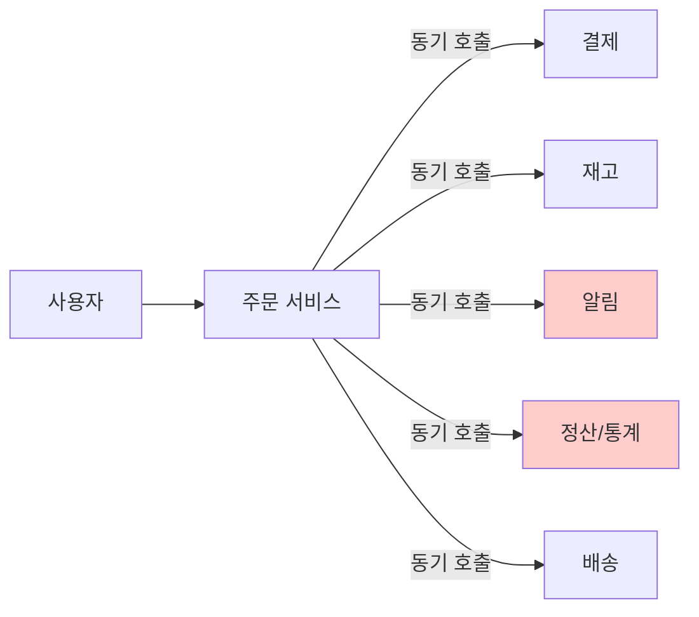

**문제점**
1. **강한 결합**: 알림 서비스가 죽으면 주문 자체가 실패합니다.
2. **느린 응답**: 모든 하위 시스템의 응답시간이 합산됩니다.
3. **확장 지옥**: 기능이 추가될 때마다 주문 서비스 코드를 수정해야 합니다. (N x M 연결)
4. **트래픽 스파이크 취약**: 초당 10만 건이 들어오면 DB가 그대로 얻어맞습니다.

### 1-2. Kafka 도입 후

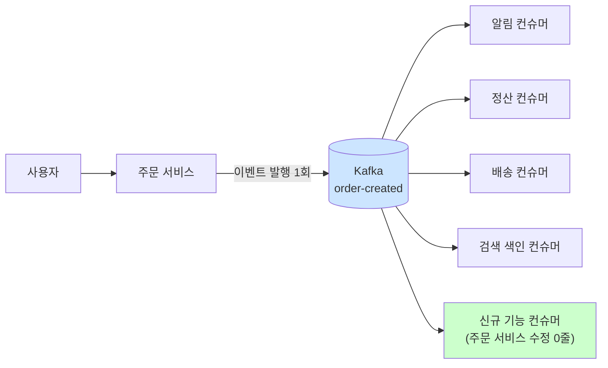

Kafka가 주는 4가지 가치:

| 가치 | 설명 |
|---|---|
| **결합도 제거 (Pub/Sub)** | 생산자는 누가 소비하는지 몰라도 된다. 컨슈머 추가 시 기존 코드 무수정. |
| **완충 장치 (Buffer)** | 트래픽 스파이크를 Kafka가 흡수하고, 컨슈머는 자기 속도로 처리(백프레셔). |
| **재처리 가능 (Replay)** | 메시지를 읽어도 삭제하지 않는다. 버그 수정 후 오프셋을 되돌려 다시 처리 가능. |
| **고가용성 + 고성능** | 복제(replication)로 장애를 견디고, 순차 디스크 쓰기 + 배치로 초당 수백만 건 처리. |

> 💬 **리뷰 질문**
> Q1. RDB 테이블을 큐처럼 쓰면 안 되는 이유는? (폴링 비용, 락 경쟁, 확장 한계)
> Q2. "메시지를 읽어도 삭제하지 않는다"는 특성이 실무에서 가장 유용한 순간은 언제일까?

---

## 2. Kafka 구조 — 전체 지도

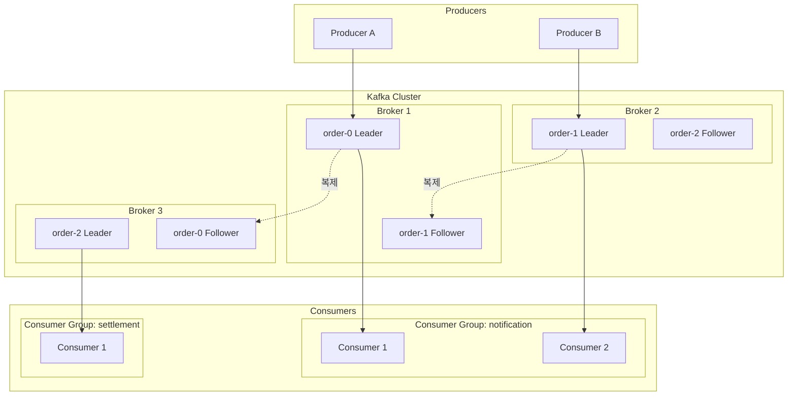

### 용어 사전 (이것만 외우면 됩니다)

| 용어 | 한 줄 정의 | 비유 |
|---|---|---|
| **Broker** | Kafka 서버 프로세스 1대 | 물류 창고 1동 |
| **Topic** | 메시지의 논리적 분류 이름 | 창고 안의 "품목 카테고리" |
| **Partition** | 토픽을 나눈 물리적 로그 단위. **병렬성과 순서의 기준** | 카테고리 안의 컨베이어 벨트 |
| **Offset** | 파티션 내 메시지의 고유 순번 (0,1,2...) | 벨트 위 상자 번호 |
| **Segment** | 파티션이 저장되는 실제 파일 조각 | 서류 보관 박스 |
| **Replica / ISR** | 파티션 복제본 / 리더와 동기화된 복제본 집합 | 백업 창고 |
| **Producer** | 메시지 발행자 | 물건 넣는 사람 |
| **Consumer Group** | 협력해서 소비하는 컨슈머 묶음. **오프셋 관리 단위** | 작업 팀 |
| **Retention** | 메시지 보관 기간/용량 정책 (기본 7일) | 보관 만료일 |

> 💬 **리뷰 질문**
> Q. Topic과 Partition의 관계를 신입에게 30초 안에 설명해 보세요.

---

## 3. Partition — 성능·순서·확장의 핵심

### 3-1. 파티션 로그 구조 (Append Only)

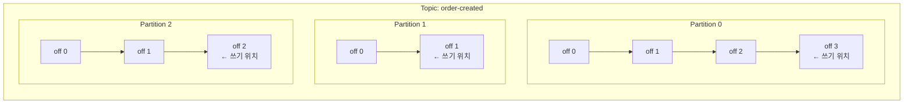

**절대 규칙 3가지**
1. **순서 보장은 파티션 안에서만** 성립합니다. 토픽 전체의 전역 순서는 보장되지 않습니다.
2. **같은 Key → 같은 Partition** (`hash(key) % partitionCount`). 그래서 `userId`나 `orderId`를 키로 씁니다.
3. 파티션은 **늘릴 수만 있고 줄일 수 없습니다.** 늘리면 기존 키의 해시 분배가 깨져 순서 보장이 흔들립니다.

```java
// 같은 주문의 이벤트는 항상 같은 파티션 → 생성 → 결제 → 배송 순서 보장
kafkaTemplate.send("order-events", order.getId().toString(), event);
```

### 3-2. 파티션 수와 컨슈머 수의 관계 (매우 중요)

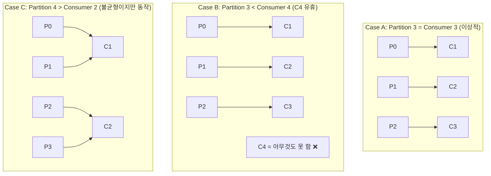

> **하나의 파티션은 한 컨슈머 그룹 내에서 오직 한 컨슈머에게만 할당됩니다.**
> 즉, **컨슈머 스케일아웃의 상한선 = 파티션 개수**입니다.
> 처리량이 부족하면 서버만 늘려도 소용없고, **파티션을 먼저 늘려야** 합니다.

**파티션 개수 산정 공식(가이드)**
```
목표 처리량 = 1,000 msg/s
컨슈머 1개 처리 능력 = 100 msg/s
→ 최소 파티션 = 10개  (여유분 포함해 12~16개 권장)
※ 파티션이 너무 많으면 브로커 파일 핸들/메모리, 리밸런싱 시간, 리더 선출 시간이 증가
```

> 💬 **리뷰 질문**
> Q1. Lag이 계속 쌓입니다. 컨슈머 서버를 2대 → 6대로 늘렸는데 개선이 없습니다. 왜일까요?
> Q2. "결제 이벤트는 순서가 중요하다"는 요구사항을 파티션 설계로 어떻게 만족시키나요?

---

## 4. Consumer Group / Offset / Rebalance

### 4-1. 소비 흐름

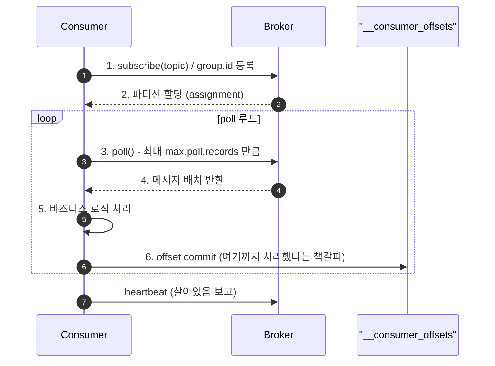

**Offset은 "책갈피"입니다.** `__consumer_offsets` 내부 토픽에 컨슈머 그룹별로 저장됩니다.
그래서 컨슈머가 재시작되어도 이어서 읽고, 그룹이 다르면 같은 메시지를 각자 처음부터 읽을 수 있습니다.

### 4-2. 커밋 시점이 결정하는 전달 보장

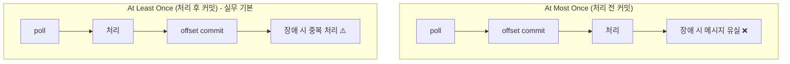

**실무 정답: At Least Once + 멱등(Idempotent) 컨슈머**
```
중복이 와도 결과가 같게 만든다
→ eventId를 PK/유니크 키로 두고 INSERT 시 중복 무시
→ UPDATE 는 "잔액 = 잔액 + 100" 대신 "잔액 = 500" 처럼 절대값으로
→ 상태 전이 검증: 이미 COMPLETED 면 무시
```

### 4-3. Rebalance — 알아야 할 위험

컨슈머가 추가/제거/장애 나면 파티션을 재분배합니다. 이때 **Stop the World**로 잠시 소비가 멈춥니다.

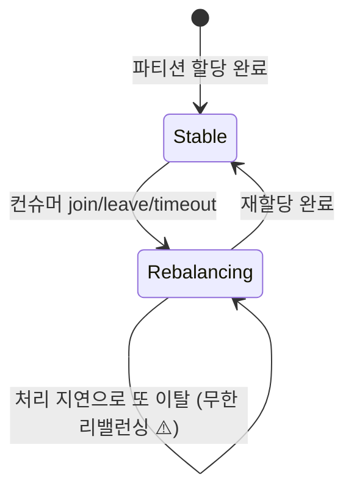

**리밸런싱 폭풍의 대표 원인**: 한 번의 `poll()`로 가져온 메시지 처리가 `max.poll.interval.ms`(기본 5분)를 초과
→ 브로커가 "죽었다"고 판단 → 리밸런스 → 재처리 → 또 초과 → 무한 반복.

**해결**: `max.poll.records`를 줄이거나, 처리 로직을 빠르게, 또는 `max.poll.interval.ms` 상향.

> 💬 **리뷰 질문**
> Q1. 같은 토픽을 두 팀이 각각 다 읽고 싶습니다. 어떻게 설정하나요? (힌트: group.id)
> Q2. "정확히 한 번(exactly-once)"을 애플리케이션에서 실질적으로 달성하는 방법은?

---

## 5. Producer — 신뢰성과 성능의 트레이드오프

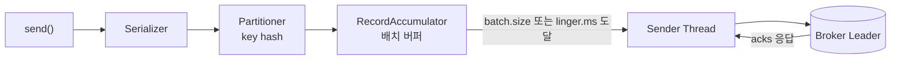

| 설정 | 의미 | 권장 |
|---|---|---|
| `acks=0` | 응답 안 기다림. 가장 빠름, 유실 가능 | 로그/메트릭 |
| `acks=1` | 리더만 기록 확인. 리더 장애 시 유실 가능 | 중간 |
| `acks=all` | 모든 ISR 기록 확인 | **금전/주문 등 중요 데이터** |
| `enable.idempotence=true` | 재시도로 인한 **브로커 측 중복 저장 방지** | 항상 켬 (최신 버전 기본값) |
| `retries` / `delivery.timeout.ms` | 재시도 횟수/총 제한 | 기본값 유지 |
| `linger.ms` (0→5~20) | 배치를 모으는 대기 시간 | 처리량↑ 지연↑ |
| `batch.size` | 배치 최대 바이트 | 16KB~64KB |
| `compression.type` | `lz4`, `snappy`, `zstd` | **네트워크·디스크 절약 효과 큼** |
| `max.in.flight.requests=1` | 순서 엄격 보장(멱등 켜면 5까지 OK) | 상황별 |

> ⚠️ `acks=all` + `min.insync.replicas=2` + `replication.factor=3` 이 **무손실 표준 조합**입니다.

---

## 6. Spring Kafka 코드로 익히기

### 6-1. 설정

```yaml
spring:
  kafka:
    bootstrap-servers: localhost:9092
    producer:
      key-serializer: org.apache.kafka.common.serialization.StringSerializer
      value-serializer: org.springframework.kafka.support.serializer.JsonSerializer
      acks: all
      properties:
        enable.idempotence: true
        linger.ms: 10
      compression-type: lz4
    consumer:
      group-id: order-notification
      auto-offset-reset: latest          # earliest = 처음부터, latest = 최신부터
      enable-auto-commit: false          # 수동 커밋 (데이터 정합성 필수)
      key-deserializer: org.apache.kafka.common.serialization.StringDeserializer
      value-deserializer: org.springframework.kafka.support.serializer.ErrorHandlingDeserializer
      properties:
        spring.deserializer.value.delegate.class: org.springframework.kafka.support.serializer.JsonDeserializer
        spring.json.trusted.packages: "com.example.event"
        max.poll.records: 100
    listener:
      ack-mode: manual                   # Acknowledgment 로 직접 커밋
      concurrency: 3                     # 파티션 수 이하로 설정
```

### 6-2. Producer

```java
@Component
@RequiredArgsConstructor
public class OrderEventProducer {

    private final KafkaTemplate<String, OrderCreatedEvent> kafkaTemplate;
    private static final String TOPIC = "order-created";

    public void publish(OrderCreatedEvent event) {
        // key = orderId → 같은 주문은 항상 같은 파티션 → 순서 보장
        kafkaTemplate.send(TOPIC, event.orderId().toString(), event)
            .whenComplete((result, ex) -> {                 // 논블로킹 콜백 (문서 1의 CompletableFuture!)
                if (ex != null) {
                    log.error("발행 실패 event={}", event, ex);
                    // 필요 시 Outbox 테이블에 저장해 재시도
                } else {
                    RecordMetadata m = result.getRecordMetadata();
                    log.info("발행 성공 partition={}, offset={}", m.partition(), m.offset());
                }
            });
    }
}
```

### 6-3. Consumer (멱등 처리 + 재시도 + DLT)

```java
@Component
@RequiredArgsConstructor
public class OrderEventConsumer {

    private final NotificationService notificationService;
    private final ProcessedEventRepository processedEventRepository;

    @RetryableTopic(
        attempts = "3",
        backoff = @Backoff(delay = 1000, multiplier = 2.0),
        dltTopicSuffix = "-dlt",                        // 3번 실패 시 order-created-dlt 로 이동
        exclude = { IllegalArgumentException.class }     // 재시도 무의미한 예외는 즉시 DLT
    )
    @KafkaListener(topics = "order-created", groupId = "order-notification")
    @Transactional
    public void consume(@Payload OrderCreatedEvent event,
                        @Header(KafkaHeaders.RECEIVED_PARTITION) int partition,
                        @Header(KafkaHeaders.OFFSET) long offset,
                        Acknowledgment ack) {
        try {
            // ✅ 멱등성 보장 - 중복 수신 방어 (eventId 유니크 제약)
            if (processedEventRepository.existsByEventId(event.eventId())) {
                log.info("중복 이벤트 스킵 eventId={}", event.eventId());
                ack.acknowledge();
                return;
            }

            notificationService.sendOrderConfirm(event.orderId());
            processedEventRepository.save(ProcessedEvent.of(event.eventId()));

            ack.acknowledge();   // 처리 성공 후 커밋 = At Least Once
        } catch (Exception e) {
            log.error("처리 실패 partition={}, offset={}", partition, offset, e);
            throw e;             // 커밋하지 않음 → 재시도 대상
        }
    }

    @DltHandler
    public void handleDlt(OrderCreatedEvent event) {
        log.error("[DLT] 수동 확인 필요: {}", event);
        // 알림 발송 + 운영 대시보드 적재
    }
}
```

### 6-4. 재시도 & DLT 흐름

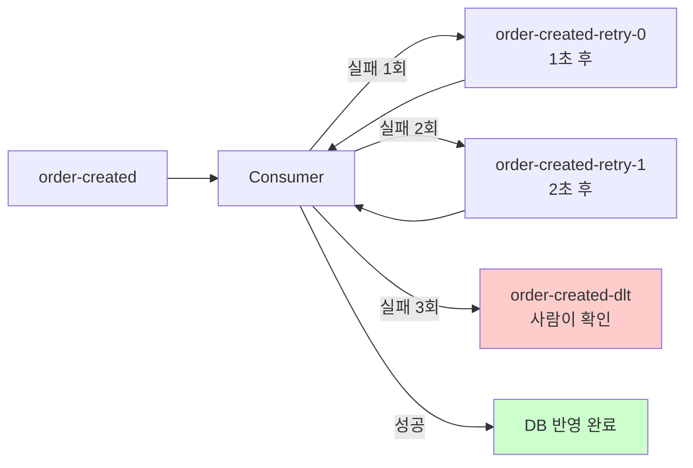

> **DLT(Dead Letter Topic)가 없으면** 독성 메시지(poison pill) 하나가 파티션 전체를
> 무한 재시도로 막아버립니다. 운영 필수 장치입니다.

---

## 7. DB 트랜잭션과 Kafka 발행의 정합성 — Outbox 패턴

```java
@Transactional
public void order(OrderCommand cmd) {
    orderRepository.save(order);       // ① DB 커밋 성공
    kafkaProducer.publish(event);      // ② 여기서 실패하면? → 데이터 불일치!
}
```
DB와 Kafka는 하나의 트랜잭션으로 묶을 수 없습니다(2PC는 실무에서 비권장).

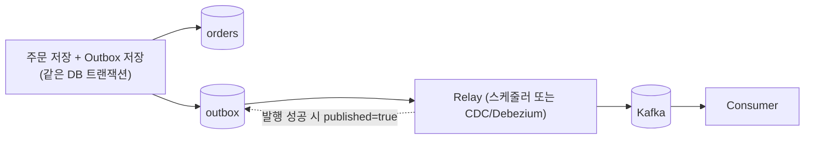

**핵심 아이디어**: 이벤트를 **DB 테이블(outbox)에 비즈니스 데이터와 함께 원자적으로 저장**하고,
별도 프로세스가 그 테이블을 읽어 Kafka로 발행합니다.
→ 최소 한 번(at-least-once) 발행이 보장되고, 컨슈머 멱등성으로 중복을 흡수합니다.

---

## 8. 다른 메시징 시스템과 비교

| 항목 | **Kafka** | RabbitMQ | Redis Stream | SQS |
|---|---|---|---|---|
| 모델 | 분산 로그 (Pub/Sub) | 메시지 브로커 (큐/라우팅) | 인메모리 로그 | 관리형 큐 |
| 처리량 | 매우 높음 (초당 수십만~) | 중간 | 높음 | 높음 |
| 메시지 보관 | **기간 내 보관, 재처리 가능** | 소비 시 삭제 | 메모리 한계 | 최대 14일 |
| 순서 보장 | 파티션 단위 | 큐 단위 | 스트림 단위 | FIFO 큐 옵션 |
| 복잡한 라우팅 | 약함 | **강함 (Exchange)** | 약함 | 약함 |
| 운영 난이도 | 높음 | 중간 | 낮음 | 매우 낮음 |
| 대표 용도 | 이벤트 스트리밍, 로그 수집, 데이터 파이프라인 | 작업 큐, RPC | 간단한 큐/실시간 | 클라우드 비동기 작업 |

> **선택 기준**: "이벤트를 여러 곳이 각자 소비하고, 재처리와 대용량이 필요하면 Kafka.
> 정교한 라우팅과 작업 큐가 필요하면 RabbitMQ."

---

## 9. 운영 모니터링 필수 지표

| 지표 | 의미 | 경보 기준 예시 |
|---|---|---|
| **Consumer Lag** | 최신 오프셋 - 커밋 오프셋 (밀린 양) | 가장 중요. 지속 증가 시 즉시 확인 |
| Rebalance 빈도 | 리밸런싱 발생 횟수 | 잦으면 `max.poll` 설정 점검 |
| Under Replicated Partitions | ISR 미달 파티션 | 0이 아니면 브로커 장애 의심 |
| Producer error rate | 발행 실패율 | 0% 유지 |
| DLT 메시지 수 | 처리 실패 누적 | 발생 즉시 알림 |

도구: Kafka UI, Confluent Control Center, Burrow, Prometheus + JMX Exporter, Grafana

---

## 10. 스터디 최종 리뷰 시나리오 🎯

### 시나리오 A. 선착순 쿠폰 100장 이벤트 (동시 요청 10만 건)
1. 왜 DB 직접 UPDATE 방식이 터지는지 설명하기 (락 경쟁, 커넥션 고갈)
2. Redis로 수량 선점(원자적 감소) → Kafka로 발급 이벤트 발행 → 컨슈머가 DB 저장하는 흐름 그리기
3. 이때 **파티션 키를 무엇으로** 할지, **중복 발급을 어떻게 막을지** 정하기

### 시나리오 B. Lag 100만 건 장애 대응
1. 원인 후보 나열하기 (파티션 부족 / 컨슈머 로직 지연 / 외부 API 느림 / DLT 미설정으로 재시도 루프)
2. 즉시 조치와 근본 조치를 구분해 정리하기
3. 만약 컨슈머 버그로 잘못 처리했다면, 어떻게 재처리할지 (오프셋 리셋 절차 + 멱등성 필요성)

### 시나리오 C. 문서 1과 연결하기
> "Spring `@Async`로 알림을 보내던 코드를 Kafka로 옮겨야 할 시점은 언제인가?"

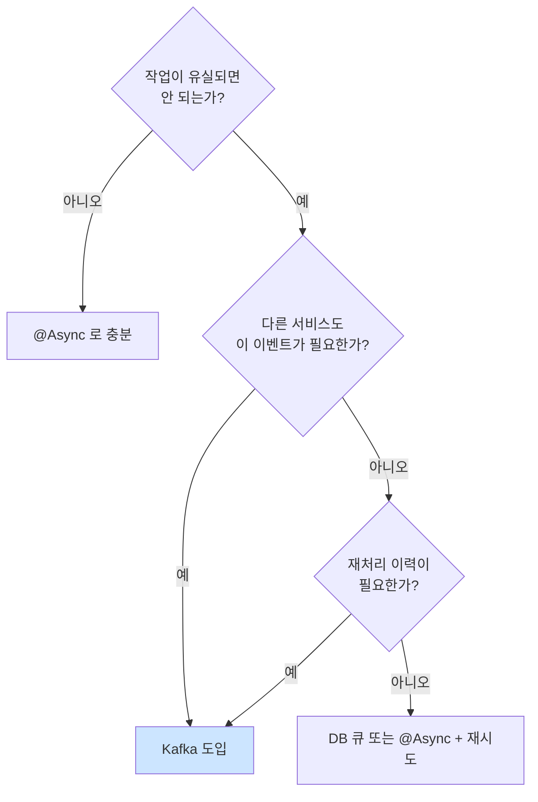

**정리 한 문장**
> `@Async`는 **한 서버 안에서의 비동기**, Kafka는 **시스템 사이의 비동기**입니다.
> 전자는 응답 속도를, 후자는 시스템의 확장성과 안정성을 해결합니다.
