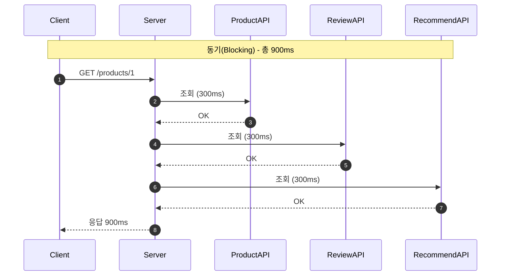
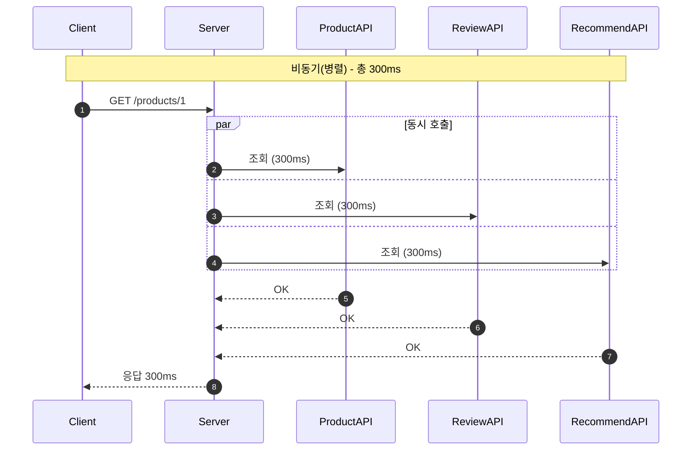
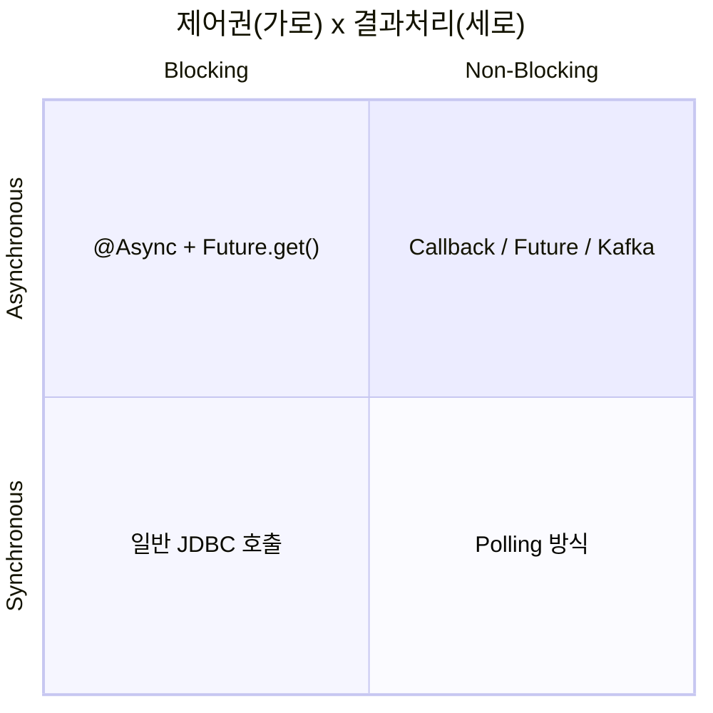
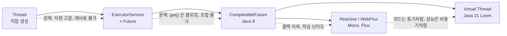
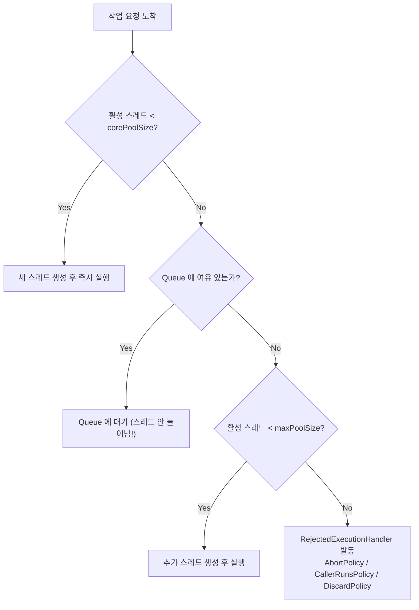
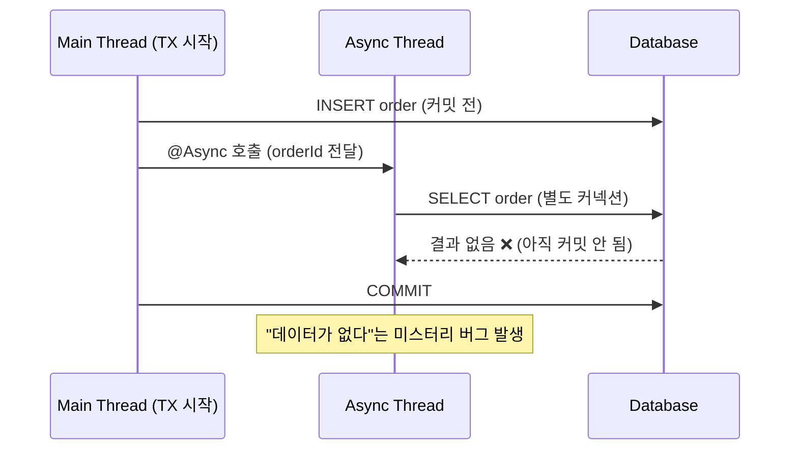
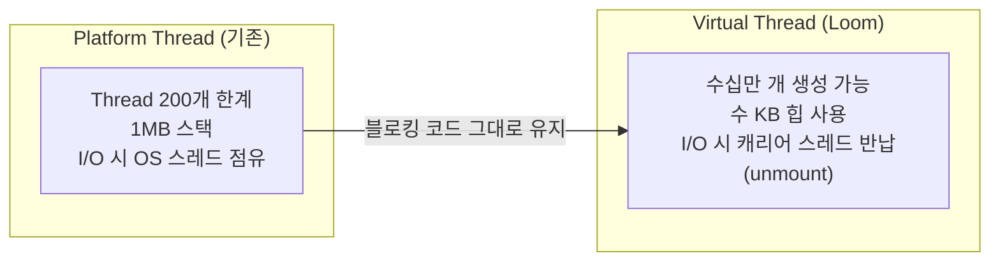
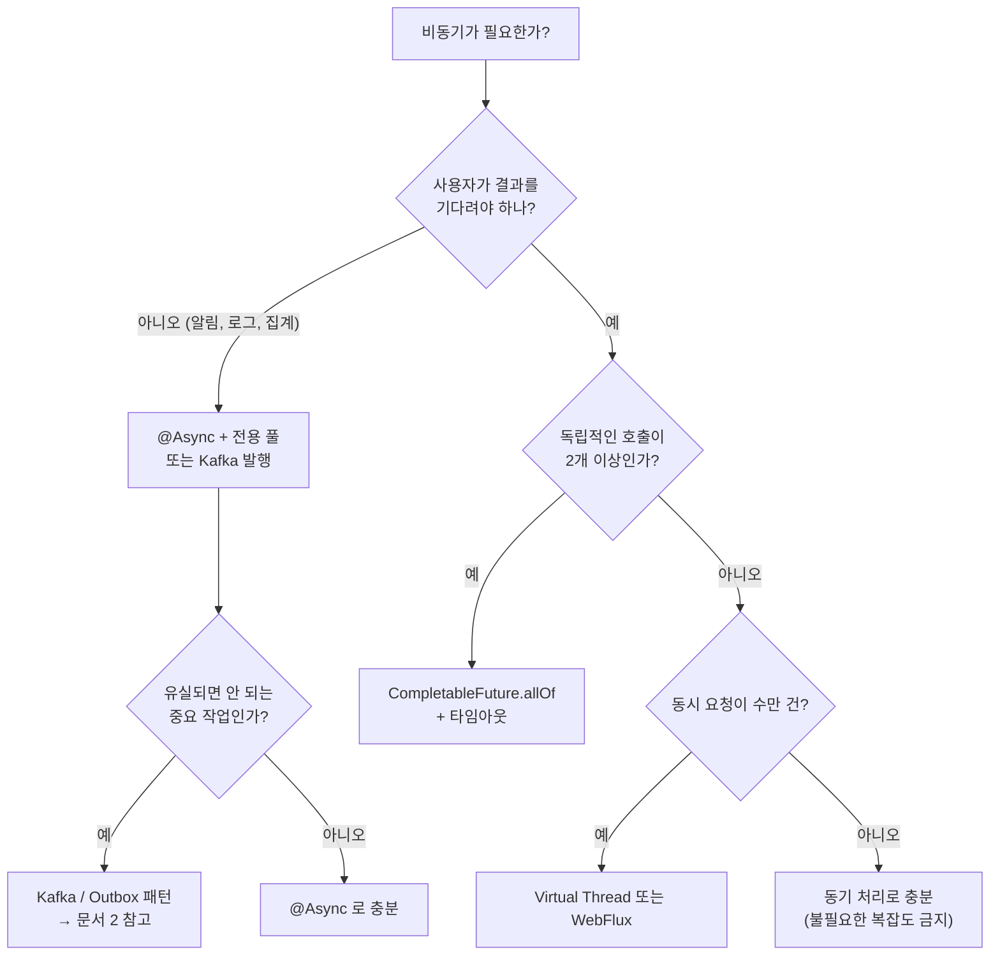

# 대용량 트래픽 관리 [이론] Spring / Java 비동기 처리하기

> 학습 목표
> 1. 왜 대용량 트래픽에서 "비동기"가 필수인지 자원(Thread) 관점으로 설명할 수 있다.
> 2. `@Async`, `CompletableFuture`, `Virtual Thread`의 차이와 선택 기준을 말할 수 있다.
> 3. 실무에서 사고가 터지는 3대 지점(스레드풀 설정, 트랜잭션, 예외/컨텍스트 전파)을 피할 수 있다.

---

## 1. 왜 비동기를 써야 하는가?

### 1-1. 문제의 본질: 스레드는 "비싼 자원"이다

전통적인 Spring MVC는 **1 요청 = 1 스레드(Thread per Request)** 모델입니다.
Tomcat 기본 설정은 `server.tomcat.threads.max=200` 입니다.

즉, **동시에 처리 가능한 요청은 200개**입니다. 그런데 대부분의 API는 CPU를 쓰는 게 아니라
DB, 외부 API, S3 응답을 **기다리기만(Blocking)** 합니다.

```
외부 결제 API 응답시간 500ms 인 API
→ 스레드 1개가 500ms 동안 "아무 일도 안 하면서" 점유됨
→ 최대 TPS = 200 threads / 0.5s = 400 TPS
→ 401번째 요청부터 큐 대기 → 타임아웃 → 장애
```

CPU 사용률은 5%인데 서버가 죽습니다. **CPU가 부족한 게 아니라 스레드가 없어서 죽는 것**입니다.

### 1-2. 비동기가 해결하는 것

| 목적 | 설명 | 예시 |
|---|---|---|
| **응답 지연 단축(Latency)** | 독립적인 작업을 동시에 실행 | 상품 상세 = 상품 + 재고 + 리뷰 + 추천 (순차 800ms → 병렬 300ms) |
| **처리량 증가(Throughput)** | 대기 중 스레드를 반납해 더 많은 요청 수용 | I/O 대기 시간 동안 다른 요청 처리 |
| **응답 분리(Fire and Forget)** | 사용자가 기다릴 필요 없는 작업 분리 | 주문 완료 후 알림톡/이메일/로그 적재 |
| **장애 격리(Bulkhead)** | 느린 외부 시스템이 전체 서버를 잠식하지 못하게 차단 | 추천 API 장애 시에도 상품 조회는 정상 |

### 1-3. 순차 vs 병렬 (Mermaid)





---

## 2. 개념 정리 — 헷갈리는 용어 4개

많은 사람이 동기/비동기와 블로킹/논블로킹을 섞어 씁니다. **관심사가 다릅니다.**

- **Blocking / Non-Blocking** : 호출한 함수가 **제어권을 바로 돌려주는가?** (제어권 관점)
- **Sync / Async** : 호출한 함수의 **완료 여부를 내가 계속 신경 쓰는가, 알림을 받는가?** (결과 처리 관점)



한 줄 요약: **비동기의 목적은 "기다리는 시간을 낭비하지 않는 것"**입니다.

---

## 3. Java 비동기의 진화 과정



| 방식 | 특징 | 언제 쓰나 |
|---|---|---|
| `new Thread()` | 매번 OS 스레드 생성(1MB 스택) | **실무 금지** |
| `ExecutorService` + `Future` | 풀 재사용, 그러나 `future.get()`이 블로킹 | 단순 병렬 작업 |
| `CompletableFuture` | 논블로킹 조합(`thenApply`, `allOf`), 예외 처리 체이닝 | **가장 실용적인 표준** |
| `@Async` | Spring이 프록시로 감싸 스레드풀에 위임 | 이벤트/알림 등 부가 로직 분리 |
| `Virtual Thread` (Java 21+) | 블로킹 코드를 그대로 쓰면서 수십만 동시성 | I/O 위주 서버의 새로운 기본값 |
| `WebFlux` | 이벤트 루프 기반 완전 논블로킹 | 게이트웨이, 스트리밍, 초고동시성 |

---

## 4. Spring `@Async` — 코드로 이해하기

### 4-1. 활성화 + 스레드풀 정의 (⚠️ 기본값 쓰면 안 되는 이유)

`@EnableAsync`만 켜고 Executor 빈을 정의하지 않으면 Spring Boot는
`SimpleAsyncTaskExecutor`(요청마다 새 스레드 생성) 또는 단일 풀을 쓸 수 있습니다.
**트래픽이 몰리면 스레드 폭발로 OOM**이 납니다. 반드시 직접 정의하세요.

```java
@Slf4j
@Configuration
@EnableAsync
public class AsyncConfig implements AsyncConfigurer {

    /**
     * 외부 API 호출 등 I/O 바운드 작업용 풀
     */
    @Bean("apiExecutor")
    public ThreadPoolTaskExecutor apiExecutor() {
        ThreadPoolTaskExecutor executor = new ThreadPoolTaskExecutor();
        executor.setCorePoolSize(20);          // 항상 살아있는 스레드
        executor.setMaxPoolSize(50);           // 큐가 꽉 찼을 때 최대치
        executor.setQueueCapacity(500);        // 대기 큐 (무한대 금지!)
        executor.setKeepAliveSeconds(60);
        executor.setThreadNamePrefix("api-async-");  // 로그 추적용 필수
        // 큐도 꽉 차면? 호출한 스레드가 직접 실행 → 자연스러운 백프레셔
        executor.setRejectedExecutionHandler(new ThreadPoolExecutor.CallerRunsPolicy());
        // 종료 시 진행 중 작업 마무리 (Graceful Shutdown)
        executor.setWaitForTasksToCompleteOnShutdown(true);
        executor.setAwaitTerminationSeconds(30);
        executor.setTaskDecorator(new MdcTaskDecorator()); // 6-3 참고
        executor.initialize();
        return executor;
    }

    /** 알림/로그 같은 Fire-and-Forget 전용 풀 (자원 격리) */
    @Bean("eventExecutor")
    public ThreadPoolTaskExecutor eventExecutor() {
        ThreadPoolTaskExecutor executor = new ThreadPoolTaskExecutor();
        executor.setCorePoolSize(5);
        executor.setMaxPoolSize(10);
        executor.setQueueCapacity(1000);
        executor.setThreadNamePrefix("event-async-");
        executor.initialize();
        return executor;
    }

    /** 반환값이 void 인 @Async 메서드의 예외는 여기서 잡힌다 */
    @Override
    public AsyncUncaughtExceptionHandler getAsyncUncaughtExceptionHandler() {
        return (ex, method, params) ->
            log.error("[Async Error] method={}, params={}", method.getName(), params, ex);
    }
}
```

### 4-2. ThreadPoolTaskExecutor 동작 원리 (면접 단골 질문)

**core → queue → max 순서**입니다. 큐가 남아 있으면 절대 max까지 늘어나지 않습니다.



> 🔥 **가장 흔한 실수**: `queueCapacity`를 `Integer.MAX_VALUE`(기본값)로 두면
> 큐가 절대 안 차므로 `maxPoolSize`는 **영원히 무의미**해지고, 메모리만 쌓여 OOM으로 죽습니다.

**스레드풀 사이징 기준**
```
CPU 바운드 : corePoolSize ≈ CPU 코어 수 + 1
I/O 바운드 : corePoolSize ≈ 코어 수 x (1 + 대기시간/연산시간)
  예) 4코어, 응답 200ms 중 연산 10ms → 4 x (1 + 190/10) = 80
※ 공식은 출발점일 뿐, 반드시 부하테스트(k6, nGrinder)로 검증
```

### 4-3. 사용 예시 — 반환 타입별

```java
@Service
@RequiredArgsConstructor
public class OrderService {

    private final PaymentClient paymentClient;
    private final NotificationService notificationService;

    /** 1) Fire-and-Forget : 반환값 void */
    @Async("eventExecutor")
    public void sendOrderNotification(Long orderId) {
        notificationService.sendKakao(orderId);   // 실패해도 주문은 성공
    }

    /** 2) 결과가 필요한 경우 : CompletableFuture 반환 (권장) */
    @Async("apiExecutor")
    public CompletableFuture<PaymentResult> pay(PaymentCommand cmd) {
        return CompletableFuture.completedFuture(paymentClient.call(cmd));
    }
}
```

> `Future<T>` 대신 **`CompletableFuture<T>`를 반환**하세요.
> `Future.get()`은 블로킹이라 조합이 불가능합니다. `CompletableFuture`는 논블로킹 조합이 됩니다.

### 4-4. `@Async`의 함정 — 프록시 기반이라는 사실

`@Async`는 **AOP 프록시**로 동작합니다. 따라서 다음은 **전부 동기로 조용히 실행**됩니다.

```java
@Service
public class BadExample {

    // ❌ 1. 같은 클래스 내부 호출(self-invocation) → 프록시를 안 거침 → 동기 실행
    public void order() {
        this.sendMail();   // 비동기 아님!
    }
    @Async public void sendMail() { }

    // ❌ 2. private 메서드 → 프록시 오버라이드 불가
    @Async private void internal() { }

    // ❌ 3. static / final 메서드
    @Async public static void statics() { }

    // ❌ 4. @PostConstruct 안에서 호출 → 아직 프록시 준비 전
}
```

**해결책**: 다른 빈으로 분리하거나, `ApplicationEventPublisher` + `@Async @EventListener` 사용.

```java
// ✅ 이벤트 기반으로 분리 (가장 깔끔한 방법)
@Component
@RequiredArgsConstructor
public class OrderFacade {
    private final ApplicationEventPublisher publisher;

    @Transactional
    public void order(OrderCommand cmd) {
        Order order = orderRepository.save(Order.from(cmd));
        publisher.publishEvent(new OrderCreatedEvent(order.getId()));
    }
}

@Component
class OrderEventHandler {
    /** 트랜잭션 커밋 이후 + 비동기 실행 → 실무 정석 조합 */
    @Async("eventExecutor")
    @TransactionalEventListener(phase = TransactionPhase.AFTER_COMMIT)
    public void handle(OrderCreatedEvent event) {
        notificationService.send(event.orderId());
    }
}
```

---

## 5. `CompletableFuture` — 조합의 힘

### 5-1. 병렬 호출 후 합치기 (실전 패턴)

```java
@Service
@RequiredArgsConstructor
public class ProductDetailService {

    private final ProductClient productClient;
    private final ReviewClient reviewClient;
    private final StockClient stockClient;
    @Qualifier("apiExecutor")
    private final Executor executor;

    public ProductDetail getDetail(Long id) {
        CompletableFuture<Product> productF =
            CompletableFuture.supplyAsync(() -> productClient.find(id), executor)
                             .orTimeout(500, TimeUnit.MILLISECONDS);   // 타임아웃 필수

        CompletableFuture<List<Review>> reviewF =
            CompletableFuture.supplyAsync(() -> reviewClient.findByProduct(id), executor)
                             .completeOnTimeout(List.of(), 300, TimeUnit.MILLISECONDS)
                             .exceptionally(e -> {                     // 부가 정보는 실패 허용
                                 log.warn("review fail", e);
                                 return List.of();
                             });

        CompletableFuture<Stock> stockF =
            CompletableFuture.supplyAsync(() -> stockClient.find(id), executor);

        // 모두 완료될 때까지 대기 (여기서만 블로킹)
        CompletableFuture.allOf(productF, reviewF, stockF).join();

        return new ProductDetail(productF.join(), reviewF.join(), stockF.join());
    }
}
```

### 5-2. 반드시 외우는 API 5개

| API | 역할 | 비유 |
|---|---|---|
| `supplyAsync(fn, executor)` | 비동기 시작 (반환값 O) | 작업 던지기 |
| `thenApply(fn)` | 결과 변환 (동기 함수) | `map` |
| `thenCompose(fn)` | 결과로 또 다른 비동기 호출 | `flatMap` (중첩 방지) |
| `thenCombine(other, fn)` | 두 결과 합치기 | `zip` |
| `exceptionally(fn)` / `handle` | 예외 복구 | `try-catch` |

```java
// A 조회 → A로 B 조회 → 결과 가공 → 실패 시 기본값
CompletableFuture<String> result =
    CompletableFuture.supplyAsync(() -> userClient.find(userId), executor)
        .thenCompose(user -> CompletableFuture.supplyAsync(
                () -> gradeClient.find(user.gradeId()), executor))
        .thenApply(Grade::getName)
        .exceptionally(e -> "BASIC");
```

> ⚠️ `Executor`를 넘기지 않으면 **`ForkJoinPool.commonPool()`(코어수-1개)** 을 씁니다.
> 여기서 블로킹 I/O를 하면 애플리케이션 전체(parallelStream 등)가 함께 멈춥니다. **항상 executor를 명시**하세요.

---

## 6. 실무 3대 사고 지점

### 6-1. 트랜잭션은 스레드를 넘지 못한다

`@Transactional`은 `ThreadLocal`(`TransactionSynchronizationManager`)에 커넥션을 보관합니다.
따라서 **비동기 스레드는 부모의 트랜잭션에 참여하지 못합니다.**



**규칙**
1. 비동기 작업은 **`@TransactionalEventListener(AFTER_COMMIT)`** 이후에 실행한다.
2. 비동기 메서드에 **엔티티를 넘기지 말고 ID(값)를 넘긴다** → 지연 로딩 시 `LazyInitializationException`.
3. 비동기 작업 안에서 DB를 쓰면 **자기 자신의 `@Transactional`을 새로 선언**한다.
4. 롤백은 전파되지 않는다 → 보상 트랜잭션 또는 재시도 설계가 필요하다.

### 6-2. 예외는 조용히 사라진다

```java
// void 반환 → 호출자는 예외를 절대 알 수 없다 → AsyncUncaughtExceptionHandler 필수
@Async public void job() { throw new RuntimeException("아무도 모른다"); }

// CompletableFuture 반환 → join()/get() 시점에 CompletionException 으로 래핑되어 전달
@Async public CompletableFuture<String> job2() { ... }
```

### 6-3. ThreadLocal 컨텍스트(MDC, Security, TraceId) 전파

스레드가 바뀌면 로그의 `traceId`, `SecurityContext`가 사라져 **장애 추적이 불가능**해집니다.

```java
public class MdcTaskDecorator implements TaskDecorator {
    @Override
    public Runnable decorate(Runnable runnable) {
        Map<String, String> parentMdc = MDC.getCopyOfContextMap();      // 부모 스레드에서 복사
        SecurityContext parentCtx = SecurityContextHolder.getContext();
        return () -> {
            try {
                if (parentMdc != null) MDC.setContextMap(parentMdc);    // 자식 스레드에 심기
                SecurityContextHolder.setContext(parentCtx);
                runnable.run();
            } finally {
                MDC.clear();                                            // 풀에 반납 전 정리 필수
                SecurityContextHolder.clearContext();
            }
        };
    }
}
```

> 스레드풀은 **스레드를 재사용**하므로 `finally`에서 정리하지 않으면
> 다른 사용자의 인증 정보가 섞이는 **심각한 보안 사고**로 이어집니다.

---

## 7. Virtual Thread (Java 21+) — 게임 체인저

```java
// application.yml
spring:
  threads:
    virtual:
      enabled: true    # Spring Boot 3.2+ / Java 21+
```

```java
// 코드는 "동기처럼" 쓰지만 캐리어 스레드는 블로킹되지 않는다
try (var executor = Executors.newVirtualThreadPerTaskExecutor()) {
    List<Future<String>> futures = ids.stream()
        .map(id -> executor.submit(() -> apiClient.call(id)))  // 10,000개도 OK
        .toList();
}
```



**주의점**
- `synchronized` 블록 안의 블로킹은 캐리어 스레드를 고정(pinning)시킬 수 있음 → `ReentrantLock` 권장.
  (Java 24의 JEP 491로 상당 부분 개선되었으나, 라이브러리/런타임 버전 확인 필요)
- **풀링하면 안 됨** — 가상 스레드는 "생성 비용이 0에 가까운 자원"이므로 매번 새로 만든다.
- 병목이 DB로 이동한다 → **커넥션 풀(HikariCP) 크기가 새로운 한계선**이 된다. 반드시 함께 튜닝.
- CPU 바운드 작업에는 이득이 없다.

---

## 8. 선택 기준 치트시트



**핵심 경계선**
- `@Async`는 **프로세스 메모리 안**에서 동작합니다. 서버가 죽으면 **큐에 있던 작업은 전부 유실**됩니다.
- 유실되면 안 되는 작업, 재처리·순서·확장이 필요한 작업은 **반드시 Kafka 같은 외부 브로커**로 보냅니다.

---

## 9. 코드 리뷰 체크리스트 ✅

- [ ] `@EnableAsync` 선언 + **Executor 빈 직접 정의**했는가? (기본값 사용 금지)
- [ ] `queueCapacity`가 무한이 아닌가? `RejectedExecutionHandler`를 지정했는가?
- [ ] `threadNamePrefix`가 있어 로그에서 구분 가능한가?
- [ ] 용도별로 스레드풀을 **분리(Bulkhead)** 했는가? (외부 API용 / 이벤트용)
- [ ] 자기 자신 메서드 호출(self-invocation)이 아닌가?
- [ ] `void` 비동기 메서드의 예외 처리 핸들러가 있는가?
- [ ] 모든 외부 호출에 **타임아웃**이 있는가? (`orTimeout`, `completeOnTimeout`)
- [ ] 비동기 메서드에 엔티티 대신 **ID/DTO**를 넘겼는가?
- [ ] 트랜잭션 커밋 이후에 실행되도록 보장했는가?
- [ ] `TaskDecorator`로 MDC/Security를 전파하고 `finally`에서 정리했는가?
- [ ] `supplyAsync`에 executor를 명시했는가? (commonPool 사용 금지)
- [ ] Graceful Shutdown 설정으로 배포 시 작업 유실을 막았는가?

---

## 10. 실습 과제

1. `corePoolSize=2, queueCapacity=2, maxPoolSize=4`로 설정하고 작업 10개를 던져
   **몇 번째 작업에서 Rejected가 발생하는지** 로그로 증명하기.
2. 순차 호출 API(각 300ms x 3개)를 `CompletableFuture.allOf`로 리팩터링하고
   k6로 부하테스트해 **p99 응답시간 변화** 측정하기.
3. `@Async` 안에서 부모 트랜잭션 데이터 조회 → 실패 재현 → `@TransactionalEventListener`로 수정하기.
4. `spring.threads.virtual.enabled=true` 적용 전후 **최대 TPS** 비교하고, 병목이 DB 커넥션 풀로 이동하는 것 확인하기.
