# 0단계. 비동기를 배우기 전에 알아야 할 기초 5가지

> 대상: Spring을 처음 배우는 분 (비전공 포함)
> 목표: 어려운 용어 없이 "서버가 어떻게 일하는지" 그림으로 이해하기
> 예상 소요: 20분

---

## 1. 서버는 "식당"입니다

웹 서비스를 식당에 비유하면 거의 모든 개념이 설명됩니다. 이 비유를 문서 끝까지 계속 씁니다.

| 개발 용어 | 식당 비유 |
|---|---|
| **클라이언트(Client)** | 손님 |
| **요청(Request)** | 주문 |
| **서버(Server)** | 식당 |
| **응답(Response)** | 음식 서빙 |
| **스레드(Thread)** | 직원 1명 |
| **API** | 메뉴판의 메뉴 1개 |
| **데이터베이스(DB)** | 창고 |

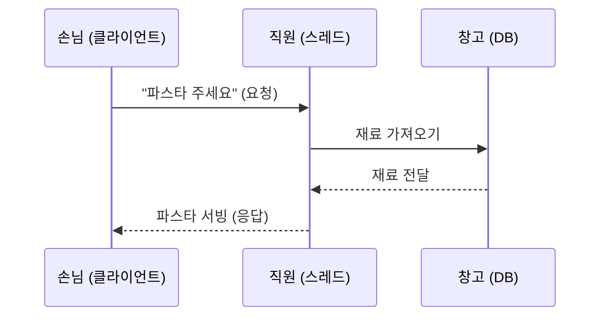

우리가 만드는 Spring 서버가 하는 일은 딱 이것입니다.
**요청을 받고 → 필요한 데이터를 가져와서 → 응답을 돌려줍니다.**

---

## 2. Spring은 무엇을 해주는 도구인가

Spring이 없다면 우리는 직접 이런 것들을 만들어야 합니다.

- 손님이 온 걸 어떻게 알아챌까? (네트워크 연결 처리)
- 주문서를 어떻게 해석할까? (HTTP 파싱, JSON 변환)
- 직원을 몇 명 둘까? (스레드 관리)
- 창고와 연결은 어떻게 유지할까? (DB 커넥션 관리)

이런 **귀찮고 반복적인 일을 Spring이 다 해줍니다.** 개발자는 "파스타 만드는 법(비즈니스 로직)"만 작성하면 됩니다.

### Spring의 3층 구조 (가장 기본 형태)

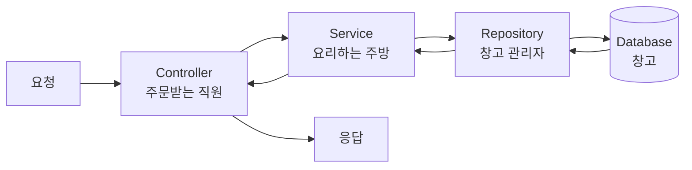

```java
// 1) Controller : 요청을 받고 응답을 돌려주는 창구
@RestController
@RequiredArgsConstructor
public class OrderController {

    private final OrderService orderService;   // 주방에 일을 넘긴다

    @PostMapping("/orders")
    public String order(@RequestBody OrderRequest request) {
        orderService.createOrder(request);
        return "주문 완료";
    }
}

// 2) Service : 실제 비즈니스 로직(요리)이 있는 곳
@Service
@RequiredArgsConstructor
public class OrderService {

    private final OrderRepository orderRepository;

    public void createOrder(OrderRequest request) {
        Order order = new Order(request.getMenu());
        orderRepository.save(order);           // 창고에 기록
    }
}
```

> 지금 단계에서 `@RestController`, `@Service` 같은 것은 "Spring아, 이 클래스 관리해줘"라는 **표시(어노테이션)** 정도로만 이해하면 충분합니다.

---

## 3. 스레드(Thread) — 이번 학습의 진짜 주인공

### 스레드는 "일하는 직원 1명"입니다

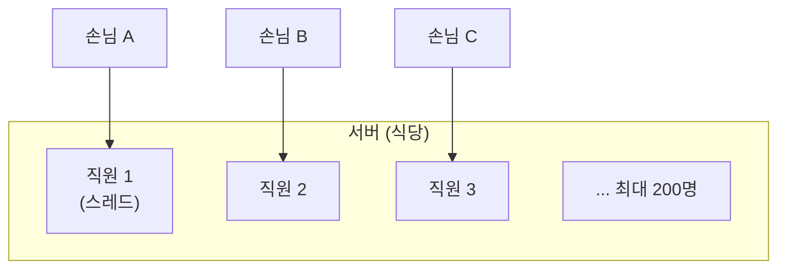

Spring(Tomcat) 서버는 기본적으로 **직원을 200명까지** 둡니다.
그리고 **손님 1명당 직원 1명이 처음부터 끝까지 담당**합니다. 이걸 어려운 말로 `Thread per Request` 모델이라고 합니다.

### 여기서 문제가 생깁니다

직원이 창고(DB)나 옆 가게(외부 API)에 재료를 요청하고 **기다리는 동안, 그 직원은 아무 일도 못 합니다.**

```mermaid
gantt
    title 직원 1명의 하루 (문제 상황)
    dateFormat X
    axisFormat %s
    section 직원 1
    주문 받기 (0.01초)      :0, 1
    옆 가게 응답 기다리기 (0.5초) :1, 50
    서빙 (0.01초)          :50, 51
```

**0.5초 동안 직원은 멍하니 서 있습니다.** 그 사이 손님이 몰려오면?

```
직원 200명 × 각자 0.5초씩 대기
→ 1초에 처리 가능한 손님 = 400명
→ 401번째 손님부터 문 앞에서 대기
→ 대기 줄이 길어짐 → 손님이 떠남 (타임아웃)
→ 서버 장애
```

중요한 포인트: **요리 실력(CPU)이 부족한 게 아니라, 기다리느라 직원이 없어서 장애가 납니다.**

> **이 문제를 해결하는 것이 바로 "비동기 처리"입니다.**
> 이제 왜 배워야 하는지 감이 오셨을 겁니다.

---

## 4. 헷갈리는 용어 3개만 정리

### 동기(Sync) vs 비동기(Async)

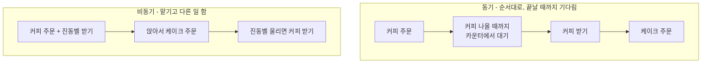

- **동기**: 커피가 나올 때까지 카운터에서 기다리기
- **비동기**: **진동벨**을 받고 자리에 앉아 다른 일 하기

프로그래밍에서 이 "진동벨"에 해당하는 것이 `CompletableFuture`, `Future` 같은 것들입니다.
"결과는 아직 없지만, 준비되면 알려줄 약속(promise)"이라고 이해하면 됩니다.

### 블로킹(Blocking) vs 논블로킹(Non-Blocking)

- **블로킹**: 카운터에 붙잡혀 움직일 수 없는 상태
- **논블로킹**: 자유롭게 다른 일을 할 수 있는 상태

일단은 **"동기 = 기다림 = 비효율", "비동기 = 안 기다림 = 효율"** 정도로 시작해도 괜찮습니다.
정확한 구분은 심화 문서에서 다시 봅니다.

### 병렬(Parallel)

직원 3명이 각각 다른 재료를 **동시에** 가져오는 것입니다.
"기다림을 없애는 것(비동기)"과 "동시에 하는 것(병렬)"은 다르지만, 실무에서는 보통 같이 씁니다.

---

## 5. 대용량 트래픽이란 무엇인가

"트래픽이 많다"는 건 결국 **손님이 한꺼번에 몰린다**는 뜻입니다.

| 상황 | 트래픽 예시 |
|---|---|
| 평상시 서비스 | 초당 10~100 요청 |
| 이벤트/할인 오픈 | 초당 수천~수만 요청 |
| 티켓 예매 오픈 순간 | 초당 수십만 요청 |

이때 쓰는 해결 카드가 크게 3장입니다. 이번 강의는 **1번과 3번**을 다룹니다.

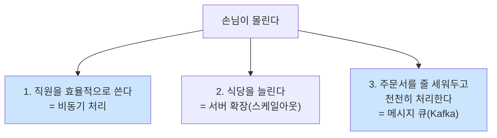

---

## 체크리스트 — 다음 문서로 넘어가기 전에

아래 질문에 내 말로 대답할 수 있으면 준비 완료입니다.

- [ ] 스레드를 식당에 비유하면 무엇인가?
- [ ] 서버 CPU는 한가한데 왜 장애가 날 수 있는가?
- [ ] 동기와 비동기의 차이를 진동벨로 설명할 수 있는가?
- [ ] Controller, Service, Repository는 각각 어떤 역할인가?

---

## 자주 나오는 용어 사전 (계속 참고)

| 용어 | 쉬운 뜻 |
|---|---|
| 스레드(Thread) | 일하는 직원 1명 |
| 스레드 풀(Thread Pool) | 미리 뽑아둔 직원 대기실 |
| I/O | 밖에서 데이터를 가져오거나 보내는 일 (DB, API, 파일) |
| CPU 바운드 | 계산이 오래 걸리는 일 (요리 자체가 오래 걸림) |
| I/O 바운드 | 기다림이 오래 걸리는 일 (재료 배송 대기) |
| 지연시간(Latency) | 손님이 음식 받기까지 걸린 시간 |
| 처리량(TPS/Throughput) | 1초에 손님 몇 명을 처리했는지 |
| 큐(Queue) | 대기 줄 |
| 타임아웃(Timeout) | "이만큼 기다려도 안 오면 포기" 규칙 |
| 어노테이션(@) | Spring에게 주는 메모/지시사항 |


# 1단계. Spring 비동기 처리 — 쉬운 버전

> 목표: `@Async`와 `CompletableFuture`를 딱 필요한 만큼만, 손으로 따라 쳐보기
> 문서 0을 먼저 읽고 오세요.

---

## 1. 비동기가 필요한 딱 2가지 상황

복잡하게 생각하지 마세요. 실무에서 비동기를 쓰는 이유는 사실상 2가지입니다.

### 상황 A. "손님이 안 기다려도 되는 일" — 나중에 처리

주문 완료 후 카카오톡 알림 보내기, 로그 저장하기, 통계 쌓기.
이런 건 손님이 알림 발송이 끝날 때까지 화면 앞에서 기다릴 이유가 없습니다.

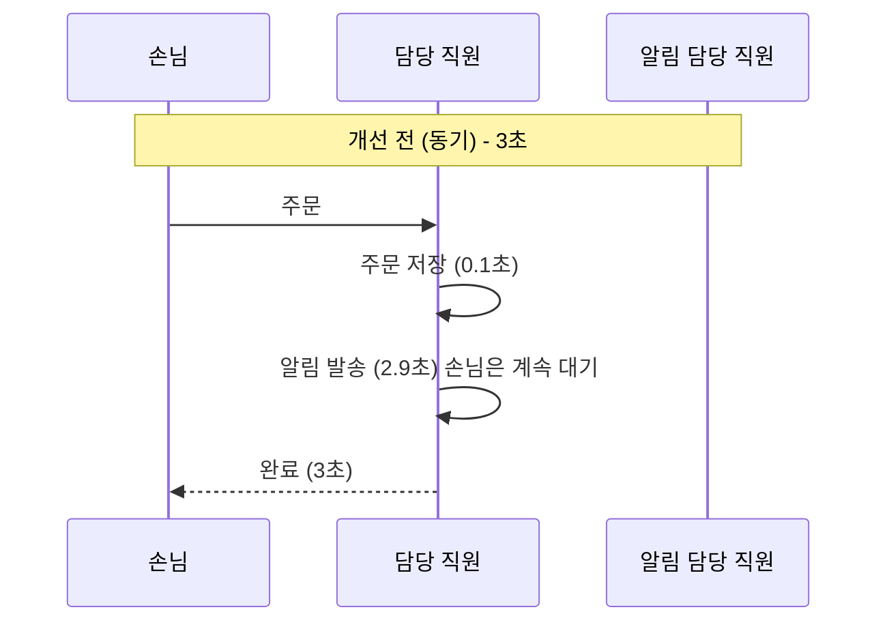

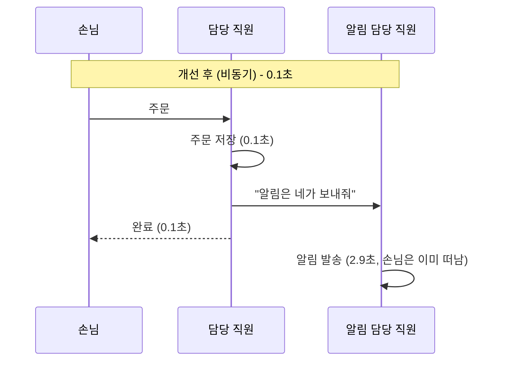

### 상황 B. "따로따로 해도 되는 일" — 동시에 처리

상품 상세 페이지에 상품정보 + 리뷰 + 재고가 필요한데, 서로 상관없는 데이터라면
순서대로 3번 기다릴 필요 없이 **동시에** 가져오면 됩니다.

```
순차: 300ms + 300ms + 300ms = 900ms
동시:        300ms          = 300ms  (3배 빠름)
```

---

## 2. 상황 A 해결하기 — `@Async` 3단계

### 1단계: 스위치 켜기 + 직원 대기실 만들기

```java
@Configuration
@EnableAsync   // ← "이 프로젝트에서 비동기 쓸게요" 스위치 (필수!)
public class AsyncConfig {

    @Bean("myExecutor")   // 이름을 붙여둔다
    public ThreadPoolTaskExecutor myExecutor() {
        ThreadPoolTaskExecutor executor = new ThreadPoolTaskExecutor();

        executor.setCorePoolSize(5);        // 항상 대기하는 직원 5명
        executor.setMaxPoolSize(10);        // 바쁠 때 최대 10명까지
        executor.setQueueCapacity(100);     // 대기 줄은 100칸까지
        executor.setThreadNamePrefix("my-async-");  // 로그에 이름표 붙이기

        executor.initialize();
        return executor;
    }
}
```

이게 **스레드 풀(직원 대기실)** 입니다. 왜 필요할까요?

> 직원이 필요할 때마다 새로 채용(스레드 생성)하면 비용이 큽니다.
> **미리 5명 뽑아두고 계속 재사용**하는 것이 스레드 풀입니다.
> 이걸 안 만들면 Spring이 알아서 하는데, 손님이 몰릴 때 직원을 무한정 뽑아서 서버가 죽습니다.

### 2단계: 비동기로 만들 메서드에 `@Async` 붙이기

```java
@Service
public class NotificationService {

    @Async("myExecutor")   // ← 위에서 만든 대기실의 직원이 처리
    public void sendKakao(Long orderId) {
        // 2.9초 걸리는 알림 발송
        System.out.println("현재 스레드: " + Thread.currentThread().getName());
        // 출력: my-async-1  ← 다른 직원이 일하고 있다는 증거!
    }
}
```

### 3단계: 다른 클래스에서 호출하기

```java
@Service
@RequiredArgsConstructor
public class OrderService {

    private final OrderRepository orderRepository;
    private final NotificationService notificationService;   // 다른 클래스여야 함! (중요)

    @Transactional
    public void createOrder(OrderRequest request) {
        orderRepository.save(new Order(request.getMenu()));   // 주문 저장
        notificationService.sendKakao(orderId);               // 여기서 안 기다리고 바로 넘어감
        // 메서드 종료 → 손님에게 즉시 응답
    }
}
```

### 확인 방법: 로그의 스레드 이름을 보세요

```
[http-nio-8080-exec-1] 주문 저장 완료      ← 손님 담당 직원
[my-async-1] 알림 발송 시작                ← 알림 담당 직원 (다르다!)
```

스레드 이름이 다르면 성공, 같으면 비동기가 동작하지 않은 것입니다.

---

## 3. 초보자가 100% 겪는 함정 3개

### 함정 1. 같은 클래스 안에서 호출하면 동작하지 않습니다

```java
@Service
public class OrderService {

    public void createOrder() {
        sendKakao();      // ❌ 비동기 안 됨! 그냥 순서대로 실행됨
    }

    @Async
    public void sendKakao() { ... }
}
```

**왜?** Spring은 `@Async`가 붙은 클래스를 "대역 배우(프록시)"로 감싸서 비동기를 처리합니다.
같은 클래스 안에서 `sendKakao()`를 부르면 대역 배우를 거치지 않고 **본인이 직접** 실행해버립니다.

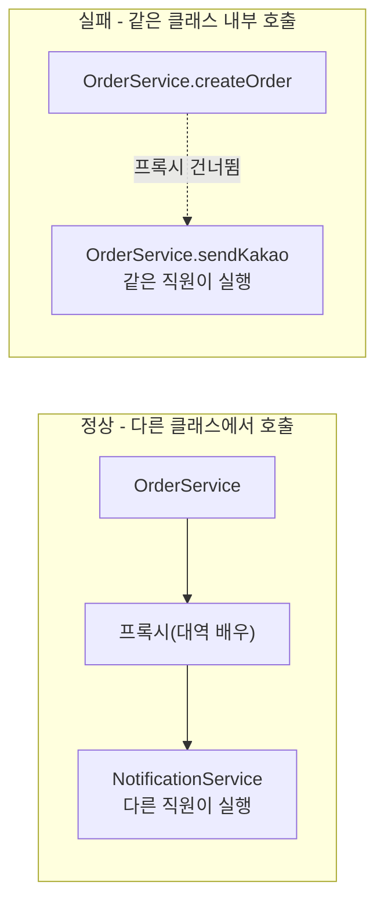

**해결**: 비동기로 만들 메서드는 **별도의 클래스(빈)로 분리**하세요.

### 함정 2. `@EnableAsync`를 안 붙였습니다

스위치를 안 켰으면 `@Async`는 그냥 주석과 같습니다. 아무 에러도 안 나고 조용히 동기 실행됩니다.

### 함정 3. 예외(에러)가 조용히 사라집니다

```java
@Async
public void sendKakao() {
    throw new RuntimeException("발송 실패!");   // 아무도 모른다. 로그도 안 남을 수 있다.
}
```

반환값이 `void`인 비동기 메서드의 예외는 호출한 쪽으로 전달되지 않습니다.
**최소한 try-catch로 로그라도 남기세요.**

```java
@Async("myExecutor")
public void sendKakao(Long orderId) {
    try {
        kakaoClient.send(orderId);
    } catch (Exception e) {
        log.error("알림 발송 실패 orderId={}", orderId, e);   // 이거라도 있어야 원인 파악 가능
    }
}
```

---

## 4. 상황 B 해결하기 — `CompletableFuture` 기초

`CompletableFuture`는 앞에서 말한 **진동벨**입니다.
"결과는 아직 없지만, 다 되면 여기 담아둘게"라는 상자입니다.

### 가장 기본 형태

```java
@Service
@RequiredArgsConstructor
public class ProductService {

    private final ProductClient productClient;
    private final ReviewClient reviewClient;

    @Qualifier("myExecutor")
    private final Executor executor;   // 어느 대기실 직원을 쓸지 지정

    public ProductDetail getDetail(Long id) {

        // 1) 직원 2명에게 동시에 일을 시킨다 (진동벨 2개 받음)
        CompletableFuture<Product> productFuture =
            CompletableFuture.supplyAsync(() -> productClient.find(id), executor);

        CompletableFuture<List<Review>> reviewFuture =
            CompletableFuture.supplyAsync(() -> reviewClient.find(id), executor);

        // 2) 두 진동벨이 모두 울릴 때까지 기다린다
        CompletableFuture.allOf(productFuture, reviewFuture).join();

        // 3) 상자에서 결과 꺼내기
        return new ProductDetail(productFuture.join(), reviewFuture.join());
    }
}
```

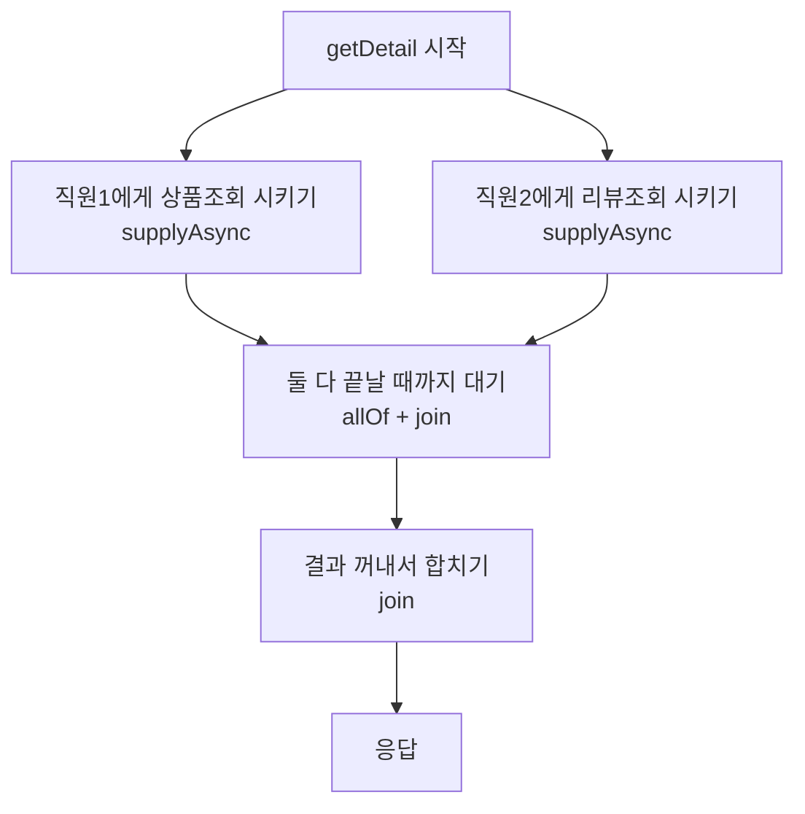

### 외울 것은 딱 4개

| 코드 | 뜻 |
|---|---|
| `supplyAsync(작업, executor)` | 일 맡기기 (결과 있음) |
| `runAsync(작업, executor)` | 일 맡기기 (결과 없음) |
| `join()` | 진동벨 울릴 때까지 기다려서 결과 꺼내기 |
| `allOf(a, b, c)` | 여러 개 전부 끝날 때까지 기다리기 |

### 실수하기 쉬운 점 2가지

```java
// ❌ 이건 병렬이 아닙니다. 하나 끝나고 다음 시작 (순차와 동일)
Product p = CompletableFuture.supplyAsync(() -> productClient.find(id), executor).join();
List<Review> r = CompletableFuture.supplyAsync(() -> reviewClient.find(id), executor).join();

// ✅ 먼저 전부 시작(맡기기)해 놓고, 나중에 한꺼번에 꺼낸다
```

> **핵심 원칙: `join()`은 최대한 늦게 부르세요.** `join()`은 "기다려"라는 뜻이라서,
> 일을 맡기자마자 부르면 비동기의 의미가 사라집니다.

```java
// ❌ executor를 빼먹으면 Java가 공용 직원(commonPool)을 쓴다 → 서비스 전체가 느려질 수 있다
CompletableFuture.supplyAsync(() -> api.call());

// ✅ 항상 내가 만든 대기실을 지정한다
CompletableFuture.supplyAsync(() -> api.call(), executor);
```

---

## 5. 딱 하나만 기억할 표

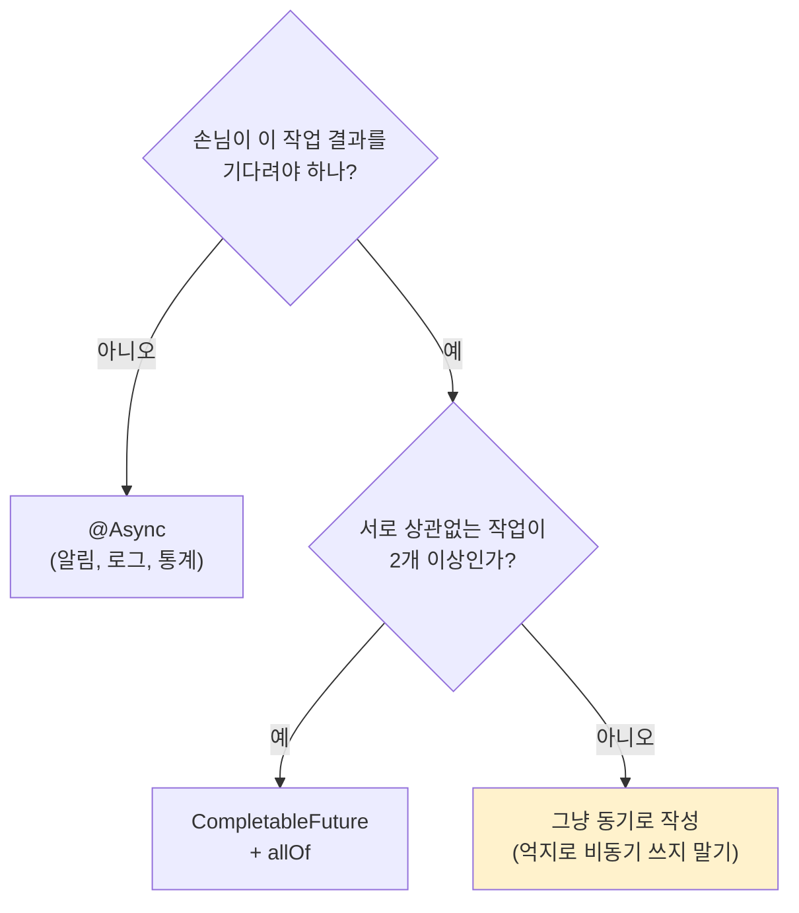

> **중요**: 비동기는 공짜가 아닙니다. 코드가 복잡해지고, 디버깅이 어려워지고, 에러가 숨습니다.
> **필요한 곳에만** 쓰는 것이 실력입니다. "일단 다 비동기로" 는 초보자의 대표적인 실수입니다.

---

## 6. 손으로 해보는 실습 (30분)

### 실습 1. 비동기가 진짜 동작하는지 눈으로 확인

```java
@RestController
@RequiredArgsConstructor
public class TestController {

    private final SlowService slowService;

    @GetMapping("/sync")
    public String sync() {
        long start = System.currentTimeMillis();
        slowService.slowSync();
        return "동기: " + (System.currentTimeMillis() - start) + "ms";
    }

    @GetMapping("/async")
    public String async() {
        long start = System.currentTimeMillis();
        slowService.slowAsync();
        return "비동기: " + (System.currentTimeMillis() - start) + "ms";
    }
}

@Slf4j
@Service
public class SlowService {

    public void slowSync() {
        sleep3sec();
    }

    @Async("myExecutor")
    public void slowAsync() {
        sleep3sec();
    }

    private void sleep3sec() {
        log.info("작업 시작 - 스레드: {}", Thread.currentThread().getName());
        try { Thread.sleep(3000); } catch (InterruptedException e) { }
        log.info("작업 끝");
    }
}
```

기대 결과: `/sync`는 약 3000ms, `/async`는 약 0~5ms.
로그에서 **스레드 이름이 다른 것**도 꼭 확인하세요.

### 실습 2. 함정 재현하기
`slowAsync()`를 같은 클래스 내부에서 호출하도록 바꿔보고, 다시 3000ms로 돌아오는 것을 확인하세요.
직접 겪어보면 절대 잊지 않습니다.

### 실습 3. 병렬 조회
3초 걸리는 메서드 3개를 만들고, 순차 호출(9초)과 `allOf` 병렬 호출(3초)을 비교하세요.

---

## 다음 문서로 넘어가기 전 체크

- [ ] `@EnableAsync`가 왜 필요한지 안다
- [ ] 스레드 풀(대기실)을 직접 만들어야 하는 이유를 안다
- [ ] 같은 클래스 내부 호출이 왜 안 되는지 설명할 수 있다
- [ ] `supplyAsync`와 `join()`의 역할을 안다
- [ ] 비동기를 "쓰지 않아야 할 때"도 있다는 걸 안다

여기까지 이해했다면 심화 문서(`spring-async-guide.md`)의
스레드 풀 상세 튜닝, 트랜잭션 문제, MDC 전파, Virtual Thread로 넘어가세요.
