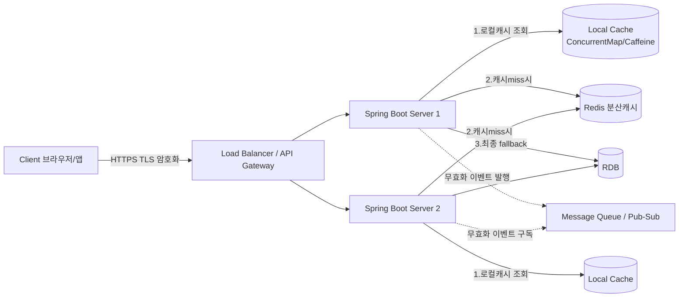
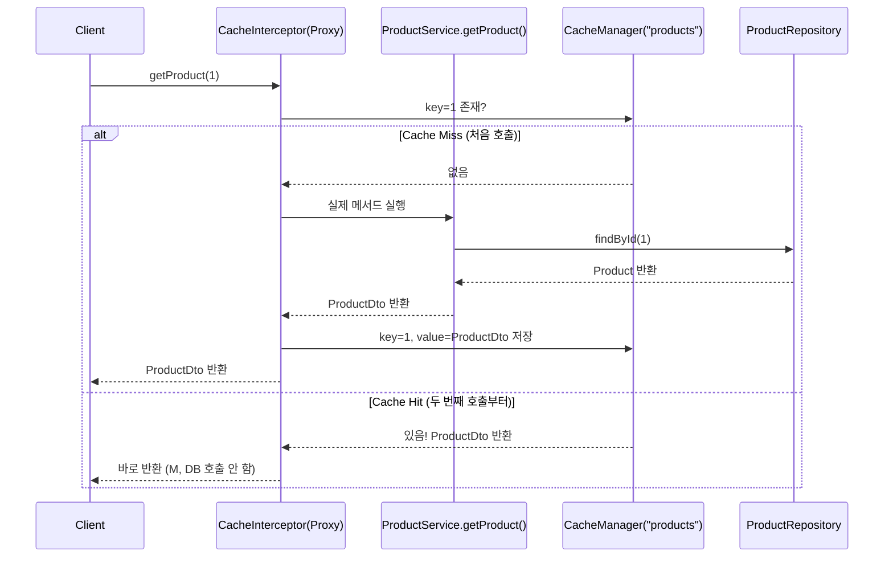
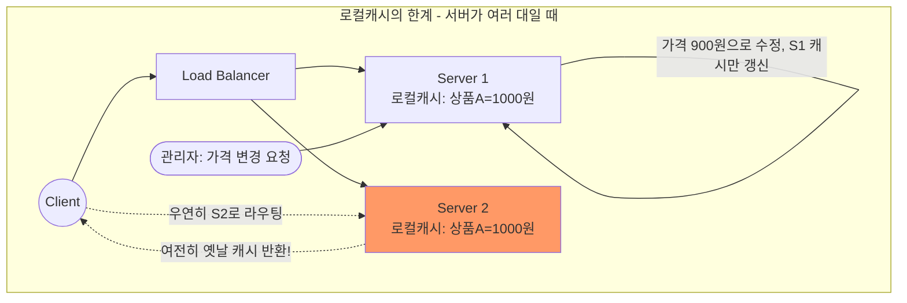
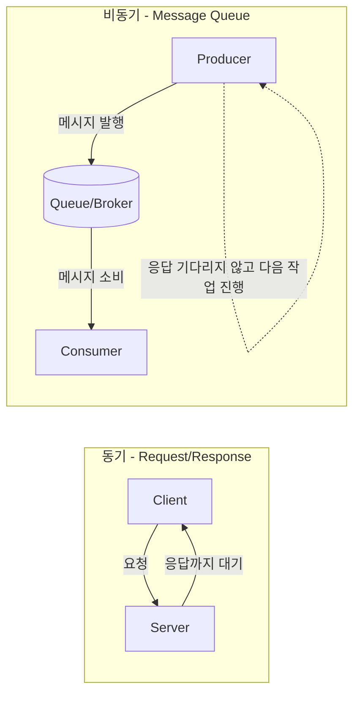
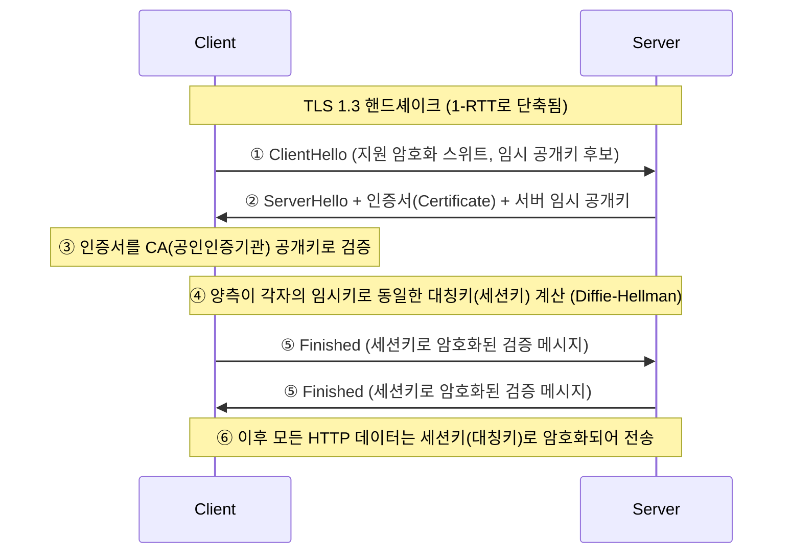
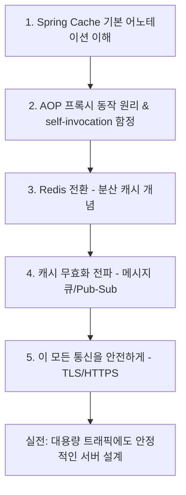

# Spring Cache · Redis · 백엔드 통신 패턴 · HTTPS/프로토콜 

**문서 목적과 전체 로드맵:**

이 네 가지 주제는 겉으로는 서로 다른 강의처럼 보이지만, 사실은 "대용량 트래픽이 몰려도 서비스가 죽지 않게 만드는 방법"이라는 하나의 큰 줄기로 연결되어 있다. 서버에 요청이 몰리면 가장 먼저 DB가 병목이 되는데, 이를 완화하는 첫 번째 무기가 Spring Cache이고, 서버가 여러 대로 늘어나는 순간 로컬 캐시로는 부족해져서 Redis 같은 분산 캐시가 필요해진다. 그런데 캐시된 데이터를 여러 서버·서비스 간에 언제, 어떻게 동기화하고 무효화할 것인가를 결정하는 것이 바로 백엔드 통신 디자인 패턴(동기/비동기, 메시지 큐, Pub/Sub)이며, 이 모든 통신이 인터넷을 거쳐 안전하게 오가려면 HTTPS/TLS 프로토콜에 대한 이해가 필수적이다. 즉 캐시는 "속도"를, 통신 패턴은 "구조"를, 프로토콜은 "안전과 신뢰"를 담당하며, 이 세 가지가 합쳐져야 실무에서 "장애 없이 빠르게 응답하는 서버"를 만들 수 있다.



이 다이어그램이 오늘 배울 내용의 최종 그림이다. 지금부터 이 그림의 각 화살표와 박스가 코드로 어떻게 구현되는지, 그리고 왜 필요한지를 한 줄씩 뜯어본다.

---

**1. Spring Cache — 코드 라인별 완전 분석**

먼저 왜 캐시가 필요한지 코드 관점에서 이해해야 한다. DB 조회는 보통 네트워크 I/O와 디스크 I/O를 포함하기 때문에 밀리초 단위가 아니라 수십~수백 밀리초가 걸릴 수 있다. 초당 수천 건의 요청이 동일한 데이터(예: 인기 상품 상세정보)를 조회한다면, 매번 DB를 두드리는 것은 명백한 자원 낭비이자 장애 유발 요인이다. Spring Cache는 이 반복되는 조회 결과를 메모리(또는 외부 저장소)에 잠깐 저장해두고, 같은 요청이 오면 DB를 건너뛰고 즉시 응답하게 만들어주는 추상화 계층이다. 핵심은 "추상화"라는 단어인데, 실제 캐시 저장소가 무엇이든(ConcurrentHashMap, Caffeine, Redis, EhCache) 개발자는 동일한 어노테이션만 붙이면 되도록 설계되어 있다.

**1-1. 기본 설정 코드**

```java
@SpringBootApplication
@EnableCaching   // ① 이 어노테이션이 없으면 @Cacheable 등은 그냥 무시된다
public class CacheDemoApplication {
    public static void main(String[] args) {
        SpringApplication.run(CacheDemoApplication.class, args);
    }
}
```

① `@EnableCaching`은 Spring이 내부적으로 `CacheInterceptor`라는 AOP 어드바이스를 빈으로 등록하게 만드는 스위치다. 이게 없으면 아래에서 아무리 `@Cacheable`을 붙여도 프록시가 생성되지 않아서 캐시 로직이 전혀 동작하지 않는다. 초급 개발자가 가장 많이 실수하는 지점이 바로 이 어노테이션을 빠뜨리고 "캐시가 안 먹혀요"라고 질문하는 경우다.

```java
@Configuration
public class CacheConfig {

    @Bean
    public CacheManager cacheManager() {                    // ①
        ConcurrentMapCacheManager cacheManager
            = new ConcurrentMapCacheManager("products", "users"); // ②
        return cacheManager;
    }
}
```

① `CacheManager`는 캐시 저장소를 생성·관리하는 총괄 매니저 인터페이스다. Spring은 이 인터페이스의 구현체만 바꿔주면 되므로 나중에 Redis로 교체할 때 비즈니스 코드(Service)는 한 줄도 건드릴 필요가 없다는 점이 핵심 장점이다. ② `ConcurrentMapCacheManager`는 내부적으로 `ConcurrentHashMap`을 사용하는 가장 단순한 로컬 캐시 구현체이며, 생성자에 넘긴 문자열("products", "users")은 캐시 이름(namespace)으로, 뒤에서 `@Cacheable(value = "products")`처럼 참조된다. 실무에서는 이 자리에 만료시간(TTL)과 최대 개수를 지정할 수 있는 `CaffeineCacheManager`를 훨씬 더 많이 쓴다.

**1-2. @Cacheable — 조회 결과 캐싱**

```java
@Service
@RequiredArgsConstructor
public class ProductService {

    private final ProductRepository productRepository;

    @Cacheable(value = "products", key = "#productId")        // ①②
    public ProductDto getProduct(Long productId) {
        System.out.println("DB 조회 발생: " + productId);     // ③
        Product product = productRepository.findById(productId)
            .orElseThrow(() -> new NoSuchElementException("상품 없음"));
        return ProductDto.from(product);
    }
}
```

① `value = "products"`는 이 메서드의 결과가 저장될 캐시 저장소의 이름을 지정한다. 앞서 만든 `CacheManager`에 등록된 캐시 이름과 정확히 일치해야 한다. ② `key = "#productId"`는 SpEL(Spring Expression Language) 문법으로, 메서드의 파라미터 `productId` 값을 캐시 키로 사용하겠다는 의미다. 키를 지정하지 않으면 Spring은 기본적으로 모든 파라미터를 조합한 `SimpleKey`를 생성하는데, 파라미터가 여러 개일 때 원하지 않는 방식으로 키가 만들어질 수 있어 실무에서는 key를 명시적으로 지정하는 습관이 중요하다.

③ 이 `System.out.println`이 이 코드 전체에서 가장 중요한 검증 포인트다. 같은 `productId`로 이 메서드를 두 번 호출했을 때, 첫 번째 호출에서는 이 로그가 출력되고 두 번째 호출에서는 출력되지 않아야 정상이다. 이것이 바로 캐시 히트(cache hit)가 발생했다는 증거이며, 실무 면접에서 "캐시가 제대로 동작하는지 어떻게 검증하나요"라는 질문에 바로 이 방식(로그/DB 쿼리 카운트 확인)으로 답하면 된다.



이 시퀀스 다이어그램이 왜 중요한지 설명하면, `@Cacheable`은 실제로 우리가 작성한 `ProductService` 객체를 직접 호출하는 것이 아니라, Spring이 런타임에 만들어주는 프록시(Proxy) 객체를 거쳐서 호출된다는 점이다. 이 프록시가 "캐시에 있으면 원본 메서드를 아예 호출하지 않고 캐시값을 반환"하는 게이트키퍼 역할을 한다. 이 구조를 알고 있어야 뒤에서 설명할 "self-invocation 함정"을 이해할 수 있다.

**1-3. @CachePut — 항상 실행하고 캐시도 갱신**

```java
@CachePut(value = "products", key = "#result.id")   // ①
public ProductDto updateProduct(Long productId, UpdateRequest request) {
    Product product = productRepository.findById(productId)
        .orElseThrow();
    product.update(request.getName(), request.getPrice());   // ②
    return ProductDto.from(product);                          // ③
}
```

`@CachePut`은 `@Cacheable`과 다르게 캐시 존재 여부를 확인하지 않고 메서드를 무조건 실행한 뒤, 그 결과를 캐시에 덮어쓴다. ① `#result.id`는 메서드가 반환한 값(result)의 id 필드를 키로 쓴다는 뜻인데, `@CachePut`에서만 사용할 수 있는 특수 변수(`#result`)다. ② 실제 DB 업데이트가 일어나고 ③ 갱신된 최신 데이터가 반환되면서 그 값 그대로 캐시에 저장된다. 이 어노테이션이 왜 필요한지 생각해보면, 데이터를 수정하는 API인데 캐시는 여전히 옛날 값을 들고 있으면 사용자가 새로고침해도 오래된 정보를 보게 되는 심각한 버그가 되기 때문이다.

**1-4. @CacheEvict — 캐시 무효화**

```java
@CacheEvict(value = "products", key = "#productId")   // ①
public void deleteProduct(Long productId) {
    productRepository.deleteById(productId);
}

@CacheEvict(value = "products", allEntries = true)     // ②
public void clearAllProductCache() {
    // 메서드 바디가 비어있어도 동작함. 캐시 전체 삭제가 목적.
}
```

① 특정 키 하나만 캐시에서 제거하는 가장 흔한 패턴이다. 상품을 삭제했는데 캐시에는 여전히 그 상품 정보가 남아있으면 "삭제했는데 계속 조회된다"는 치명적 버그로 이어지므로, 삭제 로직에는 반드시 `@CacheEvict`를 함께 붙여야 한다. ② `allEntries = true`는 해당 캐시 이름(products) 안의 모든 데이터를 통째로 지운다는 뜻으로, 대량 갱신 배치 작업 이후 캐시를 리셋할 때 사용한다.

**1-5. 초급 개발자가 반드시 알아야 할 3가지 함정**

캐시를 배울 때 이론만 알고 실무에 들어가면 반드시 부딫히는 함정들이 있는데, 첫 번째는 self-invocation 문제로, 같은 클래스 안에서 `this.getProduct()`처럼 자기 자신의 캐시 메서드를 호출하면 프록시를 거치지 않기 때문에 캐시가 전혀 동작하지 않는다는 점이다. 이는 앞서 시퀀스 다이어그램에서 본 것처럼 캐시 로직이 프록시 계층에 있기 때문에 발생하는 근본적인 구조적 한계이며, 반드시 다른 빈을 주입받아 호출하거나 `AopContext.currentProxy()`를 활용해야 해결된다. 두 번째는 캐시 스탬피드(Cache Stampede)라 불리는 현상으로, 인기 데이터의 캐시가 만료되는 순간 동시에 수백~수천 개의 요청이 한꺼번에 DB로 몰려가 DB가 다운되는 상황을 가리키며, 이를 막기 위해 `@Cacheable(sync = true)` 옵션으로 캐시 갱신 중에는 단 하나의 스레드만 원본 메서드를 실행하도록 제한할 수 있다. 세 번째는 반환 타입 직렬화 문제로, 캐시에 저장하는 객체가 `Serializable`을 구현하지 않으면 (특히 Redis로 전환할 때) 런타임 예외가 발생하므로 DTO 설계 단계에서부터 이를 고려해야 한다.

**1-6. 왜 배워야 하는가 — 현업 관점**

현업에서 캐시를 도입하는 이유는 단순히 "빠르게" 하기 위해서가 아니라, DB라는 가장 비싼 자원을 보호하기 위해서다. 실제 장애 사례를 보면 이벤트 트래픽이 몰릴 때 DB CPU가 100%에 도달해 전체 서비스가 마비되는 경우가 흔한데, 조회 API 앞단에 캐시 한 줄만 넣어도 DB 부하를 절반 이상 줄일 수 있는 경우가 많다. 그래서 신입 개발자 면접에서도 "N+1 문제를 해결한 경험"과 "캐시를 도입한 경험"은 거의 필수로 물어보는 질문이며, 단순히 어노테이션 이름을 아는 것을 넘어 "왜 이 시점에 캐시가 무효화되어야 하는지"를 설명할 수 있어야 진짜 실력으로 인정받는다.

---

**2. Redis — Spring Cache의 다음 단계, 로컬 캐시의 한계 극복**

`ConcurrentMapCacheManager`나 `Caffeine` 같은 로컬 캐시는 해당 JVM(서버 프로세스) 안에서만 존재한다는 근본적 한계가 있다. 서버가 한 대일 때는 문제가 없지만, 트래픽이 늘어나 서버를 2대, 3대로 스케일 아웃하는 순간 심각한 데이터 불일치 문제가 발생한다.



이 그림처럼 로드밸런서가 요청을 무작위로 분산시키기 때문에, Server 1에서 가격을 수정해 캐시를 갱신해도 Server 2의 로컬 캐시는 갱신되지 않은 채로 남아 사용자에게 서로 다른 가격을 보여주는 버그가 발생한다. 이것이 바로 Redis 같은 "중앙 집중형 분산 캐시"가 필요한 이유다.

**2-1. Redis 적용 코드**

```java
@Configuration
public class RedisCacheConfig {

    @Bean
    public RedisCacheManager cacheManager(RedisConnectionFactory factory) {  // ①

        RedisCacheConfiguration config = RedisCacheConfiguration
            .defaultCacheConfig()
            .entryTtl(Duration.ofMinutes(10))                               // ②
            .serializeValuesWith(
                RedisSerializationContext.SerializationPair.fromSerializer(
                    new GenericJackson2JsonRedisSerializer()))              // ③
            .disableCachingNullValues();                                   // ④

        return RedisCacheManager.builder(factory)
            .cacheDefaults(config)
            .build();
    }
}
```

① `RedisConnectionFactory`는 Spring Data Redis가 자동으로 만들어주는 Redis 서버 연결 객체이며, `application.yml`에 `spring.data.redis.host`, `port`를 지정하면 자동 주입된다. ② `entryTtl(Duration.ofMinutes(10))`은 캐시 데이터가 10분 뒤 자동 만료되도록 설정하는 부분으로, 로컬 캐시와 달리 Redis는 TTL을 저장소 레벨에서 관리해주기 때문에 개발자가 만료 로직을 직접 짤 필요가 없다는 게 큰 장점이다. ③ `GenericJackson2JsonRedisSerializer`는 Java 객체를 JSON 문자열로 직렬화해서 Redis(문자열/바이너리 기반 저장소)에 저장할 수 있게 변환해주는 역할로, 앞서 언급한 "직렬화 문제"가 실제로 여기서 명시적으로 드러난다. ④ null 값은 캐시하지 않도록 막아 불필요한 캐시 오염과 캐시 펀치(Cache Penetration, 존재하지 않는 데이터를 계속 조회해서 캐시가 무의미해지는 상황)의 일부를 예방한다.

여기서 가장 중요하게 짚어야 할 지점은, 앞의 `ProductService` 코드는 `@Cacheable(value = "products", key = "#productId")`로 **한 글자도 수정하지 않았다**는 사실이다. `CacheManager` 구현체(로컬 → Redis)만 바꿨을 뿐인데 비즈니스 코드는 전혀 손대지 않아도 된다는 것이 Spring Cache 추상화의 진짜 위력이며, 처음에 배운 어노테이션 방식을 제대로 이해해두면 나중에 Redis로 넘어갈 때 학습 비용이 거의 들지 않는다.

**2-2. 로컬 캐시 vs Redis 장단점 비교**

| 구분 | 로컬 캐시 (ConcurrentMap/Caffeine) | Redis (분산 캐시) |
|---|---|---|
| 속도 | 매우 빠름 (네트워크 홉 없음, 마이크로초 단위) | 로컬보다 느림 (네트워크 왕복 발생, 밀리초 단위) |
| 다중 서버 일관성 | 서버별로 따로 존재 → 불일치 발생 | 모든 서버가 하나의 캐시를 공유 → 일관성 보장 |
| 인프라 비용 | 추가 인프라 없음, 설정 간단 | 별도의 Redis 서버/클러스터 운영 필요 |
| 메모리 관리 | 애플리케이션 서버 메모리 사용 (부담 증가) | 별도 서버에서 메모리 관리 (앱 서버 부담 없음) |
| 장애 시 영향 | 서버 하나만 영향받음 | Redis 장애 시 전체 서비스 캐시 영향 (이중화 필요) |
| 기능 확장성 | 단순 키-값 저장 위주 | Pub/Sub, 분산 락, 정렬셋, TTL 관리 등 다양한 자료구조 지원 |
| 적합한 상황 | 서버 1대 운영, 소규모 서비스, 변경이 거의 없는 정적 데이터 | 서버 여러 대(스케일 아웃) 운영, 실시간성 강한 데이터, 세션 공유 필요 시 |

실무 판단 기준을 한 문장으로 정리하면, "서버가 한 대뿐이고 트래픽이 크지 않다면 로컬 캐시로 충분하지만, 서버를 2대 이상 운영하거나 트래픽이 대규모라면 데이터 일관성 때문에 Redis가 거의 필수"라고 이해하면 된다. 또한 두 가지를 함께 쓰는 계층형 캐시(로컬 캐시를 1차, Redis를 2차로 두는 전략)도 대규모 서비스에서 흔히 사용하는 패턴이라는 점도 알아두면 좋다.

---

**3. 백엔드 통신 디자인 패턴 — 캐시된 데이터를 서버 간에 어떻게 주고받는가**

Redis를 도입해서 여러 서버가 캐시를 공유한다 해도, 캐시를 무효화하거나 갱신해야 하는 "이벤트"를 서버들 사이에서 어떻게 전달할지는 별도의 문제다. 이때 필요한 것이 백엔드 통신 디자인 패턴에 대한 이해다.



**3-1. 동기(Synchronous) 요청-응답 패턴**

```java
@GetMapping("/products/{id}")
public ResponseEntity<ProductDto> getProduct(@PathVariable Long id) {   // ①
    ProductDto product = productService.getProduct(id);                 // ②
    return ResponseEntity.ok(product);                                  // ③
}
```

① 클라이언트가 HTTP GET 요청을 보내면 ② 서버 스레드가 `productService.getProduct(id)`가 끝날 때까지 블로킹(대기) 상태로 멈춰 있다가 ③ 결과가 나와야만 응답을 보낸다. 이것이 우리가 지금까지 짠 대부분의 REST API가 사용하는 동기식 요청-응답 패턴이며, 구현이 간단하고 디버깅이 쉽다는 장점이 있지만 응답이 오래 걸리는 작업(대량 이메일 발송, 이미지 처리 등)에는 스레드가 오래 점유되어 서버 자원을 낭비한다는 단점이 있다.

**3-2. 비동기 + 메시지 큐 패턴 (캐시 무효화 전파의 실전 사례)**

```java
@Service
@RequiredArgsConstructor
public class ProductUpdateService {

    private final ProductRepository productRepository;
    private final KafkaTemplate<String, CacheEvictEvent> kafkaTemplate;   // ①

    @CachePut(value = "products", key = "#result.id")
    public ProductDto updateProduct(Long productId, UpdateRequest request) {
        Product product = productRepository.findById(productId).orElseThrow();
        product.update(request.getName(), request.getPrice());
        ProductDto dto = ProductDto.from(product);

        kafkaTemplate.send("cache-evict-topic",
            new CacheEvictEvent("products", productId));                 // ②
        return dto;
    }
}

@Component
@RequiredArgsConstructor
public class CacheEvictListener {

    private final CacheManager cacheManager;

    @KafkaListener(topics = "cache-evict-topic")                          // ③
    public void onEvictEvent(CacheEvictEvent event) {
        cacheManager.getCache(event.getCacheName())
            .evict(event.getKey());                                      // ④
    }
}
```

① `KafkaTemplate`은 메시지 브로커(Kafka)에 메시지를 발행(publish)하는 역할을 하며, 이런 구조를 발행-구독(Publish-Subscribe) 패턴이라고 부른다. ② Server 1에서 상품 가격을 수정한 뒤, "캐시를 지워야 한다"는 이벤트를 큐에 던져놓고 응답을 즉시 돌려준다(요청자가 이벤트 전파 완료를 기다리지 않는다는 점에서 비동기적이다). ③ 이 토픽을 구독하고 있는 Server 2, Server 3의 리스너가 각자 이 이벤트를 수신해서 ④ 자기 자신의 로컬 캐시(또는 Redis 캐시)에서 해당 키를 지운다. 이 패턴이 바로 앞서 Redis 섹션에서 다룬 "여러 서버 간 캐시 불일치 문제"를 근본적으로 해결하는 실전 아키텍처이며, Redis의 Pub/Sub 기능을 직접 사용하거나 Kafka/RabbitMQ 같은 메시지 브로커를 사용하는 두 가지 방식이 실무에서 모두 쓰인다.

이 패턴을 배워야 하는 이유는, 캐시라는 것이 결국 "원본 데이터의 복사본"이기 때문에 원본이 바뀌었을 때 모든 복사본에게 이 소식을 알려야 하는 문제(캐시 무효화 전파, Cache Invalidation Propagation)가 필연적으로 발생하고, 이 문제는 동기 방식으로는 서버 대수가 늘어날수록 응답 지연이 누적되어 해결이 불가능하기 때문이다. 그래서 신입 개발자도 "동기/비동기가 뭔지"뿐 아니라 "왜 비동기 메시지 큐가 대규모 시스템에서 필수인지"를 캐시 사례와 함께 설명할 수 있어야 실무형 개발자로 인정받는다.

---

**4. 프로토콜과 HTTPS 이해하기 — 이 모든 통신이 안전하게 오가는 원리**

지금까지 서버와 서버, 클라이언트와 서버 사이에 데이터가 오가는 모든 통신은 실제로는 인터넷이라는 공용 네트워크를 거친다. 이때 데이터가 평문(암호화되지 않은 텍스트)으로 흘러가면 중간에서 누구나 가로채 볼 수 있기 때문에, HTTP가 아닌 HTTPS(HTTP + TLS 암호화)를 사용해야 한다.



이 그림에서 ①번 `ClientHello`는 클라이언트가 "나는 이런 암호화 방식들을 지원해"라고 알리는 첫 인사이며, ②번에서 서버는 자신의 신원을 증명하는 인증서(Certificate)를 함께 보낸다. ③번이 실무에서 가장 자주 오해하는 부분인데, 이 인증서는 서버가 스스로 만든 것이 아니라 신뢰할 수 있는 제3의 기관(CA, Certificate Authority)이 서명해준 것이고, 클라이언트(브라우저)는 이미 내장하고 있는 CA의 공개키로 이 서명이 위조되지 않았는지 검증한다. ④번에서는 Diffie-Hellman 키 교환이라는 수학적 알고리즘을 통해 양측이 네트워크로 실제 비밀키를 주고받지 않고도 동일한 대칭키(세션키)를 각자 독립적으로 계산해낼 수 있다는 점이 핵심이며, 이것이 바로 "공개키로 시작해서 결국 대칭키로 통신을 마무리하는" HTTPS의 원리다. ⑤, ⑥번처럼 핸드셰이크가 끝난 뒤부터의 모든 실제 데이터(로그인 정보, 결제 정보, API 요청/응답 전체)는 이 대칭키로 암호화되어 전송되므로 중간에서 가로채도 내용을 알아볼 수 없다.

**4-1. Spring Boot에서 HTTPS 설정 코드**

```yaml
server:
  port: 8443
  ssl:
    enabled: true                                    # ①
    key-store: classpath:keystore.p12                # ②
    key-store-password: ${SSL_KEYSTORE_PASSWORD}      # ③
    key-store-type: PKCS12
    key-alias: myapp
```

① `ssl.enabled: true`는 내장 톰캣이 순수 HTTP 대신 TLS 위에서 동작하도록 켜는 스위치다. ② `key-store`는 서버의 개인키와 인증서를 함께 담고 있는 파일(keystore)의 위치로, 앞의 시퀀스 다이어그램에서 ②번 단계에 서버가 제시하는 인증서가 바로 여기서 나온다. ③ 비밀번호를 환경변수로 분리한 것은 소스코드에 민감정보를 하드코딩하지 않기 위한 실무 관례이며, 이는 보안 관점에서 신입 개발자가 반드시 습관화해야 하는 부분이다.

**4-2. 왜 이걸 배워야 하는가 — 캐시/통신 패턴과의 연결**

HTTP 자체에도 캐시 관련 헤더(`Cache-Control`, `ETag`, `Last-Modified`)가 있는데, 이는 지금까지 배운 서버 내부의 Spring Cache/Redis와는 별개로 "브라우저나 CDN이 응답을 저장해두고 재사용"하게 만드는 또 다른 계층의 캐시다. 그리고 TLS 핸드셰이크는 매 요청마다 새로 하면 비용이 크기 때문에, TLS 세션 재사용(Session Resumption)이라는 기법으로 "이전에 계산한 세션키 정보를 캐시해두고 재사용"하는데, 이것 역시 넓은 의미에서 캐싱의 한 형태라는 점에서 오늘 배운 네 가지 주제가 결국 "무엇을 어떻게 저장하고 재사용해서 성능을 높이는가"라는 하나의 철학으로 수렴한다는 것을 알 수 있다. 실무에서는 로드밸런서나 API 게이트웨이 단계에서 TLS를 종료(TLS Termination)시키고 내부 서버 간에는 평문 HTTP를 쓰는 구조도 흔히 사용하므로, "TLS가 어디서 끝나고 어디부터 평문인지"를 그림으로 그릴 수 있는 능력이 백엔드 개발자에게 요구된다.

---

**5. 종합 정리 — 현업 체크리스트와 학습 로드맵**

| 학습 주제 | 현업에서 실제로 쓰이는 상황 | 초급 개발자가 자주 틀리는 부분 |
|---|---|---|
| Spring Cache | 조회 API 응답속도 개선, DB 부하 감소 | self-invocation, 캐시 미갱신(수정 API에 @CacheEvict 누락) |
| Redis | 서버 스케일 아웃 시 캐시 일관성 확보, 세션 공유 | 직렬화 오류, TTL 미설정으로 메모리 누수 |
| 백엔드 통신 패턴 | 캐시 무효화 이벤트 전파, 대량 배치 작업 처리 | 동기 방식으로 무거운 작업을 처리해 스레드 고갈 |
| HTTPS/TLS | 모든 프로덕션 API, 결제/로그인 구간 보안 | 인증서 갱신 주기 관리 누락, 내부망도 평문이라 안전하다는 오해 |


