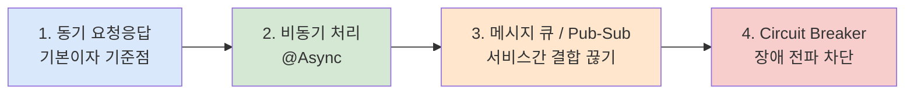
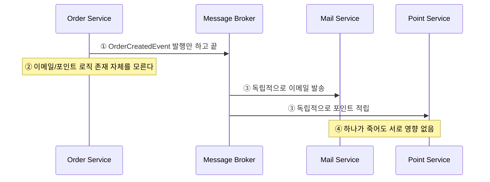
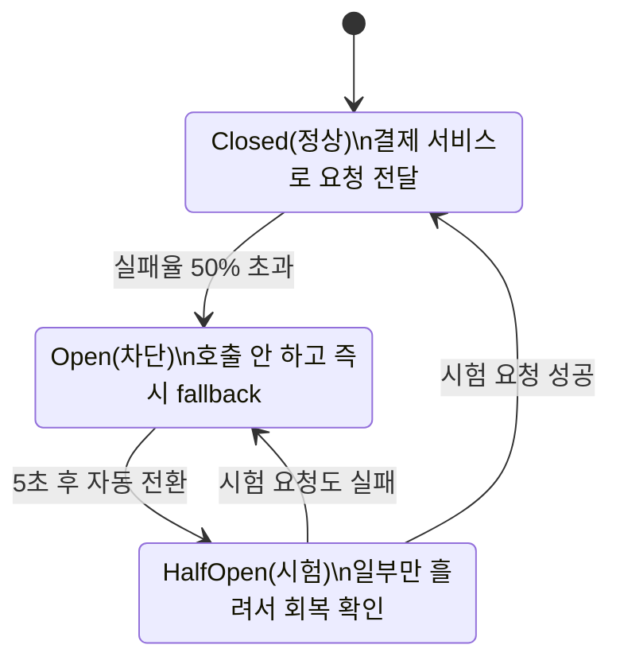
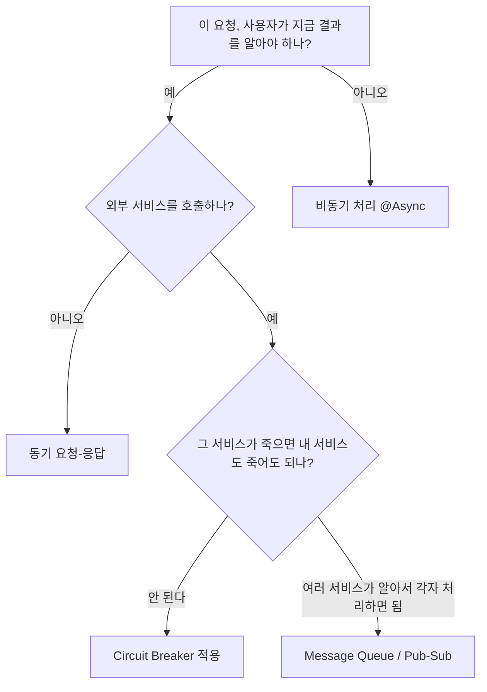

# 백엔드 통신 디자인 패턴 — 현업 필수 패턴만 압축 정리

**왜 이 4가지만 남겼는가:**

실무 채용공고와 실제 협업 현장에서 반복적으로 요구되는 패턴은 사실 그리 많지 않다. Polling이나 Long Polling, WebSocket, Saga 패턴은 알아두면 좋지만 매일 쓰는 도구는 아니다. 반면 아래 네 가지, 즉 동기 요청-응답의 한계를 아는 것, 무거운 작업을 비동기로 빼는 것, 서비스 간 결합을 끊는 메시지 큐, 그리고 장애가 전염되지 않게 막는 Circuit Breaker는 신입 개발자가 실무에 투입되는 순간부터 매주 마주치는 개념이다. 이 문서는 이 네 가지만 깊게 파고, 각 패턴을 "왜 지금 이걸 써야 하는가"라는 판단 기준까지 코드로 설명한다.



이 순서 자체가 실무에서 트래픽과 서비스 규모가 커질 때 겪는 성장 단계와 정확히 일치한다. 처음엔 동기 API 하나로 시작해서, 트래픽이 늘면 무거운 작업을 비동기로 빼고, 서비스가 여러 개로 쪼개지면 메시지 큐로 서로를 분리하고, 마지막으로 그 연결들이 서로의 장애로부터 안전하도록 Circuit Breaker를 씌우는 흐름이다.

---

**1. 동기(Synchronous) 요청-응답 — 모든 것의 기준점**

가장 먼저 확실히 이해해야 하는 것은, 지금까지 짜온 대부분의 REST API가 전부 이 방식이라는 사실이다. 여기서 중요한 것은 "이게 나쁘다"가 아니라 "이 방식의 한계가 어디서 시작되는지"를 아는 것이다.

```java
@RestController
@RequiredArgsConstructor
public class OrderController {

    private final OrderService orderService;

    @PostMapping("/orders")
    public ResponseEntity<OrderResponse> createOrder(@RequestBody OrderRequest request) {
        OrderResponse response = orderService.createOrder(request);   // ①
        return ResponseEntity.ok(response);                            // ②
    }
}
```

① 요청을 처리하는 스레드는 `orderService.createOrder()` 내부의 DB insert, 검증, 계산이 전부 끝날 때까지 그 자리에 멈춰서 기다린다(blocking). ② 결과가 나와야만 다음 줄로 넘어가 응답을 만든다. 이 구조는 코드가 짜기 쉽고 디버깅이 직관적이라는 확실한 장점이 있어서 실무에서도 여전히 API의 80% 이상은 이 방식으로 짠다. 다만 하나의 요청이 오래 걸릴수록 하나의 스레드가 그만큼 오래 묶여있게 되고, Tomcat 기본 스레드풀(보통 200개)이 전부 다 이런 식으로 묶이면 그 뒤로 들어오는 요청은 처리할 스레드가 없어 대기하다 타임아웃이 나는 장애로 이어진다. 이 한계를 정확히 인지하는 것이 바로 다음 패턴(비동기)을 왜 배우는지에 대한 답이 된다.

**언제 동기를 쓰는가:** 사용자가 그 자리에서 결과를 반드시 봐야 하는 경우(로그인, 결제 승인 여부, 단순 조회)는 무조건 동기로 처리해야 한다. 비동기로 만들면 사용자는 "성공했는지도 모르는" 불안한 화면을 보게 된다.

---

**2. 비동기(@Async) 처리 — 무거운 후속 작업 분리**

```java
@PostMapping("/orders")
public ResponseEntity<OrderAcceptedResponse> createOrder(@RequestBody OrderRequest request) {
    OrderResponse response = orderService.createOrder(request);        // ① 핵심 로직은 동기로 확정
    notificationService.sendOrderCompleteMailAsync(response);          // ② 후속 작업만 비동기로 분리
    return ResponseEntity.ok(response);
}
```

```java
@Service
public class NotificationService {

    @Async                                                              // ③
    public void sendOrderCompleteMailAsync(OrderResponse response) {
        mailSender.send(response.getUserEmail(), "주문이 완료되었습니다.");  // ④
    }
}
```

```java
@Configuration
@EnableAsync                                                            // ⑤
public class AsyncConfig {

    @Bean(name = "mailExecutor")
    public Executor mailExecutor() {
        ThreadPoolTaskExecutor executor = new ThreadPoolTaskExecutor();
        executor.setCorePoolSize(5);                                    // ⑥
        executor.setMaxPoolSize(10);
        executor.setQueueCapacity(100);
        executor.initialize();
        return executor;
    }
}
```

① 주문 생성 자체(재고 확인, DB 저장, 결제 연동)는 결과를 반드시 사용자가 알아야 하므로 그대로 동기로 남겨둔다. ② 이메일 발송처럼 "성공하든 실패하든 사용자 응답과는 무관한" 후속 작업만 비동기로 분리하는 것이 핵심 판단 기준이다. ③ `@Async`가 붙은 메서드는 호출한 스레드가 아니라 별도의 스레드풀에서 실행되며, 호출한 쪽(컨트롤러)은 이 메서드가 끝나길 기다리지 않고 즉시 다음 줄(응답 반환)로 진행한다. ④ 실제 메일 발송이 여기서 실행되는데, 이게 3초가 걸리든 5초가 걸리든 사용자는 이미 응답을 받은 뒤이므로 전혀 상관이 없다. ⑤ `@EnableAsync`가 없으면 `@Async`는 그냥 무시되는 어노테이션이 된다는 것을 반드시 기억해야 한다. ⑥ 실무에서 가장 흔한 실수가 기본 `SimpleAsyncTaskExecutor`(요청마다 새 스레드를 무한 생성)를 그대로 쓰는 것인데, 트래픽이 몰리면 스레드가 통제 불가능하게 늘어나 서버가 죽는다. 그래서 반드시 `ThreadPoolTaskExecutor`로 스레드 개수를 제한하는 커스텀 설정을 만들어야 한다.

**현업 판단 기준 한 줄 정리:** "이 작업이 실패해도 사용자가 지금 이 화면에서 알 필요가 없는가?"라는 질문에 예스라면 비동기로 뺄 후보다. 이메일 발송, 알림 푸시, 통계 집계, 로그 적재 등이 대표적이다.

---

**3. 메시지 큐 / Pub-Sub — 서비스 간 결합을 끊는 가장 중요한 패턴**

서비스가 하나뿐일 때는 `@Async`로 충분하다. 하지만 실무에서 서비스가 여러 개(주문, 결제, 재고, 알림)로 나뉘는 순간, 한 서비스가 다른 서비스를 직접 호출하는 구조는 매우 위험해진다. 이것이 채용공고에서 "Kafka/RabbitMQ 경험 우대"가 그토록 자주 등장하는 이유이며, 실무에서 가장 자주 마주치는 통신 패턴이다.



**3-1. 발행(Producer) 코드**

```java
@Service
@RequiredArgsConstructor
public class OrderService {

    private final OrderRepository orderRepository;
    private final KafkaTemplate<String, OrderCreatedEvent> kafkaTemplate;  // ①

    @Transactional
    public OrderResponse createOrder(OrderRequest request) {
        Order order = orderRepository.save(Order.from(request));           // ②

        kafkaTemplate.send("order-created-topic",
            new OrderCreatedEvent(order.getId(), order.getUserId()));      // ③

        return OrderResponse.from(order);                                  // ④
    }
}
```

① `KafkaTemplate`은 메시지 브로커(Kafka)에 이벤트를 던지는 클라이언트다. ② 주문 저장까지는 동기 트랜잭션으로 확실히 처리하고, ③ "주문이 생성됐다"는 사실만 이벤트로 큐에 발행한다. 이 코드에서 절대적으로 중요한 것은 `OrderService`가 메일 서비스나 포인트 서비스를 전혀 알지 못한다는 점이다. ④ 즉시 응답을 반환한다.

**3-2. 구독(Consumer) 코드**

```java
@Component
@RequiredArgsConstructor
public class MailEventListener {

    private final MailService mailService;

    @KafkaListener(topics = "order-created-topic", groupId = "mail-service-group")  // ①
    public void handleOrderCreated(OrderCreatedEvent event) {
        mailService.sendOrderConfirmMail(event.getUserId(), event.getOrderId());    // ②
    }
}
```

① `groupId`가 서로 다른 여러 서비스(mail-service-group, point-service-group)는 같은 이벤트를 각자 독립적으로 받아볼 수 있는데, 이것이 Pub/Sub(발행-구독)의 핵심이다. 하나의 이벤트를 발행하면 구독자가 몇 개든 각자 알아서 처리한다. ② 실제 메일 발송이 실행되는데, 이 메서드가 예외를 던지거나 메일 서버가 다운되어도 이미 완료된 주문 생성과는 완전히 분리되어 있어 사용자는 아무 영향을 받지 않는다.

**왜 반드시 알아야 하는가:** 만약 `OrderService.createOrder()` 안에서 메일 발송, 포인트 적립, 재고 갱신을 전부 직접 호출(동기)로 연결했다면, 그중 단 하나(예: 포인트 서비스)만 느려져도 주문 생성 전체가 지연되거나 실패한다. 메시지 큐로 분리하면 각 서비스가 독립적으로 장애를 겪어도 서로에게 전염되지 않는 장애 격리 효과를 얻는데, 이것이 실무에서 마이크로서비스를 운영하는 회사가 거의 예외 없이 메시지 큐를 도입하는 근본적인 이유다. 신입 면접에서도 "왜 동기 호출 대신 메시지 큐를 썼는지" 설명을 요구하는 경우가 매우 흔하다.

---

**4. Circuit Breaker — 장애가 전염되지 않도록 막는 필수 안전장치**

메시지 큐로 모든 걸 비동기화할 수는 없다. 결제 승인처럼 "지금 당장 결과가 필요한" 동기 호출은 여전히 서비스 간에 존재하고, 이때 상대 서비스가 죽으면 내 서비스까지 함께 무너지는 것을 막아주는 것이 Circuit Breaker다. MSA 환경에서 거의 필수로 요구되는 패턴이며, "왜 서킷 브레이커가 필요한가"는 백엔드 면접 단골 질문이다.



```java
@Service
@RequiredArgsConstructor
public class PaymentClient {

    private final RestClient restClient;

    @CircuitBreaker(name = "paymentService", fallbackMethod = "fallbackPayment")  // ①
    public PaymentResult requestPayment(PaymentRequest request) {
        return restClient.post()
            .uri("http://payment-service/api/pay")
            .body(request)
            .retrieve()
            .body(PaymentResult.class);                                          // ②
    }

    public PaymentResult fallbackPayment(PaymentRequest request, Throwable t) {  // ③
        log.warn("결제 서비스 장애로 fallback 처리: {}", t.getMessage());
        return PaymentResult.pending(request.getOrderId());                      // ④
    }
}
```

```yaml
resilience4j:
  circuitbreaker:
    instances:
      paymentService:
        sliding-window-size: 10          # ⑤ 최근 10번의 호출 기준으로 판단
        failure-rate-threshold: 50        # ⑥ 실패율 50% 넘으면 회로 열림(Open)
        wait-duration-in-open-state: 5s   # ⑦ 5초 뒤 회복됐는지 시험 요청
```

① `@CircuitBreaker`는 이 메서드에 대한 호출을 감시하는 회로를 만든다는 뜻이다. ② 정상 상태(Closed)라면 실제로 결제 서비스에 HTTP 요청을 보낸다. ③④ 만약 실패가 누적되어 회로가 Open 상태가 되면, 실제 호출을 시도조차 하지 않고 곧바로 `fallbackPayment`로 우회하여 "결제 대기 중"처럼 의미 있는 대체 응답을 즉시 돌려준다. ⑤⑥⑦ 최근 10번 중 절반이 실패하면 회로를 열고, 5초 뒤 일부 요청만 흘려서 상대 서비스가 회복됐는지 확인하는 정책이다.

**왜 반드시 필요한가:** 이게 없으면 결제 서비스가 느려질 때 주문 서비스의 모든 스레드가 결제 응답을 기다리며 하나씩 멈추고, 결국 주문 서비스 전체가 응답 불가 상태가 되어 그 위의 프론트엔드나 다른 서비스까지 도미노처럼 장애가 퍼진다. 실패를 빨리 인정하고 자원을 아끼는 것(Fail Fast)이 전체 시스템을 지키는 핵심 원칙이며, 실무에서 이 패턴 없이 MSA를 운영하는 경우는 거의 없다고 봐도 무방하다.

---

**핵심 요약 — 판단 흐름도**



| 패턴 | 실무 등장 빈도 | 핵심 한 줄 | 반드시 외워야 할 코드 키워드 |
|---|---|---|---|
| 동기 요청-응답 | 최고 (기본값) | 즉시 결과가 필요할 때만 | `@RestController`, blocking |
| 비동기 처리 | 매우 높음 | 후속 작업은 응답과 분리 | `@Async`, `@EnableAsync`, `ThreadPoolTaskExecutor` |
| Message Queue/Pub-Sub | MSA 환경에서 필수 | 서비스 간 결합을 끊는다 | `KafkaTemplate`, `@KafkaListener`, `groupId` |
| Circuit Breaker | MSA 환경에서 필수 | 장애가 전염되지 않게 차단 | `@CircuitBreaker`, `fallbackMethod`, `failure-rate-threshold` |

이 네 가지만 코드로 직접 짜보고, "왜 이 순간에 이 패턴을 골랐는지"를 스스로 설명할 수 있게 되면 실무 투입 시점에 가장 자주 마주치는 설계 판단의 8~9할은 이미 준비가 된 것이다. Polling, WebSocket, Saga 같은 나머지 패턴들은 특정 도메인(실시간 채팅, 복잡한 분산 트랜잭션)에서만 필요해지므로, 그런 요구사항을 실제로 만났을 때 그 시점에 깊게 파고들어도 충분하다.
