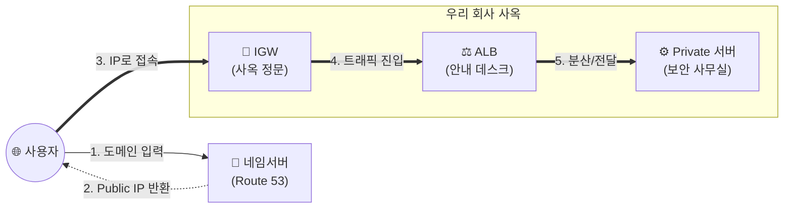
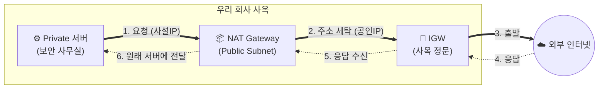
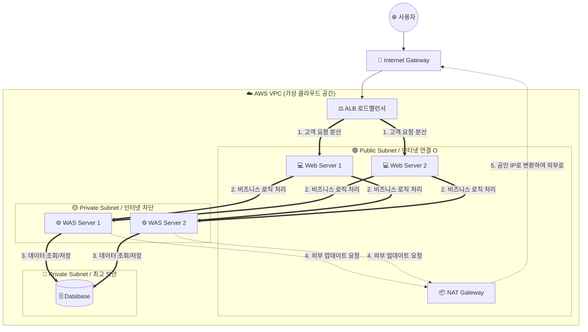

신입사원분들이 AWS 클라우드 인프라의 기초부터 트래픽의 흐름, 컨테이너 서비스까지 한 번에 이해할 수 있도록 **모든 내용을 통합한 완성본 교육 자료**입니다. 

'회사 사옥을 짓고 운영하는 과정'에 빗대어 아주 쉽게, 그리고 '왜 필요한지'에 집중하여 작성했습니다. 🏢✨

---

# ☁️ 신입사원을 위한 AWS 클라우드 인프라 완벽 가이드 (총정리 편)

## 1. AWS 네트워크 핵심 개념과 도입 필수 이유 (우리 회사 사옥 짓기)

클라우드에 서버를 띄우기 전, 안전한 네트워크 환경을 구축하는 것은 기초 공사와 같습니다. 

| AWS 용어 | 개념 설명 (비유) | 이게 왜 필요할까요? (도입 이유) 🎯 |
| :--- | :--- | :--- |
| **VPC**  (Virtual Private Cloud) | **회사 사옥의 울타리** | **"우리만의 독립된 보안 공간이 필요해서"** VPC가 없다면 우리 서버가 공공 인터넷 망에 덩그러니 놓여 해커의 표적이 됩니다. 다른 회사의 자원과 완벽히 분리된 안전한 가상 공간을 만들기 위해 절대적으로 필요합니다. |
| **Subnet**  (서브넷) | **사옥 내 부서별 사무실** | **"용도에 따라 네트워크를 나누고 통제하기 위해"** 외부와 통신할 방(Public), 완전히 숨길 방(Private)을 나누어 네트워크 보안과 관리 효율을 높이기 위해 필요합니다. |
| **Public Subnet** | **로비 / 안내 데스크** | **"고객(사용자)을 맞이할 공간이 필요해서"** 웹 사이트 접속을 위해 외부 인터넷과 직접 연결되어야 하는 로드밸런서(ALB)나 NAT Gateway를 배치하기 위해 필요합니다. |
| **Private Subnet** | **직원 전용 보안 사무실** | **"핵심 데이터를 외부 위협으로부터 숨기기 위해"** 고객 개인정보가 담긴 DB나 핵심 비즈니스 로직(WAS)이 외부에 노출되면 안 되므로, 외부 접근이 원천 차단된 안전지대가 필요합니다. |
| **IGW**  (Internet Gateway) | **사옥 정문** | **"VPC 안과 밖(인터넷)이 통신해야 하니까"** 이 대문이 없으면 Public Subnet을 만들어도 외부 사용자가 우리 웹사이트에 들어올 수도, 우리가 나갈 수도 없습니다. |
| **Routing Table** | **복도 이정표 / 내비게이션** | **"데이터(트래픽)가 길을 잃지 않게 하려고"** 네트워크 트래픽은 목적지를 스스로 모릅니다. "인터넷으로 갈 땐 IGW로 가라", "내부망 통신은 이쪽이다"라고 길을 지정해주기 위해 필요합니다. |
| **Network ACL** | **층별 보안 요원 (방화벽)** | **"특정 악성 IP의 접근을 원천 차단하기 위해"** 서브넷 단위의 방화벽입니다. 공격이 감지된 특정 IP 주소가 아예 서브넷 문턱도 넘지 못하도록 막아내는 역할을 합니다. |
| **Keypair** | **서버실 출입 마스터키** | **"비밀번호 입력 방식은 해킹에 취약하니까"** 서버(EC2)에 원격 접속할 때, 암호화된 고유한 키 파일을 통해서만 접속을 허용하여 무차별 대입 공격을 막기 위해 필요합니다. |
| **ELB**  (Elastic Load Balancer) | **교통 정리 경찰관** | **"서버 한 대가 과로로 죽는 것을 막기 위해"** 사용자가 몰렸을 때 여러 대의 서버로 요청을 골고루 **'분산'**시켜 안정적인 서비스를 유지하기 위해 필요합니다. |
| **ALB**  (Application Load Balancer) | **스마트한 맞춤형 안내원** | **"URL 주소에 따라 똑똑하게 트래픽을 나눠야 해서"** 웹(HTTP/HTTPS) 전용 로드밸런서입니다. `/image`는 이미지 서버로, `/login`은 인증 서버로 알아서 분류해 줍니다. |

---

## 2. 🚨 [집중 탐구] 요금 폭탄의 주범, NAT Gateway 완벽 파헤치기

### Q1. NAT Gateway는 어디에 붙어있나요?
👉 **무조건 `Public Subnet`에 배치해야 합니다.**
NAT Gateway의 역할은 인터넷이 차단된 Private 서버들을 대신해 인터넷에 접속해 주는 것입니다. 따라서 NAT Gateway 자체는 대문(IGW)을 통해 인터넷과 통신할 수 있는 **Public Subnet**에 위치해야 합니다.

### Q2. NAT Gateway는 왜 이렇게 비싼가요? 💸
**이중 과금 구조(고정비 + 변동비)** 때문입니다. 만들어 두기만 해도 발생하는 '시간당 유지 비용' 외에, NAT를 **통과하는 데이터 1GB당 요금**이 부과됩니다. Private 서버에서 대용량 데이터를 크롤링하거나 다운로드하면 요금 폭탄을 맞을 수 있습니다.

---

## 3. 🚦 트래픽 흐름 완벽 이해하기 (Inbound & Outbound)

우리가 `www.ourcompany.com`을 입력했을 때, 외부에서 어떻게 들어오고 내부에서는 어떻게 나가는지 살펴봅시다.

### 0. 네임서버(NS)란? (인터넷 전화번호부 📖)
컴퓨터는 영어 도메인을 모릅니다. AWS의 **Route 53(네임서버)**이 도메인 주소를 우리가 찾아가야 할 **공인 IP(Public IP)** 숫자로 변환해 줍니다.

### 📥 [Inbound] 외부에서 내부로 들어오는 길 (고객의 방문)
고객은 내부 서버의 진짜 주소(사설 IP)를 모릅니다. 안내원(ALB)의 공인 IP로 찾아오면, 안내원이 내부로 토스해 줍니다.

### 📤 [Outbound] 내부에서 외부로 나가는 길 (서버 업데이트 등)
내부 서버(Private)는 공인 IP가 없어 인터넷으로 나갈 수 없습니다. 이때 NAT Gateway가 주소를 세탁해 줍니다.

---

## 4. 🏗️ 표준 3-Tier (3계층) 아키텍처

지금까지 배운 모든 것을 하나로 조립한 가장 표준적이고 안전한 아키텍처입니다.

**💡 왜 3-Tier로 나누나요?**
- **보안:** 사용자가 DB에 직접 접근할 수 없도록 겹겹이 방어벽을 칩니다.
- **확장성:** 웹 접속자가 많으면 Web만, 계산량이 많으면 WAS만 개별적으로 확장(Scale-out)할 수 있어 비용이 절약됩니다.

---

## 5. 🐳 컨테이너 서비스의 이해 (ECR & ECS)

무거운 서버(OS)를 통째로 띄우는 대신, 실행에 필요한 것만 가볍게 뭉쳐 놓은 **'컨테이너(Docker)'**를 사용하는 최신 트렌드입니다.

### 📦 ECR (Elastic Container Registry)
- **개념:** 도커(Docker) 이미지를 안전하게 보관하는 **'비밀 창고'**입니다. (안전한 사내용 Github 느낌)
- **도입 이유:** 소스 코드가 업데이트될 때마다 버전을 관리하고, 문제가 생기면 1초 만에 이전 버전으로 되돌리기(Rollback) 위해 필수입니다.

### 🚢 ECS (Elastic Container Service)
- **개념:** 컨테이너를 서버에 띄우고, 관리하고, 감시하는 **'오케스트라 지휘자'**입니다.
- **도입 이유:** 트래픽이 몰릴 때 컨테이너를 10개로 늘리고, 죽으면 다시 살려내는 작업을 사람이 수동으로 할 수 없으므로 이를 **자동화**하기 위해 씁니다.

---

## 6. ⚖️ ECS 구동 방식 비교: 클러스터(EC2) vs Fargate

지휘자(ECS)가 컨테이너를 **'어떤 서버 인프라(땅)'** 위에서 띄울지 결정해야 합니다.

| 구분 | 💻 ECS on EC2 (직접 관리형) | ☁️ ECS Fargate (서버리스형) |
| :--- | :--- | :--- |
| **개념** | 빈 땅(EC2 서버)을 빌려, 그 위에 컨테이너를 올리는 방식 | 서버 껍데기를 없애고, **컨테이너만 허공에 딱! 띄우는 방식** |
| **도입 이유** | 인프라 내부(OS, 네트워크)를 **내 맘대로 세밀하게 조작**해야 할 때 | 서버 관리에 신경 쓸 인력이 없고, **오직 개발에만 집중**하고 싶을 때 |
| **장점 👍** | - 서버 환경을 100% 통제 가능 - 트래픽이 일정한 경우 Fargate보다 **단가가 저렴함** | - **운영 부담 제로** (OS 패치를 AWS가 다 해줌) - 유휴 리소스 낭비가 없음 |
| **단점 👎** | - EC2 서버 자체의 보안 패치 등 **운영 피로도가 높음** | - 순수 컴퓨팅 **단가는 약간 더 비쌈** - OS 레벨의 깊숙한 설정 불가 |

**📌 신입사원 실무 적용 요약:**
- "우리는 인프라 관리할 사람 없어요! 빠른 런칭이 목표예요!" 👉 **Fargate 추천!**
- "우리는 대규모 서비스고, 서버 세팅을 세밀하게 튜닝해야 해요!" 👉 **ECS on EC2 추천!**

