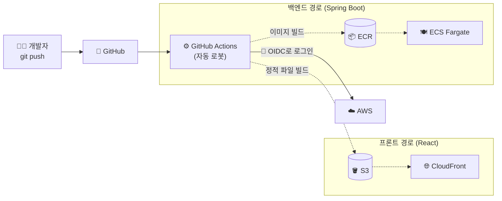
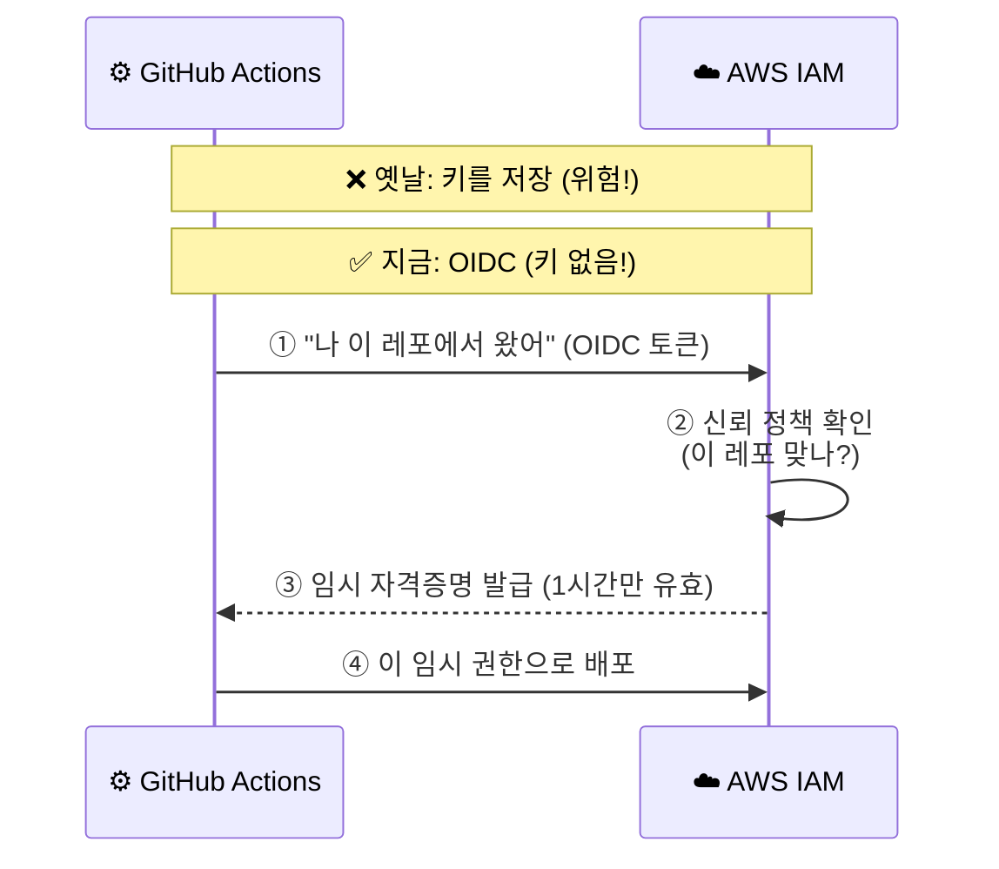
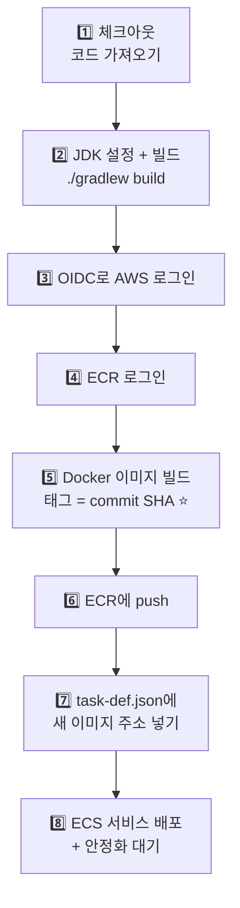
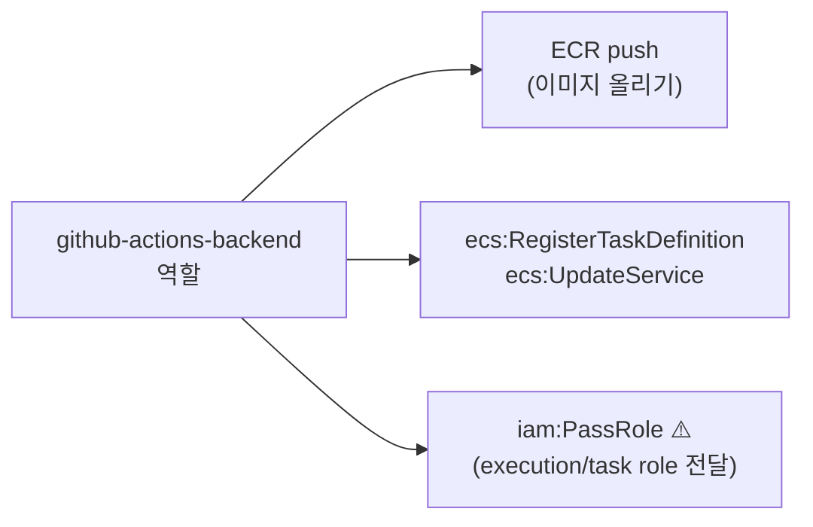
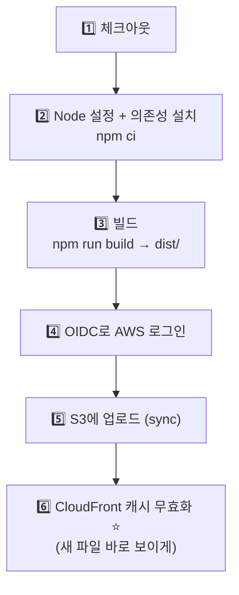
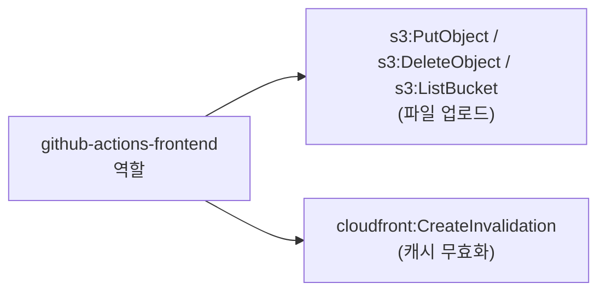
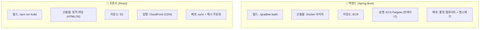
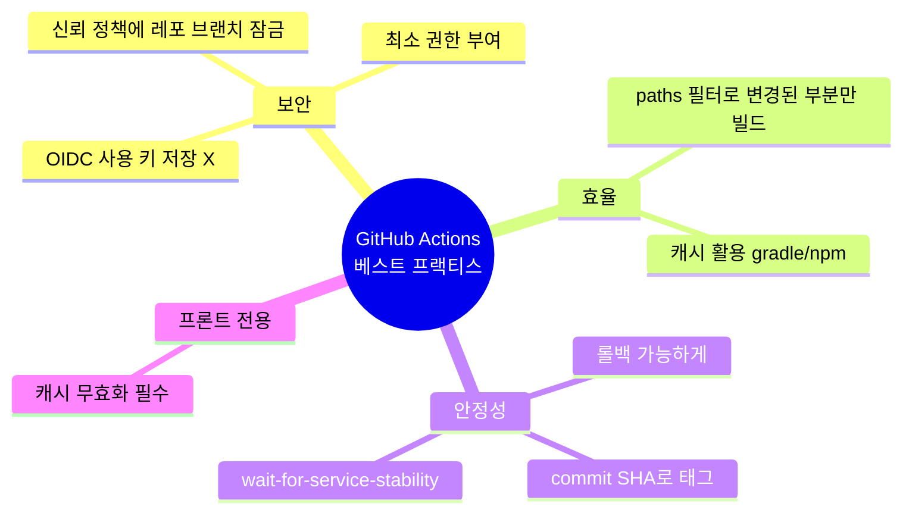

# GitHub Actions로 자동 배포하기 🚀

## 0. 큰 그림: 코드를 푸시하면 무슨 일이 일어나나?



> **핵심 차이점 한 줄:**
> 백엔드는 **컨테이너(ECR→ECS)**, 프론트는 **정적 파일(S3→CloudFront)**로 배포합니다.

---

## 1. ⭐ 가장 중요한 보안: OIDC (비밀번호 없이 로그인)

옛날 방식은 AWS 키를 GitHub Secrets에 저장했지만, **요즘 베스트 프랙티스는 OIDC**입니다. 키를 저장하지 않고, GitHub이 그때그때 임시 자격증명을 받아오는 방식이라 훨씬 안전합니다.



### 한 번만 설정하면 되는 것 (AWS 쪽)

먼저 AWS에 **GitHub을 신뢰하는 IAM 역할**을 만듭니다. 신뢰 정책에서 특정 레포만 허용하는 게 핵심입니다:

```json
{
  "Effect": "Allow",
  "Principal": {
    "Federated": "arn:aws:iam::111122223333:oidc-provider/token.actions.githubusercontent.com"
  },
  "Action": "sts:AssumeRoleWithWebIdentity",
  "Condition": {
    "StringEquals": {
      "token.actions.githubusercontent.com:aud": "sts.amazonaws.com"
    },
    "StringLike": {
      "token.actions.githubusercontent.com:sub": "repo:my-org/my-backend-repo:ref:refs/heads/main"
    }
  }
}
```

> 💡 `sub` 조건으로 **내 레포의 main 브랜치만** 이 역할을 쓸 수 있게 잠급니다. 이게 가장 중요한 보안 포인트예요.

---

## 2. 백엔드 (Spring Boot) → ECR → ECS Fargate

### 파이프라인 그림



> ⭐ **베스트 프랙티스:** 이미지 태그를 `latest`가 아니라 **commit SHA**(`github.sha`)로 합니다. 그래야 문제 생겼을 때 이전 버전으로 정확히 롤백할 수 있어요.

### `.github/workflows/backend-deploy.yml`

```yaml
name: Deploy Backend to ECS

on:
  push:
    branches: [main]
    paths: ["backend/**"]   # 백엔드 폴더 변경 시에만 실행

# OIDC 사용을 위한 필수 권한
permissions:
  id-token: write
  contents: read

env:
  AWS_REGION: ap-northeast-2
  ECR_REPOSITORY: my-backend
  ECS_CLUSTER: my-cluster
  ECS_SERVICE: my-backend-svc
  CONTAINER_NAME: web

jobs:
  deploy:
    runs-on: ubuntu-latest
    defaults:
      run:
        working-directory: backend
    steps:
      - name: 1️⃣ 코드 체크아웃
        uses: actions/checkout@v4

      - name: 2️⃣ JDK 21 설정
        uses: actions/setup-java@v4
        with:
          java-version: "21"
          distribution: "temurin"
          cache: gradle

      - name: 3️⃣ Gradle 빌드 (테스트 포함)
        run: ./gradlew clean build

      - name: 4️⃣ AWS 로그인 (OIDC - 키 없음!)
        uses: aws-actions/configure-aws-credentials@v4
        with:
          role-to-assume: arn:aws:iam::111122223333:role/github-actions-backend
          aws-region: ${{ env.AWS_REGION }}

      - name: 5️⃣ ECR 로그인
        id: login-ecr
        uses: aws-actions/amazon-ecr-login@v2

      - name: 6️⃣ 이미지 빌드 & push (태그 = commit SHA)
        id: build-image
        env:
          ECR_REGISTRY: ${{ steps.login-ecr.outputs.registry }}
          IMAGE_TAG: ${{ github.sha }}
        run: |
          docker build -t $ECR_REGISTRY/$ECR_REPOSITORY:$IMAGE_TAG .
          docker push $ECR_REGISTRY/$ECR_REPOSITORY:$IMAGE_TAG
          echo "image=$ECR_REGISTRY/$ECR_REPOSITORY:$IMAGE_TAG" >> $GITHUB_OUTPUT

      - name: 7️⃣ task-definition에 새 이미지 주입
        id: task-def
        uses: aws-actions/amazon-ecs-render-task-definition@v1
        with:
          task-definition: backend/task-definition.json
          container-name: ${{ env.CONTAINER_NAME }}
          image: ${{ steps.build-image.outputs.image }}

      - name: 8️⃣ ECS 배포 + 안정화 대기
        uses: aws-actions/amazon-ecs-deploy-task-definition@v2
        with:
          task-definition: ${{ steps.task-def.outputs.task-definition }}
          service: ${{ env.ECS_SERVICE }}
          cluster: ${{ env.ECS_CLUSTER }}
          wait-for-service-stability: true   # ⭐ 배포 끝까지 확인
```

> 💡 `task-definition.json`은 **git에 함께 커밋**하는 게 베스트 프랙티스입니다(앞서 만든 레시피 파일). 액션이 여기에 새 이미지 주소만 끼워넣어 등록합니다. `wait-for-service-stability: true`를 켜면 새 task가 healthy해질 때까지 기다려줘서, 배포 실패를 바로 알 수 있어요.

### 이 역할(`github-actions-backend`)에 필요한 권한



> ⚠️ 학생들이 자주 막히는 부분: `iam:PassRole`이 없으면 "역할을 넘길 수 없다"는 에러가 납니다. ECS가 task의 execution/task role을 쓸 수 있게 **전달 권한**을 줘야 해요.

---

## 3. 프론트엔드 (React) → S3 → CloudFront

프론트는 컨테이너가 필요 없습니다. 빌드한 정적 파일(HTML/JS/CSS)을 S3에 올리고 CloudFront로 전 세계에 빠르게 서빙합니다.

### 파이프라인 그림



> ⭐ **꼭 기억할 것:** S3에만 올리면 CloudFront가 **옛날 캐시**를 계속 보여줍니다. 그래서 마지막에 **캐시 무효화(invalidation)**를 꼭 해야 사용자가 새 버전을 봅니다.

### `.github/workflows/frontend-deploy.yml`

```yaml
name: Deploy Frontend to S3 + CloudFront

on:
  push:
    branches: [main]
    paths: ["frontend/**"]

permissions:
  id-token: write
  contents: read

env:
  AWS_REGION: ap-northeast-2
  S3_BUCKET: my-frontend-bucket
  CLOUDFRONT_ID: E1ABCDEFGHIJK

jobs:
  deploy:
    runs-on: ubuntu-latest
    defaults:
      run:
        working-directory: frontend
    steps:
      - name: 1️⃣ 코드 체크아웃
        uses: actions/checkout@v4

      - name: 2️⃣ Node 설정
        uses: actions/setup-node@v4
        with:
          node-version: "20"
          cache: npm
          cache-dependency-path: frontend/package-lock.json

      - name: 3️⃣ 설치 & 빌드
        run: |
          npm ci
          npm run build        # 결과물: dist/ (Vite) 또는 build/ (CRA)

      - name: 4️⃣ AWS 로그인 (OIDC)
        uses: aws-actions/configure-aws-credentials@v4
        with:
          role-to-assume: arn:aws:iam::111122223333:role/github-actions-frontend
          aws-region: ${{ env.AWS_REGION }}

      - name: 5️⃣ S3에 업로드
        run: |
          aws s3 sync dist/ s3://${{ env.S3_BUCKET }} --delete
        # 정적 자산은 길게 캐시, index.html은 캐시 안 함 (선택적 고급 설정)

      - name: 6️⃣ CloudFront 캐시 무효화
        run: |
          aws cloudfront create-invalidation \
            --distribution-id ${{ env.CLOUDFRONT_ID }} \
            --paths "/*"
```

> 💡 고급 팁: `index.html`은 캐시하지 않고(`--cache-control no-cache`), JS/CSS 같은 해시가 붙은 파일은 길게 캐시(`max-age=31536000`)하면 성능과 최신성을 둘 다 잡을 수 있습니다.

### 이 역할(`github-actions-frontend`)에 필요한 권한



---

## 4. 백엔드 vs 프론트엔드 한눈 비교



| 항목 | 🔧 백엔드 | 🎨 프론트 |
|------|----------|-----------|
| 빌드 결과 | Docker 이미지 | 정적 파일 |
| 저장 위치 | ECR | S3 |
| 서빙 | ECS Fargate | CloudFront |
| 배포 끝 작업 | 서비스 안정화 대기 | 캐시 무효화 |
| 태그/버전 관리 | commit SHA 태그 | 파일 해시 |

---

## 5. 공통 베스트 프랙티스 정리 📌


