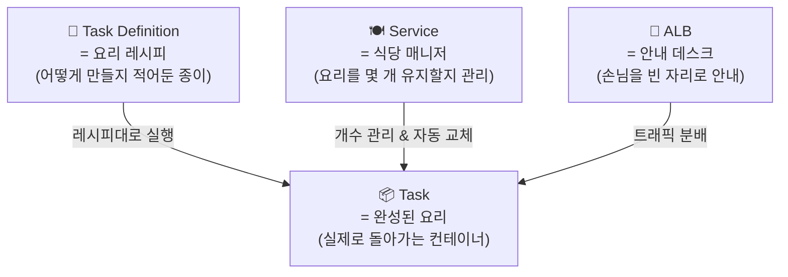
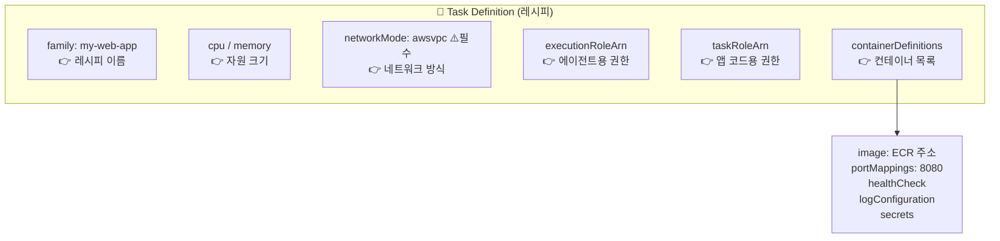
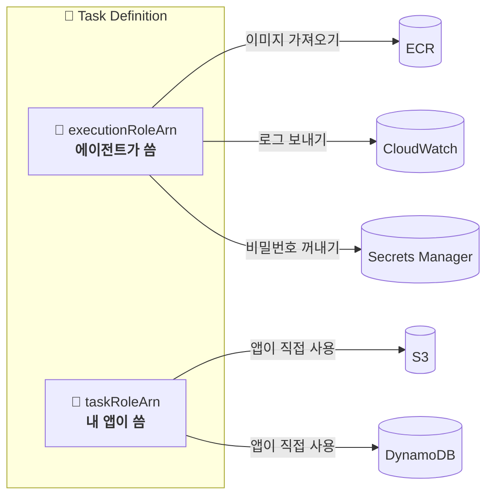
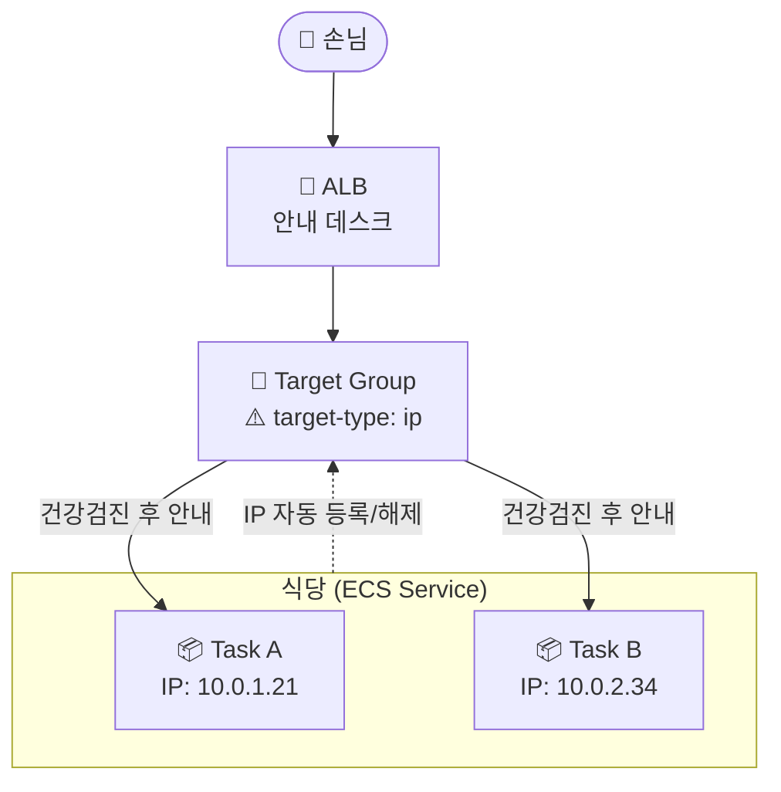
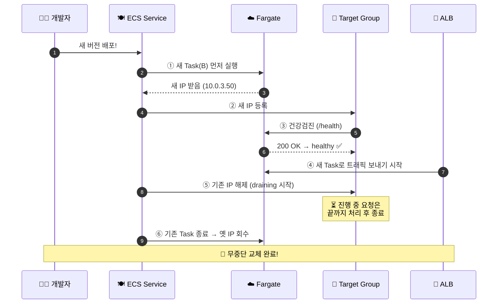
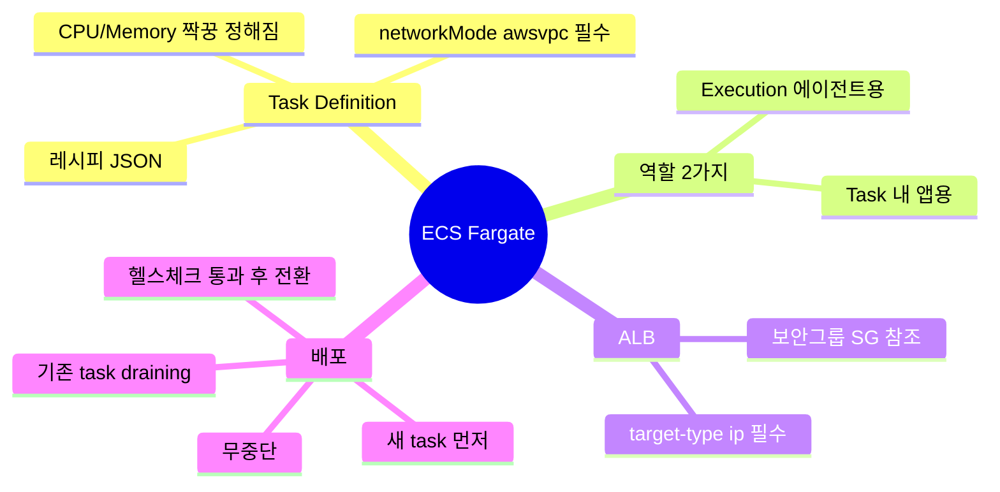

# ECS Fargate 한눈에 보기 🎯

## 0. 큰 그림부터: 이게 다 뭐죠?



> **한 문장 요약:** 레시피(Task Definition)를 보고 → 매니저(Service)가 요리(Task)를 만들고 → 안내데스크(ALB)가 손님을 나눠 보냅니다.

---

## 1. Task Definition (레시피) 📄

Task Definition은 컨테이너 애플리케이션을 실행하기 위한 청사진(JSON)입니다. Fargate에서는 몇 가지 필수 제약이 있는데, 핵심은 `networkMode`가 반드시 `awsvpc`여야 하고, CPU/Memory가 task 레벨에서 정해진 조합 중 하나로 지정되어야 한다는 점입니다.

### 레시피 구조 그림



### 핵심 옵션 자세히 보기

**task 레벨 (최상위) 필드**

| 옵션 | 설명 | Fargate에서의 주의점 |
|------|------|---------------------|
| `family` | 태스크 정의의 논리적 이름. 같은 family 안에서 revision이 1, 2, 3...으로 증가 | 필수. 배포 시 항상 새 revision 생성 |
| `requiresCompatibilities` | `["FARGATE"]` 지정 시 등록 단계에서 Fargate 호환성 검증 | 명시 권장 |
| `networkMode` | 네트워크 모드 | **반드시 `awsvpc`** (ENI가 task마다 할당됨) |
| `cpu` / `memory` | task 전체에 할당할 리소스 | 아래 조합표 중 하나만 가능 (필수) |
| `executionRoleArn` | ECS 에이전트가 사용하는 역할 | ECR pull, 로그 전송, Secrets 조회용 |
| `taskRoleArn` | 컨테이너 안의 애플리케이션이 사용하는 역할 | S3/DynamoDB 등 앱이 호출하는 API용 |

**Fargate CPU/Memory 유효 조합 (Linux)** — 아무 숫자나 못 넣고, 아래 짝꿍만 가능합니다 ⚠️

| CPU | Memory 범위 |
|-----|-------------|
| 256 (.25 vCPU) | 512 MiB, 1 GB, 2 GB |
| 512 (.5 vCPU) | 1~4 GB |
| 1024 (1 vCPU) | 2~8 GB |
| 2048 (2 vCPU) | 4~16 GB (1GB 단위) |
| 4096 (4 vCPU) | 8~30 GB (1GB 단위) |

**컨테이너 레벨 핵심 포인트**

`portMappings`에서 awsvpc 모드일 때는 `containerPort`만 의미가 있습니다. `hostPort`는 무시되며 컨테이너 포트와 동일하게 자동 매핑됩니다.

`healthCheck`는 컨테이너 자체의 헬스 체크입니다. 이것은 ALB 타겟 그룹 헬스 체크와는 별개이며, 둘 다 통과해야 트래픽이 안정적으로 흐릅니다. `startPeriod`를 충분히 줘서(부팅 느린 앱은 60~120초) 초기 기동 중 불필요한 재시작을 막는 게 중요합니다.

`secrets`는 평문 `environment` 대신 민감 정보를 Secrets Manager / SSM Parameter Store에서 주입할 때 사용합니다. 이 기능을 쓰려면 **execution role**에 권한이 필요합니다.

`logConfiguration`에서 `awslogs-create-group: "true"`를 쓰면 로그 그룹을 자동 생성하는데, 이때 execution role에 `logs:CreateLogGroup` 권한이 있어야 합니다.

### 실제 레시피 예시 (JSON)

```json
{
  "family": "my-web-app",
  "requiresCompatibilities": ["FARGATE"],
  "networkMode": "awsvpc",
  "cpu": "1024",
  "memory": "2048",
  "executionRoleArn": "arn:aws:iam::111122223333:role/ecsTaskExecutionRole",
  "taskRoleArn": "arn:aws:iam::111122223333:role/myAppTaskRole",
  "containerDefinitions": [
    {
      "name": "web",
      "image": "111122223333.dkr.ecr.ap-northeast-2.amazonaws.com/my-web-app:1.0.0",
      "essential": true,
      "portMappings": [{ "containerPort": 8080, "protocol": "tcp" }],
      "healthCheck": {
        "command": ["CMD-SHELL", "curl -f http://localhost:8080/health || exit 1"],
        "interval": 30, "timeout": 5, "retries": 3, "startPeriod": 60
      },
      "logConfiguration": {
        "logDriver": "awslogs",
        "options": {
          "awslogs-group": "/ecs/my-web-app",
          "awslogs-region": "ap-northeast-2",
          "awslogs-stream-prefix": "web"
        }
      }
    }
  ]
}
```

---

## 2. 두 가지 역할(Role)의 차이 🔑

가장 헷갈리는 부분! **"누가 그 권한을 쓰느냐"**로 구분하세요.



| 구분 | 🤖 Execution Role | 📱 Task Role |
|------|------------------|--------------|
| 누가 쓰나 | ECS/Fargate **에이전트** | 컨테이너 안 **내 앱 코드** |
| 언제 쓰나 | task를 **띄울 때** | 앱이 **돌아가는 중** |
| 예시 | ECR pull, 로그, Secrets | S3 업로드, DB 읽기 |

> 💡 **외우는 법:** "준비물 챙기는 건 에이전트(Execution), 실제로 일하는 건 내 앱(Task)"

**신뢰 정책(Trust Policy)** — 두 역할 모두 동일하게, `ecs-tasks.amazonaws.com`이 이 역할을 맡도록 허용합니다:

```json
{
  "Effect": "Allow",
  "Principal": { "Service": "ecs-tasks.amazonaws.com" },
  "Action": "sts:AssumeRole"
}
```

Execution Role에는 AWS 관리형 정책 `AmazonECSTaskExecutionRolePolicy`를 붙이면 ECR pull + 로그 전송이 기본 포함됩니다. ARN은 각각 task definition의 `executionRoleArn`, `taskRoleArn` 필드에 문자열로 그대로 넣습니다.

---

## 3. ALB 붙이기 🚪

### 전체 연결 그림



> ⚠️ **학생들이 제일 많이 틀리는 부분:** Fargate는 task마다 고유 IP를 가지므로 타겟 그룹을 만들 때 **반드시 `target-type = ip`** 로 해야 합니다 (`instance` 아님!).

### 보안 그룹(방화벽) 연결 — 이것도 자주 막혀요 🔒


> 💡 Task 보안그룹은 IP 대역(CIDR)이 아니라 **ALB 보안그룹을 소스로** 지정하는 것이 안전합니다.

---

## 4. ⭐ 새로 배포하면 IP가 어떻게 바뀌나요? (가장 중요!)

Fargate task는 배포할 때마다 **새 IP**로 교체됩니다. 하지만 손님이 보는 ALB 주소(DNS)는 그대로라서 **무중단**으로 바뀝니다. 그 비밀이 아래 순서입니다.

### 단계별 그림 (롤링 업데이트)



### 한 줄씩 풀어보면

배포가 시작되면 ECS는 **기존 task를 유지한 채 새 task를 먼저 띄웁니다**(①). 이때 Fargate가 새 IP를 부여하는데, 이전 IP와 다릅니다.

새 task가 준비되면 ECS가 그 **새 IP를 타겟 그룹에 자동 등록**합니다(②). ALB는 바로 트래픽을 보내지 않고 먼저 **건강검진(헬스 체크)**을 합니다(③). 연속으로 성공해 `healthy`가 되어야 트래픽이 흐릅니다(④).

새 task가 정상이면 ECS는 **기존 IP를 해제(draining)**합니다(⑤). 이때 바로 죽이지 않고, **진행 중이던 요청은 끝까지 처리**한 뒤 종료합니다(⑥). 그래서 손님이 끊김을 느끼지 않습니다.

> 🎯 **핵심:** ALB 주소(고정) → 뒤의 IP만 살짝살짝 교체 → 손님은 변화를 모름!

### 무중단 배포 필수 설정 4가지


---

## 정리 카드 📌


