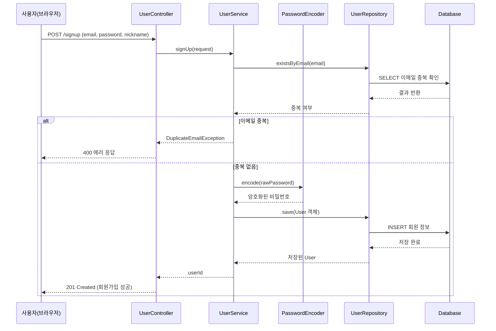
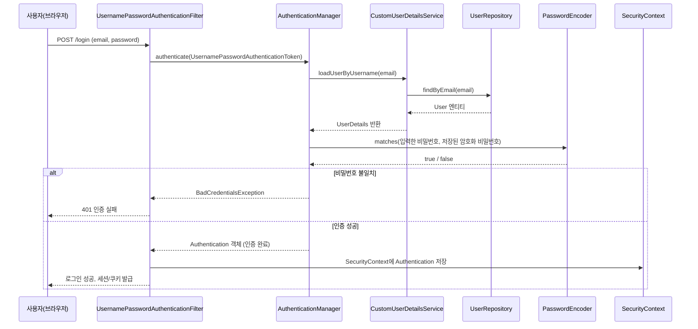
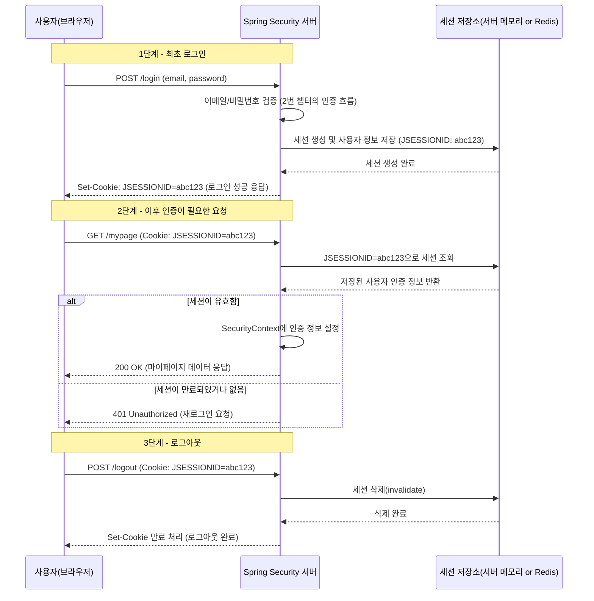

# Spring Security로 안전한 시스템 구축하기

이 문서는 백엔드 교육과정 중 "유저 관리 기능", "Spring Security 기본기", "쿠키/세션 기반 인증/인가"라는 세 가지 이론 세션을 하나로 정리한 학습 자료입니다. 전공자가 아니어도 이해할 수 있도록 프로그래밍 용어를 풀어서 설명하고, 초급 개발자가 실무에 들어가기 전에 반드시 짚고 넘어가야 할 개념을 코드와 그림을 함께 곁들여 정리했습니다.

---

## **1. 유저 관리 기능**

### **1-1. 개념 설명**

유저 관리 기능이란 서비스에 가입하는 사용자 정보를 만들고(회원가입), 저장하고, 확인하고(로그인), 필요하면 수정하거나 삭제하는 일련의 기능을 말합니다. 우리가 흔히 쓰는 쇼핑몰이나 SNS 앱을 떠올려보면, 이메일과 비밀번호를 입력해서 회원가입을 하고, 이후에 그 계정으로 로그인을 하는 과정이 바로 유저 관리 기능입니다. 겉보기엔 단순히 데이터베이스에 사용자 정보를 저장하는 것처럼 보이지만, 실제로는 비밀번호를 어떻게 안전하게 저장할지, 이메일 중복은 어떻게 막을지, 사용자마다 어떤 권한(관리자냐 일반 사용자냐)을 부여할지와 같은 여러 가지 설계 결정이 숨어 있습니다.

비전공자를 위해 조금 더 쉽게 비유하면, 유저 관리 기능은 아파트 관리사무소가 입주민 명부를 관리하는 것과 비슷합니다. 누가 몇 호에 사는지(식별자), 그 사람이 집주인인지 세입자인지(권한), 그리고 그 사람이 진짜 그 집에 사는 사람인지 확인하는 절차(비밀번호 확인)가 모두 필요합니다. 이 명부를 아무나 열람하거나 조작할 수 있다면 아파트 전체의 보안이 무너지는 것처럼, 유저 정보를 허술하게 관리하면 서비스 전체의 보안이 무너집니다.

### **1-2. 왜 이 개념을 배우는지**

신입 개발자가 실무에 들어가서 가장 먼저 맡게 되는 업무 중 하나가 회원 관련 기능인 경우가 많습니다. 그 이유는 유저 관리가 거의 모든 서비스의 기초 뼈대이기 때문입니다. 게시판이든 커머스든 결제 시스템이든, "누가 이 요청을 보냈는가"를 알아야 그 다음 로직을 처리할 수 있습니다. 따라서 유저 관리 기능을 제대로 이해하지 못하면 이후에 배우는 인증(Authentication)과 인가(Authorization)도 이해하기 어려워집니다.

또한 이 부분에서 배우는 비밀번호 암호화 개념은 실제 보안 사고와 직결됩니다. 실제로 여러 서비스에서 비밀번호를 평문(암호화하지 않은 원문 텍스트)으로 저장했다가 데이터베이스가 유출되어 사용자 계정이 대량으로 탈취된 사고가 있었습니다. 이런 사고를 방지하기 위해 비밀번호는 절대로 그대로 저장하지 않고, 단방향 암호화(해싱) 알고리즘을 거쳐서 저장해야 한다는 원칙을 이 단계에서 반드시 익혀야 합니다.

### **1-3. 코드 리뷰**

아래는 일반적인 Spring Boot 프로젝트에서 작성하는 유저 엔티티와 회원가입 서비스 코드입니다.

```java
@Entity
@Table(name = "users")
@Getter
@NoArgsConstructor(access = AccessLevel.PROTECTED)
public class User {

    @Id
    @GeneratedValue(strategy = GenerationType.IDENTITY)
    private Long id;

    @Column(nullable = false, unique = true)
    private String email;

    @Column(nullable = false)
    private String password; // 암호화된 값이 저장됨

    @Column(nullable = false)
    private String nickname;

    @Enumerated(EnumType.STRING)
    private Role role; // ROLE_USER, ROLE_ADMIN 등

    @Builder
    public User(String email, String password, String nickname, Role role) {
        this.email = email;
        this.password = password;
        this.nickname = nickname;
        this.role = role;
    }
}
```

```java
@Service
@RequiredArgsConstructor
public class UserService {

    private final UserRepository userRepository;
    private final PasswordEncoder passwordEncoder;

    @Transactional
    public Long signUp(SignUpRequest request) {
        // 1) 이메일 중복 검사
        if (userRepository.existsByEmail(request.getEmail())) {
            throw new DuplicateEmailException("이미 사용 중인 이메일입니다.");
        }

        // 2) 비밀번호 암호화 (BCrypt 알고리즘)
        String encodedPassword = passwordEncoder.encode(request.getPassword());

        // 3) 유저 저장
        User user = User.builder()
                .email(request.getEmail())
                .password(encodedPassword)
                .nickname(request.getNickname())
                .role(Role.ROLE_USER)
                .build();

        return userRepository.save(user).getId();
    }
}
```

이 코드를 한 줄씩 살펴보면 몇 가지 중요한 포인트가 보입니다. 먼저 `User` 엔티티에서 비밀번호 필드는 `password`라는 이름을 쓰지만 실제로 여기에는 사용자가 입력한 원문이 아니라 `passwordEncoder.encode()`를 거친 결과물이 들어갑니다. 이 `PasswordEncoder`는 Spring Security가 제공하는 인터페이스로, 실무에서는 대부분 `BCryptPasswordEncoder`를 사용합니다. BCrypt는 같은 비밀번호를 넣어도 매번 다른 암호화 결과(해시값)를 만들어내는 특징이 있는데, 이는 내부적으로 매번 다른 무작위 값(salt)을 섞어 넣기 때문입니다. 이 덕분에 두 사용자가 우연히 같은 비밀번호를 써도 데이터베이스에 저장된 값은 서로 다르게 보이고, 이는 레인보우 테이블 공격 같은 방식으로 비밀번호를 추측하기 어렵게 만들어 줍니다.

`existsByEmail` 검사는 회원가입 시점에 이메일 중복을 막기 위한 로직입니다. 이 검사가 없다면 같은 이메일로 여러 계정이 생성될 수 있고, 로그인 시 어떤 계정으로 인증해야 할지 시스템이 혼란스러워질 수 있습니다. `@Transactional` 어노테이션은 이 메서드 안에서 일어나는 데이터베이스 작업들이 하나의 단위로 처리되도록 보장하는 역할을 하는데, 예를 들어 저장 과정에서 예외가 발생하면 이미 처리된 부분까지 모두 롤백(되돌리기)되도록 해줍니다.

### **1-4. 시퀀스 다이어그램 (회원가입 흐름)**



---

## **2. Spring Security 기본기**

### **2-1. 개념 설명**

Spring Security는 스프링 진영에서 공식으로 제공하는 보안 프레임워크로, 인증(Authentication)과 인가(Authorization)를 손쉽게 구현할 수 있도록 도와줍니다. 여기서 인증과 인가는 자주 혼동되는 용어이니 명확히 구분해야 합니다. 인증은 "당신이 누구인지 확인하는 절차"이고, 인가는 "당신이 확인된 사람으로서 이 자원에 접근할 권한이 있는지 확인하는 절차"입니다. 예를 들어 회사 건물에 출입증을 찍는 것은 인증이고, 그 출입증으로 아무 층이나 열 수 있는 게 아니라 자신이 속한 부서의 층만 열리는 것은 인가에 해당합니다.

Spring Security의 핵심은 필터 체인(Filter Chain)이라는 구조입니다. 사용자의 모든 HTTP 요청은 실제 컨트롤러에 도달하기 전에 여러 개의 필터를 순서대로 통과하게 되는데, 이 필터들이 마치 공항 검색대처럼 하나씩 요청을 검사합니다. 예를 들어 로그인 요청은 `UsernamePasswordAuthenticationFilter`라는 필터가 가로채서 처리하고, 이미 로그인된 사용자의 요청은 세션이나 토큰을 검증하는 필터가 가로채서 "이 사람이 누구인지"를 확인한 뒤 다음 필터로 넘겨줍니다. 이 모든 필터를 통과한 요청만 최종적으로 우리가 작성한 컨트롤러 코드에 도달하게 됩니다.

이 구조에서 중요한 구성 요소로 `AuthenticationManager`, `UserDetailsService`, `PasswordEncoder`가 있습니다. `AuthenticationManager`는 인증 요청을 실제로 처리하는 매니저 역할을 하고, `UserDetailsService`는 "이 이메일을 가진 유저 정보를 데이터베이스에서 가져와줘"라는 역할을 담당하며, `PasswordEncoder`는 앞서 설명한 것처럼 비밀번호가 일치하는지 안전하게 비교하는 역할을 합니다. 이 세 가지가 톱니바퀴처럼 맞물려 돌아가면서 인증 과정을 완성합니다.

### **2-2. 왜 이 개념을 배우는지**

많은 초급 개발자들이 "그냥 내가 직접 if문으로 비밀번호 비교하면 되지 않나요?"라는 질문을 합니다. 이론적으로는 가능하지만, 실무에서는 절대 권장되지 않습니다. 그 이유는 보안이라는 영역이 생각보다 훨씬 복잡하고, 사소한 실수 하나가 치명적인 침해 사고로 이어지기 때문입니다. Spring Security는 이미 수많은 개발자들이 검증하고 다듬어온 프레임워크이기 때문에, 세션 고정 공격(Session Fixation), CSRF(사이트 간 요청 위조), 타이밍 공격 등 우리가 미처 생각하지 못한 공격 기법에 대한 방어 로직이 이미 내장되어 있습니다. 즉, 이 프레임워크를 배우는 이유는 "바퀴를 다시 발명하지 않고, 이미 검증된 안전한 바퀴를 올바르게 사용하는 방법"을 익히는 것입니다.

또한 실무에서 협업할 때 Spring Security는 사실상 표준으로 자리잡고 있기 때문에, 이 프레임워크의 동작 원리를 이해하지 못하면 팀에서 작성된 보안 관련 코드를 읽거나 디버깅하는 데 큰 어려움을 겪게 됩니다. 특히 로그인이 실패하는 버그, 권한 문제로 403 에러가 발생하는 문제 등을 해결하려면 필터 체인이 어떤 순서로 동작하는지 반드시 이해하고 있어야 합니다.

### **2-3. 코드 리뷰**

Spring Security 6 버전 이상에서는 기존의 `WebSecurityConfigurerAdapter`가 삭제되고, 아래와 같이 람다 기반의 `SecurityFilterChain` Bean을 등록하는 방식을 사용합니다.

```java
@Configuration
@EnableWebSecurity
@RequiredArgsConstructor
public class SecurityConfig {

    private final CustomUserDetailsService userDetailsService;

    @Bean
    public PasswordEncoder passwordEncoder() {
        return new BCryptPasswordEncoder();
    }

    @Bean
    public SecurityFilterChain filterChain(HttpSecurity http) throws Exception {
        http
            .csrf(csrf -> csrf.disable()) // API 서버라면 상황에 따라 조정
            .authorizeHttpRequests(auth -> auth
                .requestMatchers("/signup", "/login").permitAll()
                .requestMatchers("/admin/**").hasRole("ADMIN")
                .anyRequest().authenticated()
            )
            .formLogin(form -> form
                .loginProcessingUrl("/login")
                .usernameParameter("email")
                .defaultSuccessUrl("/home", true)
                .permitAll()
            )
            .logout(logout -> logout
                .logoutUrl("/logout")
                .logoutSuccessUrl("/login")
            );

        return http.build();
    }

    @Bean
    public AuthenticationManager authenticationManager(HttpSecurity http) throws Exception {
        AuthenticationManagerBuilder builder =
                http.getSharedObject(AuthenticationManagerBuilder.class);
        builder.userDetailsService(userDetailsService)
               .passwordEncoder(passwordEncoder());
        return builder.build();
    }
}
```

```java
@Service
@RequiredArgsConstructor
public class CustomUserDetailsService implements UserDetailsService {

    private final UserRepository userRepository;

    @Override
    public UserDetails loadUserByUsername(String email) throws UsernameNotFoundException {
        User user = userRepository.findByEmail(email)
                .orElseThrow(() -> new UsernameNotFoundException("존재하지 않는 유저입니다."));

        return new CustomUserDetails(user);
    }
}
```

```java
public class CustomUserDetails implements UserDetails {

    private final User user;

    public CustomUserDetails(User user) {
        this.user = user;
    }

    @Override
    public Collection<? extends GrantedAuthority> getAuthorities() {
        return List.of(new SimpleGrantedAuthority(user.getRole().name()));
    }

    @Override
    public String getPassword() {
        return user.getPassword(); // 암호화된 비밀번호
    }

    @Override
    public String getUsername() {
        return user.getEmail();
    }

    // isAccountNonExpired, isEnabled 등은 생략 (기본값 true 처리)
}
```

이 코드에서 눈여겨봐야 할 부분은 `authorizeHttpRequests` 설정입니다. 이 부분은 "어떤 경로에 어떤 권한이 필요한지"를 선언적으로 정의합니다. `/signup`과 `/login`은 아직 인증되지 않은 사용자도 접근해야 하므로 `permitAll()`로 열어두고, `/admin/**` 경로는 `ROLE_ADMIN` 권한을 가진 사용자만 접근하도록 제한합니다. 나머지 모든 요청(`anyRequest()`)은 인증된 사용자만 접근하도록(`authenticated()`) 설정되어 있습니다. 이 설정 하나만으로도 URL별 접근 제어가 자동으로 이루어지기 때문에, 개발자가 각 컨트롤러 메서드마다 일일이 권한 체크 코드를 작성할 필요가 없어집니다.

`CustomUserDetailsService`는 Spring Security가 로그인 시도를 처리할 때 내부적으로 호출하는 클래스입니다. 사용자가 로그인 폼에 이메일과 비밀번호를 입력하면, Spring Security는 이 클래스의 `loadUserByUsername` 메서드를 호출해서 데이터베이스에서 해당 이메일의 유저 정보를 가져옵니다. 그 후 Spring Security 내부에서 사용자가 입력한 비밀번호와 데이터베이스에 저장된 암호화된 비밀번호를 `PasswordEncoder`를 통해 비교합니다. 이때 개발자가 직접 `.equals()`로 비교하지 않는다는 점이 중요한데, BCrypt로 암호화된 값은 매번 다르게 생성되기 때문에 단순 비교로는 검증할 수 없고, `PasswordEncoder.matches()`라는 특수한 검증 로직을 통해서만 올바르게 비교할 수 있습니다.

### **2-4. 시퀀스 다이어그램 (Spring Security 필터 체인 인증 흐름)**



---

## **3. 쿠키/세션 기반 인증/인가**

### **3-1. 개념 설명**

이 부분을 이해하기 위해서는 먼저 HTTP라는 프로토콜의 근본적인 특징 하나를 알아야 합니다. HTTP는 "무상태(Stateless)" 프로토콜입니다. 이 말은 서버가 클라이언트의 요청을 처리하고 응답을 보내고 나면, 그 요청에 대한 기억을 전혀 남기지 않는다는 뜻입니다. 마치 매번 처음 만나는 사람처럼, 서버는 같은 사용자가 연속으로 요청을 보내더라도 "이 사람이 방금 그 사람이구나"라는 걸 스스로 알 수 없습니다. 하지만 우리가 사용하는 대부분의 서비스는 한 번 로그인하면 그 상태가 유지되어야 하죠. 이 문제를 해결하기 위해 등장한 것이 쿠키와 세션입니다.

쿠키(Cookie)는 서버가 사용자의 브라우저에게 "이 정보를 저장해두고, 다음에 나에게 요청 보낼 때마다 같이 보내줘"라고 넘겨주는 작은 데이터 조각입니다. 세션(Session)은 서버 측에 저장되는 사용자의 상태 정보인데, 쿠키와 세션이 함께 동작하는 방식은 이렇습니다. 사용자가 로그인에 성공하면 서버는 그 사용자를 위한 세션을 하나 만들고, 이 세션을 구분할 수 있는 고유한 식별자(세션 ID, 흔히 `JSESSIONID`라는 이름의 쿠키에 담겨 전달됨)를 쿠키에 담아 브라우저에게 돌려줍니다. 이후 브라우저는 같은 서버로 요청을 보낼 때마다 이 쿠키를 자동으로 함께 전송하고, 서버는 쿠키 속 세션 ID를 보고 "아, 이 사람은 아까 로그인했던 그 사용자구나"라고 인식할 수 있게 됩니다.

이를 비유하자면, 놀이공원에 입장할 때 손목에 팔찌(쿠키)를 채워주는 것과 같습니다. 놀이공원 직원(서버)은 당신이 누구인지 매번 신분증을 확인할 필요 없이, 팔찌에 적힌 고유번호(세션 ID)만 보고 "이 사람은 오늘 입장료를 낸 사람이구나"라고 빠르게 확인할 수 있습니다. 실제 당신에 대한 자세한 정보(이름, 나이, 결제 내역 등)는 놀이공원 사무실의 명부(서버의 세션 저장소)에 기록되어 있고, 팔찌에는 그 명부를 찾아볼 수 있는 번호만 적혀 있는 셈입니다.

### **3-2. 왜 이 개념을 배우는지**

이 개념은 "로그인 상태 유지"라는 웹 서비스의 가장 기본적인 기능을 어떻게 구현하는지에 대한 원리를 담고 있기 때문에 반드시 이해해야 합니다. 특히 최근에는 JWT(JSON Web Token) 기반 인증도 널리 쓰이고 있는데, 세션 기반 인증의 원리를 정확히 알고 있어야 JWT와 세션 방식의 차이점, 그리고 각각의 장단점을 제대로 판단할 수 있습니다. 예를 들어 세션 방식은 서버가 사용자 상태를 직접 관리하기 때문에 로그아웃이나 강제 세션 만료를 서버 측에서 즉시 처리할 수 있다는 장점이 있지만, 여러 대의 서버로 서비스를 확장할 때(로드 밸런싱 환경) 세션 정보를 서버 간에 공유해야 하는 문제(세션 클러스터링)가 발생한다는 단점도 있습니다.

또한 이 개념을 배우면서 자연스럽게 CSRF(Cross-Site Request Forgery)나 세션 고정 공격 같은 보안 취약점도 함께 이해하게 됩니다. 쿠키는 브라우저가 자동으로 전송해주는 특성 때문에, 사용자가 악성 사이트를 열어놓은 상태에서 몰래 요청이 전송되면 사용자의 세션 쿠키가 의도치 않게 함께 전송되어 공격에 이용될 수 있습니다. 이런 위험성을 이해해야 왜 Spring Security가 기본적으로 CSRF 방어 기능을 켜두는지, 그리고 API 서버를 만들 때 이를 어떻게 다뤄야 하는지 판단할 수 있는 감각이 생깁니다.

### **3-3. 코드 리뷰**

Spring Security에서 세션 기반 인증을 사용할 때, 아래와 같은 설정을 통해 세션 정책을 세밀하게 제어할 수 있습니다.

```java
@Bean
public SecurityFilterChain filterChain(HttpSecurity http) throws Exception {
    http
        .sessionManagement(session -> session
            .sessionCreationPolicy(SessionCreationPolicy.IF_REQUIRED) // 필요할 때만 세션 생성
            .maximumSessions(1) // 한 계정당 동시 로그인 1개 세션만 허용
            .maxSessionsPreventsLogin(false) // 새로운 로그인이 기존 세션을 만료시킴
        )
        .authorizeHttpRequests(auth -> auth
            .anyRequest().authenticated()
        );

    return http.build();
}
```

```java
@RestController
@RequiredArgsConstructor
public class MyPageController {

    @GetMapping("/mypage")
    public ResponseEntity<UserResponse> getMyPage(HttpSession session) {
        // Spring Security가 이미 인증을 마쳤기 때문에,
        // SecurityContext에서 인증 정보를 꺼내 쓸 수 있음
        Authentication auth = SecurityContextHolder.getContext().getAuthentication();
        CustomUserDetails userDetails = (CustomUserDetails) auth.getPrincipal();

        return ResponseEntity.ok(new UserResponse(userDetails.getUsername()));
    }
}
```

application.yml에서 세션 관련 쿠키 속성을 조정할 수도 있습니다.

```yaml
server:
  servlet:
    session:
      cookie:
        http-only: true    # 자바스크립트에서 쿠키에 접근 못하게 막음 (XSS 방어)
        secure: true        # HTTPS 환경에서만 쿠키 전송
        same-site: lax       # CSRF 방어를 위한 쿠키 전송 정책
      timeout: 30m           # 세션 유효 시간
```

이 코드에서 가장 중요하게 봐야 할 부분은 `sessionCreationPolicy`입니다. `IF_REQUIRED`는 세션이 필요한 상황(로그인 등)에서만 세션을 생성한다는 뜻이며, 이 값을 `STATELESS`로 바꾸면 Spring Security가 세션을 전혀 사용하지 않게 되는데, 이는 JWT 기반 인증을 사용할 때 주로 설정하는 값입니다. `maximumSessions(1)`은 동시 로그인을 하나의 세션으로 제한하는 설정으로, 다른 기기에서 같은 계정으로 로그인하면 기존 세션이 만료되도록 만들 수 있습니다.

`http-only: true` 설정은 보안적으로 매우 중요한 부분입니다. 이 옵션이 켜져 있으면 자바스크립트 코드가 `document.cookie`로 세션 쿠키 값을 읽어올 수 없게 됩니다. 만약 이 옵션이 없다면, 악의적인 스크립트가 페이지에 삽입되는 XSS(Cross-Site Scripting) 공격을 당했을 때 공격자가 사용자의 세션 쿠키를 그대로 탈취해서 그 사용자로 위장할 수 있게 됩니다. `secure: true`는 쿠키가 HTTPS 연결에서만 전송되도록 강제하는데, 이를 통해 네트워크 중간에서 쿠키 값이 평문으로 노출되는 것을 막을 수 있습니다.

### **3-4. 시퀀스 다이어그램 (세션 기반 로그인 및 이후 요청 검증)**



---

## **정리하며**

세 가지 이론을 하나로 엮어보면 자연스러운 흐름이 보입니다. 먼저 유저 관리 기능에서 "누구인지 저장하고 확인할 수 있는 데이터 구조"를 만들고, Spring Security 기본기에서 "그 데이터를 안전하고 표준화된 방식으로 검증하는 프레임워크"를 익히고, 마지막으로 쿠키/세션 기반 인증에서 "검증이 끝난 사용자의 상태를 어떻게 유지시키는지"를 배우는 것입니다. 이 세 가지를 하나의 흐름으로 이해하면, 회원가입부터 로그인, 그리고 로그인 이후 페이지 접근까지 전체 사이클이 어떻게 맞물려 돌아가는지 훨씬 선명하게 그려질 것입니다. 초급 개발자 입장에서는 처음엔 필터, 매니저, 세션 저장소 같은 용어들이 낯설게 느껴질 수 있지만, 결국 이 모든 구성 요소는 "이 사람이 누구인지 확인하고, 확인된 상태를 안전하게 유지한다"는 단 하나의 목적을 위해 움직이고 있다는 점을 기억하면 개념을 훨씬 수월하게 붙잡을 수 있습니다.
