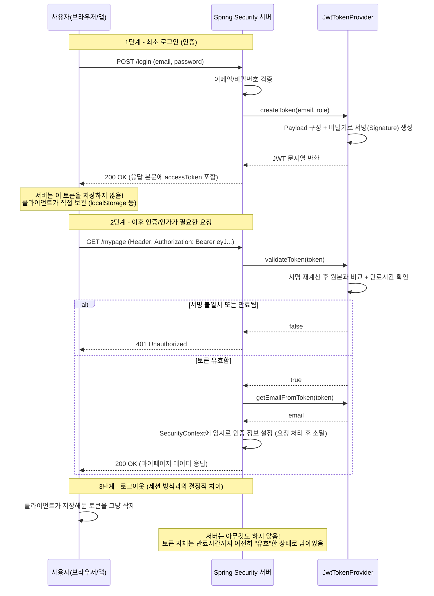

# JWT 기반 인증 - 예습 자료 (세션 방식과 비교하며 이해하기)

앞서 배운 쿠키/세션 기반 인증에 이어서, 이번에는 JWT(JSON Web Token) 기반 인증을 예습 자료로 정리해보겠습니다. 실무에서는 특히 API 서버나 모바일 앱 백엔드를 만들 때 JWT 방식을 많이 사용하기 때문에, 세션 방식과의 차이점을 명확히 이해해두면 나중에 실습 시간에 훨씬 수월하게 따라갈 수 있습니다. 이 자료는 세션 기반 인증을 이미 배웠다는 전제로, 그것과 비교하면서 설명하는 방식으로 구성했습니다.

---

## **1. JWT란 무엇인가**

### **1-1. 개념 설명**

JWT는 JSON Web Token의 줄임말로, 사용자의 인증 정보를 하나의 문자열 안에 통째로 담아버리는 토큰 방식입니다. 앞서 세션 방식에서는 서버가 사용자 정보를 세션 저장소(서버 메모리나 Redis)에 저장해두고, 클라이언트에게는 그 정보를 찾아갈 수 있는 "번호표"(세션 ID)만 쿠키에 담아 보냈습니다. 반면 JWT 방식은 정반대의 철학을 가지고 있습니다. 서버는 아무것도 저장하지 않고, 사용자에 대한 정보(누구인지, 어떤 권한을 가졌는지 등)를 암호화된 형태로 통째로 문자열에 담아서 클라이언트에게 넘겨주고, 클라이언트는 이후 요청마다 이 문자열 전체를 서버에게 제출합니다.

비유를 들어보면 이해가 빠릅니다. 세션 방식이 놀이공원의 손목 팔찌(번호만 적혀 있고, 자세한 정보는 사무실 명부에 있음)라면, JWT는 여권과 비슷합니다. 여권에는 이름, 생년월일, 국적, 발급기관 등 신원 정보가 이미 다 적혀 있고, 여권 자체에 위조를 막기 위한 홀로그램과 특수 인장이 찍혀 있습니다. 출입국 심사관(서버)은 별도로 본국의 명부를 조회할 필요 없이, 여권에 찍힌 정부의 인장(서명)만 확인하면 "이 사람이 진짜 그 나라 국적자다"라는 사실과 "여권에 적힌 정보가 위조되지 않았다"는 사실을 동시에 확인할 수 있습니다.

JWT는 실제로 마침표(.)로 구분된 세 부분으로 이루어져 있습니다. 첫 번째는 헤더(Header)로 어떤 암호화 알고리즘을 썼는지 정보가 담겨 있고, 두 번째는 페이로드(Payload)로 사용자 ID, 권한, 만료 시간 같은 실제 데이터가 담겨 있으며, 세 번째는 서명(Signature)으로 이 토큰이 위조되지 않았음을 증명하는 부분입니다. 예를 들면 아래와 같은 모습입니다.

```
eyJhbGciOiJIUzI1NiJ9.eyJzdWIiOiJ1c2VyMTIzIiwicm9sZSI6IlVTRVIiLCJleHAiOjE3MzAwMDAwMDB9.4f8s9d...
     (헤더)                    (페이로드: userId, role, 만료시간 등)              (서명)
```

여기서 반드시 짚어야 할 오해가 하나 있습니다. 페이로드 부분은 암호화된 것이 아니라 단지 Base64로 인코딩되어 있을 뿐이라서, 누구나 그 내용을 디코딩해서 읽을 수 있습니다. 그렇다면 왜 안전하다고 하는 걸까요? 그 이유는 서명 부분 때문입니다. 서버만 알고 있는 비밀키(Secret Key)로 헤더와 페이로드를 서명해두기 때문에, 중간에 누군가 페이로드 내용을 몰래 바꾸면 서명값이 더 이상 일치하지 않게 되어 서버가 즉시 위조를 탐지할 수 있습니다. 즉 JWT의 안전성은 "내용을 숨기는 것"이 아니라 "내용이 조작되지 않았음을 검증하는 것"에 있습니다. 그래서 비밀번호나 주민번호 같은 민감한 정보는 페이로드에 절대 넣으면 안 된다는 점을 꼭 기억해야 합니다.

### **1-2. 왜 이 개념을 배우는지**

세션 방식은 서버가 사용자 상태를 직접 기억하고 있어야 한다는 점에서 "상태를 가진(Stateful)" 방식입니다. 그런데 실제 서비스가 성장해서 사용자가 많아지면, 서버를 한 대에서 여러 대로 늘려야 하는 순간이 옵니다. 이런 환경을 로드 밸런싱 환경이라고 하는데, 문제는 사용자 A가 로그인할 때는 1번 서버가 응답했는데, 다음 요청이 2번 서버로 전달되면 2번 서버에는 A의 세션 정보가 없다는 문제가 발생합니다. 이를 해결하려면 여러 서버가 세션 정보를 공유하는 별도의 저장소(Redis 등)를 두어야 하는데, 이는 시스템을 더 복잡하게 만듭니다.

JWT는 이 문제를 근본적으로 다르게 접근합니다. 서버가 아무것도 저장하지 않는 "무상태(Stateless)" 방식이기 때문에, 사용자의 요청이 어느 서버로 가더라도 그 서버는 토큰에 찍힌 서명만 검증하면 됩니다. 별도의 세션 저장소나 서버 간 공유 작업이 필요 없다는 뜻입니다. 이런 특성 때문에 요즘 서버를 여러 대로 쉽게 늘렸다 줄였다 할 수 있는 클라우드 환경이나, 마이크로서비스처럼 여러 개의 작은 서버가 나뉘어 동작하는 구조에서는 JWT가 훨씬 잘 맞는 선택으로 여겨집니다. 또한 웹 브라우저뿐만 아니라 모바일 앱이나 다른 서버(서버 간 통신)에서도 쿠키 없이 토큰만으로 인증할 수 있다는 점에서 활용 범위가 넓습니다.

다만 이런 장점이 있다고 해서 JWT가 세션보다 무조건 우월한 것은 아니라는 점을 예습 단계에서부터 명확히 인지하고 있어야 합니다. 뒤에서 다룰 단점들, 특히 로그아웃 처리의 어려움 같은 부분은 실무에서 자주 마주치는 골칫거리이기 때문에, 이 트레이드오프를 이해하고 상황에 맞게 선택하는 안목을 기르는 것이 이 개념을 배우는 핵심 목적입니다.

---

## **2. JWT 기반 인증 코드 (예습용 미리보기)**

아래 코드는 아직 정식으로 다루지 않은 내용이니, 지금 단계에서는 전체를 완벽히 이해하기보다는 "대략 이런 흐름으로 동작하는구나"를 느끼는 정도로 가볍게 봐주시면 됩니다.

### **2-1. 토큰을 만들고 검증하는 클래스**

```java
@Component
public class JwtTokenProvider {

    @Value("${jwt.secret}")
    private String secretKey; // 서버만 아는 비밀키

    private final long accessTokenValidity = 1000L * 60 * 30; // 30분

    // 로그인 성공 시, 토큰을 발급하는 메서드
    public String createToken(String email, Role role) {
        Claims claims = Jwts.claims().setSubject(email); // Payload에 담을 데이터
        claims.put("role", role.name());

        Date now = new Date();
        Date expiry = new Date(now.getTime() + accessTokenValidity);

        return Jwts.builder()
                .setClaims(claims)
                .setIssuedAt(now)
                .setExpiration(expiry)
                .signWith(SignatureAlgorithm.HS256, secretKey) // 서명 생성
                .compact();
    }

    // 요청이 들어올 때마다, 토큰이 유효한지 검증하는 메서드
    public boolean validateToken(String token) {
        try {
            Jws<Claims> claims = Jwts.parser()
                    .setSigningKey(secretKey)
                    .parseClaimsJws(token);
            return !claims.getBody().getExpiration().before(new Date());
        } catch (JwtException | IllegalArgumentException e) {
            return false; // 서명 불일치, 만료, 형식 오류 등
        }
    }

    public String getEmailFromToken(String token) {
        return Jwts.parser().setSigningKey(secretKey)
                .parseClaimsJws(token).getBody().getSubject();
    }
}
```

### **2-2. 요청마다 토큰을 검사하는 필터**

```java
@RequiredArgsConstructor
public class JwtAuthenticationFilter extends OncePerRequestFilter {

    private final JwtTokenProvider jwtTokenProvider;

    @Override
    protected void doFilterInternal(HttpServletRequest request,
                                     HttpServletResponse response,
                                     FilterChain filterChain) throws ServletException, IOException {

        // 1) Authorization 헤더에서 토큰 추출 (Bearer eyJhbGci...)
        String token = resolveToken(request);

        // 2) 토큰이 있고 유효하다면, 인증 정보를 SecurityContext에 등록
        if (token != null && jwtTokenProvider.validateToken(token)) {
            String email = jwtTokenProvider.getEmailFromToken(token);
            UserDetails userDetails = customUserDetailsService.loadUserByUsername(email);

            Authentication auth = new UsernamePasswordAuthenticationToken(
                    userDetails, null, userDetails.getAuthorities());
            SecurityContextHolder.getContext().setAuthentication(auth);
        }

        filterChain.doFilter(request, response); // 다음 필터로 전달
    }

    private String resolveToken(HttpServletRequest request) {
        String bearer = request.getHeader("Authorization");
        if (bearer != null && bearer.startsWith("Bearer ")) {
            return bearer.substring(7);
        }
        return null;
    }
}
```

### **2-3. Security 설정 (핵심 차이점 확인)**

```java
@Bean
public SecurityFilterChain filterChain(HttpSecurity http) throws Exception {
    http
        .sessionManagement(session -> session
            .sessionCreationPolicy(SessionCreationPolicy.STATELESS) // 세션을 전혀 만들지 않음!
        )
        .csrf(csrf -> csrf.disable()) // 쿠키를 안 쓰므로 CSRF 위험이 크게 줄어듦
        .authorizeHttpRequests(auth -> auth
            .requestMatchers("/signup", "/login").permitAll()
            .anyRequest().authenticated()
        )
        .addFilterBefore(jwtAuthenticationFilter, UsernamePasswordAuthenticationFilter.class);

    return http.build();
}
```

이 코드에서 예습 단계에서 반드시 눈에 담아둘 부분은 `SessionCreationPolicy.STATELESS`입니다. 이 한 줄이 바로 세션 방식과 JWT 방식을 가르는 가장 상징적인 설정입니다. 세션 방식에서는 서버가 로그인 성공 시 `HttpSession`을 만들어서 사용자 정보를 담아두었지만, JWT 방식에서는 이 줄을 통해 "나는 어떤 세션도 만들지 않겠다"고 Spring Security에게 선언합니다. 대신 `JwtAuthenticationFilter`라는 커스텀 필터를 만들어서, 매 요청이 들어올 때마다 `Authorization` 헤더에 담긴 토큰을 꺼내 서명을 검증하고, 검증에 성공하면 그때그때 임시로 `SecurityContext`에 인증 정보를 채워 넣습니다. 이 인증 정보는 세션처럼 다음 요청까지 유지되는 것이 아니라, 딱 그 요청을 처리하는 동안만 존재했다가 사라집니다. 즉 매 요청마다 "이 사람이 누구인지"를 토큰만 보고 새롭게 계산해내는 셈입니다.

---

## **3. 시퀀스 다이어그램 (JWT 기반 로그인 및 이후 요청 검증)**



---

## **4. 세션 방식 vs JWT 방식 핵심 비교**

지금까지 배운 세션 방식과 이번에 예습한 JWT 방식을 나란히 놓고 비교해보면 각각의 특성이 훨씬 뚜렷하게 드러납니다.

가장 근본적인 차이는 "누가 사용자 정보를 들고 있는가"입니다. 세션 방식에서는 서버가 사용자의 인증 정보를 세션 저장소에 계속 들고 있고, 클라이언트는 그저 그 정보를 찾아갈 번호표(세션 ID)만 가지고 있습니다. 반면 JWT 방식에서는 서버가 아무것도 들고 있지 않고, 사용자 정보 자체가 토큰 안에 담긴 채로 클라이언트가 직접 들고 다닙니다. 이 차이 때문에 세션 방식은 "상태를 가진(Stateful)" 방식이라 부르고, JWT 방식은 "무상태(Stateless)" 방식이라 부릅니다.

이 근본적인 차이는 서버 확장성 문제로 이어집니다. 세션 방식은 서버를 여러 대로 늘리면 세션 정보를 서버끼리 공유해야 하는 번거로움(세션 클러스터링, Redis 같은 별도 저장소 필요)이 생기지만, JWT 방식은 토큰 자체에 필요한 정보가 다 들어있기 때문에 어떤 서버가 요청을 받아도 서명만 검증하면 바로 처리할 수 있어 서버를 늘리는 것이 훨씬 간단합니다.

반면 로그아웃과 강제 만료 처리에서는 정반대의 결과가 나타납니다. 세션 방식은 서버가 세션 저장소에서 해당 세션을 삭제하는 순간 그 즉시 로그아웃 처리가 완료되고, 관리자가 특정 사용자를 강제로 로그아웃시키는 것도 간단합니다. 그런데 JWT 방식은 토큰 자체가 서버 없이도 검증 가능하도록 설계되어 있기 때문에, 클라이언트가 토큰을 삭제해도 그 토큰의 원본이 어딘가에 남아있다면(예를 들어 공격자가 미리 탈취해둔 경우) 만료시간이 되기 전까지는 여전히 유효한 토큰으로 인식됩니다. 즉 "서버가 토큰을 강제로 무효화시키는 것"이 원래 설계상 어렵습니다. 이 문제를 보완하기 위해 실무에서는 보통 Access Token의 유효시간을 짧게(예를 들어 15분~30분) 설정하고, 별도의 Refresh Token을 두거나, 블랙리스트 방식으로 무효화된 토큰을 서버가 잠시 기억해두는 방식을 함께 사용합니다. 이는 뒤에 나올 실습에서 더 자세히 다루게 될 내용입니다.

보안 측면에서도 서로 다른 위협에 노출됩니다. 세션 방식은 세션 ID가 쿠키에 담겨 브라우저가 자동으로 전송하기 때문에 CSRF 공격에 취약할 수 있어 별도의 CSRF 방어 로직이 필요합니다. JWT 방식은 보통 쿠키가 아니라 `Authorization` 헤더에 담아 클라이언트가 직접 명시적으로 붙여서 보내기 때문에 CSRF 위험은 상대적으로 적지만, 대신 클라이언트가 토큰을 어딘가에 저장해야 하는데 이때 `localStorage`에 저장하면 XSS 공격을 당했을 때 스크립트가 토큰을 직접 읽어갈 수 있는 위험이 있습니다.

아래 표로 지금까지의 비교 내용을 한눈에 정리해보았습니다.

| 비교 항목 | 세션 기반 인증 | JWT 기반 인증 |
|---|---|---|
| 상태 관리 | 서버가 상태를 가짐 (Stateful) | 서버가 상태를 갖지 않음 (Stateless) |
| 사용자 정보 위치 | 서버의 세션 저장소 | 토큰 안(클라이언트가 보관) |
| 서버 확장(스케일 아웃) | 세션 클러스터링/공유 필요, 복잡함 | 토큰만 검증하면 되어 상대적으로 간단함 |
| 로그아웃/강제 만료 | 서버에서 세션 삭제로 즉시 처리 가능 | 원칙적으로 어려움 (블랙리스트, 짧은 만료시간 등으로 보완) |
| 클라이언트 전송 방식 | 쿠키(자동 전송) | Authorization 헤더(직접 명시) |
| 주요 보안 위협 | CSRF | XSS로 인한 토큰 탈취(저장 위치에 따라) |
| 적합한 환경 | 서버 대수가 적거나 단일 서버, 전통적인 웹 서비스 | 다중 서버, 마이크로서비스, 모바일 앱, 서버 간 통신 |

---

## **예습을 마치며**

세션과 JWT는 "어떤 방식이 더 좋다"의 문제가 아니라, 서비스의 규모와 구조에 맞는 선택의 문제라는 점을 꼭 기억해두면 좋겠습니다. 신입 개발자 시절에는 종종 최신 기술이라는 이유만으로 JWT를 무조건 선호하는 경향이 있는데, 실제로는 로그아웃 처리나 토큰 탈취 대응처럼 JWT가 갖는 특유의 난이도 높은 문제들도 함께 따라온다는 점을 이해하고 있어야 합니다. 실습 시간에는 오늘 예습한 `JwtTokenProvider`와 `JwtAuthenticationFilter`를 직접 손으로 작성해보면서, Access Token과 Refresh Token을 함께 쓰는 방식이나 토큰 재발급 흐름까지 이어서 다루게 될 예정이니, 오늘 정리한 "세션은 서버가 기억하고, JWT는 클라이언트가 들고 다닌다"는 핵심 그림만 확실히 챙겨가시면 충분할 것 같습니다.
