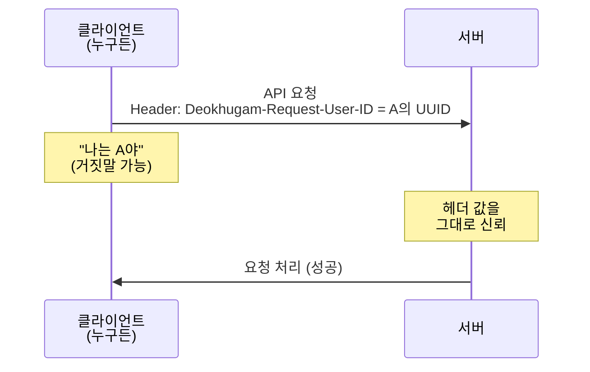
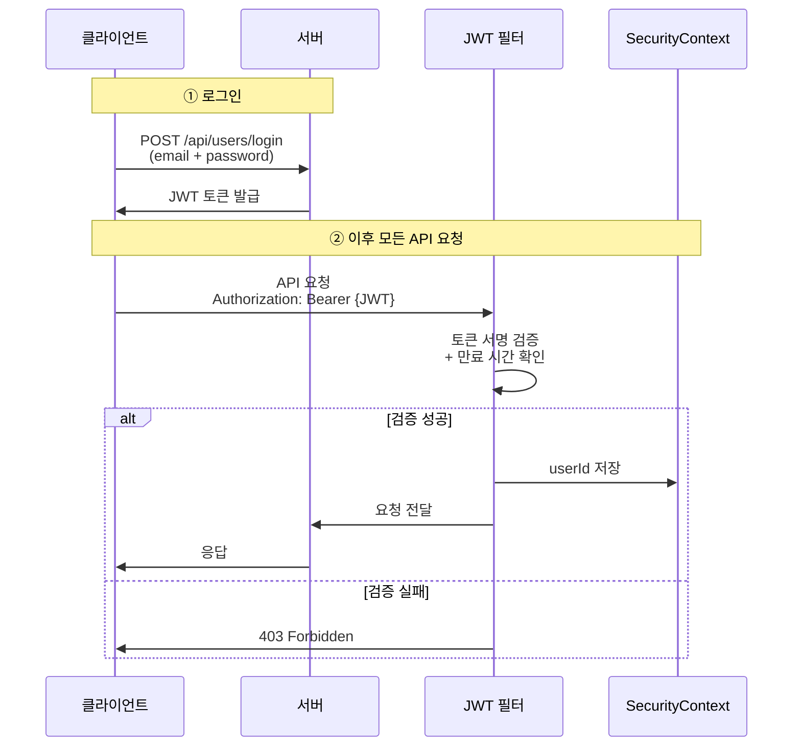
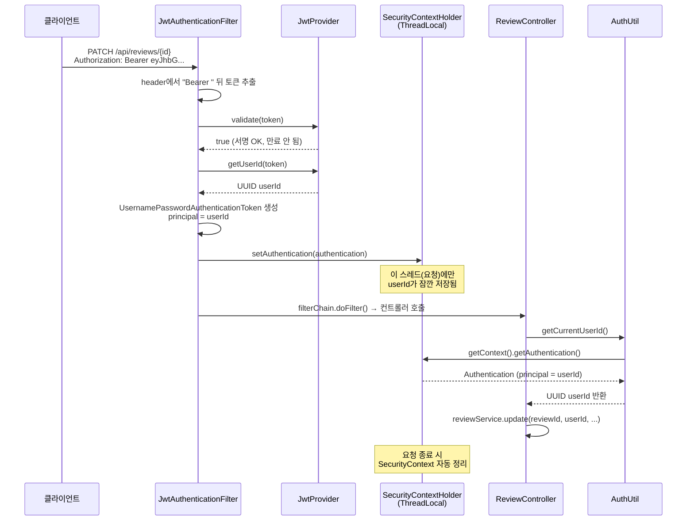
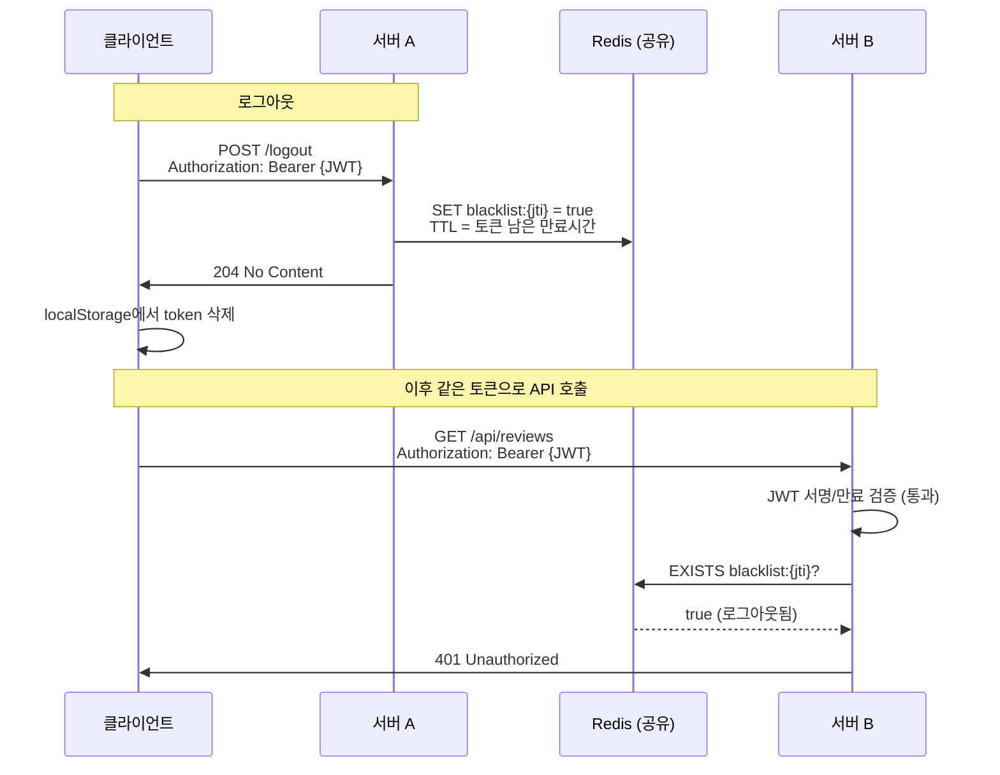

# JWT 인증 필터 도입 가이드

> deokhugam-api에 JWT 기반 인증을 적용하는 방법을 단계별로 설명합니다.  
---

## 목차

1. [왜 해야 하는가](#왜-해야-하는가)
2. [Step 1: 의존성 추가](#step-1-의존성-추가)
3. [Step 2: application.yml 설정](#step-2-applicationyml에-jwt-설정-추가)
4. [Step 3: JwtProvider 생성](#step-3-jwtprovider-클래스-생성)
5. [Step 4: JWT 인증 필터 생성](#step-4-jwt-인증-필터-생성)
6. [Step 5: SecurityConfig 수정](#step-5-securityconfig-수정)
7. [Step 6: 로그인 API에서 토큰 발급](#step-6-로그인-api에서-토큰-발급)
8. [Step 7: 컨트롤러에서 인증된 사용자 사용](#step-7-컨트롤러에서-헤더-대신-인증된-사용자-사용)
9. [전체 흐름 한눈에 보기](#전체-흐름-한눈에-보기)
10. [개념 정리: SecurityContextHolder와 AuthUtil](#개념-정리-securitycontextholder와-authutil)

---

## 왜 해야 하는가

현재 프로젝트에는 **인증이 사실상 없습니다**. 아래 두 줄이 핵심 원인입니다:

```java
// SecurityConfig.java 30행
"/**"   // ← 이것이 모든 경로를 permitAll() 처리
```

```java
// ReviewController.java 75행
@RequestHeader(value = "Deokhugam-Request-User-ID") UUID deokhugamRequestUserId
// ← 이 헤더를 "진짜 그 사용자가 맞는지" 검증하는 곳이 없음
```

**쉽게 말하면:**  
현재는 누구든 HTTP 요청에 `Deokhugam-Request-User-ID: 아무-UUID`를 넣으면 그 사람인 척 할 수 있습니다.

```bash
# 이 한 줄로 다른 사람 계정을 삭제할 수 있음
curl -X DELETE http://localhost:8080/api/users/피해자-UUID \
  -H "Deokhugam-Request-User-ID: 피해자-UUID"
```

HTTP 헤더는 **클라이언트가 마음대로 적을 수 있는 메모지**입니다. 신분증이 아닙니다.  
JWT는 **서버가 발급한 위조 불가능한 신분증**입니다.

---

## Step 1: 의존성 추가

**파일**: `build.gradle`  
**위치**: `dependencies` 블록 안에 추가

```groovy
// JWT
implementation 'io.jsonwebtoken:jjwt-api:0.12.6'
runtimeOnly 'io.jsonwebtoken:jjwt-impl:0.12.6'
runtimeOnly 'io.jsonwebtoken:jjwt-jackson:0.12.6'
```

---

## Step 2: application.yml에 JWT 설정 추가

**파일**: `src/main/resources/application.yml`  
**위치**: 파일 맨 아래에 추가

```yaml
jwt:
  secret: ${JWT_SECRET:my-super-secret-key-that-is-at-least-32-bytes-long!!}
  expiration-ms: 86400000  # 24시간
```

---

## Step 3: JwtProvider 클래스 생성

**파일**: `src/main/java/com/sbproject/deokhugam/config/jwt/JwtProvider.java` (새 파일)

```java
package com.sbproject.deokhugam.config.jwt;

import io.jsonwebtoken.Claims;
import io.jsonwebtoken.Jwts;
import io.jsonwebtoken.security.Keys;
import org.springframework.beans.factory.annotation.Value;
import org.springframework.stereotype.Component;

import javax.crypto.SecretKey;
import java.nio.charset.StandardCharsets;
import java.util.Date;
import java.util.UUID;

@Component
public class JwtProvider {

    private final SecretKey key;
    private final long expirationMs;

    public JwtProvider(
        @Value("${jwt.secret}") String secret,
        @Value("${jwt.expiration-ms}") long expirationMs
    ) {
        this.key = Keys.hmacShaKeyFor(secret.getBytes(StandardCharsets.UTF_8));
        this.expirationMs = expirationMs;
    }

    /**
     * 로그인 성공 시 호출 — userId를 담은 토큰을 생성한다.
     */
    public String createToken(UUID userId) {
        Date now = new Date();
        Date expiry = new Date(now.getTime() + expirationMs);

        return Jwts.builder()
            .subject(userId.toString())
            .issuedAt(now)
            .expiration(expiry)
            .signWith(key)
            .compact();
    }

    /**
     * 토큰이 유효한지 검증한다.
     * - 서명이 맞는지 (위조 여부)
     * - 만료되지 않았는지
     */
    public boolean validate(String token) {
        try {
            Jwts.parser().verifyWith(key).build().parseSignedClaims(token);
            return true;
        } catch (Exception e) {
            return false;
        }
    }

    /**
     * 검증된 토큰에서 userId를 꺼낸다.
     */
    public UUID getUserId(String token) {
        Claims claims = Jwts.parser()
            .verifyWith(key).build()
            .parseSignedClaims(token)
            .getPayload();

        return UUID.fromString(claims.getSubject());
    }
}
```

**이 클래스가 하는 일:**
- `createToken`: 로그인 성공 시 userId를 비밀키로 서명해서 토큰 문자열 생성
- `validate`: 들어온 토큰의 서명이 진짜인지, 만료 안 됐는지 확인
- `getUserId`: 검증된 토큰에서 userId 추출

---

## Step 4: JWT 인증 필터 생성

**파일**: `src/main/java/com/sbproject/deokhugam/config/jwt/JwtAuthenticationFilter.java` (새 파일)

```java
package com.sbproject.deokhugam.config.jwt;

import jakarta.servlet.FilterChain;
import jakarta.servlet.ServletException;
import jakarta.servlet.http.HttpServletRequest;
import jakarta.servlet.http.HttpServletResponse;
import lombok.RequiredArgsConstructor;
import org.springframework.security.authentication.UsernamePasswordAuthenticationToken;
import org.springframework.security.core.context.SecurityContextHolder;
import org.springframework.stereotype.Component;
import org.springframework.web.filter.OncePerRequestFilter;

import java.io.IOException;
import java.util.Collections;
import java.util.UUID;

@Component
@RequiredArgsConstructor
public class JwtAuthenticationFilter extends OncePerRequestFilter {

    private final JwtProvider jwtProvider;

    @Override
    protected void doFilterInternal(
        HttpServletRequest request,
        HttpServletResponse response,
        FilterChain filterChain
    ) throws ServletException, IOException {

        // 1) Authorization 헤더에서 토큰 추출
        String header = request.getHeader("Authorization");

        if (header != null && header.startsWith("Bearer ")) {
            String token = header.substring(7);  // "Bearer " 제거

            // 2) 토큰 서명 검증
            if (jwtProvider.validate(token)) {
                // 3) 검증 성공 → userId 추출 → SecurityContext에 저장
                UUID userId = jwtProvider.getUserId(token);

                UsernamePasswordAuthenticationToken authentication =
                    new UsernamePasswordAuthenticationToken(
                        userId,           // principal = userId
                        null,             // credentials
                        Collections.emptyList()  // authorities
                    );

                SecurityContextHolder.getContext().setAuthentication(authentication);
            }
        }

        // 4) 다음 필터로 진행
        filterChain.doFilter(request, response);
    }
}
```

**이 필터가 하는 일 (매 요청마다 실행됨):**

```
요청 들어옴
  → Authorization: Bearer eyJhbG... 헤더가 있나?
    → 없으면: 그냥 통과 (인증 안 된 상태로)
    → 있으면: 토큰 검증
      → 실패: 그냥 통과 (인증 안 된 상태로 → 보호된 API면 403)
      → 성공: SecurityContext에 userId 저장 → 컨트롤러에서 사용 가능
```

---

## Step 5: SecurityConfig 수정

**파일**: `src/main/java/com/sbproject/deokhugam/config/SecurityConfig.java`  
**전체 교체**

```java
package com.sbproject.deokhugam.config;

import com.sbproject.deokhugam.config.jwt.JwtAuthenticationFilter;
import lombok.RequiredArgsConstructor;
import org.springframework.context.annotation.Bean;
import org.springframework.context.annotation.Configuration;
import org.springframework.security.config.annotation.web.builders.HttpSecurity;
import org.springframework.security.config.annotation.web.configuration.EnableWebSecurity;
import org.springframework.security.config.http.SessionCreationPolicy;
import org.springframework.security.crypto.bcrypt.BCryptPasswordEncoder;
import org.springframework.security.crypto.password.PasswordEncoder;
import org.springframework.security.web.SecurityFilterChain;
import org.springframework.security.web.authentication.UsernamePasswordAuthenticationFilter;
import org.springframework.security.web.firewall.HttpFirewall;
import org.springframework.security.web.firewall.StrictHttpFirewall;

@Configuration
@EnableWebSecurity
@RequiredArgsConstructor
public class SecurityConfig {

    private final JwtAuthenticationFilter jwtAuthenticationFilter;

    @Bean
    public SecurityFilterChain filterChain(HttpSecurity http) throws Exception {
        http
            .csrf(csrf -> csrf.disable())
            .sessionManagement(session ->
                session.sessionCreationPolicy(SessionCreationPolicy.STATELESS))
            .authorizeHttpRequests(auth -> auth
                .requestMatchers(
                    "/api/users/login",    // 로그인
                    "/api/users",          // 회원가입 (POST)
                    "/swagger-ui/**",      // Swagger
                    "/api-docs/**",        // API 문서
                    "/actuator/health"     // 헬스체크
                ).permitAll()
                .anyRequest().authenticated()  // 나머지는 인증 필수
            )
            // JWT 필터를 Spring Security 필터 체인에 등록
            .addFilterBefore(jwtAuthenticationFilter, UsernamePasswordAuthenticationFilter.class);

        return http.build();
    }

    @Bean
    public PasswordEncoder passwordEncoder() {
        return new BCryptPasswordEncoder();
    }

    @Bean
    public HttpFirewall allowDoubleSlashHttpFirewall() {
        StrictHttpFirewall firewall = new StrictHttpFirewall();
        firewall.setAllowUrlEncodedDoubleSlash(true);
        return firewall;
    }
}
```

**변경 전후 비교:**

| 구분 | 변경 전 | 변경 후 |
|------|---------|---------|
| permitAll 범위 | `"/**"` (전체) | 로그인/회원가입/Swagger만 |
| 인증 필터 | 없음 | JWT 필터 등록 |
| 결과 | 아무나 접근 가능 | 토큰 없으면 403 |

---

## Step 6: 로그인 API에서 토큰 발급

**파일**: `src/main/java/com/sbproject/deokhugam/user/controller/UserController.java`  
**변경**: `login` 메서드

```java
// 변경 전
@PostMapping("/login")
public ResponseEntity<UserDto> login(
    @Valid @RequestBody UserLoginRequest request
) {
    return ResponseEntity.ok(userService.login(request));
}

// 변경 후
@PostMapping("/login")
public ResponseEntity<LoginResponse> login(
    @Valid @RequestBody UserLoginRequest request
) {
    return ResponseEntity.ok(userService.login(request));
}
```

**파일**: `src/main/java/com/sbproject/deokhugam/user/dto/LoginResponse.java` (새 파일)

```java
package com.sbproject.deokhugam.user.dto;

public record LoginResponse(
    String token,
    UserDto user
) {}
```

**파일**: `src/main/java/com/sbproject/deokhugam/user/service/impl/UserServiceImpl.java`  
**변경**: `login` 메서드

```java
// 변경 전
@Override
public UserDto login(UserLoginRequest request) {
    User user = userRepository.findByEmail(request.email())
        .orElseThrow(InvalidCredentialsException::new);

    if (!passwordEncoder.matches(request.password(), user.getPassword())) {
        throw new InvalidCredentialsException();
    }

    return UserDto.from(user);
}

// 변경 후
private final JwtProvider jwtProvider;  // 필드 추가 (생성자 주입)

@Override
public LoginResponse login(UserLoginRequest request) {
    User user = userRepository.findByEmail(request.email())
        .orElseThrow(InvalidCredentialsException::new);

    if (!passwordEncoder.matches(request.password(), user.getPassword())) {
        throw new InvalidCredentialsException();
    }

    String token = jwtProvider.createToken(user.getId());
    return new LoginResponse(token, UserDto.from(user));
}
```

**흐름 정리:**
```
1. 클라이언트: POST /api/users/login { email, password }
2. 서버: 비밀번호 확인 → 성공 시 JWT 토큰 발급
3. 응답: { "token": "eyJhbG...", "user": { ... } }
4. 이후 클라이언트: 모든 요청에 Authorization: Bearer eyJhbG... 헤더 포함
5. 서버: 매 요청마다 JwtAuthenticationFilter가 토큰 검증
```

---

## Step 7: 컨트롤러에서 헤더 대신 인증된 사용자 사용

**모든 컨트롤러**에서 `@RequestHeader("Deokhugam-Request-User-ID")`를 제거하고,  
`SecurityContext`에서 검증된 userId를 가져오도록 변경합니다.

**유틸 메서드 생성**: `src/main/java/com/sbproject/deokhugam/config/jwt/AuthUtil.java` (새 파일)

```java
package com.sbproject.deokhugam.config.jwt;

import org.springframework.security.core.Authentication;
import org.springframework.security.core.context.SecurityContextHolder;

import java.util.UUID;

public class AuthUtil {
    
    private AuthUtil() {}

    /**
     * 현재 인증된 사용자의 UUID를 반환한다.
     * JwtAuthenticationFilter에서 SecurityContext에 저장한 값.
     */
    public static UUID getCurrentUserId() {
        Authentication auth = SecurityContextHolder.getContext().getAuthentication();
        if (auth == null || auth.getPrincipal() == null) {
            throw new IllegalStateException("인증 정보가 없습니다");
        }
        return (UUID) auth.getPrincipal();
    }
}
```

**ReviewController 변경 예시:**

```java
// 변경 전: 헤더에서 직접 받음 (위조 가능)
@PatchMapping("/{reviewId}")
public ResponseEntity<ReviewDto> updateReview(
    @PathVariable("reviewId") UUID reviewId,
    @Valid @RequestBody ReviewUpdateRequest request,
    @RequestHeader(value = "Deokhugam-Request-User-ID") UUID deokhugamRequestUserId
) {
    ReviewDto reviewDto = reviewService.update(reviewId, deokhugamRequestUserId, request);
    return ResponseEntity.ok(reviewDto);
}

// 변경 후: SecurityContext에서 검증된 userId 사용 (위조 불가)
@PatchMapping("/{reviewId}")
public ResponseEntity<ReviewDto> updateReview(
    @PathVariable("reviewId") UUID reviewId,
    @Valid @RequestBody ReviewUpdateRequest request
) {
    UUID userId = AuthUtil.getCurrentUserId();  // 서버가 검증한 값만 사용
    ReviewDto reviewDto = reviewService.update(reviewId, userId, request);
    return ResponseEntity.ok(reviewDto);
}
```

**같은 패턴으로 변경해야 할 모든 컨트롤러:**

| 컨트롤러 | 변경 대상 메서드 |
|----------|-----------------|
| `ReviewController` | getReviewList, getReviewDetail, updateReview, deleteReviewLogical, deleteReviewPhysical, toggleReviewLike |
| `UserController` | update, delete, hardDelete |
| `CommentController` | createComment, updateComment, deleteComment, hardDeleteComment |
| `NotificationController` | findAll, updateReadStatus, updateReadAllStatus |

모두 동일한 패턴입니다:
1. `@RequestHeader("Deokhugam-Request-User-ID") UUID ...` 파라미터 제거
2. 메서드 본문에서 `UUID userId = AuthUtil.getCurrentUserId();` 사용

---

## 전체 흐름 한눈에 보기

### 변경 전 — 위험



### 변경 후 — 안전



---

## 개념 정리: SecurityContextHolder와 AuthUtil

학생들이 자주 헷갈리는 부분을 정리합니다.

> **한 줄 요약**  
> JWT는 **클라이언트가 들고 다니는 신분증**이고,  
> `SecurityContext`는 **이번 요청 처리 동안만** 서버 메모리에 잠깐 올라가는 **임시 메모**입니다.

### JWT vs SecurityContext — 역할이 다릅니다

| | JWT 토큰 | SecurityContext |
|---|---|---|
| **어디에 있나** | 클라이언트 (localStorage, 앱 저장소 등) | 서버 메모리 (ThreadLocal) |
| **언제까지 유지** | 만료 전까지 클라이언트가 보관 | **해당 HTTP 요청 1건 처리 동안만** |
| **서버 재시작 후** | 토큰 자체는 그대로 (서명/만료만 맞으면 유효) | 이전 요청 정보는 없음 |
| **비유** | 지갑 속 신분증 | 카운터 직원 손에 든 "지금 처리 중인 손님 메모" |

서버가 "로그인 상태를 메모리에 계속 들고 있는" 구조가 **아닙니다**.  
**요청이 올 때마다** JWT를 검증하고, 그 순간만 `SecurityContext`를 채웁니다.

### 요청 1건 안에서 일어나는 일 (상세 흐름)



### ① JWT 필터 — SecurityContextHolder에 **넣는** 부분

핵심 코드는 `JwtAuthenticationFilter`의 아래 3줄입니다:

```java
// 검증 성공 후 userId 추출
UUID userId = jwtProvider.getUserId(token);

// Authentication 객체 생성 (principal = "누구인지")
UsernamePasswordAuthenticationToken authentication =
    new UsernamePasswordAuthenticationToken(
        userId,                    // ← principal: "이 요청의 주인공"
        null,                      // credentials: JWT 방식에서는 비밀번호 불필요
        Collections.emptyList()    // authorities: 권한 목록 (ROLE_USER 등)
    );

// SecurityContext에 저장
SecurityContextHolder.getContext().setAuthentication(authentication);
```

**각 객체가 의미하는 것:**

| 객체 | 역할 | 비유 |
|------|------|------|
| `UsernamePasswordAuthenticationToken` | "이 요청은 userId=xxx 사용자 것"이라는 **인증 정보 꺾지** | 손님 명찰 |
| `authentication.getPrincipal()` | 실제 사용자 식별값 (`UUID userId`) | 명찰에 적힌 이름 |
| `SecurityContextHolder` | 현재 요청 스레드에 인증 정보를 보관하는 **전역 접근점** | 카운터 직원 손 |
| `SecurityContext` | `Authentication`을 담는 **작은 상자** | 명찰 보관함 |

**ThreadLocal이란?**  
Spring Security는 `SecurityContextHolder`를 **ThreadLocal**에 저장합니다.

- HTTP 요청 1건 = 서버 스레드 1개가 처리
- 그 스레드 안에서만 `SecurityContext`가 보임
- 요청이 끝나면 자동으로 비워짐 → **다른 요청/다른 사용자와 섞이지 않음**

그래서 "서버 메모리에 로그인 상태를 영구 저장"하는 게 아니라, **"이 요청 처리 중에만 잠깐"** 기억하는 것입니다.

### ② AuthUtil — SecurityContextHolder에서 **읽는** 부분

컨트롤러는 헤더를 믿지 않고, 필터가 검증해 둔 값만 읽습니다:

```java
public static UUID getCurrentUserId() {
    // 1) 현재 스레드의 SecurityContext 가져오기
    Authentication auth = SecurityContextHolder.getContext().getAuthentication();

    // 2) 인증 정보가 없으면 예외 (토큰 없이 보호된 API 호출 등)
    if (auth == null || auth.getPrincipal() == null) {
        throw new IllegalStateException("인증 정보가 없습니다");
    }

    // 3) 필터가 principal에 넣어 둔 userId 꺼내기
    return (UUID) auth.getPrincipal();
}
```

**읽는 순서:**

```
AuthUtil.getCurrentUserId()
  → SecurityContextHolder.getContext()     // "이 요청의 상자" 열기
  → .getAuthentication()                   // "인증 정보 꺾지" 꺼내기
  → .getPrincipal()                        // 꺾지 안의 userId (UUID)
```

JWT 필터가 **넣은 것**과 AuthUtil이 **읽는 것**이 같은 `principal`이므로,  
컨트롤러는 **서버가 이미 검증한 userId**만 사용하게 됩니다.

### ③ 세션 방식과 비교 (왜 JWT는 Stateless인가)

**세션 방식 (Stateful)** — 서버가 상태를 계속 들고 있음

```
로그인 → 서버 메모리/Redis에 sessionId → userId 저장
이후 요청 → sessionId 쿠키로 서버가 "아, 이 사람이구나" 조회
```

**JWT 방식 (Stateless)** — 서버는 상태를 안 들고, 매번 검증

```
로그인 → JWT 발급 → 클라이언트 보관
이후 요청 → JWT 매번 전송 → 서버가 매번 검증 → SecurityContext에 잠깐 저장
```

현재 프로젝트는 `SessionCreationPolicy.STATELESS` 설정이므로 **HttpSession에 로그인 정보를 저장하지 않습니다**.  
JWT + SecurityContext 조합이 이 stateless 구조를 완성합니다.

### ④ 자주 나오는 질문

**Q. 로그아웃하면 서버 SecurityContext도 지워지나요?**  
A. **요청이 끝나면 그 요청의 SecurityContext는 어차피 사라집니다** (ThreadLocal 정리).  
로그아웃의 진짜 문제는 SecurityContext가 아니라 **클라이언트가 들고 있는 JWT가 아직 유효하다는 것**입니다.  
서버는 세션을 안 들고 있으므로, **서버 입장에서 "이 토큰 무효화"가 기본으로는 안 됩니다**.

**Q. 서버를 이중화(2대 이상)하면 SecurityContext가 서버마다 다른데, 로그아웃은 어떻게 하나요?**  
A. **SecurityContext가 서버마다 다른 것은 정상이며, 로그아웃 문제의 원인이 아닙니다.**

| 오해 | 실제 |
|------|------|
| "A서버 SecurityContext와 B서버 SecurityContext가 달라서 로그아웃이 안 된다" | SecurityContext는 **요청 1건 처리 중에만** 각 서버 스레드에 잠깐 존재 |
| "로그아웃 시 모든 서버의 SecurityContext를 지워야 한다" | 지울 **공유된 SecurityContext가 애초에 없음** |

이중화에서의 진짜 이슈는 이것입니다:

```
[로그아웃 직후]
클라이언트: 토큰 삭제 (또는 안 삭제)
서버 A, B: 둘 다 "이 토큰 아직 서명/만료 OK" → 둘 다 통과시킴
```

즉 **어느 서버로 요청이 가도**, JWT가 만료 전이면 **둘 다 인증 성공**합니다.  
SecurityContext를 동기화할 필요가 없고, **토큰 자체를 무효화하는 방법**이 필요합니다.

**이중화 환경에서 로그아웃 해결 방법 (실무에서 흔한 순서)**

| 방법 | 설명 | 이중화 대응 |
|------|------|-------------|
| **1. 클라이언트에서 토큰 삭제** | localStorage 등에서 token 제거 | 가장 단순. 단, 토큰이 유출됐으면 다른 곳에서 계속 사용 가능 |
| **2. Redis 토큰 블랙리스트 (권장)** | 로그아웃 시 `jti`(토큰 ID) 또는 token 해시를 Redis에 저장. **모든 서버가 같은 Redis 조회** | 서버 A에서 로그아웃 → Redis에 등록 → 서버 B도 같은 Redis 보고 차단 |
| **3. Access Token 짧게 + Refresh Token** | Access 15분, Refresh는 DB/Redis에 저장·회수 | 로그아웃 시 Refresh만 서버에서 삭제 → 재발급 불가 |
| **4. 로그아웃 API** | `POST /logout` → 서버가 Redis 블랙리스트에 추가 + 클라이언트 토큰 삭제 | LB 뒤 어느 인스턴스로 가도 Redis는 공유 |

**Redis 블랙리스트 흐름 (이중화)**



**JwtAuthenticationFilter에 추가할 검증 (개념):**

```java
// validate(token) 성공 후, 블랙리스트 확인 추가
if (jwtProvider.validate(token)) {
    if (tokenBlacklistService.isBlacklisted(token)) {
        // 로그아웃된 토큰 → SecurityContext에 넣지 않음
        filterChain.doFilter(request, response);
        return;
    }
    // ... 기존 SecurityContext 설정
}
```

`tokenBlacklistService`는 **Redis를 바라보는 빈**이면 서버 A/B/C 모두 동일하게 동작합니다.

**한 줄 정리:**  
이중화에서 맞춰야 하는 것은 **SecurityContext가 아니라 "무효화된 토큰 목록"을 모든 인스턴스가 공유**하는 것입니다 (Redis 등).

**Q. 토큰은 클라이언트에 있는데, 서버는 어떻게 "누구인지" 아나요?**  
A. 매 요청마다 JWT 필터가 토큰을 **다시 검증**하고, 그때마다 `SecurityContext`를 **새로 채웁니다**. 영구 저장이 아니라 **요청마다 재구성**입니다. LB가 요청을 서버 A/B에 나눠내도, **각 서버가 독립적으로 토큰만 검증**하면 되므로 SecurityContext 동기화는 필요 없습니다.

**Q. `@RequestHeader("Deokhugam-Request-User-ID")`와 뭐가 다른가요?**  
A. 헤더는 클라이언트가 **아무 값이나 넣을 수 있습니다**. `AuthUtil.getCurrentUserId()`는 **JWT 검증을 통과한 값만** 읽습니다. 위조가 불가능합니다.

---
